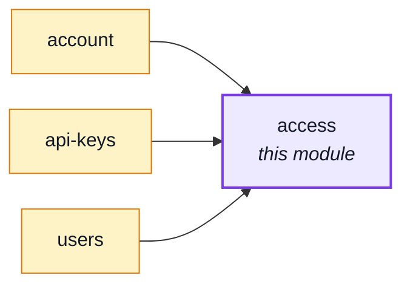

# access

::: tip At a glance
**Owns** — the tenant and membership collections: who the shops are, and who holds which role,
where.
**Depends on** — nothing. It sits low enough in the graph that [`account`](./account.md),
[`api-keys`](./api-keys.md) and [`users`](./users.md) all import it, never the reverse.
**Breaks if you change** — the escalation refusal in `assignRole`: it is the one thing standing
between any grant form and a privilege-escalation endpoint.
:::

## Its neighbourhood

<!-- module-graph:access:start -->

_Solid arrows are imports. Dotted arrows are domain events — the return path an import
graph cannot see._

<!-- module-graph:access:end -->

## The story

**Routeless on purpose.** Nothing in the boilerplate creates a shop or grants a role over the
wire — a deployment ships with one tenant, fixed at build time (`DEPLOYMENT_TENANT_ID`, which
stays in `kernel/access/tenant.ts`, imported directly rather than looked up), and every role a
person can hold comes from `shared/authorization-roles.yaml`, never from a request. So there is no
URL for this module to answer, and none of the route-guarding code — `kernel/permissions.ts`,
`kernel/ability.ts`, `kernel/access/query.ts` — moved here with the data; those stay in the kernel
because the guard itself is kernel code, and this module is the domain they ask about, not the
asking.

What makes it a module rather than kernel code anyway: it is an identity-and-access domain with
real collections and real write invariants, consumed by several sibling modules — several unrelated
modules sharing one domain is reason enough for its own module, the same reasoning
[`addresses`](./addresses.md) is split out of `account` for. A routeless module is not a special
case here: `basePath`/`routes` are both optional on the manifest (see
[Module lifecycle](../theory/module-lifecycle.md)), and `access` is this repo's one module that
omits both.

::: tip Roles are data, permissions are code
A role's PERMISSIONS live in `shared/authorization-roles.yaml` alone — the same file the PHP twin
reads byte-for-byte — never in this module's own collection. What this module stores is the other
half: WHO holds a role, in which shop, at which scope. `assignRole` validates a name against the
presets before writing a membership, so a role that exists nowhere can never be silently assigned;
`administratorsOf` counts membership rows but asks the presets which role names count as
administrators. One fact, one home, on each side of that line.
:::

Every invariant here is a refusal, not a comment: a granter cannot hand over a role they do not
themselves hold, and self-service signup can only ever assign the one default role (`assignDefaultRole`) — never a caller-supplied name, which
is what would turn signup into a privilege-escalation door. The same exemption covers an admin
holding `users.any.create`: granting the default role there isn't escalation either, since every
key on that role is `.self.` — power over the new account's own data, not the shop's.

::: info The last administrator CAN be removed
Revoking, demoting or deleting a shop's last administrator is allowed, and leaves the shop with
none. A refusal would only guard against an operator who knows what they are doing, and the repair
is one database write: give somebody an administrator membership again.
:::

## Related pages

- [`account`](./account.md) — resolves a bearer token into an `AuthContext` via `rolesOf`
- [`api-keys`](./api-keys.md) — re-derives a minted key's current role at check time
- [`users`](./users.md) — writes a membership on create, update and email verification
- [Authorization](../theory/authorization.md) — the whole model, kernel half and module half together
- [Tenancy](../theory/tenancy.md) — why one deployment pins one tenant id
