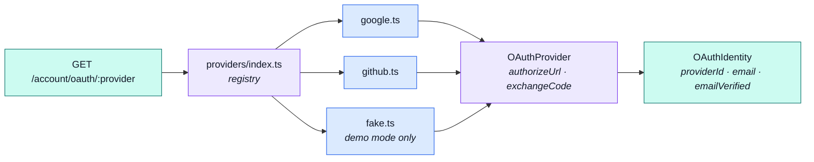
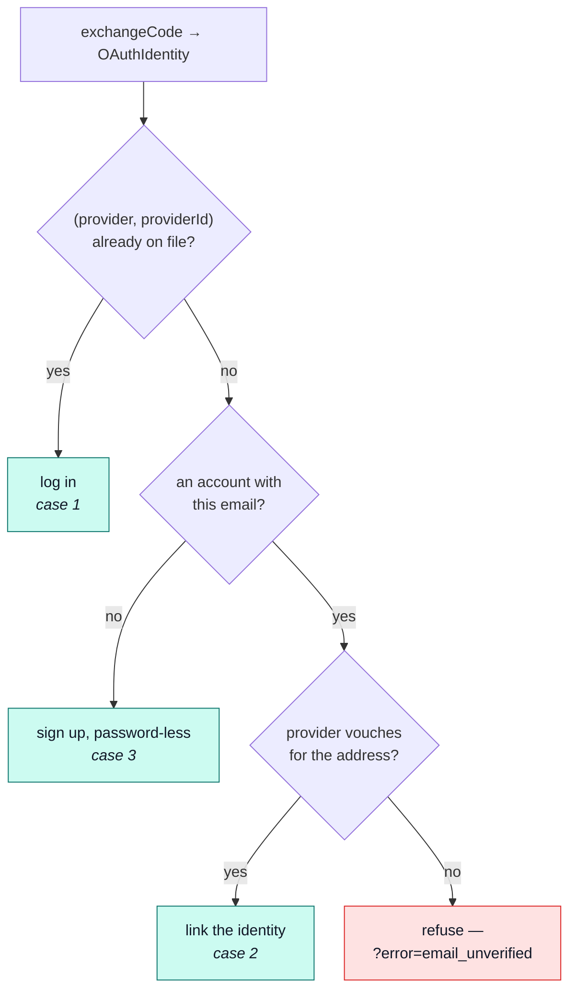

# OAuth

Signing in with somebody else's identity provider — the port, the CSRF handshake across the
redirect, and the three outcomes a callback can have.
[Web attack defences](../theory/web-attack-defences.md#the-perimeter-the-auth-waves-reviewed-clean)
carries the same three defences as attack rows — the `state` cookie, the server-derived URIs, and the
linking rule — naming what each one stops. This page is the mechanism behind them.

::: tip At a glance
**The shape** — `config.ts` reads the env, `state.ts` owns the CSRF cookie, `providers/` holds the
port and one file per implementation.
**Published** — nothing. Minting this application's sessions is [`account`](./account.md)'s own
business, exactly as [Sessions](./account-sessions.md) is.
**Breaks if you change** — `oauthRedirectUri`. Every provider's console has the old value
registered, and a mismatch fails the exchange, not the redirect.
:::

## The port, and why several may be live at once

Same seam as [`payments`](./payments-provider-port.md)' provider port, with one deliberate
difference: a deployment can offer Google **and** GitHub together, so there is no single
`NODE_*_PROVIDER` switch to pick a winner.

Each registry entry is a **closure re-checked on every call**, never a value computed at import: a
provider becomes configured the moment its `NODE_OAUTH_<NAME>_CLIENT_ID` / `_CLIENT_SECRET` pair is
set, with no restart-shaped memoisation to go stale. An unconfigured provider resolves `undefined`
and the route answers 404 — the same "loud, never silently wrong" stance an unset
`NODE_PAYMENT_PROVIDER` gets.

`fake` is the demo profile's stand-in: no network call and no consent screen, so a Cypress spec
clicking "Continue with Google" never leaves this app. It still round-trips the real `state` cookie,
so the CSRF check gets genuine coverage rather than being skipped in the suite that exercises it
most.

## Two URLs, both server-derived

| Value                                  | Built from          | Never from            |
| -------------------------------------- | ------------------- | --------------------- |
| the redirect URI given to the provider | `NODE_URL`          | the request           |
| where the callback sends the browser   | `NODE_FRONTEND_URL` | the provider's answer |

That is the whole of the open-redirect and callback-confusion defence, and it works only because
`config.ts` is the single place both the start and the callback controller read them from.

## The CSRF handshake

A double-submit cookie, not server-side state: the value is minted and handed to the provider as
`state` in the **same response** that sets it as `oauth_state`, and the callback trusts a request
only when the two agree. No new server secret, unlike a signed token would need.

- 128 bits, from `randomBytes(16)` — the same entropy every `tokens[]` value carries.
- 5 minutes: long enough to pick a Google account, short enough to bound reuse.
- `httpOnly` / `sameSite: 'lax'`, `secure` in production — `createRefreshCookie`'s flags exactly.
- Cleared by **both** a successful and a failed callback.

## Three outcomes, and the one that is a security decision

::: warning `providerId` is the identity key, never `email`
An email match is consulted **only** when no identity is on file, and it only ever **links** — it
never logs anyone in on its own. A provider's email can change while its subject id cannot, and
anyone able to register an OAuth app under a victim's address must not be able to walk into that
account. `emailVerified` is the provider's own claim, and an unverified match is refused rather
than linked.
:::

Two identities minting the **same** never-before-seen account at once is the race the
`users_oauth_identity` unique index exists for: the loser's `create` rejects with `E11000`, the
callback turns that into a generic `?error=provider_error`, and the caller's retry finds case 1.

## The endpoint surface, and how failure travels

| Route                                   | Answers                                                     |
| --------------------------------------- | ----------------------------------------------------------- |
| `GET /account/oauth/providers`          | the configured names — a deployment with no keys lists none |
| `GET /account/oauth/:provider`          | 302 to the consent screen, `state` cookie set               |
| `GET /account/oauth/:provider/callback` | 302 back to the frontend, session cookies set               |

All three are public, because this **is** how an unauthenticated caller signs in, and all three sit
behind `credentialLimiters`.

Only two failures answer with a body. Everything past the state check redirects to the frontend
with `?error=<code>`, because by then the browser is mid-navigation and a JSON body has nowhere to
be read:

| Failure                                  | Answer                        |
| ---------------------------------------- | ----------------------------- |
| provider never configured                | `404`                         |
| `state` missing or mismatched            | `400`                         |
| consent declined                         | `302 ?error=access_denied`    |
| no `code`, or the exchange failed        | `302 ?error=provider_error`   |
| email match the provider won't vouch for | `302 ?error=email_unverified` |

The success path calls the same `issueSession` [`postLogin`](./account-sessions.md) does, with
`amr: [provider.name]` — so a Google login records **how** it was proved, and the freshness guards
read it like any other method. It returns no access token: the frontend's
`GET /account/refresh` bootstrap mints one the moment it lands.

## Two consequences worth naming

- **An OAuth-only account has no password.** `users.password` is deliberately not `required`, and
  sign-in for such an account works only through a provider — until a password reset gives it one.
- **The callback does not consult `twoFactorEnabledAt`.** An account with a linked provider
  therefore has an unchallenged way in, whatever
  [two-factor auth](./account-two-factor.md) it has armed. What that costs is
  [Security](../tools/security.md#what-is-not-covered)'s to say; that it is true of _this_ route is
  this page's.

## Related pages

- [`account`](./account.md) — the module this belongs to
- [Sessions](./account-sessions.md) — the session a callback mints, and `amr`
- [Two-factor authentication](./account-two-factor.md) — the control this path skips
- [`users`](./users.md) — `oauthAccounts` and the unique index behind it
- [Web attack defences](../theory/web-attack-defences.md) — the same subsystem as attack rows
- [`payments` provider port](./payments-provider-port.md) — the port this one is shaped after
