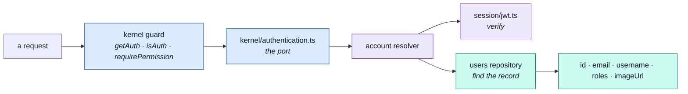
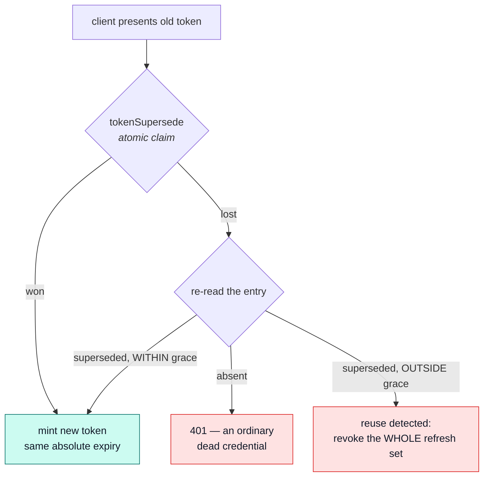

# Sessions

How this application decides who is making a request — and why none of it is published.

::: tip At a glance
**Five files** — `config.ts` reads the lifetimes, `jwt.ts` signs and verifies, `cookies.ts` sets and clears, `session.ts` mints the three of them together, `login-observability.ts` records that a login happened.
**Published** — nothing. `session/` has no barrel and may not be imported from outside the module.
**Breaks if you change** — the cookie flags or the lifetimes. Every guard in the app resolves through here.
:::

## The resolver, installed at import time

[`account`](./account.md) fills the kernel's authentication port the moment its manifest is
imported — not in a boot step. Installing a function touches no connection, and every guard in the
application depends on it existing before the first request arrives.

The resolver hands back **only the fields the port declares**. The kernel must never learn the
document shape — that is what keeps `kernel` below `modules` in the tier order.

::: warning Two failures that are not the same failure
A **bad token** rejects. A **valid token whose user is gone** resolves `undefined`. The guard turns
that distinction into `401` versus `403`, and collapsing the two would tell an attacker whether an
account exists.
:::

## Two tokens, two lifetimes, two homes

|                | Access token               | Refresh token             |
| -------------- | -------------------------- | ------------------------- |
| Travels in     | the `Authorization` header | the `jwt` cookie          |
| Lifetime from  | `NODE_TOKEN_ACCESS_TIME`   | one of three tiers, below |
| Readable by JS | yes — the client holds it  | no — `httpOnly`           |

The refresh tier is the "remember me" choice, and it is a tier rather than a boolean so the copy on
the login form and the lifetime in the environment stay one decision:

| Tier     | Environment variable             |
| -------- | -------------------------------- |
| `short`  | `NODE_TOKEN_REFRESH_TIME_SHORT`  |
| `medium` | `NODE_TOKEN_REFRESH_TIME_MEDIUM` |
| `long`   | `NODE_TOKEN_REFRESH_TIME_LONG`   |

`config.ts` is the single place a deployment's answer to _how long is a session_ is parsed —
`jwt.ts` signs against it and `cookies.ts` sets `maxAge` from it. Its name is deliberate: it holds
no token and issues none.

## Freshness: how recently they proved it {#freshness-auth-time-and-amr}

A valid token and a recently-proved token are different things, and two OIDC claims are what makes
the difference expressible. Wire names are OIDC's on purpose: a future external identity provider's
tokens would satisfy the same guards unchanged.

| Claim       | Holds                                                             |
| ----------- | ----------------------------------------------------------------- |
| `auth_time` | epoch seconds at which the user last actually proved themselves   |
| `amr`       | **how** they proved it — RFC 8176 values, an array, not a boolean |

Both are **stamped once**, at login, then COPIED FORWARD on every access-token mint and every
rotation. Never re-stamped from the clock — a clock-derived `auth_time` would make every refresh
look like a fresh proof, which is precisely the thing the claim exists to deny.

`amr` is an array because proofs compose: a password login is `['pwd']`, a completed
[2FA](./account-two-factor.md) login is `['pwd', 'otp']`, an [OAuth](./account-oauth.md) callback is
`['google']`, and a future WebAuthn passkey is `['hwk']` without a schema change.

::: warning Both are optional, and absent means infinitely old
A token signed before these claims existed carries neither. Every reader treats a missing
`auth_time` as `0` rather than trusting it, so a pre-existing session is asked to re-authenticate at
its first sensitive action instead of reading as freshly authenticated. Fail-closed, in the only
direction that is safe.
:::

`POST /account/reauth` is how a caller refreshes `auth_time` without logging out — re-prove the
password, get a new stamp. What consumes all of this is the `stepUp` tier declared on a permission
key, in [Authorization](../theory/authorization.md); the "remember me" tiers above set the cookie's
lifetime and **do not** exempt a sensitive action from the freshness check.

## The cookie, flag by flag

| Flag       | Value           | Why                                                                                 |
| ---------- | --------------- | ----------------------------------------------------------------------------------- |
| `httpOnly` | `true`          | The refresh token is the long-lived credential; script must not be able to read it. |
| `secure`   | production only | So local development over http still works, without weakening the deployed cookie.  |
| `sameSite` | `lax`           | Survives a top-level navigation back into the app; refuses cross-site form posts.   |
| `path`     | `/`             | The refresh endpoint and the logout endpoint are on different paths.                |
| `maxAge`   | the chosen tier | The cookie expires when the token does, rather than outliving it.                   |

There is a second, deliberately **non-secure** cookie carrying nothing but a logged-in hint, so the
client shell can render the right chrome before its first request answers. It holds no credential
and is safe to read from script — that is its entire job.

## Why none of this is published

::: tip The barrel is one line wide
`session/` used to be exported on the theory that authorization would need it. It does not.
`kernel/authentication.ts` is the port every request goes through, this module fills it from
`module.ts` using its own relative imports, and **no sibling has ever reached for a token**.

Issuing this application's tokens _is_ what `account` is, and none of it is anyone else's business.
That is also why `session/` is a folder rather than a published layer: nothing outside these four
walls may import it, so it needs no barrel of its own.
:::

What the barrel does publish is `addressForCheckout` — one function, for [`cart`](./cart.md).

## The two shared tails

Three flows mint a session and two record one, so both halves are extracted rather than copied.
Neither is a layer — they are the repeated ends of controllers.

| File                     | Is                                                                        | Reused by                                             |
| ------------------------ | ------------------------------------------------------------------------- | ----------------------------------------------------- |
| `session.ts`             | `issueSession` — refresh token, its cookies, the access token handed back | `postLogin`, `postPasswordChange`, the OAuth callback |
| `login-observability.ts` | the metrics / audit / analytics emit meaning "a login happened"           | `post-login.ts`, `post-login-2fa.ts`                  |

::: tip Why the observability tail is not in the service
`services/authentication.ts` checks credentials; it cannot know whether a session exists. The
SUCCESS emit must fire only **after** cookies and an access token are real, which is a
controller-layer fact — so `login()` and `verifyLoginChallenge()` are deliberately kept ignorant of
it.
:::

## Logout everywhere

The refresh tokens hang off the user document in [`users`](./users.md)' `tokens` subdocument, which
is what makes "log me out of every device" a single write rather than a token blocklist. It is also
the concrete reason the `account → users` edge is `shared-kernel`: this module writes that array.

## Refresh rotation

`GET /account/refresh` doesn't just re-sign an access token — it REPLACES the refresh token too,
every time. Without that, a stolen cookie would stay valid, silently, for as long as it had left to
live (up to a year, `remember: long`); rotation turns "a value that never changes" into "a value
that changes on every use", so a copy presented after the original has moved is detectable.

The new token's absolute expiry is COPIED from the old one's own claim, never reset to a fresh full
window — rotation changes the token's VALUE for theft detection, it does not extend how long the
session may live past what it was granted at login.

The grace window (`NODE_TOKEN_ROTATION_GRACE_MS`, default 10s) exists for one reason: two requests
racing on the SAME cookie — two tabs waking together, an interceptor retrying — both present the
identical old token, and only one can win the atomic claim. Without the grace window the loser's
retry would look exactly like theft. Within it, the loser is reissued its own sibling token instead
of rejected — proven under real concurrent load in
`tests/integration/concurrency/auth-races.test.ts` (R5), not just asserted here.

A superseded entry stays in `tokens` — never `$pull`ed immediately — so a later presentation of it
can still be told apart from noise. `GET /account/sessions` filters these out; they aren't a device
the account holder should see or be able to revoke on their own. The housekeeping sweep
(`runTokenCleanup`) removes them once the grace window has long passed, alongside ordinarily
expired tokens — see `tokenRemoveExpired` in [`users`](./users.md)'s repository.

## Related pages

- [`account`](./account.md) — the module this belongs to
- [Two-factor authentication](./account-two-factor.md) — the second factor a login may have to pass
- [OAuth](./account-oauth.md) — the other way a session is minted
- [Authorization](../theory/authorization.md) — what consumes `auth_time` and `amr`
- [`users`](./users.md) — where the refresh tokens are stored
- [Security](../tools/security.md) — hashing, headers, and rate limits
- [Request Flow](../theory/request-flow.md) — where the guard sits
- [Strategic DDD](../theory/strategic-ddd.md#_2-context-map-—-how-a-module-reaches-its-siblings) — what `shared-kernel` costs
