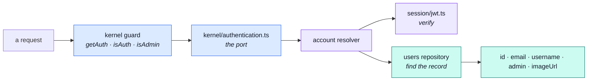

# Sessions

How this application decides who is making a request — and why none of it is published.

::: tip At a glance
**Three files** — `config.ts` reads the lifetimes, `jwt.ts` signs and verifies, `cookies.ts` sets and clears.
**Published** — nothing. `session/` has no barrel and may not be imported from outside the module.
**Breaks if you change** — the cookie flags or the lifetimes. Every guard in the app resolves through here.
:::

## The resolver, installed at import time

[`account`](./account.md) fills the kernel's authentication port the moment its manifest is
imported — not in a boot step. Installing a function touches no connection, and every guard in the
application depends on it existing before the first request arrives.

The resolver hands back **only the fields the port declares**. The kernel must never learn the
document shape — that is what keeps `kernel` below `modules` in the tier order.

::: warning Two failures that are not the same failure
A **bad token** rejects. A **valid token whose user is gone** resolves `undefined`. The guard turns
that distinction into `401` versus `403`, and collapsing the two would tell an attacker whether an
account exists.
:::

## Two tokens, two lifetimes, two homes

|                | Access token               | Refresh token             |
| -------------- | -------------------------- | ------------------------- |
| Travels in     | the `Authorization` header | the `jwt` cookie          |
| Lifetime from  | `NODE_TOKEN_ACCESS_TIME`   | one of three tiers, below |
| Readable by JS | yes — the client holds it  | no — `httpOnly`           |

The refresh tier is the "remember me" choice, and it is a tier rather than a boolean so the copy on
the login form and the lifetime in the environment stay one decision:

| Tier     | Environment variable             |
| -------- | -------------------------------- |
| `short`  | `NODE_TOKEN_REFRESH_TIME_SHORT`  |
| `medium` | `NODE_TOKEN_REFRESH_TIME_MEDIUM` |
| `long`   | `NODE_TOKEN_REFRESH_TIME_LONG`   |

`config.ts` is the single place a deployment's answer to _how long is a session_ is parsed —
`jwt.ts` signs against it and `cookies.ts` sets `maxAge` from it. Its name is deliberate: it holds
no token and issues none.

## The cookie, flag by flag

| Flag       | Value           | Why                                                                                 |
| ---------- | --------------- | ----------------------------------------------------------------------------------- |
| `httpOnly` | `true`          | The refresh token is the long-lived credential; script must not be able to read it. |
| `secure`   | production only | So local development over http still works, without weakening the deployed cookie.  |
| `sameSite` | `lax`           | Survives a top-level navigation back into the app; refuses cross-site form posts.   |
| `path`     | `/`             | The refresh endpoint and the logout endpoint are on different paths.                |
| `maxAge`   | the chosen tier | The cookie expires when the token does, rather than outliving it.                   |

There is a second, deliberately **non-secure** cookie carrying nothing but a logged-in hint, so the
client shell can render the right chrome before its first request answers. It holds no credential
and is safe to read from script — that is its entire job.

## Why none of this is published

::: tip The barrel is one line wide
`session/` used to be exported on the theory that authorization would need it. It does not.
`kernel/authentication.ts` is the port every request goes through, this module fills it from
`module.ts` using its own relative imports, and **no sibling has ever reached for a token**.

Issuing this application's tokens _is_ what `account` is, and none of it is anyone else's business.
That is also why `session/` is a folder rather than a published layer: nothing outside these four
walls may import it, so it needs no barrel of its own.
:::

What the barrel does publish is `addressForCheckout` — one function, for [`cart`](./cart.md).

## Logout everywhere

The refresh tokens hang off the user document in [`users`](./users.md)' `tokens` subdocument, which
is what makes "log me out of every device" a single write rather than a token blocklist. It is also
the concrete reason the `account → users` edge is `shared-kernel`: this module writes that array.

## Related pages

- [`account`](./account.md) — the module this belongs to
- [`users`](./users.md) — where the refresh tokens are stored
- [Security](../tools/security.md) — hashing, headers, and rate limits
- [Request Flow](../theory/request-flow.md) — where the guard sits
- [Strategic DDD](../theory/strategic-ddd.md#_2-context-map-—-how-a-module-reaches-its-siblings) — what `shared-kernel` costs
