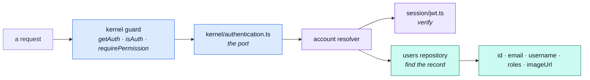
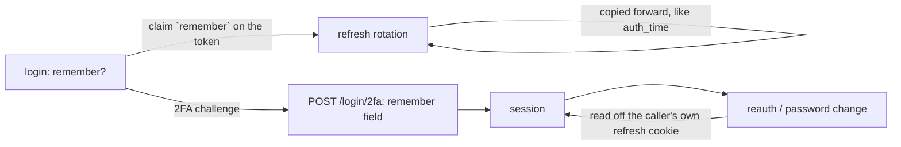
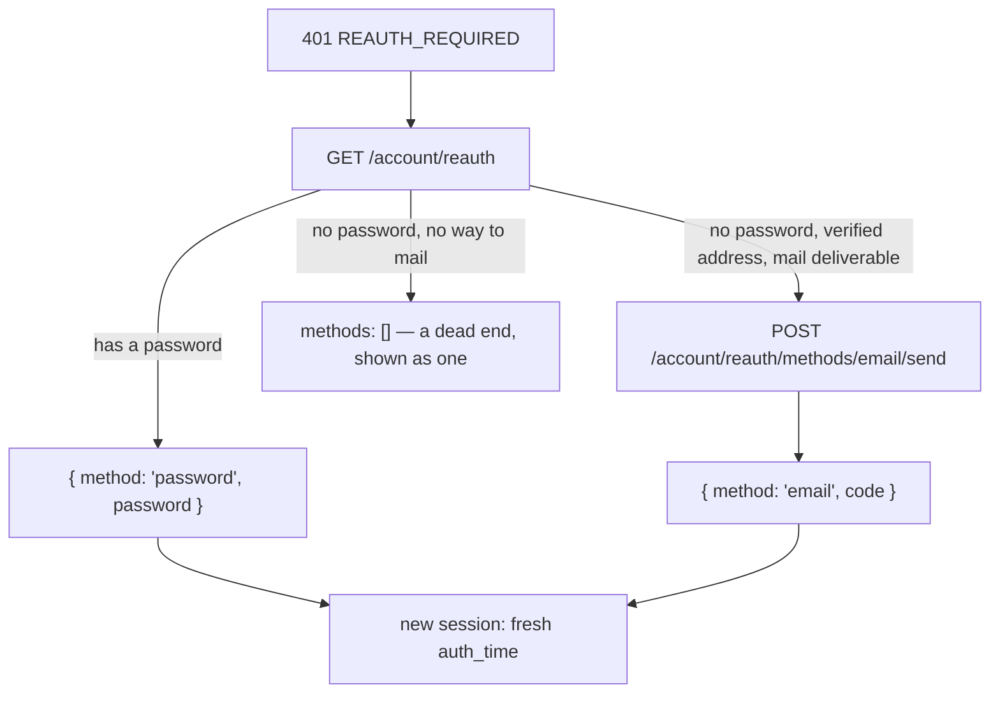
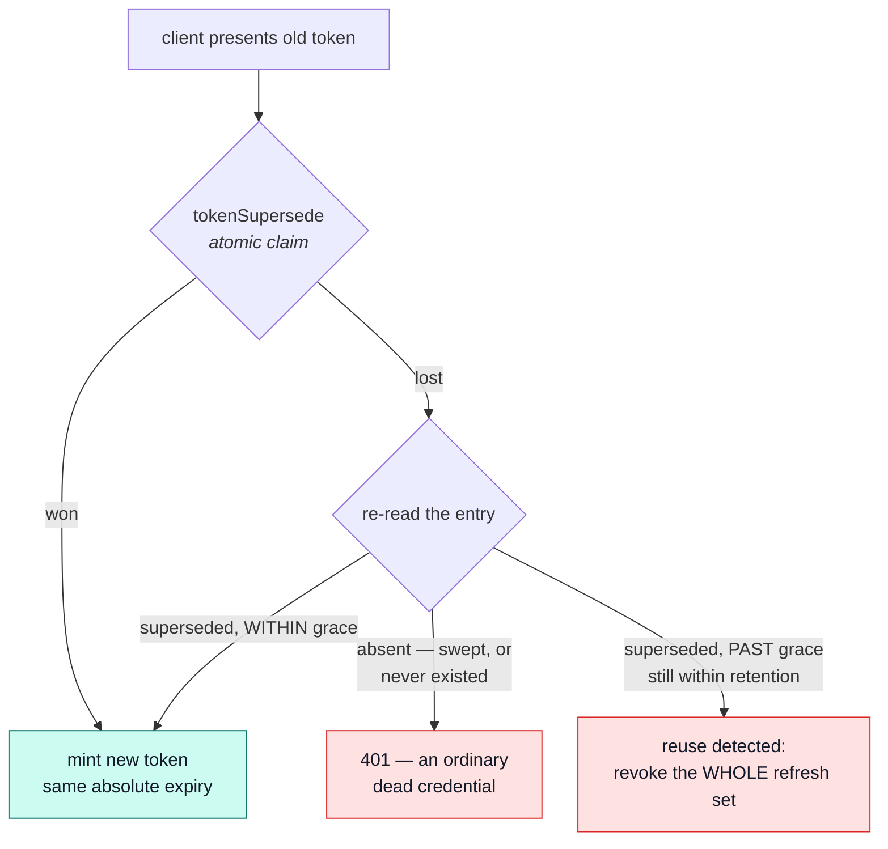

# Sessions

How this application decides who is making a request — and why none of it is published.

::: tip At a glance
**Six files** — `config.ts` reads the lifetimes, `key-ring.ts` gives a secret its `kid`, `jwt.ts` signs and verifies, `cookies.ts` sets and clears, `session.ts` mints the three of them together, `login-observability.ts` records that a login happened.
**Published** — nothing. `session/` has no barrel and may not be imported from outside the module.
**Breaks if you change** — the cookie flags or the lifetimes. Every guard in the app resolves through here.
:::

## The resolver, installed by `onRegistered`

[`account`](./account.md) fills the kernel's authentication port from its own `onRegistered` hook,
called once when `app.ts` registers every enabled module — not in a boot step, and not merely by
being imported. Installing a function touches no connection, and every guard in the application
depends on it existing before the first request arrives.

```mermaid
%%{init: {'flowchart': {'nodeSpacing': 32, 'rankSpacing': 50}}}%%
flowchart LR
    RQ["a request"] --> G["kernel guard<br/><i>getAuth · isAuth · requirePermission</i>"]
    G --> PT["kernel/authentication.ts<br/><i>the port</i>"]
    PT --> RS["account resolver"]
    RS --> V["session/jwt.ts<br/><i>verify</i>"]
    RS --> UR["users repository<br/><i>find the record</i>"]
    UR --> OUT["id · email · username · roles · imageUrl"]

    classDef k fill:#dbeafe,stroke:#2563eb,color:#111827;
    classDef a fill:#ede9fe,stroke:#7c3aed,color:#111827;
    classDef u fill:#ccfbf1,stroke:#0f766e,color:#111827;
    class G,PT k;
    class RS,V a;
    class UR,OUT u;
```

The resolver hands back **only the fields the port declares**. The kernel must never learn the
document shape — that is what keeps `kernel` below `modules` in the tier order.

::: warning Two failures that are not the same failure
A **bad token** rejects. A **valid token whose user is gone** resolves `undefined`. The guard turns
that distinction into `401` versus `403`, and collapsing the two would tell an attacker whether an
account exists.
:::

## Two tokens, two lifetimes, two homes

|                | Access token               | Refresh token             |
| -------------- | -------------------------- | ------------------------- |
| Travels in     | the `Authorization` header | the `jwt` cookie          |
| Lifetime from  | `NODE_TOKEN_ACCESS_TIME`   | one of three tiers, below |
| Readable by JS | yes — the client holds it  | no — `httpOnly`           |

The refresh tier is the "remember me" choice, and it is a tier rather than a boolean so the copy on
the login form and the lifetime in the environment stay one decision:

| Tier     | Environment variable             |
| -------- | -------------------------------- |
| `short`  | `NODE_TOKEN_REFRESH_TIME_SHORT`  |
| `medium` | `NODE_TOKEN_REFRESH_TIME_MEDIUM` |
| `long`   | `NODE_TOKEN_REFRESH_TIME_LONG`   |

`config.ts` is the single place a deployment's answer to _how long is a session_ is parsed —
`jwt.ts` signs against it and `cookies.ts` sets `maxAge` from it. Its name is deliberate: it holds
no token and issues none.

### The box left unticked {#remember-me-unticked}

No `remember` is a real choice, not a missing one. It is the conventional meaning of an unticked
"remember me" (ASP.NET Core Identity, Django, Rails Devise, Spring Security all do the same):

| Login                                 | Cookie                                      | Refresh token's server TTL |
| ------------------------------------- | ------------------------------------------- | -------------------------- |
| `remember: short` / `medium` / `long` | persistent, `Max-Age` = the tier            | the tier                   |
| no `remember` (also OAuth, signup)    | **browser-session**: no `Max-Age`/`Expires` | the `short` tier           |

The **server** TTL is the real limit, not the cookie: browsers restore session cookies ("continue
where you left off"), so a session cookie alone would not end anything. NIST 800-63B-4 says the same
— use a non-persistent cookie, and never let cookie expiry be the limit.

The access token is a separate clock. `getAccessExpiryTime()` reads `NODE_TOKEN_ACCESS_TIME` and
nothing else, so the refresh fallback above can never leak into it.

The choice has to survive every step that re-mints the session, or it silently reverts:

```mermaid
flowchart LR
    L[login: remember?] -->|claim `remember` on the token| R[refresh rotation]
    R -->|copied forward, like auth_time| R
    L -->|2FA challenge| T["POST /login/2fa: remember field"]
    T --> S[session]
    S --> A["reauth / password change"]
    A -->|read off the caller's own refresh cookie| S
```

- **Claim.** The refresh token carries `remember` only when a tier was ticked; absent means a
  browser-session login. Rotation copies it (`carriedClaims` in `jwt.ts`) and hands the controller
  `refreshMaxAgeMs: undefined` for a session login, so the rotated cookie stays a session cookie.
- **2FA.** The password step answers a challenge and sets no cookie, so the box's value is asked
  again: `POST /account/login/2fa` takes the same optional `remember` (`LoginTwoFactorRequest`).
  ASP.NET Core Identity carries it the same way. An OAuth-originated challenge has no earlier
  password step, so the 2FA request is the only place it can be said.
- **Reauth and password change.** Both replace the session, so `reissueSession` reads the tier off
  the request's own `jwt` cookie (signature only — a password change has already revoked the row)
  and keeps it. No cookie, a stranger's cookie or an expired one all read as "no tier": a session
  cookie, never a persistent one granted by accident.

## The signing key is a ring, not a single secret

`NODE_TOKEN_ACCESS`/`NODE_TOKEN_REFRESH` are each an ordered, comma-separated list of secrets,
newest first. `jwt.ts` signs with `ring[0]` and stamps a `kid` (`key-ring.ts#keyId`, a digest of
the secret itself); verifying looks the token's `kid` up in the ring rather than assuming
`ring[0]`, so a token signed moments before a rotation still verifies. Full rotation procedure:
docs/tools/security.md#signing-key-rotation.

## Freshness: how recently they proved it {#freshness-auth-time-and-amr}

A valid token and a recently-proved token are different things, and two OIDC claims are what makes
the difference expressible. Wire names are OIDC's on purpose: a future external identity provider's
tokens would satisfy the same guards unchanged.

| Claim       | Holds                                                             |
| ----------- | ----------------------------------------------------------------- |
| `auth_time` | epoch seconds at which the user last actually proved themselves   |
| `amr`       | **how** they proved it — RFC 8176 values, an array, not a boolean |

Both are **stamped once**, at login, then COPIED FORWARD on every access-token mint and every
rotation. Never re-stamped from the clock — a clock-derived `auth_time` would make every refresh
look like a fresh proof, which is precisely the thing the claim exists to deny.

`amr` is an array because proofs compose: a password login is `['pwd']`, a completed
[2FA](./account-two-factor.md) login is `['pwd', 'otp']`, an [OAuth](./account-oauth.md) callback is
`['google']`, and a future WebAuthn passkey is `['hwk']` without a schema change.

::: warning Both are optional, and absent means infinitely old
A token signed before these claims existed carries neither. Every reader treats a missing
`auth_time` as `0` rather than trusting it, so a pre-existing session is asked to re-authenticate at
its first sensitive action instead of reading as freshly authenticated. Fail-closed, in the only
direction that is safe.
:::

`POST /account/reauth` is how a caller refreshes `auth_time` without logging out — re-prove who you
are, get a new stamp. What consumes all of this is the `stepUp` tier declared on a permission
key, in [Authorization](../theory/authorization.md); the "remember me" tiers above set the cookie's
lifetime and **do not** exempt a sensitive action from the freshness check.

## Step-up for an account with no password

An account made through Google or GitHub has no password, so "re-prove the password" cannot be its
step-up. `GET /account/reauth` tells the client which methods apply; the body of `POST /account/reauth`
is tagged by `method`:

```mermaid
flowchart TD
    C[401 REAUTH_REQUIRED] --> G["GET /account/reauth"]
    G -->|has a password| P["{ method: 'password', password }"]
    G -->|no password, verified address, mail deliverable| S["POST /account/reauth/methods/email/send"]
    S --> E["{ method: 'email', code }"]
    P --> R[new session: fresh auth_time]
    E --> R
    G -->|no password, no way to mail| X["methods: [] — a dead end, shown as one"]
```

- **Why a mailed code is enough.** Forgot-password already works on an OAuth-only account, so the
  mailbox is the account's root key; a code to it adds no new trust. GitHub's sudo mode offers the
  same for social-login accounts. A provider round trip cannot replace it: Google honours neither
  `prompt=login` nor `max_age`, and GitHub returns no `auth_time`.
- **Only for accounts with no password.** A password account keeps the password, and the send route
  refuses it, so the route cannot mail unrequested codes to an account with a better proof.
- **Storage.** The code's HMAC sits on the user as `reauthCode`, separate from `twoFactorMethods`
  because it is not a factor: never armed, never challenges a login. Lifetime, cooldown and the
  five-guess ceiling are `two-factor/delivered-codes.ts`'s, shared.
- **Budget.** The send spends the same per-account hourly budget as
  `POST /account/2fa/methods/{method}/send`, since both fill the same mailbox.
- **`amr`.** The re-minted session keeps what it had and adds the method: `pwd` or the new `email`
  (not `otp`, which means a second factor here). A session that passed 2FA at login keeps `otp` after
  a re-auth, so a route that requires it still opens.
- **Boot.** An enabled OAuth provider with no deliverable mail (`smtp` with a host) refuses to boot
  outside `development` and `test`: those accounts would be locked out of checkout, payment and
  self-deletion. The demo registers its fake provider in code, not through these variables.

## The cookie, flag by flag

| Flag       | Value           | Why                                                                                 |
| ---------- | --------------- | ----------------------------------------------------------------------------------- |
| `httpOnly` | `true`          | The refresh token is the long-lived credential; script must not be able to read it. |
| `secure`   | production only | So local development over http still works, without weakening the deployed cookie.  |
| `sameSite` | `lax`           | Survives a top-level navigation back into the app; refuses cross-site form posts.   |
| `path`     | `/`             | The refresh endpoint and the logout endpoint are on different paths.                |
| `maxAge`   | the chosen tier | The cookie expires when the token does, rather than outliving it.                   |

There is a second, deliberately **non-secure** cookie carrying nothing but a logged-in hint, so the
client shell can render the right chrome before its first request answers. It holds no credential
and is safe to read from script — that is its entire job.

## Why none of this is published

::: tip The barrel is one line wide
`session/` used to be exported on the theory that authorization would need it. It does not.
`kernel/authentication.ts` is the port every request goes through, this module fills it from
`module.ts` using its own relative imports, and **no sibling has ever reached for a token**.

Issuing this application's tokens _is_ what `account` is, and none of it is anyone else's business.
That is also why `session/` is a folder rather than a published layer: nothing outside these four
walls may import it, so it needs no barrel of its own.
:::

`account`'s own barrel publishes nothing this page's flows produce either — `session/` stays
entirely internal. What `account` used to publish, `addressForCheckout`, left with the address
book when it moved to its own module — see [`addresses`](./addresses.md).

## The two shared tails

Three flows mint a session and two record one, so both halves are extracted rather than copied.
Neither is a layer — they are the repeated ends of controllers.

| File                     | Is                                                                        | Reused by                                             |
| ------------------------ | ------------------------------------------------------------------------- | ----------------------------------------------------- |
| `session.ts`             | `issueSession` — refresh token, its cookies, the access token handed back | `postLogin`, `postPasswordChange`, the OAuth callback |
| `login-observability.ts` | the metrics / audit / analytics emit meaning "a login happened"           | `post-login.ts`, `post-login-2fa.ts`                  |

::: tip Why the observability tail is not in the service
`services/authentication.ts` checks credentials; it cannot know whether a session exists. The
SUCCESS emit must fire only **after** cookies and an access token are real, which is a
controller-layer fact — so `login()` and `verifyLoginChallenge()` are deliberately kept ignorant of
it.
:::

## Logout everywhere

The refresh tokens hang off the user document in [`users`](./users.md)' `tokens` subdocument, which
is what makes "log me out of every device" a single write rather than a token blocklist. It is also
the concrete reason the `account → users` edge is `shared-kernel`: this module writes that array.

## Refresh rotation

`GET /account/refresh` doesn't just re-sign an access token — it REPLACES the refresh token too,
every time. Without that, a stolen cookie would stay valid, silently, for as long as it had left to
live (up to a year, `remember: long`); rotation turns "a value that never changes" into "a value
that changes on every use", so a copy presented after the original has moved is detectable.

The new token's absolute expiry is COPIED from the old one's own claim, never reset to a fresh full
window — rotation changes the token's VALUE for theft detection, it does not extend how long the
session may live past what it was granted at login. The "remember me" choice is copied forward too
([above](#remember-me-unticked)): a rotation that dropped it would turn a session cookie persistent
on the first refresh.

```mermaid
%%{init: {'flowchart': {'nodeSpacing': 32, 'rankSpacing': 46}}}%%
flowchart TD
    C["client presents old token"] --> S{"tokenSupersede<br/><i>atomic claim</i>"}
    S -->|"won"| N["mint new token<br/>same absolute expiry"]
    S -->|"lost"| R{"re-read the entry"}
    R -->|"absent — swept, or<br/>never existed"| F["401 — an ordinary<br/>dead credential"]
    R -->|"superseded, WITHIN grace"| N
    R -->|"superseded, PAST grace<br/>still within retention"| X["reuse detected:<br/>revoke the WHOLE refresh set"]

    classDef ok fill:#ccfbf1,stroke:#0f766e,color:#111827;
    classDef bad fill:#fee2e2,stroke:#dc2626,color:#111827;
    class N ok;
    class F,X bad;
```

The grace window (`NODE_TOKEN_ROTATION_GRACE_MS`, default 10s) exists for one reason: two requests
racing on the SAME cookie — two tabs waking together, an interceptor retrying — both present the
identical old token, and only one can win the atomic claim. Without the grace window the loser's
retry would look exactly like theft. Within it, the loser is reissued its own sibling token instead
of rejected — proven under real concurrent load in
`tests/integration/concurrency/auth-races.test.ts` (R5), not just asserted here.

### Two windows, and why they must not be one

A superseded entry stays in `tokens` — never `$pull`ed immediately — so a later presentation of it
can still be told apart from noise. `GET /account/sessions` filters these out; they aren't a device
the account holder should see or be able to revoke on their own. The housekeeping sweep
(the nightly `reap:expired-tokens` job, plus each account's own prune on a login or a refresh) removes
them eventually, alongside ordinarily expired tokens — see `tokenRemoveExpired` in
[`users`](./users.md)'s repository.

How long "eventually" is, is its own setting, and the separation is load-bearing:

| Window                         | Default | Answers                                                      |
| ------------------------------ | ------- | ------------------------------------------------------------ |
| `NODE_TOKEN_ROTATION_GRACE_MS` | 10s     | Is this replay a benign race, to be reissued?                |
| `NODE_TOKEN_REUSE_WINDOW_MS`   | 24h     | Do we still REMEMBER this token, so a replay reads as theft? |

While the sweep used the grace window as its cutoff, the two were the same value — and its purge
predicate (`supersededAt < now - grace`) was the exact complement of the detection predicate
(`supersededMsAgo > grace`). A sweep that ran ahead of the rotation on the very request presenting
the token deleted a stale token before the reuse check could recognise it. The check fell through
to "genuinely absent", answered an ordinary 401, and revoked nothing. Nothing failed; the defence
was simply unreachable.

So every sweep uses the RETENTION window, and none runs AHEAD of a rotation: a refresh prunes its own
account only after the rotation's lookup and the new token are written (`session/prune.ts`),
and the whole-collection sweep is a nightly job. The sweep also no longer rides on login and refresh
at all, because an unindexed collection-wide `updateMany` on an anonymous request's path let anyone
schedule it.

`account`'s manifest refuses to boot unless retention exceeds grace (the check on `sessionConfig` in `session/config.ts`) — the failure is silent by
nature, so it is made loud at the only moment it can be.

The retention default is a trade, stated plainly: an active client rotates about once per
`NODE_TOKEN_ACCESS_TIME` (600s), so 24h keeps roughly 144 entries per session, a few tens of KB.
Retaining for a refresh token's full lifetime would reach ~52,500 entries on the one-year tier,
against MongoDB's 16 MB document ceiling. Past the retention window a replay is an ordinary 401
with no revocation — a real limit, chosen rather than stumbled into, and asserted as such in
`src/modules/account/tests/integration/jwt.test.ts`.

## Libraries

`jsonwebtoken` is `account`'s alone — see [Package Dependencies](../tools/package-dependencies.md)
for where it sits among everything else this repo depends on.

| Library                  | Maintained    | What it costs you                                                                      |
| ------------------------ | ------------- | -------------------------------------------------------------------------------------- |
| `jsonwebtoken` (chosen)  | active, typed | the one signing algorithm this app actually uses (`HS256`), a small, well-worn surface |
| `jose`                   | active, typed | a broader JOSE/JWK toolkit — more than a same-secret access/refresh pair needs         |
| hand-rolled HMAC signing | —             | exactly the kind of crypto `CLAUDE.md` rules out writing by hand                       |

## Related pages

- [`account`](./account.md) — the module this belongs to
- [Two-factor authentication](./account-two-factor.md) — the second factor a login may have to pass
- [OAuth](./account-oauth.md) — the other way a session is minted
- [Authorization](../theory/authorization.md) — what consumes `auth_time` and `amr`
- [`users`](./users.md) — where the refresh tokens are stored
- [Security](../tools/security.md) — hashing, headers, and rate limits
- [Request Flow](../theory/request-flow.md) — where the guard sits
- [Strategic DDD](../theory/strategic-ddd.md#_2-context-map-—-how-a-module-reaches-its-siblings) — what `shared-kernel` costs
