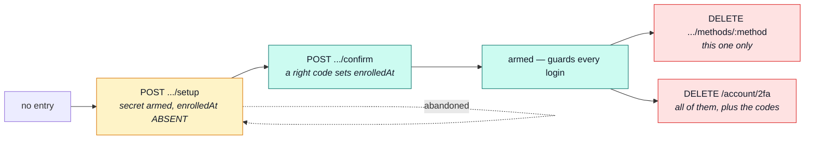

# Two-factor authentication

The second factor's **structure** — the registry, the state machine, and what a user document
carries. [Security](../tools/security.md#two-factor-authentication) covers the same subsystem from
the attacker's side: the crypto at rest, the controls, and what is honestly not covered.

::: tip At a glance
**The shape** — `registry.ts` declares the port, `methods/*.ts` implement it one channel per file,
`totp.ts` / `delivered-codes.ts` / `backup-codes.ts` hold the crypto behind them, `index.ts` is the
module-internal barrel.
**Published** — nothing. No sibling imports it, including the admin recovery path in
[`users`](./users.md).
**Breaks if you change** — `TwoFactorMethodRecord`. One shape serves every method, so a new field
is a schema change in `users`, not here.
:::

## A registry, not a branch

Gaining a channel means adding a handler. Everything above `registry.ts` — services, controllers,
the contract — deals in a `method` string and a handler looked up from it, so no login-flow
`switch` grows a third arm.

| Member          | What it answers                                                       |
| --------------- | --------------------------------------------------------------------- |
| `name`          | the wire name, stored on the entry and carried by the contract        |
| `delivers`      | does the server send the code, or does a device derive it?            |
| `available()`   | can this **deployment** run the method at all?                        |
| `eligibility()` | may this **account** enroll it — a verified address, a verified phone |
| `target()`      | the masked destination, so no client has to redact one                |
| `setup()`       | arm whatever the caller needs to produce a first code                 |
| `verify()`      | check a typed code, advancing the replay guard or burning the code    |
| `send?()`       | deliver a fresh code — present exactly when `delivers` is true        |

::: warning Handlers never touch the database
A handler mutates the entry it is handed and returns. Persisting is the calling service's job,
which is what lets **one** save cover the factor, the backup codes and the account flag together —
three writes could half-apply and leave an account whose flag says "armed" and whose methods say
otherwise.
:::

Two ship. `HANDLERS` declares their order, and that order is the client's offer order — a device
method first, because it costs no round-trip and no mailbox:

| Method  | `delivers` | `available()` when                        |
| ------- | ---------- | ----------------------------------------- |
| `totp`  | no         | always — it needs no channel and no proof |
| `email` | yes        | SMTP is configured                        |

`twoFactorMethod(name)` answers `undefined` for an unknown method **and** for one this deployment
has switched off. One answer for two cases, on purpose: a caller learns nothing from being told a
channel exists but is unavailable.

## Enrollment is two steps, and the halfway state is real

`enrolledAt` is the whole distinction. Setup arms a secret so the caller can produce a code;
nothing guards a login until a code proves the caller actually received it.

A half-enrolled entry is **ignored by login**, not cleaned up: re-running setup overwrites it, and
a fresh secret resets `lastUsedStep` too — the old high-water mark belongs to a secret that no
longer exists, and keeping it would refuse the first valid code.

## What the user document carries

The fields live on [`users`](./users.md)' `User`, because that is the account record. This module
is the only writer.

| Field                    | Holds                                  | On the contract?                          |
| ------------------------ | -------------------------------------- | ----------------------------------------- |
| `twoFactorMethods[]`     | one `TwoFactorMethodRecord` per method | no — `select: false` credential material  |
| `twoFactorBackupCodes[]` | sha256 of ten one-time codes           | no — same                                 |
| `twoFactorEnabledAt`     | when the account first armed anything  | **yes**, the only 2FA field a client sees |

One record shape serves every method, rather than a collection per channel: a deployment that
gains a channel adds a handler, not a migration. Device fields (`secret`, `lastUsedStep`) and
delivered fields (`codeHash`, `codeExpiresAt`, `codeSentAt`, `codeAttempts`) are all optional on
the same record, and which half a method uses follows from its `delivers`.

## The endpoint surface, and what guards each one

Reading your own factors is not a privileged act. Changing them is, and every mutation sits behind
**critical** fresh auth — see [Sessions](./account-sessions.md#freshness-auth-time-and-amr).

| Route                                       | Guard                                                |
| ------------------------------------------- | ---------------------------------------------------- |
| `GET /account/2fa`                          | `isAuth` — your own status                           |
| `POST /account/2fa/methods/:method/setup`   | critical fresh auth                                  |
| `POST /account/2fa/methods/:method/confirm` | critical fresh auth                                  |
| `DELETE /account/2fa/methods/:method`       | critical fresh auth **+** a valid code               |
| `DELETE /account/2fa`                       | critical fresh auth **+** a valid code               |
| `POST /account/2fa/backup-codes`            | critical fresh auth                                  |
| `POST /account/login/2fa/send`              | public — `credentialLimiters`, `mfaSendLimiter`      |
| `POST /account/login/2fa`                   | public — `credentialLimiters`, `mfaChallengeLimiter` |

The two login routes are public because they must be: the caller has no session yet, which is the
entire point of the step. What stands in for one is the challenge — see
[Security](../tools/security.md#the-challenge-is-a-claim-check-not-a-code) for why it is a
single-use `tokens[]` entry rather than a JWT.

::: warning Two route orderings are load-bearing
`/login/2fa/send` is registered **above** `/login/2fa`, and `DELETE /2fa/methods/:method` **last**
of the method routes. Express matches in registration order, so either one moved changes which
handler answers.
:::

Why a mutation needs a code on top of a fresh session, and why removing one method is held to the
same bar as removing all of them, is argued in
[Security](../tools/security.md#the-controls-and-which-attack-each-one-answers).

## Adding a channel

1. Write the handler under `methods/` — one file, satisfying `TwoFactorMethodHandler`.
2. Add it to `HANDLERS` in `registry.ts`, in the position a client should offer it.
3. Gate `available()` on whatever the channel needs, the way `email` gates on SMTP.

No service, controller, contract or schema change. That is the property the registry exists to buy,
and the reason `sms` is described everywhere as "a third handler and no other change".

## Related pages

- [`account`](./account.md) — the module this belongs to
- [Sessions](./account-sessions.md) — the tokens a completed 2FA login mints, and `amr`
- [Security](../tools/security.md#two-factor-authentication) — the crypto, the controls, the gaps
- [`users`](./users.md) — where the factors are stored, and the admin recovery path
- [OAuth](./account-oauth.md) — the other way in, and the one that does **not** consult 2FA
