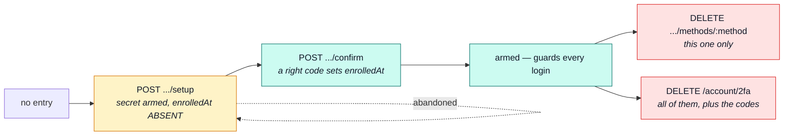
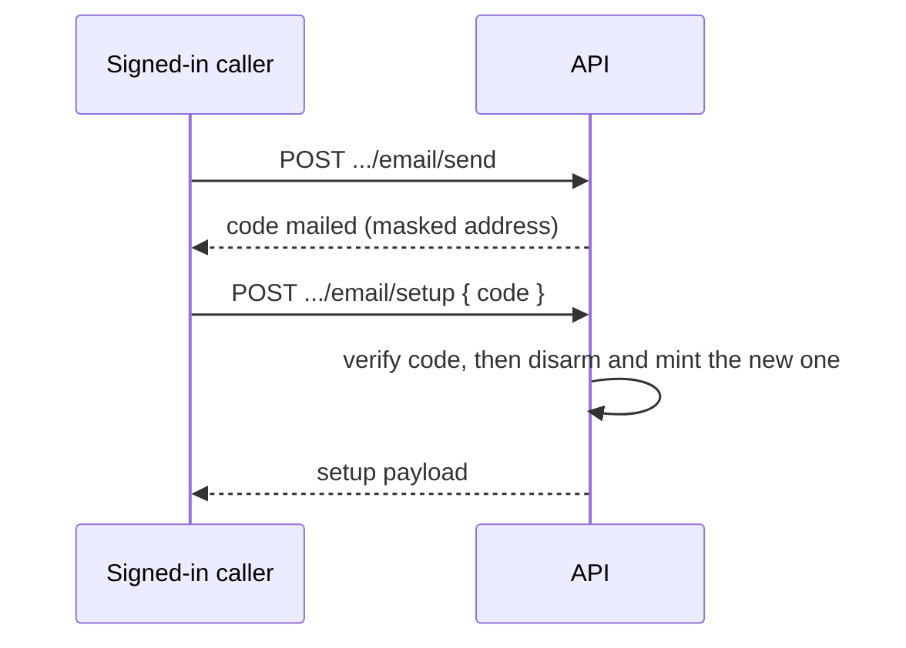

# Two-factor authentication

The second factor's **structure** — the registry, the state machine, and what a user document
carries. [Security](../tools/security.md#two-factor-authentication) covers the same subsystem from
the attacker's side: the crypto at rest, the controls, and what is honestly not covered.

::: tip At a glance
**The shape** — `registry.ts` declares the port, `methods/*.ts` implement it one channel per file,
`totp.ts` / `delivered-codes.ts` / `backup-codes.ts` hold the crypto behind them, `index.ts` is the
module-internal barrel.
**Published** — nothing. No sibling imports it. There is no admin recovery path: a lost factor is
a technician's hand edit in the database.
**Breaks if you change** — `TwoFactorMethodRecord`. One shape serves every method, so a new field
is a schema change in `users`, not here.
:::

## A registry, not a branch

Gaining a channel means adding a handler. Everything above `registry.ts` — services, controllers,
the contract — deals in a `method` string and a handler looked up from it, so no login-flow
`switch` grows a third arm.

| Member          | What it answers                                                       |
| --------------- | --------------------------------------------------------------------- |
| `name`          | the wire name, stored on the entry and carried by the contract        |
| `delivers`      | does the server send the code, or does a device derive it?            |
| `available()`   | can this **deployment** run the method at all?                        |
| `eligibility()` | may this **account** enroll it — a verified address, a verified phone |
| `target()`      | the masked destination, so no client has to redact one                |
| `setup()`       | arm whatever the caller needs to produce a first code                 |
| `verify()`      | check a typed code, advancing the replay guard or burning the code    |
| `send?()`       | deliver a fresh code — present exactly when `delivers` is true        |

::: warning Handlers never touch the database
A handler mutates the entry it is handed and returns. Persisting is the calling service's job,
which is what lets **one** save cover the factor, the backup codes and the account flag together —
three writes could half-apply and leave an account whose flag says "armed" and whose methods say
otherwise.
:::

Two ship. `HANDLERS` declares their order, and that order is the client's offer order — a device
method first, because it costs no round-trip and no mailbox:

| Method  | `delivers` | `available()` when                        |
| ------- | ---------- | ----------------------------------------- |
| `totp`  | no         | always — it needs no channel and no proof |
| `email` | yes        | SMTP is configured                        |

`twoFactorMethod(name)` answers `undefined` for an unknown method **and** for one this deployment
has switched off. One answer for two cases, on purpose: a caller learns nothing from being told a
channel exists but is unavailable.

## Enrollment is two steps, and the halfway state is real

`enrolledAt` is the whole distinction. Setup arms a secret so the caller can produce a code;
nothing guards a login until a code proves the caller actually received it.

```mermaid
%%{init: {'flowchart': {'nodeSpacing': 32, 'rankSpacing': 46}}}%%
flowchart LR
    N["no entry"] --> S["POST .../setup<br/><i>secret armed, enrolledAt ABSENT</i>"]
    S --> C["POST .../confirm<br/><i>a right code sets enrolledAt</i>"]
    C --> A["armed — guards every login"]
    S -.->|"abandoned"| S
    A --> D["DELETE .../methods/:method<br/><i>this one only</i>"]
    A --> X["DELETE /account/2fa<br/><i>all of them, plus the codes</i>"]

    classDef half fill:#fef3c7,stroke:#d97706,color:#111827;
    classDef ok fill:#ccfbf1,stroke:#0f766e,color:#111827;
    classDef gone fill:#fee2e2,stroke:#dc2626,color:#111827;
    class S half;
    class A,C ok;
    class D,X gone;
```

A half-enrolled entry is **ignored by login**, not cleaned up: re-running setup overwrites it, and
a fresh secret resets `lastUsedStep` too — the old high-water mark belongs to a secret that no
longer exists, and keeping it would refuse the first valid code.

## What the user document carries

The fields live on [`users`](./users.md)' `User`, because that is the account record. This module
is the only writer.

| Field                     | Holds                                            | On the contract?                          |
| ------------------------- | ------------------------------------------------ | ----------------------------------------- |
| `twoFactorMethods[]`      | one `TwoFactorMethodRecord` per method           | no — `select: false` credential material  |
| `twoFactorBackupCodes[]`  | salted scrypt of ten one-time codes              | no — same                                 |
| `twoFactorBackupCodeSalt` | the one salt every entry above is scrypt'd under | no — same                                 |
| `twoFactorEnabledAt`      | when the account first armed anything            | **yes**, the only 2FA field a client sees |

One record shape serves every method, rather than a collection per channel: a deployment that
gains a channel adds a handler, not a migration. Device fields (`secret`, `lastUsedStep`) and
delivered fields (`codeHash`, `codeExpiresAt`, `codeSentAt`, `codeAttempts`) are all optional on
the same record, and which half a method uses follows from its `delivers`.

## The endpoint surface, and what guards each one

Reading your own factors is not a privileged act. Changing them is, and every mutation sits behind
**critical** fresh auth — see [Sessions](./account-sessions.md#freshness-auth-time-and-amr).

| Route                                       | Guard                                                               |
| ------------------------------------------- | ------------------------------------------------------------------- |
| `GET /account/2fa`                          | `isAuth` — your own status                                          |
| `POST /account/2fa/methods/:method/setup`   | critical fresh auth **+** a valid code once any factor is armed     |
| `POST /account/2fa/methods/:method/send`    | critical fresh auth, `accountCodeSendLimiter`; armed delivered only |
| `POST /account/2fa/methods/:method/confirm` | critical fresh auth                                                 |
| `DELETE /account/2fa/methods/:method`       | critical fresh auth **+** a valid code                              |
| `DELETE /account/2fa`                       | critical fresh auth **+** a valid code                              |
| `POST /account/2fa/backup-codes`            | critical fresh auth **+** a valid code                              |
| `POST /account/login/2fa/send`              | public — `credentialLimiters`, `mfaSendLimiter`                     |
| `POST /account/login/2fa`                   | public — `credentialLimiters`, `mfaChallengeLimiter`                |

The two login routes are public because they must be: the caller has no session yet, which is the
entire point of the step. What stands in for one is the challenge — see
[Security](../tools/security.md#the-challenge-is-a-claim-check-not-a-code) for why it is a
single-use `tokens[]` entry rather than a JWT.

::: warning Two route orderings are load-bearing
`/login/2fa/send` is registered **above** `/login/2fa`, and `DELETE /2fa/methods/:method` **last**
of the method routes. Express matches in registration order, so either one moved changes which
handler answers.
:::

Why a mutation needs a code on top of a fresh session, and why removing one method is held to the
same bar as removing all of them, is argued in
[Security](../tools/security.md#the-controls-and-which-attack-each-one-answers).

## Changing factors needs a factor

Once any factor is armed, **every** `setup` — replacing one, or adding a second method — carries a
`code` from an armed factor or an unused backup code, the same `verifyAnyFactor` that removing one
asks for. The **first** factor needs only the fresh password: there is nothing to prove yet, and a
backup code is the route for someone who lost their phone. Without the rule a stolen-but-fresh
session could disarm the factor it would otherwise have to pass (OWASP MFA Cheat Sheet, "Changing
MFA Factors"; NIST SP 800-63B).

Every check of an **armed** factor — those calls, and the login challenge's code step — shares one
per-account cap of **wrong** codes: ten lock the account's 2FA checks for 15 minutes, answering
`429` before any code is compared, and the owner is mailed once (`account.two-factor-locked`). The
counter is a Mongo field on the user, not a Redis budget: the write is free, it survives a cache
outage, and one count covers every place a code is typed (NIST SP 800-63B allows up to 100). The
attempt is **reserved before it is compared** — one atomic `findOneAndUpdate` — because a
check-then-increment races: parallel guesses would all read "under the cap". A right code hands the
counter back, and so does a completed password reset (the mailbox is the account's own recovery).
Enrolment `/confirm` never counts: no factor is armed there yet. Login's own guesses are also capped
per challenge (`NODE_MFA_CHALLENGE_MAX`), keyed on the challenge cookie when an OAuth login carries
it there.

An account whose only factor is **delivered** has nothing to read a code from, so
`POST /account/2fa/methods/:method/send` mails one to the signed-in caller — armed delivered methods
only, paced by the same 30 s per-code cooldown and by its own per-account hourly budget
(`NODE_MFA_ACCOUNT_SEND_MAX`).

```mermaid
sequenceDiagram
    participant U as Signed-in caller
    participant A as API
    U->>A: POST .../email/send
    A-->>U: code mailed (masked address)
    U->>A: POST .../email/setup { code }
    A->>A: verify code, then disarm and mint the new one
    A-->>U: setup payload
```

Every add or replace, removal, and "2FA turned off" also **mails the account holder** out of band
(`account.two-factor-changed`), because a change from a stolen session is otherwise silent.

## Adding a channel

1. Write the handler under `methods/` — one file, satisfying `TwoFactorMethodHandler`.
2. Add it to `HANDLERS` in `registry.ts`, in the position a client should offer it.
3. Gate `available()` on whatever the channel needs, the way `email` gates on SMTP.

No service, controller, contract or schema change. That is the property the registry exists to buy,
and the reason `sms` is described everywhere as "a third handler and no other change".

## Libraries

`otplib` is `account`'s alone — see [Package Dependencies](../tools/package-dependencies.md) for
where it sits among everything else this repo depends on.

| Library                             | Maintained             | What it costs you                                                |
| ----------------------------------- | ---------------------- | ---------------------------------------------------------------- |
| `otplib` (chosen)                   | active, typed          | RFC 4226/6238 TOTP + HOTP, a QR-ready `keyuri`, nothing else     |
| `speakeasy`                         | unmaintained for years | the same RFCs, but a security-relevant dependency nobody patches |
| hand-rolled HMAC-SHA1 time-stepping | —                      | exactly the kind of crypto `CLAUDE.md` rules out writing by hand |

## Related pages

- [`account`](./account.md) — the module this belongs to
- [Sessions](./account-sessions.md) — the tokens a completed 2FA login mints, and `amr`
- [Security](../tools/security.md#two-factor-authentication) — the crypto, the controls, the gaps
- [`users`](./users.md) — where the factors are stored
- [OAuth](./account-oauth.md) — the other way in, and it consults 2FA like the password login
