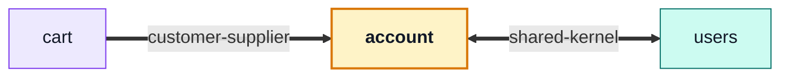

# account

::: tip At a glance
**Owns** — the session: signup, login, refresh, password reset, logout-everywhere, two-step deletion — plus the address book.
**Depends on** — [`users`](./users.md), whose record it authenticates. The repo's only `shared-kernel` edge.
**Breaks if you change** — the token lifetimes or the cookie flags. Every guard in the app resolves through this module.
:::

<!-- gen:identity:start -->

| Fact                     | This module                                                         |
| ------------------------ | ------------------------------------------------------------------- |
| **Subdomain**            | `generic` — A solved problem. Modelling effort here would be waste. |
| **Base path**            | `/account`                                                          |
| **Collection**           | `addressbooks` (model `AddressBook`)                                |
| **Depends on**           | [`users`](./users.md)                                               |
| **Depended on by**       | [`cart`](./cart.md)                                                 |
| **Languages**            | `en` · `it`                                                         |
| **Seeded**               | yes — `addressBooks` as `stored`                                    |
| **Frontend counterpart** | `account` in `boilerplate-vue-frontend`                             |

<!-- gen:identity:end -->

## The map

<!-- gen:map:start -->



- `cart` → **customer-supplier** — Checkout asks the address book for the one address it should ship to (`addressForCheckout`).
- → `users` **shared-kernel** — Both modules read and write the same User record: `users` administers it, this module authenticates it. The only shared kernel in the repo, and the reason the users barrel exports its model and repository at all.

<!-- gen:map:end -->

## The story

This module answers the kernel's one question: **who is making this request?** It registers an
auth resolver at import time — not in a boot step — because installing a function touches no
connection, and every guard in the application depends on it existing before the first request
arrives.

It owns exactly one collection, and it is not the one you would guess. The User record belongs to
[`users`](./users.md) and is reached through that module's barrel; what this module owns outright
is the **address book**, one document per account, and a destroyed account takes its book with it
through the same `user.deleted` event the cart and wishlist listen for.

::: tip The barrel is one line wide, and that is the story
The three files in `session/` — JWT signing, cookie shape, the lifetimes both read — used to be
published on the theory that authorization would need them. It does not: `kernel/authentication.ts`
is the port every request goes through, and this module fills it using its own relative imports. No
sibling has ever reached for a token. Issuing this application's tokens _is_ what `account` is, and
none of it is anyone else's business.
:::

What the barrel does publish is `addressForCheckout` — the single address an order ships to. The
address CRUD stays internal, served by this module's own routes. That one function is the whole of
the cart's `customer-supplier` arrow.

## Data

<!-- gen:data:start -->

#### `addressbooks`

From model `AddressBook`. `_id` and `__v` are omitted — every document carries them.

| Field        | Type            | Flags            | Default | Reference / values |
| ------------ | --------------- | ---------------- | ------- | ------------------ |
| `userId`     | `ObjectId`      | required, unique | —       | → `User`           |
| `items`      | `Subdocument[]` | —                | []      | —                  |
| ↳ `label`    | `String`        | —                | —       | —                  |
| ↳ `fullName` | `String`        | required         | —       | —                  |
| ↳ `street`   | `String`        | required         | —       | —                  |
| ↳ `city`     | `String`        | required         | —       | —                  |
| ↳ `zip`      | `String`        | required         | —       | —                  |
| ↳ `country`  | `String`        | required         | —       | —                  |
| ↳ `phone`    | `String`        | —                | —       | —                  |
| ↳ `default`  | `Boolean`       | —                | false   | —                  |
| `createdAt`  | `Date`          | —                | —       | —                  |
| `updatedAt`  | `Date`          | —                | —       | —                  |

**Declared indexes**

| Keys        | Options |
| ----------- | ------- |
| `userId: 1` | unique  |

<!-- gen:data:end -->

## Surface

<!-- gen:surface:start -->

| Endpoint                                | Middlewares                                                                                                                  | Controller             | What it does               |
| --------------------------------------- | ---------------------------------------------------------------------------------------------------------------------------- | ---------------------- | -------------------------- |
| `DELETE /account`                       | `getAuth` → `noStore` → `isAuth`                                                                                             | `deleteAccountRequest` | Request account deletion   |
| `GET /account`                          | `getAuth` → `noStore` → `isAuth`                                                                                             | `getAccount`           | Current user info          |
| `PUT /account`                          | `getAuth` → `noStore` → `isAuth` → `(inline)` → `(inline)` → `validateUploadedImages` → `storeUploadedImages`                | `putAccount`           | Update own profile         |
| `GET /account/addresses`                | `getAuth` → `noStore` → `isAuth`                                                                                             | `getAddresses`         | List saved addresses       |
| `POST /account/addresses`               | `getAuth` → `noStore` → `isAuth`                                                                                             | `postAddress`          | Add an address             |
| `DELETE /account/addresses/{addressId}` | `getAuth` → `noStore` → `isAuth`                                                                                             | `deleteAddress`        | Remove an address          |
| `PUT /account/addresses/{addressId}`    | `getAuth` → `noStore` → `isAuth`                                                                                             | `putAddress`           | Update an address          |
| `DELETE /account/delete-confirm`        | `getAuth` → `noStore` → `(inline)`                                                                                           | `deleteAccountConfirm` | Confirm account deletion   |
| `POST /account/login`                   | `getAuth` → `noStore` → `(inline)` → `(inline)`                                                                              | `postLogin`            | Login                      |
| `POST /account/logout`                  | `getAuth` → `noStore`                                                                                                        | `postLogout`           | Logout this session        |
| `POST /account/logout-all`              | `getAuth` → `noStore` → `isAuth` → `(inline)`                                                                                | `postLogoutEverywhere` | Logout from all devices    |
| `POST /account/password`                | `getAuth` → `noStore` → `(inline)` → `(inline)` → `isAuth`                                                                   | `postPasswordChange`   | Change password            |
| `GET /account/refresh`                  | `getAuth` → `noStore`                                                                                                        | `getRefreshToken`      | Refresh access token       |
| `POST /account/reset`                   | `getAuth` → `noStore` → `(inline)` → `(inline)`                                                                              | `postResetRequest`     | Request password reset     |
| `POST /account/reset-confirm`           | `getAuth` → `noStore` → `(inline)` → `(inline)` → `(inline)`                                                                 | `postResetConfirm`     | Confirm password reset     |
| `GET /account/sessions`                 | `getAuth` → `noStore` → `isAuth`                                                                                             | `getSessions`          | List active sessions       |
| `DELETE /account/sessions/{sessionId}`  | `getAuth` → `noStore` → `isAuth`                                                                                             | `deleteSession`        | Revoke one session         |
| `POST /account/signup`                  | `getAuth` → `noStore` → `(inline)` → `(inline)` → `(inline)` → `(inline)` → `validateUploadedImages` → `storeUploadedImages` | `postSignup`           | Signup                     |
| `DELETE /account/tokens/expired`        | `getAuth` → `noStore` → `isAuth` → `isAdmin` → `(inline)`                                                                    | `deleteExpiredTokens`  | Remove expired tokens      |
| `POST /account/verify-confirm`          | `getAuth` → `noStore` → `(inline)` → `(inline)` → `(inline)`                                                                 | `postVerifyConfirm`    | Confirm email verification |
| `POST /account/verify-request`          | `getAuth` → `noStore` → `(inline)` → `(inline)` → `isAuth`                                                                   | `postVerifyRequest`    | Request email verification |

Middlewares run left to right; the controller is the last handler on the route. Summaries come from this module’s own `openapi.yaml`, which is where they are edited.

<!-- gen:surface:end -->

## Signals

<!-- gen:signals:start -->

#### Domain events

| Event          | Direction                    |
| -------------- | ---------------------------- |
| `user.deleted` | subscribed to in `module.ts` |

#### Audit actions

| Constant                         | Action name                      |
| -------------------------------- | -------------------------------- |
| `AUTH_LOGIN_SUCCEEDED`           | `auth.login.succeeded`           |
| `AUTH_LOGIN_FAILED`              | `auth.login.failed`              |
| `AUTH_SIGNUP_SUCCEEDED`          | `auth.signup.succeeded`          |
| `AUTH_SIGNUP_FAILED`             | `auth.signup.failed`             |
| `AUTH_ACCOUNT_UPDATED`           | `auth.account.updated`           |
| `AUTH_PASSWORD_RESET_REQUESTED`  | `auth.password_reset.requested`  |
| `AUTH_PASSWORD_RESET_COMPLETED`  | `auth.password_reset.completed`  |
| `AUTH_PASSWORD_CHANGE_COMPLETED` | `auth.password_change.completed` |
| `AUTH_PASSWORD_CHANGE_FAILED`    | `auth.password_change.failed`    |
| `AUTH_ACCOUNT_DELETE_REQUESTED`  | `auth.account_delete.requested`  |
| `AUTH_ACCOUNT_DELETE_COMPLETED`  | `auth.account_delete.completed`  |
| `AUTH_EMAIL_VERIFY_REQUESTED`    | `auth.email_verify.requested`    |
| `AUTH_EMAIL_VERIFY_COMPLETED`    | `auth.email_verify.completed`    |
| `AUTH_REFRESH_SUCCEEDED`         | `auth.refresh.succeeded`         |
| `AUTH_REFRESH_FAILED`            | `auth.refresh.failed`            |
| `AUTH_LOGOUT_SUCCEEDED`          | `auth.logout.succeeded`          |
| `AUTH_LOGOUT_ALL_SUCCEEDED`      | `auth.logout_all.succeeded`      |
| `AUTH_SESSION_REVOKED`           | `auth.session.revoked`           |
| `AUTH_TOKEN_EXPIRED_CLEANUP`     | `auth.token.expired_cleanup`     |

#### Analytics events

| Constant              | Event name            |
| --------------------- | --------------------- |
| `USER_SIGNED_UP`      | `user_signed_up`      |
| `USER_LOGGED_IN`      | `user_logged_in`      |
| `USER_PROFILE_VIEWED` | `user_profile_viewed` |
| `ACCOUNT_DELETED`     | `account_deleted`     |

#### Metrics

| Collector                    | Type    | Labels   | Help                                                                 |
| ---------------------------- | ------- | -------- | -------------------------------------------------------------------- |
| `auth_account_delete_total`  | Counter | `status` | Total account-deletion request attempts.                             |
| `auth_email_verify_total`    | Counter | `status` | Total email-verification confirmation attempts, labelled by outcome. |
| `auth_login_total`           | Counter | `status` | Total login attempts, labelled by outcome.                           |
| `auth_password_change_total` | Counter | `status` | Total authenticated password-change attempts, labelled by outcome.   |
| `auth_password_reset_total`  | Counter | `status` | Total password-reset request attempts.                               |
| `auth_refresh_total`         | Counter | `status` | Total token-refresh attempts, labelled by outcome.                   |
| `auth_signup_total`          | Counter | `status` | Total sign-up attempts, labelled by outcome.                         |
| `auth_token_cleanup_total`   | Counter | —        | Total expired-token cleanup operations.                              |

#### Contract probes

Requests the contract cannot describe — the calls that prove this module refuses things.

| Call                   | Probe                                      |
| ---------------------- | ------------------------------------------ |
| `POST /account/login`  | Probe: log in as the non-admin             |
| `GET /account`         | Probe: 401 with a bogus token              |
| `POST /account/signup` | Probe: 409 on a signup that already exists |
| `POST /account/login`  | Probe: rate limit (send repeatedly)        |

<!-- gen:signals:end -->

## Files

<!-- gen:files:start -->

| File                                    | What it is                                                                                                                                                   | Explained in                              |
| --------------------------------------- | ------------------------------------------------------------------------------------------------------------------------------------------------------------ | ----------------------------------------- |
| `analytics.ts`                          | The product-analytics event names this module emits.                                                                                                         | [read](../tools/analytics.md)             |
| `audit.ts`                              | Which of this module’s operations reach the audit trail, and under what action names.                                                                        | [read](../tools/winston.md)               |
| `controllers/delete-account-confirm.ts` | One operation: reads inputs, calls the service, answers through the response envelope, and catches.                                                          | [read](../theory/request-flow.md)         |
| `controllers/delete-account-request.ts` | One operation: reads inputs, calls the service, answers through the response envelope, and catches.                                                          | [read](../theory/request-flow.md)         |
| `controllers/delete-address.ts`         | One operation: reads inputs, calls the service, answers through the response envelope, and catches.                                                          | [read](../theory/request-flow.md)         |
| `controllers/delete-expired-tokens.ts`  | One operation: reads inputs, calls the service, answers through the response envelope, and catches.                                                          | [read](../theory/request-flow.md)         |
| `controllers/delete-session.ts`         | One operation: reads inputs, calls the service, answers through the response envelope, and catches.                                                          | [read](../theory/request-flow.md)         |
| `controllers/get-account.ts`            | One operation: reads inputs, calls the service, answers through the response envelope, and catches.                                                          | [read](../theory/request-flow.md)         |
| `controllers/get-addresses.ts`          | One operation: reads inputs, calls the service, answers through the response envelope, and catches.                                                          | [read](../theory/request-flow.md)         |
| `controllers/get-refresh-token.ts`      | One operation: reads inputs, calls the service, answers through the response envelope, and catches.                                                          | [read](../theory/request-flow.md)         |
| `controllers/get-sessions.ts`           | One operation: reads inputs, calls the service, answers through the response envelope, and catches.                                                          | [read](../theory/request-flow.md)         |
| `controllers/post-login.ts`             | One operation: reads inputs, calls the service, answers through the response envelope, and catches.                                                          | [read](../theory/request-flow.md)         |
| `controllers/post-logout-everywhere.ts` | One operation: reads inputs, calls the service, answers through the response envelope, and catches.                                                          | [read](../theory/request-flow.md)         |
| `controllers/post-logout.ts`            | One operation: reads inputs, calls the service, answers through the response envelope, and catches.                                                          | [read](../theory/request-flow.md)         |
| `controllers/post-password-change.ts`   | One operation: reads inputs, calls the service, answers through the response envelope, and catches.                                                          | [read](../theory/request-flow.md)         |
| `controllers/post-reset-confirm.ts`     | One operation: reads inputs, calls the service, answers through the response envelope, and catches.                                                          | [read](../theory/request-flow.md)         |
| `controllers/post-reset-request.ts`     | One operation: reads inputs, calls the service, answers through the response envelope, and catches.                                                          | [read](../theory/request-flow.md)         |
| `controllers/post-signup.ts`            | One operation: reads inputs, calls the service, answers through the response envelope, and catches.                                                          | [read](../theory/request-flow.md)         |
| `controllers/post-verify-confirm.ts`    | One operation: reads inputs, calls the service, answers through the response envelope, and catches.                                                          | [read](../theory/request-flow.md)         |
| `controllers/post-verify-request.ts`    | One operation: reads inputs, calls the service, answers through the response envelope, and catches.                                                          | [read](../theory/request-flow.md)         |
| `controllers/put-account.ts`            | One operation: reads inputs, calls the service, answers through the response envelope, and catches.                                                          | [read](../theory/request-flow.md)         |
| `controllers/write-addresses.ts`        | One operation: reads inputs, calls the service, answers through the response envelope, and catches.                                                          | [read](../theory/request-flow.md)         |
| `demo.ts`                               | This module's seed fixtures, upserted through the shared seeding primitive.                                                                                  | [read](../tools/demo-profile.md)          |
| `emails.ts`                             | Which templates this module sends and what they are given.                                                                                                   | [read](../tools/email-and-rendering.md)   |
| `factory.ts`                            | Fixture builders for tests, on top of the shared persistence factory.                                                                                        | [read](../tools/unit-testing.md)          |
| `index.ts`                              | The public barrel: the only surface a sibling module may import.                                                                                             | [read](../theory/strategic-ddd.md)        |
| `locales/en.json`                       | This module's user-facing strings, one file per language.                                                                                                    | [read](../tools/i18n.md)                  |
| `locales/it.json`                       | This module's user-facing strings, one file per language.                                                                                                    | [read](../tools/i18n.md)                  |
| `metrics.ts`                            | The domain counters and histograms this module registers with Prometheus.                                                                                    | [read](../tools/prometheus.md)            |
| `model.ts`                              | The Mongoose schema, its indexes and its serialisation rules — the collection's shape.                                                                       | [read](../tools/mongodb-mongoose.md)      |
| `module.ts`                             | The manifest — the only file the application loads directly. Declares the name, base path, router, dependency edges, locales, seeds and event subscriptions. | [read](../theory/modules.md)              |
| `openapi.yaml`                          | This module's slice of the REST contract. The root `openapi.yaml` is bundled from these.                                                                     | [read](../api/contract-fragmentation.md)  |
| `probes.ts`                             | The requests the contract cannot describe — the calls that prove the API refuses things.                                                                     | [read](../tools/contract-request-data.md) |
| `repository.ts`                         | Every query this module makes, on the shared base repository. The only tier that talks to Mongoose.                                                          | [read](../tools/mongodb-mongoose.md)      |
| `routes.ts`                             | The URL surface — one line per endpoint, naming its middlewares, the role it requires and the controller it lands on.                                        | [read](../api/endpoints.md)               |
| `services/addresses.ts`                 | Domain decisions, split by what the operations do rather than by which route reaches them.                                                                   | [read](../theory/layers.md)               |
| `services/authentication.ts`            | Domain decisions, split by what the operations do rather than by which route reaches them.                                                                   | [read](../theory/layers.md)               |
| `services/index.ts`                     | The service barrel, once the tier outgrew a single file.                                                                                                     | [read](../theory/layers.md)               |
| `services/profile.ts`                   | Domain decisions, split by what the operations do rather than by which route reaches them.                                                                   | [read](../theory/layers.md)               |
| `services/token-cleanup.ts`             | Domain decisions, split by what the operations do rather than by which route reaches them.                                                                   | [read](../theory/layers.md)               |
| `services/verification.ts`              | Domain decisions, split by what the operations do rather than by which route reaches them.                                                                   | [read](../theory/layers.md)               |
| `session/config.ts`                     | Session mechanics kept out of the services: JWT signing and verification, cookie shape and flags, and the lifetimes both read.                               | [read](../tools/security.md)              |
| `session/cookies.ts`                    | Session mechanics kept out of the services: JWT signing and verification, cookie shape and flags, and the lifetimes both read.                               | [read](../tools/security.md)              |
| `session/jwt.ts`                        | Session mechanics kept out of the services: JWT signing and verification, cookie shape and flags, and the lifetimes both read.                               | [read](../tools/security.md)              |
| `tests/contract/api.contract.test.ts`   | Contract suite — the responses, against the fragment.                                                                                                        | [read](../tools/contract-testing.md)      |
| `tests/unit/addresses.test.ts`          | Unit suite — the rules, in isolation.                                                                                                                        | [read](../tools/unit-testing.md)          |
| `tests/unit/audit.test.ts`              | Unit suite — the rules, in isolation.                                                                                                                        | [read](../tools/unit-testing.md)          |
| `tests/unit/auth-surface.test.ts`       | Unit suite — the rules, in isolation.                                                                                                                        | [read](../tools/unit-testing.md)          |
| `tests/unit/cookies.test.ts`            | Unit suite — the rules, in isolation.                                                                                                                        | [read](../tools/unit-testing.md)          |
| `tests/unit/delete-account.test.ts`     | Unit suite — the rules, in isolation.                                                                                                                        | [read](../tools/unit-testing.md)          |
| `tests/unit/jwt.test.ts`                | Unit suite — the rules, in isolation.                                                                                                                        | [read](../tools/unit-testing.md)          |
| `tests/unit/persisted-locale.test.ts`   | Unit suite — the rules, in isolation.                                                                                                                        | [read](../tools/unit-testing.md)          |
| `tests/unit/self-service.test.ts`       | Unit suite — the rules, in isolation.                                                                                                                        | [read](../tools/unit-testing.md)          |
| `tests/unit/service-flows.test.ts`      | Unit suite — the rules, in isolation.                                                                                                                        | [read](../tools/unit-testing.md)          |
| `tests/unit/service.test.ts`            | Unit suite — the rules, in isolation.                                                                                                                        | [read](../tools/unit-testing.md)          |
| `tests/unit/token-cleanup-job.test.ts`  | Unit suite — the rules, in isolation.                                                                                                                        | [read](../tools/unit-testing.md)          |
| `tests/unit/token-cleanup.test.ts`      | Unit suite — the rules, in isolation.                                                                                                                        | [read](../tools/unit-testing.md)          |
| `tests/unit/tokens.test.ts`             | Unit suite — the rules, in isolation.                                                                                                                        | [read](../tools/unit-testing.md)          |

<!-- gen:files:end -->

## Working on it

<!-- gen:working:start -->

| Suite    | Files | Where                                 |
| -------- | ----- | ------------------------------------- |
| Unit     | 13    | `src/modules/account/tests/unit/`     |
| Contract | 1     | `src/modules/account/tests/contract/` |

```bash
# every suite this module carries
npm run test:module -- src/modules/account

# after editing this module’s openapi.yaml
npm run contracts:bundle && npm run lint:openapi:modules

# after editing this module’s seeds
npm run db:seed && npm run check:seed-export
```

<!-- gen:working:end -->

## Deeper in

<!-- gen:subpages:start -->

- [Sessions](./account-sessions.md)

<!-- gen:subpages:end -->

## Related pages

- [Sessions](./account-sessions.md) — the token mechanics, in detail
- [`users`](./users.md) — the collection this module shares
- [Security](../tools/security.md) — hashing, cookies, and the headers around them
- [Request Flow](../theory/request-flow.md) — where the guard sits in a request
- [Strategic DDD](../theory/strategic-ddd.md#_2-context-map-—-typed-edges) — what `shared-kernel` costs
