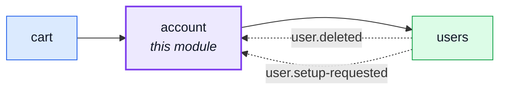
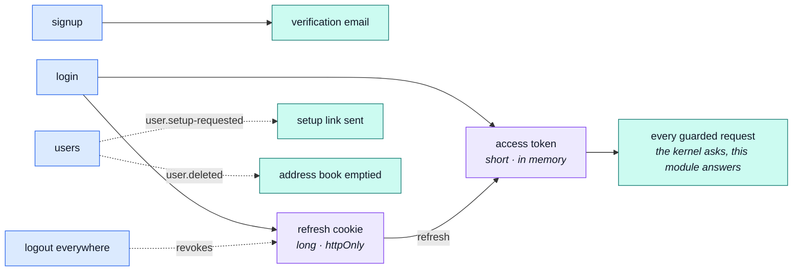

# account

::: tip At a glance
**Owns** — the session: signup, login, refresh, password reset, logout-everywhere, two-step deletion — plus the address book.
**Depends on** — [`users`](./users.md), whose record it authenticates. The repo's only `shared-kernel` edge.
**Breaks if you change** — the token lifetimes or the cookie flags. Every guard in the app resolves through this module.
:::

## Its neighbourhood

<!-- module-graph:account:start -->

_Solid arrows are imports. Dotted arrows are domain events — the return path an import
graph cannot see._

<!-- module-graph:account:end -->

## The story

This module answers the kernel's one question: **who is making this request?** It registers an
auth resolver at import time — not in a boot step — because installing a function touches no
connection, and every guard in the application depends on it existing before the first request
arrives.

It owns exactly one collection, and it is not the one you would guess. The User record belongs to
[`users`](./users.md) and is reached through that module's barrel; what this module owns outright
is the **address book**, one document per account, and a destroyed account takes its book with it
through the same `user.deleted` event the cart and wishlist listen for.

::: tip The barrel is one line wide, and that is the story
The three files in `session/` — JWT signing, cookie shape, the lifetimes both read — used to be
published on the theory that authorization would need them. It does not: `kernel/authentication.ts`
is the port every request goes through, and this module fills it using its own relative imports. No
sibling has ever reached for a token. Issuing this application's tokens _is_ what `account` is, and
none of it is anyone else's business.
:::

What the barrel does publish is `addressForCheckout` — the single address an order ships to. The
address CRUD stays internal, served by this module's own routes. That one function is the whole of
the cart's `customer-supplier` arrow.

## The pipeline

Two tokens with two lifetimes, and the one question the kernel asks on every guarded request.
[Sessions](./account-sessions.md) has the mechanics.

## Related pages

- [Sessions](./account-sessions.md) — the token mechanics, in detail
- [`users`](./users.md) — the collection this module shares
- [Security](../tools/security.md) — hashing, cookies, and the headers around them
- [Request Flow](../theory/request-flow.md) — where the guard sits in a request
- [Strategic DDD](../theory/strategic-ddd.md#_2-context-map-—-how-a-module-reaches-its-siblings) — what `shared-kernel` costs
