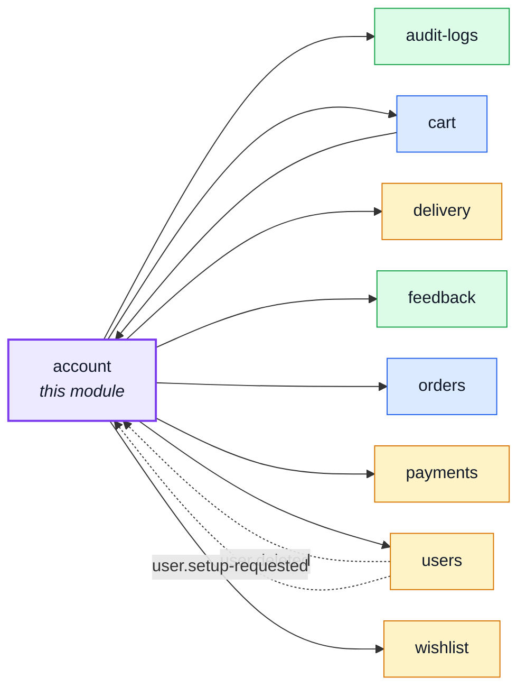
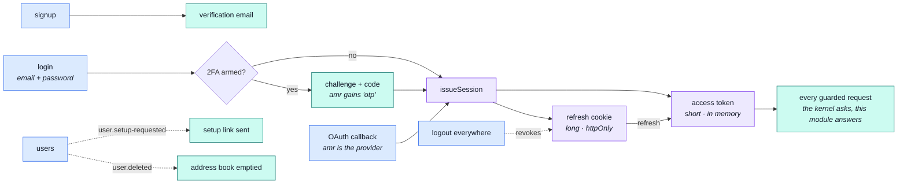
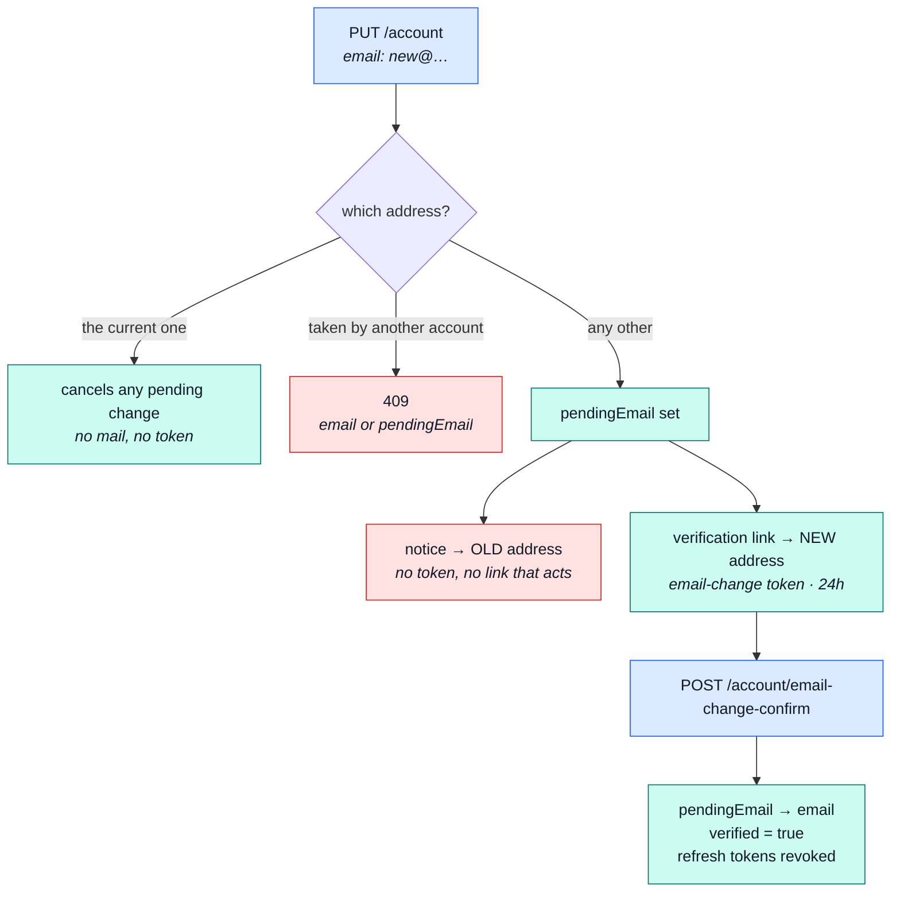

# account

::: tip At a glance
**Owns** — every way into an account: signup, login, [OAuth](./account-oauth.md), [two-factor auth](./account-two-factor.md), refresh, re-auth, password reset, session listing and revocation, logout-everywhere, two-step deletion — plus the address book.
**Depends on** — [`users`](./users.md), whose record it authenticates. The repo's only `shared-kernel` edge.
**Breaks if you change** — the token lifetimes or the cookie flags. Every guard in the app resolves through this module.
:::

## Its neighbourhood

<!-- module-graph:account:start -->

_Solid arrows are imports. Dotted arrows are domain events — the return path an import
graph cannot see._

<!-- module-graph:account:end -->

## The story

This module answers the kernel's one question: **who is making this request?** It registers an
auth resolver at import time — not in a boot step — because installing a function touches no
connection, and every guard in the application depends on it existing before the first request
arrives.

It owns exactly one collection, and it is not the one you would guess. The User record belongs to
[`users`](./users.md) and is reached through that module's barrel; what this module owns outright
is the **address book**, one document per account, and a destroyed account takes its book with it
through the same `user.deleted` event the cart and wishlist listen for.

::: tip The barrel is one line wide, and that is the story
`session/`, `two-factor/` and `oauth/` are three folders and not one exported symbol between them.
They used to look like something authorization would need. It does not: `kernel/authentication.ts`
is the port every request goes through, and this module fills it using its own relative imports. No
sibling has ever reached for a token, a factor or a provider — even the admin 2FA reset in
[`users`](./users.md) clears the fields rather than importing anything from here. Proving who
somebody is _is_ what `account` is, and none of it is anyone else's business.
:::

What the barrel does publish is `addressForCheckout` — the single address an order ships to. The
address CRUD stays internal, served by this module's own routes. That one function is the whole of
the cart's `customer-supplier` arrow.

## The pipeline

**Three ways in, one place they converge.** Password, password-plus-a-factor, and a provider's
redirect all end in the same `issueSession` — two tokens with two lifetimes, and then the one
question the kernel asks on every guarded request. [Sessions](./account-sessions.md) has the
mechanics.

::: warning The two entries are not held to the same bar
The OAuth callback does not consult `twoFactorEnabledAt` — see
[OAuth](./account-oauth.md#two-consequences-worth-naming).
:::

## Proving an address {#proving-an-address}

Two **kinds** of email verification share one mechanism, and the distinction is the whole design.
One proves the address an account **already has** — signup, and the explicit re-send. The other
proves the address a `PUT /account` change has **asked for**. They are stored under different
`tokens.type` values (`verify` and `email-change`), and neither can do the other's work: a signup
token that could swap in a `pendingEmail` would be an account takeover with an extra step.

A change never writes `user.email` directly. It parks the requested address in `pendingEmail`, so
the account keeps its current, proven address — and its `verified` flag, which describes that
proven address — until the new one is confirmed.

Three things in that diagram are decisions rather than mechanics:

- **The notice goes to the old address when the change is _requested_, not when it completes.** A
  warning that arrives before a takeover is a warning; one that arrives after is a receipt. It
  carries no token and no link that acts — "this wasn't me" is a password change and a
  logout-everywhere, both of which already exist.
- **Re-typing the current address cancels a pending change.** Cheaper than a dedicated endpoint,
  and it is what a user who changed their mind would naturally do.
- **Confirming revokes every refresh token.** An email change is the stronger takeover primitive
  of the two, and this is the same treatment a changed password already gets.

Collision is checked twice, because the two checks catch different things. At **request time**,
the requested address is compared against every account's `email` _and_ `pendingEmail`. At **swap
time**, the `users_email` and `users_pending_email` unique indexes catch whatever changed in the
up-to-24-hours between the two.

## Related pages

- [Sessions](./account-sessions.md) — the token mechanics, in detail
- [Two-factor authentication](./account-two-factor.md) — the registry, and the enrollment state machine
- [OAuth](./account-oauth.md) — the provider port and the three outcomes of a callback
- [`users`](./users.md) — the collection this module shares
- [Security](../tools/security.md) — hashing, cookies, and the headers around them
- [Request Flow](../theory/request-flow.md) — where the guard sits in a request
- [Strategic DDD](../theory/strategic-ddd.md#_2-context-map-—-how-a-module-reaches-its-siblings) — what `shared-kernel` costs
