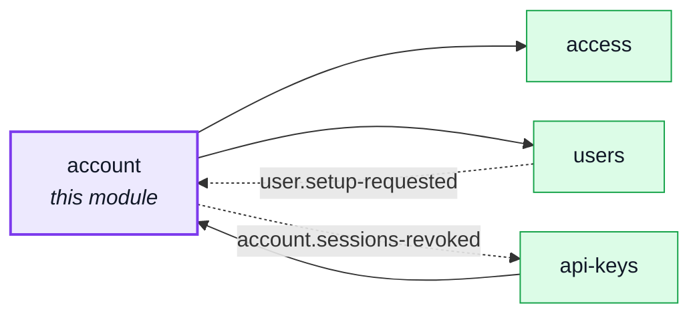
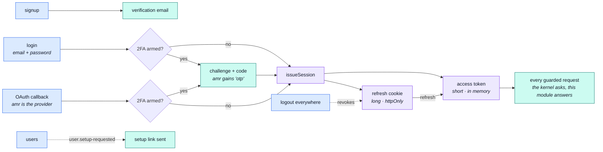
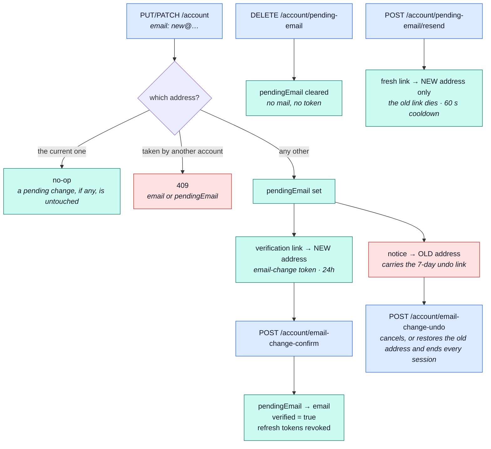
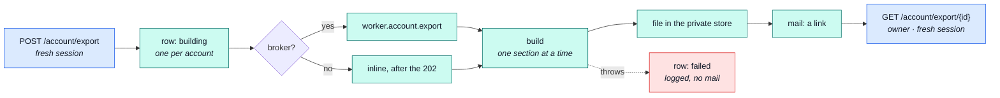

# account

::: tip At a glance
**Owns** — every way into an account: signup, login, [OAuth](./account-oauth.md), [two-factor auth](./account-two-factor.md), refresh, re-auth, password reset, session listing and revocation, logout-everywhere, two-step deletion, and the [data export](#data-export). One collection of its own, `accountexports`; the address book that used to live here is [`addresses`](./addresses.md).
**Depends on** — [`users`](./users.md), whose record it authenticates. The repo's only `shared-kernel` edge.
**Breaks if you change** — the token lifetimes or the cookie flags. Every guard in the app resolves through this module.
:::

## Its neighbourhood

<!-- module-graph:account:start -->

_Solid arrows are imports. Dotted arrows are domain events — the return path an import
graph cannot see._

```mermaid
%%{init: {'flowchart': {'nodeSpacing': 30, 'rankSpacing': 60}}}%%
flowchart LR
    account["account<br/><i>this module</i>"]
    access["access"]
    api_keys["api-keys"]
    users["users"]

    api_keys --> account
    account --> access
    account --> users
    users -. "user.setup-requested" .-> account
    account -. "account.sessions-revoked" .-> api_keys

    classDef core fill:#dbeafe,stroke:#2563eb,color:#111827;
    classDef supporting fill:#fef3c7,stroke:#d97706,color:#111827;
    classDef generic fill:#dcfce7,stroke:#16a34a,color:#111827;
    classDef centre fill:#ede9fe,stroke:#7c3aed,stroke-width:2px,color:#111827;
    class access,api_keys,users generic;
    class account centre;
```

<!-- module-graph:account:end -->

## The story

This module answers the kernel's one question: **who is making this request?** It registers an
auth resolver from its own `onRegistered` hook — run once every enabled module is known, not
merely on import — because installing a function touches no connection, and every guard in the
application depends on it existing before the first request arrives. Registering there rather than
at import time means importing this file for a type or a test no longer installs the resolver too.

Its one collection is `accountexports`, a row per account that asked for its data
([below](#data-export)). The User record belongs to [`users`](./users.md) and is reached through
that module's barrel; the address book that used to live here moved to its own module,
[`addresses`](./addresses.md), once nothing else needed `account` to hold it — see that page for
why.

An account nobody has signed into in a long time is a live account with no live purpose —
`npm run reap:inactive-accounts` (`docker/crontab`, nightly, disabled by default via
`NODE_INACTIVE_ACCOUNT_DAYS=0`) warns, then soft-, then hard-deletes one, the hard delete running the
same `personalData.erase` hooks [`addresses`](./addresses.md), `cart` and `wishlist` each declare
for their own collection. See [Scheduled jobs](../reference/ops.md#scheduled-jobs) for the full mechanism.

::: tip The barrel is one line wide, and that is the story
`session/`, `two-factor/` and `oauth/` are three folders and not one exported symbol between them.
They used to look like something authorization would need. It does not: `kernel/authentication.ts`
is the port every request goes through, and this module fills it using its own relative imports. No
sibling has ever reached for a token, a factor or a provider — and no staff route in
[`users`](./users.md) touches a credential at all. Proving who somebody is _is_ what `account` is,
and none of it is anyone else's business.
:::

## The pipeline

**Three ways in, one place they converge.** Password, password-plus-a-factor, and a provider's
redirect all end in the same `issueSession` — two tokens with two lifetimes, and then the one
question the kernel asks on every guarded request. [Sessions](./account-sessions.md) has the
mechanics.

```mermaid
%%{init: {'flowchart': {'nodeSpacing': 30, 'rankSpacing': 50}}}%%
flowchart LR
    S["signup"] --> V["verification email"]
    L["login<br/><i>email + password</i>"] --> Q{"2FA armed?"}
    Q -->|no| IS
    Q -->|yes| CH["challenge + code<br/><i>amr gains 'otp'</i>"]
    CH --> IS
    OA["OAuth callback<br/><i>amr is the provider</i>"] --> OQ{"2FA armed?"}
    OQ -->|no| IS
    OQ -->|yes| CH
    IS["issueSession"] --> T["access token<br/><i>short · in memory</i>"]
    IS --> RC["refresh cookie<br/><i>long · httpOnly</i>"]
    RC -->|refresh| T
    T --> G["every guarded request<br/><i>the kernel asks, this module answers</i>"]
    LO["logout everywhere"] -.->|revokes| RC
    US["users"] -. "user.setup-requested" .-> SU["setup link sent"]

    classDef entry fill:#dbeafe,stroke:#2563eb,color:#111827;
    classDef token fill:#ede9fe,stroke:#7c3aed,color:#111827;
    classDef done fill:#ccfbf1,stroke:#0f766e,color:#111827;
    class S,L,LO,US,OA entry;
    class T,RC,IS token;
    class V,G,SU,CH done;
```

::: tip Both entries owe the second factor
The OAuth callback checks `twoFactorEnabledAt` like the password login does and issues the same
challenge — see [OAuth](./account-oauth.md#two-consequences-worth-naming).
:::

## Proving an address {#proving-an-address}

Two **kinds** of email verification share one mechanism, and the distinction is the whole design.
One proves the address an account **already has** — signup, and the explicit re-send. The other
proves the address a `PUT`/`PATCH /account` change has **asked for**. They are stored under different
`tokens.type` values (`verify` and `email-change`), and neither can do the other's work: a signup
token that could swap in a `pendingEmail` would be an account takeover with an extra step.

The old address gets a one-time **undo link** in its notice, valid for 7 days from the request and
kept through a password change (a password change purges every other pending one-time token, not
this one). Only the newest request's link lives. While the change is pending the undo cancels it;
once the new address was confirmed it restores `previousEmail`, a field written at the swap. Either
way every session ends, since the owner is saying the change was not theirs. The link is the
credential, so the route is public like the confirm one.

A change never writes `user.email` directly. It parks the requested address in `pendingEmail`, so
the account keeps its current, proven address — and its `verified` flag, which describes that
proven address — until the new one is confirmed.

```mermaid
%%{init: {'flowchart': {'nodeSpacing': 30, 'rankSpacing': 50}}}%%
flowchart TB
    P["PUT/PATCH /account<br/><i>email: new@…</i>"] --> C{"which address?"}
    C -->|"the current one"| O["no-op<br/><i>a pending change, if any, is untouched</i>"]
    C -->|"taken by another account"| R["409<br/><i>email or pendingEmail</i>"]
    C -->|"any other"| W["pendingEmail set"]
    W --> N["notice → OLD address<br/><i>carries the 7-day undo link</i>"]
    W --> V["verification link → NEW address<br/><i>email-change token · 24h</i>"]
    V --> F["POST /account/email-change-confirm"]
    F --> S["pendingEmail → email<br/>verified = true<br/>refresh tokens revoked"]
    N --> U["POST /account/email-change-undo<br/><i>cancels, or restores the old address and ends every session</i>"]
    D["DELETE /account/pending-email"] --> X["pendingEmail cleared<br/><i>no mail, no token</i>"]
    Q["POST /account/pending-email/resend"] --> V2["fresh link → NEW address only<br/><i>the old link dies · 60 s cooldown</i>"]

    classDef entry fill:#dbeafe,stroke:#2563eb,color:#111827;
    classDef warn fill:#fee2e2,stroke:#dc2626,color:#111827;
    classDef done fill:#ccfbf1,stroke:#0f766e,color:#111827;
    class P,F,D,Q,U entry;
    class R,N warn;
    class O,W,V,V2,S,X done;
```

Three things in that diagram are decisions rather than mechanics:

- **The notice goes to the old address when the change is _requested_, not when it completes.** A
  warning that arrives before a takeover is a warning; one that arrives after is a receipt. It
  carries no token and no link that acts — "this wasn't me" is a password change and a
  logout-everywhere, both of which already exist.
- **Cancelling is its own explicit action, not a side effect of re-typing the current address.**
  `PUT /account`'s `email` is required — every replace, including a phone-only edit, names it — so
  treating "same address" as "cancel" meant a routine save could silently drop a pending change
  the caller never asked to drop. `DELETE /account/pending-email` is the only thing that cancels
  one now.
- **Resending is its own action too, and it mails the new address only.** Sending the pending
  address again through `PUT`/`PATCH /account` is a no-op (a double-submitted save must not mail
  twice), so `POST /account/pending-email/resend` is the explicit way to ask for the link again.
  The old address was told once, when the change was requested; telling it on every resend would
  read like a takeover alert. It uses `POST /account/verify-request`'s cooldown and budget and
  answers `200 { resendAfter }` like it, so the button counts down from the server's number; when
  nothing is pending it mails nothing and answers `resendAfter` 0.
- **A new change request is paced, and so is a reset request.** A genuine change to a different
  address (one that is neither the current nor the already-pending address) is held to one a
  minute per account, answering `429 EMAIL_CHANGE_TOO_SOON` with `details.retryAfter`, like the
  resend button. The caller is signed in, so the answer can be honest. A password-reset request is
  paced the same way but SILENTLY: inside the minute it answers the same `200` and sends nothing,
  because a `429` would tell a stranger which addresses have an account. Both also spend the
  recipient's mailbox budget ([security](../tools/security.md#mail-to-one-mailbox-the-victim-s-budget)),
  which a refused request does not.
- **A display name is printed only to a mailbox that has proven itself.** `username` is free text
  (up to 50 characters, no charset rule: one would refuse real names). A mail to an address nobody
  has verified — a signup for a stranger's address, a pending new address — would put text of the
  caller's choosing in a stranger's inbox, from the shop's own domain. So the greeting carries the
  name only when the mail goes to the account's own VERIFIED address (`greetableName`), and a plain
  "Hello!" otherwise; every template that greets goes through the same `greetingFor`. The notice to
  the OLD address of an email change keeps the name, since that mailbox is the verified one.
- **Confirming revokes every refresh token.** An email change is the stronger takeover primitive
  of the two, and this is the same treatment a changed password already gets.

Collision is checked twice, because the two checks catch different things. At **request time**,
the requested address is compared against every account's `email` _and_ `pendingEmail`. At **swap
time**, the `users_email` and `users_pending_email` unique indexes catch whatever changed in the
up-to-24-hours between the two.

## Data export {#data-export}

"Give me my data" (GDPR Art. 15 and 20) is a job, not a request. Building the answer reads every
module's section of the account, and doing that inside the HTTP request held all of them in one
object, per call, for as long as the slowest took. So asking only records a row and queues a
build; a **link** is mailed when the file is ready, never the data. Google Takeout, GitHub and
Facebook all do the same.

```mermaid
%%{init: {'flowchart': {'nodeSpacing': 30, 'rankSpacing': 50}}}%%
flowchart LR
    A["POST /account/export<br/><i>fresh session</i>"] --> R["row: building<br/><i>one per account</i>"]
    R --> Q{"broker?"}
    Q -->|yes| W["worker.account.export"]
    Q -->|no| I["inline, after the 202"]
    W --> B["build<br/><i>one section at a time</i>"]
    I --> B
    B --> F["file in the private store"]
    F --> M["mail: a link"]
    M --> D["GET /account/export/{id}<br/><i>owner · fresh session</i>"]
    B -. "throws" .-> X["row: failed<br/><i>logged, no mail</i>"]

    classDef entry fill:#dbeafe,stroke:#2563eb,color:#111827;
    classDef warn fill:#fee2e2,stroke:#dc2626,color:#111827;
    classDef done fill:#ccfbf1,stroke:#0f766e,color:#111827;
    class A,D entry;
    class X warn;
    class R,W,I,B,F,M done;
```

Decisions rather than mechanics:

- **One live export per account.** Asking while one is `building` returns that one (and starts no
  second build). Asking after one is `ready` or `failed` _replaces_ it: the old file and row are
  deleted first. The unique index on `userId` settles two simultaneous requests: one wins, the other
  gets the winner back. A `building` row older than 30 minutes counts as lost with its process and is
  replaced too.
- **A new export costs one mail.** Starting one is charged to the per-mailbox mail
  budget, because it ends in a mailed link. A spent budget answers `429` before the old export is deleted,
  so a ready file stays downloadable; asking while one is `building` is not charged.
- **Peak memory is one section.** The worker collects the sections one at a time and appends each to
  the file as it arrives, so the largest section is the ceiling, not the sum. The audit section reads
  by cursor on the `{ actor_user_id, timestamp }` index: no count and no skip per page, which made
  reading a long trail cost work quadratic in its length.
- **The job carries the subject the request saw**, including whether the address had been proven. A
  section that matches by address (`feedback`) answers only for a proven one, so the file says what
  the caller was entitled to when they asked, not what became true later.
- **A failed build is a state.** The worker logs the error and marks the row `failed`; no mail goes
  out, and asking again replaces it. Two runs of one job (a broker redelivery) are safe: only a row
  still `building` is built, and only the run that settles it mails the link.
- **The download asks for a fresh session, like the request.** The mailed link opens a frontend page
  that calls `GET /account/export/{id}`; a forwarded mail hands nobody the file. A row that is not
  yours, not ready, past its retention or already gone are the same `404`.
- **Kept `NODE_ACCOUNT_EXPORT_TTL_DAYS` days (7), then gone.** The nightly `reap:account-exports`
  deletes file and row, and sweeps files no row points at by age. A hard account delete (and so
  `reap:inactive-accounts`) deletes the export with the rest of the account: the row inside the
  erasure's transaction, the file after its commit, because a file cannot roll back.
- **Plaintext on disk, on purpose.** The file sits unencrypted in `NODE_ACCOUNT_EXPORT_STORE_PATH`,
  like the Mongo data files: private (never under the public directory), regenerable (not backed up),
  at-rest protection is the host's. See
  [crypto and secrets](../theory/defences/crypto-and-secrets.md#secrets-at-rest).
- **Audited at both ends.** `auth.data_export.requested` when it is asked for, and
  `auth.data_export.downloaded` when the data actually leaves.

## Related pages

- [Sessions](./account-sessions.md) — the token mechanics, in detail
- [Two-factor authentication](./account-two-factor.md) — the registry, and the enrollment state machine
- [OAuth](./account-oauth.md) — the provider port and the three outcomes of a callback
- [`addresses`](./addresses.md) — shares the `/account` URL prefix and the frontend screen
- [`users`](./users.md) — the collection this module shares
- [Security](../tools/security.md) — hashing, cookies, the headers around them, and this module's own rate-limit budgets
- [Request Flow](../theory/request-flow.md) — where the guard sits in a request
- [Strategic DDD](../theory/strategic-ddd.md#_2-context-map-—-how-a-module-reaches-its-siblings) — what `shared-kernel` costs
