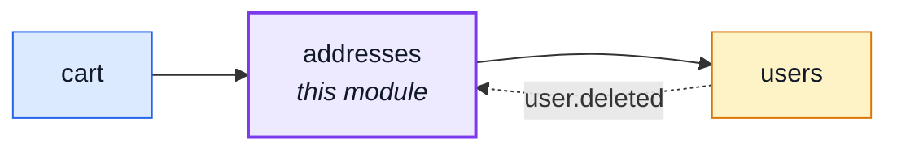
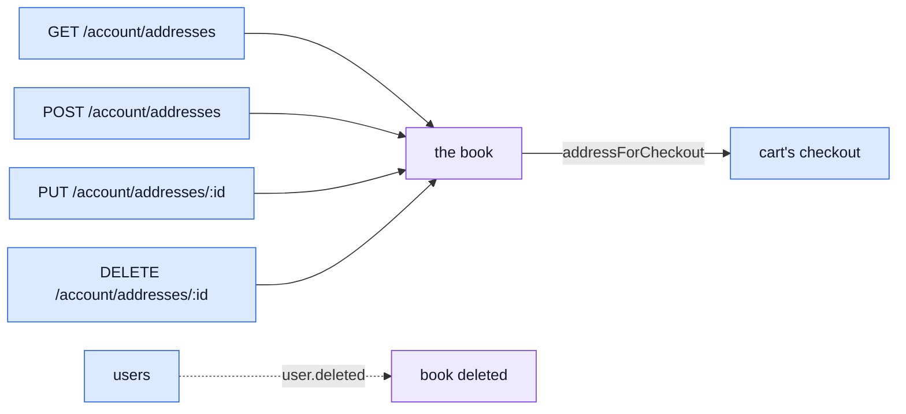

# addresses

::: tip At a glance
**Owns** — the address book: one document per user, entries keeping their own id (two addresses
can be identical in every field and still be different entries).
**Depends on** — [`users`](./users.md), for the `user.deleted` event name only — never a service
call.
**Breaks if you change** — [`cart`](./cart.md)'s checkout, the only sibling consumer of
`addressForCheckout`.
:::

## Its neighbourhood

<!-- module-graph:addresses:start -->

_Solid arrows are imports. Dotted arrows are domain events — the return path an import
graph cannot see._

<!-- module-graph:addresses:end -->

## The story

Until this module existed, the address book lived inside [`account`](./account.md) — the only
collection that module owned outright — and `cart`'s checkout imported `account` for exactly one
function, `addressForCheckout`. That single arrow was the whole of an `account ↔ cart` import
cycle: `account`'s own data export read `cart` for the shopping-basket section, and `cart` read
`account` back for the delivery address.

Extracting the address book into its own module breaks the cycle at its root. `account` never
depended on `cart`'s existence to answer "who is this person"; it depended on it only because the
address book happened to live in the same folder. Moving the data to where the dependency actually
points — a leaf both `account` and `cart` can import, that imports neither back — removes the
arrow instead of routing around it.

::: tip Shares a URL, not a folder
The routes stay at `/account/addresses` — nothing about the API surface changed, only which module
answers it. Two routers mounting `getAuth` under the same prefix would normally mean the JWT
verify, the user read and the membership read run twice for one request; `getAuth`
(`kernel/middlewares/authorizations.ts`) returns early once a caller is already resolved, so the
second router's mount costs nothing beyond the first.
:::

`users` is reached only through the domain-event bus, for one subscription: a destroyed account
takes its address book with it, the same `user.deleted` event `cart`, `wishlist`, `payments` and
`orders` each answer on their own collection. Nothing here ever calls into `users`' service — the
import in `module.yaml` is for the event's name constant alone.

## The pipeline

One collection, four routes, one cross-cutting read.

The one invariant worth seeing after any write: whenever the book is non-empty, exactly one entry
carries `default`. The repository (`repository.ts`), not the schema, maintains it — a
read-modify-write on the whole array, because "exactly one default" is a property of the list, not
of any one entry, and no single `$set`/`$pull` can demote the old holder, promote the new one and
prune a removed entry atomically in one operation.

`addressForCheckout(userId, addressId?)` answers three ways, and the distinction between the last
two is deliberate: `undefined` means the caller keeps no addresses and named none (not required to
buy); `null` means they named an entry that is not theirs or does not exist. Checkout must refuse
the second case, not silently ship nowhere — collapsing the two would let a stale id downgrade to
"no address" instead of failing loudly.

`fullName`/`street`/`city`/`zip`/`country`/`phone` are stored AES-256-GCM under
`NODE_PII_ENCRYPTION_KEY` (`@infrastructure/security/pii-encryption`) — none of them is ever
queried on directly, so encrypting them costs no lookup capability. `repository.ts` is the one
place that encrypts (every write) and decrypts (every read) — `service.ts` and `cart`'s checkout
snapshot both see plaintext, never the stored ciphertext. See
[Secrets at rest](../theory/defences/crypto-and-secrets.md#secrets-at-rest).

## Related pages

- [`account`](./account.md) — shares the `/account` URL prefix and the frontend screen
- [`cart`](./cart.md) — the checkout that resolves a shipping address through this module
- [Adding & Removing a Module](../theory/module-lifecycle.md) — the deletability procedure
- [Strategic DDD](../theory/strategic-ddd.md#_2-context-map-—-how-a-module-reaches-its-siblings) — why the address book left `account`
