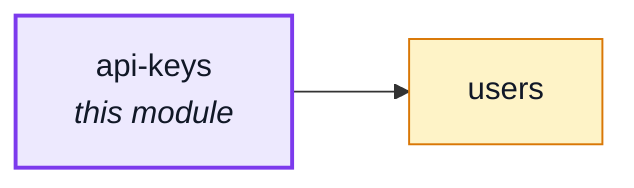
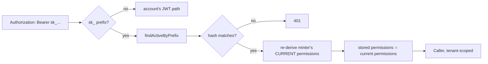

# api-keys

::: tip At a glance
**Owns** — machine-to-machine credentials: mint, list, revoke, and the `CredentialResolver` that
lets an `sk_...` bearer token authenticate a request the way a JWT does.
**Depends on** — [`users`](./users.md), for the minting user's account and current role — the same
dependency `account` itself already has.
**Breaks if you change** — the `sk_` token prefix (`kernel/authentication.ts`'s dispatch between
this module's credential path and `account`'s JWT path assumes it), or the mint-time/check-time
permission-floor pair in `services/api-keys.ts` and `module.ts`.
:::

## Its neighbourhood

<!-- module-graph:api-keys:start -->

_Solid arrows are imports. Dotted arrows are domain events — the return path an import
graph cannot see._

<!-- module-graph:api-keys:end -->

## The story

A partner integration, or a webhook consumer calling back into this shop's own API, has nothing to
present today short of a person's password — which then appears in the audit trail as that person,
and carries their whole reach rather than the two endpoints the partner needs. This module is the
answer: a revocable credential, scoped to a caller-chosen subset of whoever minted it.

**The credential is verified, never decrypted.** `sk_<8-char prefix>_<32 bytes>`, both halves
`base64url`. Only a sha256 digest is ever stored — `credentials.ts` reuses `hashToken`
(`@modules/users`), the same one-way primitive `account/two-factor/backup-codes.ts` already uses
for the same reason: a high-entropy, one-time secret has no search space for bcrypt/argon2 to make
expensive, so the ~100ms they would cost on every authenticated request buys nothing. The prefix is
the only part ever stored in the clear — it is what turns verification into one indexed lookup
instead of a collection scan, and it is not secret.

**A key holds a subset of the minter's permissions, floored TWICE.** Once at mint time
(`services/api-keys.ts#isMintable`, against what the requesting caller holds right now), and again
on every single use (`module.ts`'s `CredentialResolver`, re-deriving the minter's CURRENT
permissions and intersecting them against the key's stored snapshot). The second floor is the one
that matters after the fact: demote or delete the person who minted a key, and every key they ever
minted shrinks or dies with them — without the credential document itself ever being touched.

**Tenant-scoped only, by design.** This repo's own deployment model is a silo — one organisation
per stack, never pooled multi-tenancy — so every real use case for a machine credential (a partner,
a webhook consumer calling back) is shop-level. A platform-scoped credential would exist for
automating this ONE installation's own ops surface, and that need is already served by the static
`NODE_METRICS_TOKEN` bearer credential — building a second, per-key mechanism for a need nobody has
stated would be scope nobody asked for.

::: tip What deleting this module actually costs
Every ingredient it is built from — `kernel/authentication.ts`'s `CredentialResolver` port,
`hashToken`, the permission model — is still there and still used by whatever remains. Deleting
`api-keys` simply means no build serves `sk_...` tokens: `resolveCredential` resolves `undefined`
for one instead of throwing, exactly like a build with no `account` has no JWTs to verify.
:::

See: [Security](../tools/security.md#machine-to-machine-credentials),
[Authorization theory](../theory/authorization.md).
