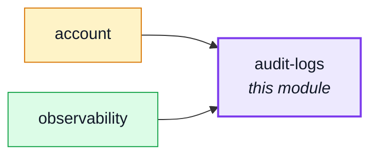
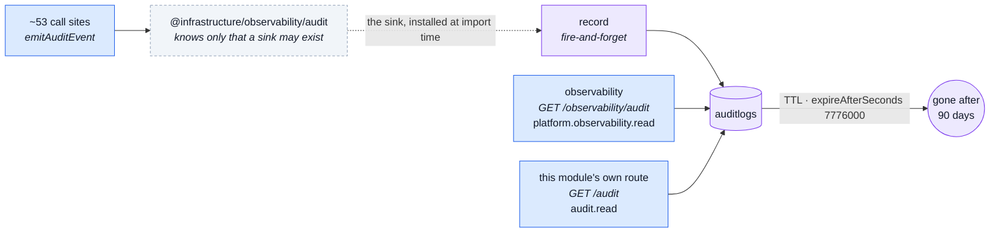

# audit-logs

::: tip At a glance
**Owns** — the queryable audit trail, kept for the ninety days its TTL index enforces.
**Depends on** — nothing, for the write side: nothing imports this module, it installs a sink instead.
**Breaks if you change** — the retention window on the `timestamp` index. It is the only thing deleting old entries.
:::

## Its neighbourhood

<!-- module-graph:audit-logs:start -->

_Solid arrows are imports. Dotted arrows are domain events — the return path an import
graph cannot see._

<!-- module-graph:audit-logs:end -->

## The story

**One collection, two readers, and neither is this module's own write path.** The write side stays
exactly as headless as it always was — see the tip below. The read side used to belong entirely to
[`observability`](./observability.md)'s `GET /observability/audit`, gated on
`platform.observability.read` — a key only the platform operator holds, and therefore useless to a
shop's own staff.

This module now owns a second, tenant-facing door onto the same collection: `GET /audit`, gated on
`audit.read` — held by `manager`, `support` and `moderator` in the demo. Same rows, same shape,
different audience: `observability`'s route answers "what happened across every shop", this
module's own route answers "what happened in mine". Enabling this module without `observability`
now gives you a working `GET /audit` and no platform-wide view — still a legitimate build, just a
narrower one.

::: tip How ~53 call sites reach a module nothing imports, for the WRITE
They do not — and this is still true despite the module now having a router. Every
`emitAuditEvent` call in the app talks to `@infrastructure/observability/audit`, which knows only
that a sink _may_ exist. **This module installs that sink itself, at import time** — the same way
it hands `basePath`/`routes` to the app tier for the read side.

Registering a function is not a database call: `record` is fire-and-forget and only touches Mongo
when an entry actually fires, which cannot happen before the app serves a request. Doing it here
rather than in `app.ts` is what keeps the assembly file from naming a domain. With this module
deleted, the audit trail stops being stored and everything else still builds.
:::

Retention is a database fact, not a cron job: `expireAfterSeconds: 7776000` on `timestamp` is
ninety days, enforced by Mongo. The two compound indexes are the two questions anyone asks of a
trail — everything one actor did, and everyone who did one thing.

Field names are `snake_case` here and `camelCase` everywhere else, because an audit row is a log
record rather than a domain document.

## The pipeline

The gap in the middle is the design on the write side. No call site imports this module; it
installs a sink and the infrastructure finds it. The read side is unremarkable by comparison — two
ordinary routes, in two different modules, over one collection.

## Related pages

- [`observability`](./observability.md) — the module's OTHER reader, `GET /observability/audit`
- [Authorization](../theory/authorization.md) — `audit.read`, and why a bare key can never answer a platform question
- [Winston & Audit Logs](../tools/winston.md) — what gets audited and under what action names
- [Modules](../theory/modules.md#the-manifest) — the headless half of the manifest, for the write side
- [MongoDB & Mongoose](../tools/mongodb-mongoose.md) — TTL indexes
