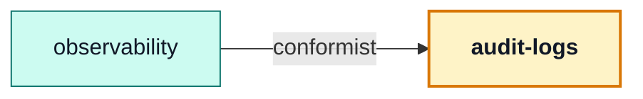

# audit-logs

::: tip At a glance
**Owns** — the queryable audit trail, kept for the ninety days its TTL index enforces.
**Depends on** — nothing, and nothing imports it. It installs a sink instead.
**Breaks if you change** — the retention window on the `timestamp` index. It is the only thing deleting old entries.
:::

<!-- gen:identity:start -->

| Fact                     | This module                                                                                                                                                                                             |
| ------------------------ | ------------------------------------------------------------------------------------------------------------------------------------------------------------------------------------------------------- |
| **Subdomain**            | `generic` — A solved problem. Modelling effort here would be waste.                                                                                                                                     |
| **Base path**            | _headless_ — this module owns no URL of its own                                                                                                                                                         |
| **Collection**           | `auditlogs` (model `AuditLog`)                                                                                                                                                                          |
| **Depends on**           | _nothing_                                                                                                                                                                                               |
| **Depended on by**       | [`observability`](./observability.md)                                                                                                                                                                   |
| **Languages**            | _none_                                                                                                                                                                                                  |
| **Seeded**               | no                                                                                                                                                                                                      |
| **Frontend counterpart** | `admin` in `boilerplate-vue-frontend` — This module owns the trail and no URL; the endpoint that reads it belongs to `observability`, and the screen that renders it is the frontend’s admin dashboard. |

<!-- gen:identity:end -->

## The map

<!-- gen:map:start -->



- `observability` → **conformist** — Renders audit entries exactly as that module stores them; `GET /observability/audit` adds a URL, not a model.

<!-- gen:map:end -->

## The story

**This module declares no router, and that is the whole point of the headless half of the
manifest.** The domain owns a collection, so it is a module. The one endpoint that reads it —
`GET /observability/audit` — belongs to [`observability`](./observability.md), the dashboard that
renders the data rather than the data itself.

Enabling this module without `observability` gives you an audit trail nothing exposes. That is a
legitimate build, not a broken one.

::: tip How ~53 call sites reach a module nothing imports
They do not. Every `emitAuditEvent` call in the app talks to
`@infrastructure/observability/audit`, which knows only that a sink _may_ exist. **This module
installs that sink itself, at import time** — the same way a routed module hands over a router.

Registering a function is not a database call: `record` is fire-and-forget and only touches Mongo
when an entry actually fires, which cannot happen before the app serves a request. Doing it here
rather than in `app.ts` is what keeps the assembly file from naming a domain. With this module
deleted, the audit trail stops being stored and everything else still builds.
:::

Retention is a database fact, not a cron job: `expireAfterSeconds: 7776000` on `timestamp` is
ninety days, enforced by Mongo. The two compound indexes are the two questions anyone asks of a
trail — everything one actor did, and everyone who did one thing.

Field names are `snake_case` here and `camelCase` everywhere else, because an audit row is a log
record rather than a domain document.

## Data

<!-- gen:data:start -->

#### `auditlogs`

From model `AuditLog`. `_id` and `__v` are omitted — every document carries them.

| Field           | Type     | Flags    | Default | Reference / values               |
| --------------- | -------- | -------- | ------- | -------------------------------- |
| `actor_user_id` | `String` | required | —       | —                                |
| `actor_role`    | `String` | required | —       | `admin` \| `user` \| `anonymous` |
| `action`        | `String` | required | —       | —                                |
| `outcome`       | `String` | required | —       | `success` \| `failure`           |
| `ip`            | `String` | —        | —       | —                                |
| `user_agent`    | `String` | —        | —       | —                                |
| `request_id`    | `String` | —        | —       | —                                |
| `trace_id`      | `String` | —        | —       | —                                |
| `target_type`   | `String` | —        | —       | —                                |
| `target_id`     | `String` | —        | —       | —                                |
| `metadata`      | `Mixed`  | —        | —       | —                                |
| `timestamp`     | `Date`   | required | —       | —                                |
| `level`         | `String` | required | —       | `info` \| `warn`                 |

**Declared indexes**

| Keys                              | Options                     |
| --------------------------------- | --------------------------- |
| `actor_user_id: 1, timestamp: -1` | —                           |
| `action: 1, timestamp: -1`        | —                           |
| `timestamp: 1`                    | expireAfterSeconds: 7776000 |

<!-- gen:data:end -->

## Surface

<!-- gen:surface:start -->

This module mounts no routes. It is reached through its barrel by the modules that depend on it, or through another module’s endpoints.

<!-- gen:surface:end -->

## Signals

<!-- gen:signals:start -->

#### Metrics

| Collector                   | Type    | Labels | Help                                                                       |
| --------------------------- | ------- | ------ | -------------------------------------------------------------------------- |
| `audit_sink_failures_total` | Counter | —      | Audit entries written to the log but not persisted to the queryable trail. |

<!-- gen:signals:end -->

## Files

<!-- gen:files:start -->

| File                            | What it is                                                                                                                                                   | Explained in                         |
| ------------------------------- | ------------------------------------------------------------------------------------------------------------------------------------------------------------ | ------------------------------------ |
| `index.ts`                      | The public barrel: the only surface a sibling module may import.                                                                                             | [read](../theory/strategic-ddd.md)   |
| `metrics.ts`                    | The domain counters and histograms this module registers with Prometheus.                                                                                    | [read](../tools/prometheus.md)       |
| `model.ts`                      | The Mongoose schema, its indexes and its serialisation rules — the collection's shape.                                                                       | [read](../tools/mongodb-mongoose.md) |
| `module.ts`                     | The manifest — the only file the application loads directly. Declares the name, base path, router, dependency edges, locales, seeds and event subscriptions. | [read](../theory/modules.md)         |
| `repository.ts`                 | Every query this module makes, on the shared base repository. The only tier that talks to Mongoose.                                                          | [read](../tools/mongodb-mongoose.md) |
| `service.ts`                    | The domain decision, and the layer that owns status-code meaning.                                                                                            | [read](../theory/layers.md)          |
| `tests/unit/repository.test.ts` | Unit suite — the rules, in isolation.                                                                                                                        | [read](../tools/unit-testing.md)     |
| `tests/unit/retention.test.ts`  | Unit suite — the rules, in isolation.                                                                                                                        | [read](../tools/unit-testing.md)     |
| `tests/unit/service.test.ts`    | Unit suite — the rules, in isolation.                                                                                                                        | [read](../tools/unit-testing.md)     |

<!-- gen:files:end -->

## Working on it

<!-- gen:working:start -->

| Suite | Files | Where                                |
| ----- | ----- | ------------------------------------ |
| Unit  | 3     | `src/modules/audit-logs/tests/unit/` |

```bash
# every suite this module carries
npm run test:module -- src/modules/audit-logs

```

<!-- gen:working:end -->

## Deeper in

<!-- gen:subpages:start -->

Nothing in this domain needs a page of its own — the story above is the whole of it.

<!-- gen:subpages:end -->

## Related pages

- [`observability`](./observability.md) — the module that serves this collection
- [Winston & Audit Logs](../tools/winston.md) — what gets audited and under what action names
- [Modules](../theory/modules.md#the-manifest) — the headless half of the manifest
- [MongoDB & Mongoose](../tools/mongodb-mongoose.md) — TTL indexes
