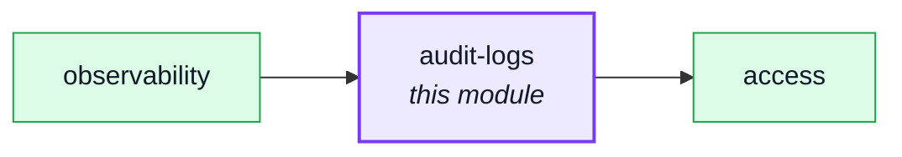
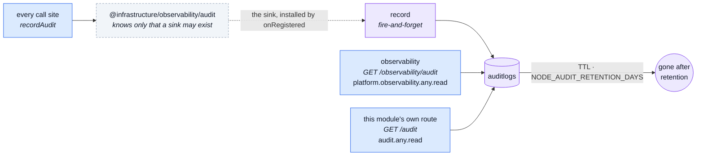

# audit-logs

::: tip At a glance
**Owns** — the queryable audit trail, kept for `NODE_AUDIT_RETENTION_DAYS` (90 by default), which its TTL index enforces.
**Depends on** — nothing, for the write side: nothing imports this module, it installs a sink instead.
**Breaks if you change** — the retention window (`NODE_AUDIT_RETENTION_DAYS`) on the `timestamp` index. It is the only thing deleting old entries.
:::

## Its neighbourhood

<!-- module-graph:audit-logs:start -->

_Solid arrows are imports. Dotted arrows are domain events — the return path an import
graph cannot see._

```mermaid
%%{init: {'flowchart': {'nodeSpacing': 30, 'rankSpacing': 60}}}%%
flowchart LR
    audit_logs["audit-logs<br/><i>this module</i>"]
    access["access"]
    observability["observability"]

    observability --> audit_logs
    audit_logs --> access

    classDef core fill:#dbeafe,stroke:#2563eb,color:#111827;
    classDef supporting fill:#fef3c7,stroke:#d97706,color:#111827;
    classDef generic fill:#dcfce7,stroke:#16a34a,color:#111827;
    classDef centre fill:#ede9fe,stroke:#7c3aed,stroke-width:2px,color:#111827;
    class access,observability generic;
    class audit_logs centre;
```

<!-- module-graph:audit-logs:end -->

## The story

**One collection, two readers, and neither is this module's own write path.** The write side is headless — see the tip below. The read side has two doors.
[`observability`](./observability.md)'s `GET /observability/audit` is gated on
`platform.observability.any.read` — a key only the platform operator holds, and therefore useless to a
shop's own staff.

This module owns the tenant-facing door onto the same collection: `GET /audit`, gated on
`audit.any.read` — held by `manager`, `moderator` and `admin` in `shared/authorization-roles.yaml`.
Same rows, same shape, different audience: `observability`'s route answers "what happened across
every shop", this module's own route answers "what happened in mine". Enabling this module without
`observability` gives a working `GET /audit` and no platform-wide view — a legitimate build, just a
narrower one.

::: tip How every call site reaches a module nothing imports, for the WRITE
They do not, even though the module has a router. Every
`recordAudit` / `emitAuditEvent` call in the app talks to `@infrastructure/observability/audit`, which knows only
that a sink _may_ exist. **This module installs that sink itself, from its own `onRegistered`
hook** — run once every enabled module is known, not merely on import, the same way it hands
`basePath`/`routes` to the app tier for the read side.

Registering a function is not a database call: `record` is fire-and-forget and only touches Mongo
when an entry actually fires, which cannot happen before the app serves a request. Doing it here
rather than in `app.ts` is what keeps the assembly file from naming a domain, and doing it from
`onRegistered` rather than at import time means importing this file for a type or a test does not
install the sink. With this module deleted, the audit trail stops being stored and everything
else still builds.
:::

Retention is a database fact, not a cron job: `expireAfterSeconds` on `timestamp` is
`NODE_AUDIT_RETENTION_DAYS` days (90 by default), enforced by Mongo. Mongo will not change an
existing TTL index's window in place: a new value fails the boot until `npm run db:sync` rebuilds
the index. The two compound indexes are the two questions anyone asks of a
trail — everything one actor did, and everyone who did one thing.

Field names are `camelCase` in the event, in Mongo and in the API, like every other collection. The
log line is the one place they change: the Winston formatter renames them to OpenTelemetry
semantic-convention names (`actorUserId` becomes `user.id`) on the way out. See
[Winston](../tools/winston.md#field-names-in-the-log-line).

One row shape, `AuditEntryItem`, answers every read: `GET /audit`, `GET /observability/audit` and the
account export. `actorCredentialId` names the API key when a credential did the action, and is absent
when a person did.

## Offline writes

`bufferCommands: false` on this schema fails a write immediately when Mongo is unreachable,
instead of queueing it.

Mongoose's default is to BUFFER any operation issued while disconnected and hold it for
`bufferTimeoutMS` — ten seconds — before rejecting. For every other collection here that is the
right behaviour: it rides out a reconnect and the request waiting on the answer gets one.

This collection is the exception, because nothing waits on it. `auditLogService.record` is
fire-and-forget by contract and the audit LOG LINE is the compliance record — the stored copy is
the queryable convenience on top of it. Buffering cannot save an entry that matters; it only
converts "not persisted, logged, moved on" into a pending timer per audited request, held for ten
seconds each, for as long as Mongo is away.

A suite that runs with no database, such as `tests/integration/locale.test.ts`, shows the cost:
each rejected signup emits `auth.signup.failed`, and a buffered insert would leave a 10s timer
holding the worker's event loop open.

## The pipeline

The gap in the middle is the design on the write side. No call site imports this module; it
installs a sink and the infrastructure finds it. The read side is unremarkable by comparison — two
ordinary routes, in two different modules, over one collection.

```mermaid
%%{init: {'flowchart': {'nodeSpacing': 30, 'rankSpacing': 55}}}%%
flowchart LR
    C["every call site<br/><i>recordAudit</i>"] --> P["@infrastructure/observability/audit<br/><i>knows only that a sink may exist</i>"]
    P -.->|"the sink, installed by onRegistered"| R["record<br/><i>fire-and-forget</i>"]
    R --> M[("auditlogs")]
    M -->|"TTL · NODE_AUDIT_RETENTION_DAYS"| X(("gone after<br/>retention"))
    O["observability<br/><i>GET /observability/audit</i><br/>platform.observability.any.read"] --> M
    S["this module's own route<br/><i>GET /audit</i><br/>audit.any.read"] --> M

    classDef caller fill:#dbeafe,stroke:#2563eb,color:#111827;
    classDef seam fill:#f1f5f9,stroke:#94a3b8,color:#111827,stroke-dasharray:4 3;
    classDef own fill:#ede9fe,stroke:#7c3aed,color:#111827;
    class C,O,S caller;
    class P seam;
    class R,M,X own;
```

**The operator's read is an incident feed, not the trail.** `GET /observability/audit` goes through
`searchIncidents`, which ANDs the operator's own filters with an allow-list (`INCIDENT_SCOPE` in
`service.ts`): the `security.*` actions, a refused sign-in, a failed second-factor
challenge or provider sign-in, a reused refresh token and an auto-disabled webhook. The one
`security.forbidden` it drops is the shop's own rank refusals (`metadata.reason` is `outranked` or
`own`): staff refused a thing that belongs to an equal, a superior or themselves is the shop's
business and names an account. Orders, payments, products and successful sign-ins stay on the shop's own `GET /audit`, and every address
is returned as a keyed digest (`hmac:…`): the operator can correlate "this address, three
incidents" and never read the address. An operator watching an installation needs the incidents,
and holding no shop key was never meant to include reading a shop's customers.

## Related pages

- [`observability`](./observability.md) — the module's OTHER reader, `GET /observability/audit`
- [Authorization](../theory/authorization.md) — `audit.any.read`, and why a bare key can never answer a platform question
- [Winston & Audit Logs](../tools/winston.md) — what gets audited and under what action names
- [Modules](../theory/modules.md#the-manifest) — the headless half of the manifest, for the write side
- [MongoDB & Mongoose](../tools/mongodb-mongoose.md) — TTL indexes
