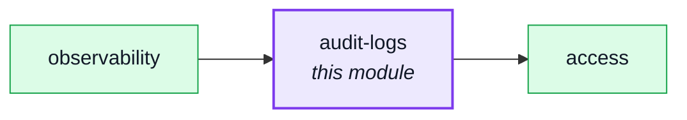
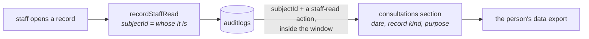
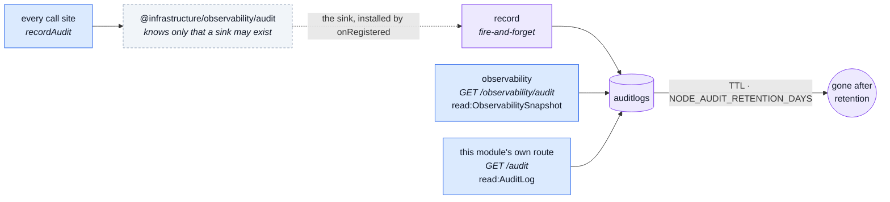

# audit-logs

Owns the audit trail; the read endpoint is its own, the platform operator's view lives in observability.

::: tip At a glance
**Owns** — the queryable audit trail, kept for `NODE_AUDIT_RETENTION_DAYS` (180 by default), which its TTL index enforces.
**Depends on** — [`access`](./access.md), only for the refusal reasons its read side lists. Nothing, for the write side: nothing imports this module, it installs a sink instead.
**Breaks if you change** — the retention window (`NODE_AUDIT_RETENTION_DAYS`) on the `timestamp` index. It is the only thing deleting old entries.
:::

## Its neighbourhood

<!-- module-graph:audit-logs:start -->

_Solid arrows are imports. Dotted arrows are domain events — the return path an import
graph cannot see._


```mermaid
%%{init: {'flowchart': {'nodeSpacing': 30, 'rankSpacing': 60}}}%%
flowchart LR
    audit_logs["audit-logs<br/><i>this module</i>"]
    access["access"]
    observability["observability"]

    observability --> audit_logs
    audit_logs --> access

    classDef core fill:#dbeafe,stroke:#2563eb,color:#111827;
    classDef supporting fill:#fef3c7,stroke:#d97706,color:#111827;
    classDef generic fill:#dcfce7,stroke:#16a34a,color:#111827;
    classDef centre fill:#ede9fe,stroke:#7c3aed,stroke-width:2px,color:#111827;
    class access,observability generic;
    class audit_logs centre;
```

<!-- module-graph:audit-logs:end -->

## Who can do what

Every rule this module declares and who holds it, role by role. The rule is what a route guard asks for; the set is what a role lists.

<!-- permissions:start -->

| Rule            | Set            | `guest` | `unverified` | `customer` | `manager` | `warehouse` | `support` | `editor` | `moderator` | `admin` | `operator` | Credential | What it lets them do                                                      |
| --------------- | -------------- | ------- | ------------ | ---------- | --------- | ----------- | --------- | -------- | ----------- | ------- | ---------- | ---------- | ------------------------------------------------------------------------- |
| `read:AuditLog` | `AuditDisplay` | —       | —            | —          | —         | —           | —         | —        | —           | ✅      | —          | ✅         | Read the audit trail. There is no write key — nothing edits an audit row. |

✅ held · `own` only the caller’s own rows · ⚡c / ⚡s needs a freshly proved session (critical / sensitive) ·
Credential: ✅ when an API key can be minted with the rule. Generated from the rules and sets in
`src/modules/*/authorization.yaml` and the roles in `shared/rules/authorization-roles.yaml`, asked of the
evaluator — [Authorization](../understand/authorization.md) explains the model.

<!-- permissions:end -->

## The story

**One collection, two readers, and neither is this module's own write path.** The write side is headless — see the tip below. The read side has two doors.
[`observability`](./observability.md)'s `GET /observability/audit` is gated on
`read:ObservabilitySnapshot` — a key only the platform operator holds, and therefore useless to a
shop's own staff.

This module owns the tenant-facing door onto the same collection: `GET /audit`, gated on
`read:AuditLog` — held by `admin` only in `shared/rules/authorization-roles.yaml`.
Same rows, same shape, different audience: `observability`'s route answers "what happened across
every shop", this module's own route answers "what happened in mine". Enabling this module without
`observability` gives a working `GET /audit` and no platform-wide view — a legitimate build, just a
narrower one.

::: tip How every call site reaches a module nothing imports, for the WRITE
They do not, even though the module has a router. Every
`recordAudit` / `emitAuditEvent` call in the app talks to `@infrastructure/observability/audit`, which knows only
that a sink _may_ exist. **This module installs that sink itself, from its own `onRegistered`
hook** — run once every enabled module is known, not merely on import, the same way it hands
`mounts` to the app tier for the read side.

Registering a function is not a database call: `record` is fire-and-forget and only touches Mongo
when an entry actually fires, which cannot happen before the app serves a request. Doing it here
rather than in `app.ts` is what keeps the assembly file from naming a domain, and doing it from
`onRegistered` rather than at import time means importing this file for a type or a test does not
install the sink. With this module deleted, the audit trail stops being stored and everything
else still builds.
:::

Retention is a database fact, not a cron job: `expireAfterSeconds` on `timestamp` is
`NODE_AUDIT_RETENTION_DAYS` days (180 by default), enforced by Mongo. Mongo will not change an
existing TTL index's window in place: a new value fails the boot until `npm run db:sync` rebuilds
the index. The compound indexes are the questions anyone asks of a trail — everything one actor
did, everyone who did one thing, what happened to one row, and whose data a row was about.

Field names are `camelCase` in the event, in Mongo and in the API, like every other collection. The
log line is the one place they change: the Winston formatter renames them to OpenTelemetry
semantic-convention names (`actorUserId` becomes `user.id`) on the way out. See
[Winston](../operate/winston.md#field-names-in-the-log-line).

One row shape, `AuditEntryItem`, answers every read: `GET /audit`, `GET /observability/audit` and the
account export. `actorCredentialId` names the API key when a credential did the action, and is absent
when a person did. `subjectId` names the person whose data the row is about, when that is not the
actor: a staff read of someone's record sets it, and `GET /audit?subject=<id>` is the staff-side
answer to "who looked at this person's data".

## The person can see who looked {#the-person-can-see-who-looked}

A staff member opening someone else's record writes `admin.<resource>.viewed` with the person's id
as `subjectId` (`src/kernel/staff-read.ts`). The person's own data export then carries a
`consultations` section: when, which kind of record, and why. Never the staff member: the EU court
(C-579/21, Art. 15) gives a person the dates and purposes of each consultation, not the employee's name.


```mermaid
flowchart LR
    S["staff opens a record"] --> W["recordStaffRead<br/><i>subjectId = whose it is</i>"]
    W --> A[("auditlogs")]
    A -->|"subjectId + a staff-read action,<br/>inside the window"| C["consultations section<br/><i>date, record kind, purpose</i>"]
    C --> E["the person's data export"]
```

- **Purpose** comes from one fixed map, `STAFF_READ_PURPOSES` in `src/kernel/staff-read.ts`
  (`admin.order.viewed` is "handling your order"). It is also the list of actions that count as a
  consultation: a new `admin.<resource>.viewed` is added there, or it never reaches the export.
- **Window** is `NODE_AUDIT_RETENTION_DAYS`, and the section says so (`windowDays`). Retention is not
  extended to answer the request: the ruling covers the logs that are held, not how long they are kept.
- **Limits, stated rather than hidden:** a guest's order has no person to name, so it has no
  `subjectId`; the orders CSV export (`GET /orders/export`) names no person either; a return's
  `subjectId` is the order's buyer, resolved at read time and stored only on the audit row.
- **Erasure:** no erase hook. Rows that name an erased person expire with the log window. The
  trail is kept for accountability, so the shop can show who accessed data (GDPR Art. 17(3)(e), and
  Art. 5(2)).

## Offline writes

`bufferCommands: false` on this schema fails a write immediately when Mongo is unreachable,
instead of queueing it.

Mongoose's default is to BUFFER any operation issued while disconnected and hold it for
`bufferTimeoutMS` — ten seconds — before rejecting. For every other collection here that is the
right behaviour: it rides out a reconnect and the request waiting on the answer gets one.

This collection is the exception, because nothing waits on it. `auditLogService.record` is
fire-and-forget by contract and the audit LOG LINE is the compliance record — the stored copy is
the queryable convenience on top of it. Buffering cannot save an entry that matters; it only
converts "not persisted, logged, moved on" into a pending timer per audited request, held for ten
seconds each, for as long as Mongo is away.

A suite that runs with no database, such as `tests/integration/locale.test.ts`, shows the cost:
each rejected signup emits `auth.signup.failed`, and a buffered insert would leave a 10s timer
holding the worker's event loop open.

## The pipeline

The gap in the middle is the design on the write side. No call site imports this module; it
installs a sink and the infrastructure finds it. The read side is unremarkable by comparison — two
ordinary routes, in two different modules, over one collection.


```mermaid
%%{init: {'flowchart': {'nodeSpacing': 30, 'rankSpacing': 55}}}%%
flowchart LR
    C["every call site<br/><i>recordAudit</i>"] --> P["@infrastructure/observability/audit<br/><i>knows only that a sink may exist</i>"]
    P -.->|"the sink, installed by onRegistered"| R["record<br/><i>fire-and-forget</i>"]
    R --> M[("auditlogs")]
    M -->|"TTL · NODE_AUDIT_RETENTION_DAYS"| X(("gone after<br/>retention"))
    O["observability<br/><i>GET /observability/audit</i><br/>read:ObservabilitySnapshot"] --> M
    S["this module's own route<br/><i>GET /audit</i><br/>read:AuditLog"] --> M

    classDef caller fill:#dbeafe,stroke:#2563eb,color:#111827;
    classDef seam fill:#f1f5f9,stroke:#94a3b8,color:#111827,stroke-dasharray:4 3;
    classDef own fill:#ede9fe,stroke:#7c3aed,color:#111827;
    class C,O,S caller;
    class P seam;
    class R,M,X own;
```

**The operator's read is an incident feed, not the trail.** `GET /observability/audit` goes through
`searchIncidents`, which ANDs the operator's own filters with an allow-list (`INCIDENT_SCOPE` in
`service.ts`): the `security.*` actions, a refused sign-in, a failed second-factor
challenge or provider sign-in, a reused refresh token and an auto-disabled webhook. The one
`security.forbidden` it drops is the shop's own refusal of a staff account (`metadata.reason` is
`role_protected`): staff refused an account that holds a role is the shop's business and names an
account. Orders, payments, products and successful sign-ins stay on the shop's own `GET /audit`, and every address
is returned as a keyed digest (`hmac:…`): the operator can correlate "this address, three
incidents" and never read the address. An operator watching an installation needs the incidents,
and holding no shop key was never meant to include reading a shop's customers.

The feed shows no 401s either: a request with no credential, or a stale one, is logged as
`security.unauthorized` and never stored ([Audit events](#a-line-with-or-without-a-row)).

The stored row's `metadata` is credential-scrubbed before it is written (a `password` or `token` key becomes `[REDACTED]`), exactly as the log line's is; `ip` stays raw in the row on purpose.

## What an update records

Every `*.updated` audit row says what the edit moved, through one pure helper,
`auditChanges(before, data, { valued, named })` in `infrastructure/observability/audit-changes.ts`.
The trail is append-only and never scrubbed on erasure, so the rule is an allowlist, not a diff of
everything:

| Form           | Where in `metadata` | For which fields                                               |
| -------------- | ------------------- | -------------------------------------------------------------- |
| `{ from, to }` | `changes.<field>`   | non-personal fields: prices, flags, preferences, display names |
| the name only  | `changedFields[]`   | free text, personal data, bearer secrets                       |
| nothing        |                     | every field on neither list                                    |

The caller snapshots "before" ahead of any in-place assignment. Where the write is atomic and
returns no previous value (the backorder limit), it reads first.

Which fields of which action go in which column is the `valued` / `named` argument at each call site; the list of audited actions is generated in [Every action](#every-action). The policy is the table above: a non-personal field by value, free text, personal data and bearer secrets by name, everything else not at all.

`admin.translation.updated` already lists the locales it upserted and deleted; the text itself is
free text and stays out.

`GET /audit` also filters on `ownOrder` (`true` keeps the entries flagged `metadata.ownOrder`,
`false` the rest) so staff can separate actions on their own orders from actions on customers'.

## Audit events

`emitAuditEvent` and `recordAuditLine` (both in `src/infrastructure/observability/audit.ts`) are the only entry points for auditable actions: the first writes the line and stores a row, the second writes the line alone (see [A line, with or without a row](#a-line-with-or-without-a-row)). Each event has a stable `action` (`auth.login`, `admin.user.erased`, …), an `outcome` (`success` / `failure`), and a `level` derived from the outcome.

```json
{
    "level": "info",
    "log_type": "audit",
    "event.name": "auth.login",
    "user.id": "user-123",
    "user.roles": ["user"],
    "app.actor.scope": "tenant",
    "app.audit.outcome": "success",
    "client.address": "hmac:3f9a1c0b7d2e",
    "app.request.id": "…",
    "trace_id": "…"
}
```

### A line, with or without a row

`emitAuditEvent` writes the log line and then hands the entry to the persistence sink, which stores
a row. `recordAuditLine` writes the **line only**. A refusal goes one way or the other by who can
cause it and how often:

| Refusal                                                              | Line | Row | Counter                        |
| -------------------------------------------------------------------- | ---- | --- | ------------------------------ |
| A forged or malformed token, a revoked `sk_` key (an attack)         | yes  | yes | `security_events_total`        |
| A stale credential: expired, revoked or idle session, an expired key | yes  | no  | `auth_stale_credentials_total` |
| A request with no credential on a protected route                    | yes  | no  | —                              |
| A permission refused, a step-up demanded (`security.forbidden`, …)   | yes  | yes | —                              |

The line-only ones are `security.unauthorized`, with `metadata.reason` saying which: `not_authenticated`,
or the resolver's own (`expired`, `revoked`, `idle`) beside `metadata.kind`
(`session` or `api_key`). Each carries the route, the method and the address (as every audit line
carries it, under `NODE_LOG_PERSONAL_FIELDS`) and never the credential: `redactCredentials` scrubs the metadata, and the
token is not put in it to begin with. A row for each would be a write the caller chooses to make
at any rate, and a customer's expired tab sends one every few minutes. One request
logs one line: the 401 that follows a refused credential does not log it again.

The `action` vocabulary is a closed union, not free strings — an alert built on
`auth.login` cannot be defeated by a typo at a call site.

It is assembled rather than declared in one place. Each module owns its own actions in
`src/modules/<name>/audit.ts` as an `as const` object and augments core's `IAuditActionMap`, the
same way modules declare domain events; `infrastructure` keeps only the `security.*` actions the guards emit about requests that never
reached a domain. A module's own attack action (a forged webhook, a wrong scrape token) lives in
its `audit.ts` and registers its counter series with `registerSecurityEvents`. So the union narrows when
you delete a module, and `infrastructure` never names one. `tests/cross-cutting/audit-actions.test.ts` is
what keeps two modules from claiming the same string. ESLint (the `audit.ts` block of `eslint.config.ts`) refuses a name that breaks the
dotted convention log backends filter on.

### Every action

`npm run regenerate`, checked by `npm run check`. Every action this
build can emit, its owning module, and — where a call site names one — the `targetType` it
audits. `—` means no call site attaches a target; `(varies)` means the action is fired against more
than one, from a generic helper that takes the target as a runtime parameter.

<!-- audit-actions:start -->

| Module           | Action                                       | Value                                        | Target type            |
| ---------------- | -------------------------------------------- | -------------------------------------------- | ---------------------- |
| `access`         | `ROLE_ASSIGNED`                              | `access.role.assigned`                       | —                      |
| `access`         | `ROLE_REVOKED`                               | `access.role.revoked`                        | —                      |
| `account`        | `AUTH_2FA_BACKUP_CODES_REGENERATED`          | `auth.two_factor.backup_codes_regenerated`   | —                      |
| `account`        | `AUTH_2FA_CHALLENGE_FAILED`                  | `auth.two_factor.challenge_failed`           | —                      |
| `account`        | `AUTH_2FA_CODE_SENT`                         | `auth.two_factor.code_sent`                  | —                      |
| `account`        | `AUTH_2FA_DISABLED`                          | `auth.two_factor.disabled`                   | —                      |
| `account`        | `AUTH_2FA_ENROLLED`                          | `auth.two_factor.enrolled`                   | —                      |
| `account`        | `AUTH_ACCOUNT_DELETE_CANCELED`               | `auth.account_delete.canceled`               | —                      |
| `account`        | `AUTH_ACCOUNT_DELETE_COMPLETED`              | `auth.account_delete.completed`              | —                      |
| `account`        | `AUTH_ACCOUNT_DELETE_SCHEDULED`              | `auth.account_delete.scheduled`              | —                      |
| `account`        | `AUTH_DATA_EXPORT_DOWNLOADED`                | `auth.data_export.downloaded`                | `account_export`       |
| `account`        | `AUTH_DATA_EXPORT_REQUESTED`                 | `auth.data_export.requested`                 | `account_export`       |
| `account`        | `AUTH_EMAIL_CHANGE_CANCELED`                 | `auth.email_change.canceled`                 | —                      |
| `account`        | `AUTH_EMAIL_CHANGE_COMPLETED`                | `auth.email_change.completed`                | —                      |
| `account`        | `AUTH_EMAIL_CHANGE_REQUESTED`                | `auth.email_change.requested`                | —                      |
| `account`        | `AUTH_EMAIL_CHANGE_RESENT`                   | `auth.email_change.resent`                   | —                      |
| `account`        | `AUTH_EMAIL_CHANGE_UNDONE`                   | `auth.email_change.undone`                   | —                      |
| `account`        | `AUTH_EMAIL_VERIFY_COMPLETED`                | `auth.email_verify.completed`                | —                      |
| `account`        | `AUTH_EMAIL_VERIFY_REQUESTED`                | `auth.email_verify.requested`                | —                      |
| `account`        | `AUTH_ERASURES_REAPPLIED`                    | `auth.erasures.reapplied`                    | —                      |
| `account`        | `AUTH_LOGGED_OUT`                            | `auth.logout`                                | —                      |
| `account`        | `AUTH_LOGGED_OUT_EVERYWHERE`                 | `auth.logout_all`                            | —                      |
| `account`        | `AUTH_LOGIN`                                 | `auth.login`                                 | `login_identifier`     |
| `account`        | `AUTH_OAUTH_FAILED`                          | `auth.oauth.failed`                          | —                      |
| `account`        | `AUTH_OAUTH_LINKED`                          | `auth.oauth.linked`                          | —                      |
| `account`        | `AUTH_OAUTH_UNLINKED`                        | `auth.oauth.unlinked`                        | —                      |
| `account`        | `AUTH_ONE_TIME_TOKEN_REJECTED`               | `auth.one_time_token.rejected`               | —                      |
| `account`        | `AUTH_PASSWORD_CHANGED`                      | `auth.password.changed`                      | —                      |
| `account`        | `AUTH_PASSWORD_RESET_COMPLETED`              | `auth.password_reset.completed`              | —                      |
| `account`        | `AUTH_PASSWORD_RESET_REQUESTED`              | `auth.password_reset.requested`              | —                      |
| `account`        | `AUTH_PROFILE_UPDATED`                       | `auth.profile.updated`                       | —                      |
| `account`        | `AUTH_REAUTH_CODE_SENT`                      | `auth.reauth.code_sent`                      | —                      |
| `account`        | `AUTH_REAUTHENTICATED`                       | `auth.reauth`                                | —                      |
| `account`        | `AUTH_REFRESH_TOKEN_REUSE_DETECTED`          | `auth.refresh_token.reuse_detected`          | —                      |
| `account`        | `AUTH_SESSION_REVOKED`                       | `auth.session.revoked`                       | —                      |
| `account`        | `AUTH_SIGNED_UP`                             | `auth.signup`                                | —                      |
| `account`        | `AUTH_TOKEN_REFRESHED`                       | `auth.token.refreshed`                       | —                      |
| `api-keys`       | `ADMIN_API_KEY_MINTED`                       | `admin.api_key.minted`                       | `api_key`              |
| `api-keys`       | `ADMIN_API_KEY_REVOKED`                      | `admin.api_key.revoked`                      | `api_key`              |
| `api-keys`       | `SYSTEM_API_KEYS_REVOKED_ON_COMPROMISE`      | `system.api_keys.revoked_on_compromise`      | `user`                 |
| `cart`           | `USER_CART_ITEM_REMOVED`                     | `user.cart.item_removed`                     | `product`              |
| `cart`           | `USER_CART_REORDERED`                        | `user.cart.reordered`                        | —                      |
| `delivery`       | `ADMIN_FULFILLMENT_ORDER_HELD`               | `admin.fulfillment_order.held`               | —                      |
| `delivery`       | `ADMIN_FULFILLMENT_ORDER_RELEASED`           | `admin.fulfillment_order.released`           | —                      |
| `delivery`       | `ADMIN_ORDER_DELIVERED`                      | `admin.order.delivered`                      | `order`                |
| `delivery`       | `ADMIN_ORDER_FULFILLED`                      | `admin.order.fulfilled`                      | `order`                |
| `delivery`       | `ADMIN_ORDER_FULFILLMENT_STARTED`            | `admin.order.fulfillment_started`            | `order`                |
| `delivery`       | `ADMIN_ORDER_SHIPPED`                        | `admin.order.shipped`                        | `order`                |
| `delivery`       | `ADMIN_SHIPMENT_LOST`                        | `admin.shipment.lost`                        | `order`                |
| `delivery`       | `ADMIN_SHIPMENT_TRACKING_EDITED`             | `admin.shipment.tracking_edited`             | `order`                |
| `example`        | `EXAMPLE_COVER_CHANGED`                      | `example.cover_changed`                      | `example`              |
| `example`        | `EXAMPLE_CREATED`                            | `example.created`                            | `example`              |
| `example`        | `EXAMPLE_DELETED`                            | `example.deleted`                            | `example`              |
| `example`        | `EXAMPLE_STATUS_CHANGED`                     | `example.status_changed`                     | `example`              |
| `example`        | `EXAMPLE_UPDATED`                            | `example.updated`                            | `example`              |
| `infrastructure` | `SECURITY_API_KEY_REVOKED`                   | `security.api_key.revoked`                   | —                      |
| `infrastructure` | `SECURITY_FORBIDDEN`                         | `security.forbidden`                         | —                      |
| `infrastructure` | `SECURITY_RATE_LIMIT_HIT`                    | `security.rate_limit_hit`                    | —                      |
| `infrastructure` | `SECURITY_REAUTH_REQUIRED`                   | `security.reauth_required`                   | —                      |
| `infrastructure` | `SECURITY_TOKEN_INVALID_SIGNATURE`           | `security.token.invalid_signature`           | —                      |
| `infrastructure` | `SECURITY_TOKEN_MALFORMED`                   | `security.token.malformed`                   | —                      |
| `infrastructure` | `SECURITY_UNAUTHORIZED`                      | `security.unauthorized`                      | —                      |
| `inventory`      | `ADMIN_BACKORDER_LIMIT_SET`                  | `admin.backorder.limit.set`                  | `product`              |
| `inventory`      | `ADMIN_COMMIT_ORPHANED`                      | `admin.commit.orphaned`                      | `order`                |
| `inventory`      | `ADMIN_RESERVATIONS_SWEPT`                   | `admin.reservations.swept`                   | `reservation`          |
| `inventory`      | `ADMIN_STOCK_ADJUSTED`                       | `admin.stock.adjusted`                       | —                      |
| `inventory`      | `ADMIN_STOCK_RECEIVED`                       | `admin.stock.received`                       | —                      |
| `invoicing`      | `ADMIN_CREDIT_NOTE_VIEWED`                   | `admin.credit_note.viewed`                   | `credit_note`          |
| `invoicing`      | `ADMIN_INVOICE_VIEWED`                       | `admin.invoice.viewed`                       | `invoice`              |
| `locales`        | `ADMIN_LOCALE_ACTIVATED`                     | `admin.locale.activated`                     | `locale`               |
| `locales`        | `ADMIN_LOCALE_CREATED`                       | `admin.locale.created`                       | `locale`               |
| `locales`        | `ADMIN_LOCALE_DEACTIVATED`                   | `admin.locale.deactivated`                   | `locale`               |
| `locales`        | `ADMIN_LOCALE_DELETED`                       | `admin.locale.deleted`                       | `locale`               |
| `locales`        | `ADMIN_LOCALE_ENTRY_CREATED`                 | `admin.locale_entry.created`                 | `locale_entry`         |
| `locales`        | `ADMIN_LOCALE_ENTRY_DELETED`                 | `admin.locale_entry.deleted`                 | `locale_entry`         |
| `locales`        | `ADMIN_LOCALE_ENTRY_IMPORTED`                | `admin.locale_entry.imported`                | `locale`               |
| `locales`        | `ADMIN_LOCALE_ENTRY_UPDATED`                 | `admin.locale_entry.updated`                 | `locale_entry`         |
| `locales`        | `ADMIN_LOCALE_UPDATED`                       | `admin.locale.updated`                       | `locale`               |
| `locales`        | `ADMIN_TRANSLATION_UPDATED`                  | `admin.translation.updated`                  | —                      |
| `observability`  | `SECURITY_METRICS_TOKEN_INVALID`             | `security.metrics_token.invalid`             | —                      |
| `orders`         | `ADMIN_ORDER_ADDRESS_CORRECTED`              | `admin.order.address_corrected`              | `order`                |
| `orders`         | `ADMIN_ORDER_BILLING_CORRECTED`              | `admin.order.billing_corrected`              | `order`                |
| `orders`         | `ADMIN_ORDER_NOTE_ADDED`                     | `admin.order.note_added`                     | `order`                |
| `orders`         | `ADMIN_ORDER_NOTE_DELETED`                   | `admin.order.note_deleted`                   | `order`                |
| `orders`         | `ADMIN_ORDER_VIEWED`                         | `admin.order.viewed`                         | `order`                |
| `orders`         | `ADMIN_ORDERS_EXPORTED`                      | `admin.orders.exported`                      | `order`                |
| `orders`         | `ORDER_CANCELED`                             | `order.canceled`                             | `order`                |
| `orders`         | `ORDER_CREATED`                              | `order.created`                              | `order`                |
| `orders`         | `ORDER_DELETED`                              | `order.deleted`                              | `order`                |
| `orders`         | `ORDER_RESTORED`                             | `order.restored`                             | `order`                |
| `orders`         | `ORDER_STATUS_OVERRIDDEN`                    | `order.status_overridden`                    | `order`                |
| `orders`         | `ORDER_UPDATED`                              | `order.updated`                              | `order`                |
| `payments`       | `ADMIN_PAYMENT_REFUND_CANCELED`              | `admin.payment.refund_canceled`              | `order`                |
| `payments`       | `ADMIN_PAYMENT_REFUND_REQUESTED`             | `admin.payment.refund_requested`             | `order`                |
| `payments`       | `ADMIN_PAYMENT_REFUND_SETTLED_BY_HAND`       | `admin.payment.refund_settled_by_hand`       | `order`                |
| `payments`       | `ADMIN_PAYMENT_REFUNDED`                     | `admin.payment.refunded`                     | `order`                |
| `payments`       | `PAYMENT_AMOUNT_MISMATCH`                    | `payment.amount_mismatch`                    | `payment`              |
| `payments`       | `PAYMENT_CONFIRMED`                          | `payment.confirmed`                          | —                      |
| `payments`       | `PAYMENT_FAILED`                             | `payment.failed`                             | —                      |
| `payments`       | `PAYMENT_RECORDED_OFFLINE`                   | `payment.recorded_offline`                   | `order`                |
| `payments`       | `PAYMENT_REFUND_OWED_BY_HAND`                | `payment.refund_owed_by_hand`                | `order`                |
| `payments`       | `SECURITY_PAYMENT_WEBHOOK_INVALID_SIGNATURE` | `security.payment_webhook.invalid_signature` | —                      |
| `products`       | `ADMIN_PRODUCT_CREATED`                      | `admin.product.created`                      | `product`              |
| `products`       | `ADMIN_PRODUCT_DELETED`                      | `admin.product.deleted`                      | `product`              |
| `products`       | `ADMIN_PRODUCT_RESTORED`                     | `admin.product.restored`                     | `product`              |
| `products`       | `ADMIN_PRODUCT_UPDATED`                      | `admin.product.updated`                      | `product`              |
| `returns`        | `ADMIN_RETURN_APPROVED`                      | `admin.return.approved`                      | `return`               |
| `returns`        | `ADMIN_RETURN_CANCELED`                      | `admin.return.canceled`                      | `return`               |
| `returns`        | `ADMIN_RETURN_CLOSED`                        | `admin.return.closed`                        | `return`               |
| `returns`        | `ADMIN_RETURN_DECLINED`                      | `admin.return.declined`                      | `return`               |
| `returns`        | `ADMIN_RETURN_PROOF_RECORDED`                | `admin.return.proof_recorded`                | `return`               |
| `returns`        | `ADMIN_RETURN_RECEIVED`                      | `admin.return.received`                      | `return`               |
| `returns`        | `ADMIN_RETURN_VIEWED`                        | `admin.return.viewed`                        | `return`               |
| `returns`        | `RETURN_REQUESTED`                           | `return.requested`                           | `return`               |
| `tasks`          | `ADMIN_TASK_ASSIGNED`                        | `admin.task.assigned`                        | `task`                 |
| `tasks`          | `ADMIN_TASK_DELETED`                         | `admin.task.deleted`                         | `task`                 |
| `tasks`          | `ADMIN_TASK_MARKED_SPAM`                     | `admin.task.marked_spam`                     | —                      |
| `tasks`          | `ADMIN_TASK_NOTED`                           | `admin.task.noted`                           | `task`                 |
| `tasks`          | `ADMIN_TASK_REOPENED`                        | `admin.task.reopened`                        | —                      |
| `tasks`          | `ADMIN_TASK_RESOLVED`                        | `admin.task.resolved`                        | —                      |
| `tasks`          | `ADMIN_TASK_UNASSIGNED`                      | `admin.task.unassigned`                      | `task`                 |
| `tasks`          | `ADMIN_TASK_VIEWED`                          | `admin.task.viewed`                          | `task`                 |
| `tasks`          | `SYSTEM_TASK_CLEARED`                        | `system.task.cleared`                        | `task`                 |
| `tasks`          | `SYSTEM_TASK_OPENED`                         | `system.task.opened`                         | `task`                 |
| `users`          | `ADMIN_USER_BANNED`                          | `admin.user.banned`                          | `user`                 |
| `users`          | `ADMIN_USER_CREATED`                         | `admin.user.created`                         | `user`                 |
| `users`          | `ADMIN_USER_ERASED`                          | `admin.user.erased`                          | `user`                 |
| `users`          | `ADMIN_USER_PURCHASE_HOLD_LIFTED`            | `admin.user.purchase_hold_lifted`            | `user`                 |
| `users`          | `ADMIN_USER_PURCHASE_HOLD_SET`               | `admin.user.purchase_hold_set`               | `user`                 |
| `users`          | `ADMIN_USER_RESTORED`                        | `admin.user.restored`                        | `user`                 |
| `users`          | `ADMIN_USER_SOFT_DELETED`                    | `admin.user.soft_deleted`                    | `user`                 |
| `users`          | `ADMIN_USER_UNBANNED`                        | `admin.user.unbanned`                        | `user`                 |
| `users`          | `ADMIN_USER_UPDATED`                         | `admin.user.updated`                         | `user`                 |
| `users`          | `ADMIN_USER_VIEWED`                          | `admin.user.viewed`                          | `user`                 |
| `users`          | `SYSTEM_USER_DELETION_LOCK_RESTORED`         | `system.user.deletion_lock_restored`         | `user`                 |
| `users`          | `SYSTEM_USER_ERASED`                         | `system.user.erased`                         | `user`                 |
| `users`          | `SYSTEM_USER_PURCHASE_HOLD_FLAGGED`          | `system.user.purchase_hold_flagged`          | `user`                 |
| `users`          | `SYSTEM_USER_PURCHASE_HOLD_SET`              | `system.user.purchase_hold_set`              | `user`                 |
| `users`          | `SYSTEM_USER_SOFT_DELETED`                   | `system.user.soft_deleted`                   | `user`                 |
| `webhooks`       | `ADMIN_WEBHOOK_DELIVERY_REPLAYED`            | `admin.webhook_delivery.replayed`            | `webhook_delivery`     |
| `webhooks`       | `ADMIN_WEBHOOK_SUBSCRIPTION_CREATED`         | `admin.webhook_subscription.created`         | `webhook_subscription` |
| `webhooks`       | `ADMIN_WEBHOOK_SUBSCRIPTION_DELETED`         | `admin.webhook_subscription.deleted`         | `webhook_subscription` |
| `webhooks`       | `ADMIN_WEBHOOK_SUBSCRIPTION_DISABLED`        | `admin.webhook_subscription.disabled`        | `webhook_subscription` |
| `webhooks`       | `ADMIN_WEBHOOK_SUBSCRIPTION_ENABLED`         | `admin.webhook_subscription.enabled`         | `webhook_subscription` |
| `webhooks`       | `ADMIN_WEBHOOK_SUBSCRIPTION_SECRET_REMOVED`  | `admin.webhook_subscription.secret_removed`  | `webhook_subscription` |
| `webhooks`       | `ADMIN_WEBHOOK_SUBSCRIPTION_SECRET_ROTATED`  | `admin.webhook_subscription.secret_rotated`  | `webhook_subscription` |
| `webhooks`       | `ADMIN_WEBHOOK_SUBSCRIPTION_UPDATED`         | `admin.webhook_subscription.updated`         | `webhook_subscription` |
| `webhooks`       | `SYSTEM_WEBHOOK_SUBSCRIPTION_AUTO_DISABLED`  | `system.webhook_subscription.auto_disabled`  | `webhook_subscription` |
| `zammad`         | `ZAMMAD_ERASURES_REPLAYED`                   | `zammad.erasures.replayed`                   | —                      |

<!-- audit-actions:end -->

### Where an audit entry ends up

Two destinations, from the single `emitAuditEvent` call:

| Destination            | Role                                                                                            | Fails how                                                     |
| ---------------------- | ----------------------------------------------------------------------------------------------- | ------------------------------------------------------------- |
| `auditLogger` → stdout | the compliance record — append-only, shipped to [Loki](../operate/loki.md)                      | a broken logger is a real problem                             |
| Mongo `auditlogs`      | the queryable copy behind `GET /observability/audit` and the `audit-logs` module's `GET /audit` | silently, into a warning — never fails the triggering request |

The Mongo write goes through an `AuditSink` port that the `audit-logs` module registers
(`registerAuditSink`) when it boots. `src/infrastructure/**` may not import `@modules/*`, so the dependency is inverted rather
than smuggled — and the call sites that reach `recordAudit` know about neither destination.

### Retention

| Env var                     | Effect                                                                                                       |
| --------------------------- | ------------------------------------------------------------------------------------------------------------ |
| `NODE_AUDIT_RETENTION_DAYS` | how long the Mongo copy survives before its TTL index removes it (def. 180, read by the `audit-logs` module) |

Only the queryable copy expires — log retention is [Loki](../operate/loki.md)'s business.

::: warning Changing the retention window
Mongo will not alter an existing TTL index's `expireAfterSeconds` in place. After changing
`NODE_AUDIT_RETENTION_DAYS`, a restart **fails the boot** — `autoIndex` asks for the new window and
Mongo refuses the conflicting options. `npm run db:sync` replaces the index (drops it and rebuilds it), which is
why `db:bootstrap` syncs before the server starts.
:::

## Read next

- [`observability`](./observability.md) — the module's OTHER reader, `GET /observability/audit`
- [Authorization](../understand/authorization.md) — `read:AuditLog`, and why a bare key can never answer a platform question
- [Winston & Audit Logs](../operate/winston.md) — the log line the audit event writes, and its redaction
- [Modules](../understand/modules.md#the-manifest) — the headless half of the manifest, for the write side
- [MongoDB & Mongoose](../understand/mongodb-mongoose.md) — TTL indexes
