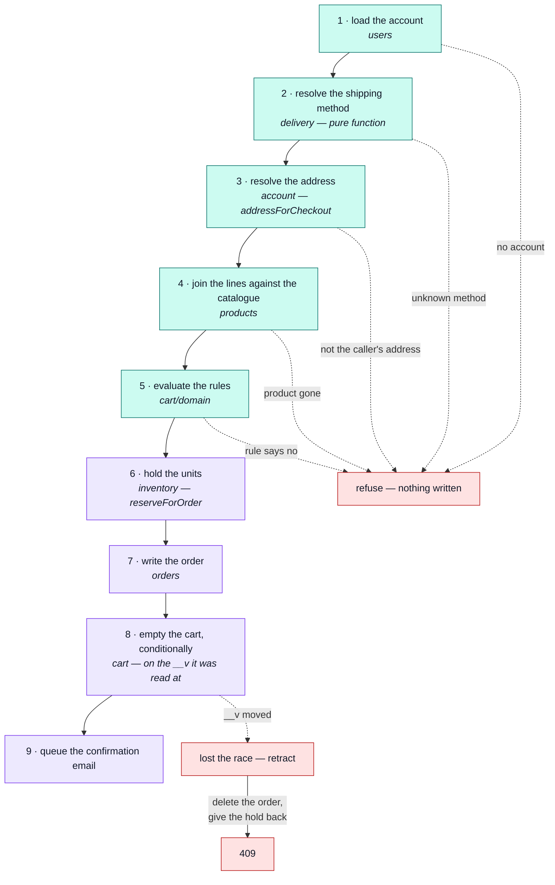

# Checkout

`POST /cart/checkout` — the one cart operation that writes to another module's collection, and the
only one where a race can cost a customer money.

::: tip At a glance
**Touches** — five modules, in a fixed order, and the order is the correctness.
**Costs** — one order, one reservation, one emptied cart, one email.
**Breaks if you change** — the sequence below, or the conditional cart clear at the end.
:::

## Why this page exists

[`cart`](./cart.md) declares six dependency edges, more than any other module, and every one of
them is here. Reading the manifest tells you _that_ checkout is a customer of four contexts;
this page is _why_, and in what order.

## The sequence

Everything that can refuse the checkout is resolved **before anything is written**. That is the
whole design: a bad address or an unknown shipping method costs nothing, because no stock has moved
and no order exists yet.

Steps 1–5 are reads and refusals. Steps 6–9 are the writes, and from step 6 onward a failure has
something to undo.

## What crosses each edge

| Module                        | Edge                 | What checkout actually asks for                                                                                                                                       |
| ----------------------------- | -------------------- | --------------------------------------------------------------------------------------------------------------------------------------------------------------------- |
| [`users`](./users.md)         | `conformist`         | The account record. An order records the address it was placed from, so a checkout for an account that no longer exists is the one cart operation that can still 404. |
| [`delivery`](./delivery.md)   | `published-language` | `findShippingMethod` and `priceShipping` — pure functions. The cart never learns that a shipment record exists.                                                       |
| [`account`](./account.md)     | `customer-supplier`  | `addressForCheckout` — the one address this order ships to. The address CRUD stays behind that module's routes.                                                       |
| [`products`](./products.md)   | `conformist`         | Catalogue documents, read as they are, to price lines and pre-flight availability.                                                                                    |
| [`inventory`](./inventory.md) | `customer-supplier`  | `reserveForOrder` to hold the basket, and the hold given back when the cart race is lost. Checkout never touches a counter itself.                                    |
| [`orders`](./orders.md)       | `customer-supplier`  | `create` — this is the one place an order is made outside the admin routes.                                                                                           |

::: tip The basket is mapped, not handed over
`inventory` is given product ids and quantities, nothing else. Mapping the lines rather than passing
them is what keeps that module from ever learning what a cart is.
:::

## The race, and why it is a 409

Read cart → write order → empty cart is three statements. Until the cart write was made
conditional, nothing tied the third to the first:

> Two parallel `POST /cart/checkout` both read the same lines, both wrote an order, and both
> emptied an already-empty cart. One cart, two orders, the customer charged twice. **A
> double-clicked button is enough to reach it.**

So the cart is emptied **conditionally, on the `__v` it was read at**, and that write is what
decides the race — exactly one of the two matches.

The loser has already created an order by then, which is the cost of not using a transaction, so it
deletes that order, gives the hold back, and answers `409`.

::: warning The ordering is deliberate, in both directions
The order is written **first** and retracted on failure, rather than the cart being cleared first.
An order that briefly exists and is removed is recoverable; a cart emptied without an order is a
customer's basket silently thrown away.

And the `409` is deliberate rather than a retry. The loser's cart is empty and its lines are on the
winner's order — the request has been **superseded, not defeated**. Re-running it would produce
"empty cart" anyway.
:::

## The analytics pair

`checkout_completed` and `checkout_failed` are emitted here rather than from
[`orders`](./orders.md), because a name belongs to the code that emits it. Delete this module and
the two outcomes leave the funnel with the endpoint that produced them.

`cart_checkout_total`, labelled by outcome, is the most revenue-critical counter in the
application: a rising failure ratio means money is not being taken, and it warrants a page rather
than a dashboard glance.

## Related pages

- [`cart`](./cart.md) — the module this belongs to
- [`orders`](./orders.md) — the status machine a checkout drops an order into
- [Reservations](./inventory-reservations.md) — what the hold in step 6 actually is
- [Request Flow](../theory/request-flow.md) — how a request reaches a service at all
- [Product Analytics](../tools/analytics.md) — the funnel these two events sit in
