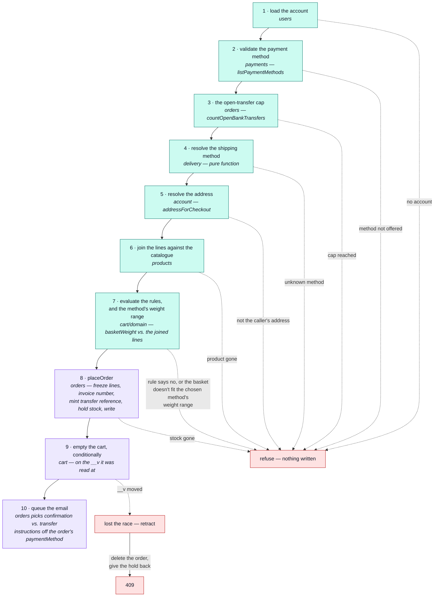

# Checkout

`POST /cart/checkout` — the one cart operation that writes to another module's collection, and the
only one where a race can cost a customer money.

::: tip At a glance
**Touches** — five modules, in a fixed order, and the order is the correctness.
**Costs** — one order, one reservation, one emptied cart, one email — the confirmation, or the
bank-transfer instructions when that is the method chosen.
**Breaks if you change** — the sequence below, or the conditional cart clear at the end.
:::

## Why this page exists

[`cart`](./cart.md) declares more dependency edges than any other module, and every one of them is
here. Reading the manifest tells you _that_ checkout is a customer of five contexts; this page is
_why_, and in what order.

## The sequence

Everything that can refuse the checkout is resolved **before anything is written**. That is the
whole design: a bad address or an unknown shipping method costs nothing, because no stock has moved
and no order exists yet.

Steps 1–7 are reads and refusals — genuinely checkout's own job: deciding whether this basket, this
account and this address are allowed to become an order at all. Step 7's weight check is the
authoritative one: `GET /delivery/methods?weight=` (used to build the selector) is advisory only,
computed client-side from whatever the caller last summed — this step re-sums the joined lines'
real `weight` server-side and refuses a chosen method the basket doesn't actually fit
(`CART_SHIPPING_METHOD_WEIGHT`), so a stale or omitted query value on the list can never buy a
method that list would have hidden. **Step 8 is not checkout's write —
it's checkout handing everything it resolved to [`orders`'](./orders.md) `placeOrder`**, the one
function every order (this checkout, the admin's own `POST /orders`) is written through. Checkout
never freezes a line, allocates an invoice number, or mints a `bank_transfer` reference itself; it
only decides whether the attempt should happen, then reads the verdict `placeOrder` hands back.
Steps 9–10 are checkout's own again: clearing the cart is what makes the race in the next section
possible, and only checkout knows which basket it was clearing.

## What crosses each edge

| Module                        | Edge                 | What checkout actually asks for                                                                                                                                       |
| ----------------------------- | -------------------- | --------------------------------------------------------------------------------------------------------------------------------------------------------------------- |
| [`users`](./users.md)         | `conformist`         | The account record. An order records the address it was placed from, so a checkout for an account that no longer exists is the one cart operation that can still 404. |
| [`payments`](./payments.md)   | `customer-supplier`  | `listPaymentMethods` — the same list `GET /payments/methods` answers, so checkout and that endpoint can never disagree about what this deployment offers.             |
| [`delivery`](./delivery.md)   | `published-language` | `findShippingMethod` and `priceShipping` — pure functions. The cart never learns that a shipment record exists.                                                       |
| [`addresses`](./addresses.md) | `customer-supplier`  | `addressForCheckout` — the one address this order ships to. The address CRUD stays behind that module's routes.                                                       |
| [`products`](./products.md)   | `conformist`         | Catalogue documents, read as they are, to price lines and pre-flight availability.                                                                                    |
| [`orders`](./orders.md)       | `customer-supplier`  | `placeOrder` — the one function every order is written through, admin's own `POST /orders` included — and `countOpenBankTransfers` for the open-transfer cap.         |

::: tip The basket is mapped, not handed over — inside `placeOrder`, not here
`inventory` is given product ids and quantities, nothing else — `placeOrder`'s job now, not
checkout's. Mapping the lines rather than passing the whole basket is what keeps `inventory` from
ever learning what a cart is; checkout itself no longer imports `inventory` at all.
:::

## The race, and why it is a 409

Read cart → write order → empty cart is three statements. Until the cart write was made
conditional, nothing tied the third to the first:

> Two parallel `POST /cart/checkout` both read the same lines, both wrote an order, and both
> emptied an already-empty cart. One cart, two orders, the customer charged twice. **A
> double-clicked button is enough to reach it.**

So the cart is emptied **conditionally, on the `__v` it was read at**, and that write is what
decides the race — exactly one of the two matches.

The loser has already created an order by then, which is the cost of not using a transaction, so it
deletes that order, gives the hold back, and answers `409`.

::: warning The ordering is deliberate, in both directions
The order is written **first** and retracted on failure, rather than the cart being cleared first.
An order that briefly exists and is removed is recoverable; a cart emptied without an order is a
customer's basket silently thrown away.

And the `409` is deliberate rather than a retry. The loser's cart is empty and its lines are on the
winner's order — the request has been **superseded, not defeated**. Re-running it would produce
"empty cart" anyway.
:::

## The analytics pair

`checkout_completed` and `checkout_failed` are emitted here rather than from
[`orders`](./orders.md), because a name belongs to the code that emits it. Delete this module and
the two outcomes leave the funnel with the endpoint that produced them.

`cart_checkout_total`, labelled by outcome, is the most revenue-critical counter in the
application: a rising failure ratio means money is not being taken, and it warrants a page rather
than a dashboard glance.

## Related pages

- [`cart`](./cart.md) — the module this belongs to
- [`orders`](./orders.md) — the status machine a checkout drops an order into
- [Reservations](./inventory-reservations.md) — what the hold in step 8 actually is
- [Request Flow](../theory/request-flow.md) — how a request reaches a service at all
- [Product Analytics](../tools/analytics.md) — the funnel these two events sit in
