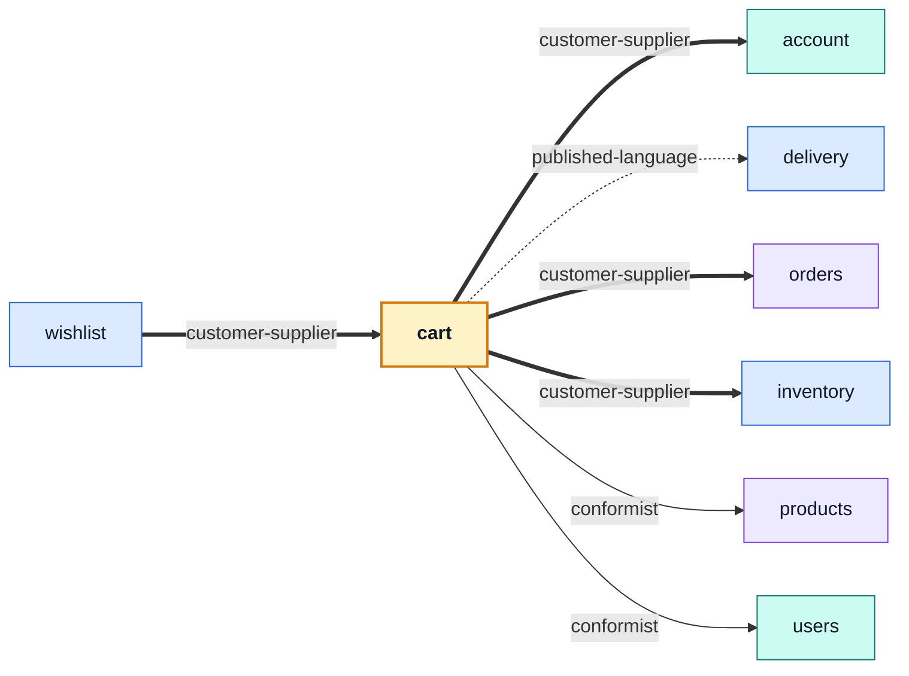

# cart

::: tip At a glance
**Owns** — one cart document per user, priced against the live catalogue, and the checkout that ends it.
**Depends on** — six modules. Checkout is where every rule in the shop has to agree at once.
**Breaks if you change** — `clearLinesIfUnchanged`. It is what stops two parallel checkouts becoming two orders.
:::

<!-- gen:identity:start -->

| Fact                     | This module                                                                                                                                                             |
| ------------------------ | ----------------------------------------------------------------------------------------------------------------------------------------------------------------------- |
| **Subdomain**            | `core` — The reason the product exists. Worth entities, value objects and invariants.                                                                                   |
| **Base path**            | `/cart`                                                                                                                                                                 |
| **Collection**           | `carts` (model `Cart`)                                                                                                                                                  |
| **Depends on**           | [`account`](./account.md) · [`delivery`](./delivery.md) · [`orders`](./orders.md) · [`inventory`](./inventory.md) · [`products`](./products.md) · [`users`](./users.md) |
| **Depended on by**       | [`wishlist`](./wishlist.md)                                                                                                                                             |
| **Languages**            | `en` · `it`                                                                                                                                                             |
| **Seeded**               | yes — `carts` as `stored`                                                                                                                                               |
| **Frontend counterpart** | `cart` in `boilerplate-vue-frontend`                                                                                                                                    |

<!-- gen:identity:end -->

## The map

<!-- gen:map:start -->



- `wishlist` → **customer-supplier** — Move-to-cart asks the cart to add a line; this module never writes a cart document itself.
- → `account` **customer-supplier** — Checkout asks the address book for the one address it should ship to (`addressForCheckout`).
- → `delivery` **published-language** — Prices a shipping method through `findShippingMethod`/`priceShipping` — pure functions over plain data, no shipment record in sight.
- → `orders` **customer-supplier** — A checkout is the one place an order is created outside the admin routes.
- → `inventory` **customer-supplier** — A checkout asks for the basket to be held (`reserveForOrder`) and gives the hold back when it loses the cart race. It never touches a counter itself — what a hold costs is inventory’s to know.
- → `products` **conformist** — Reads catalogue documents as they are to price lines and to pre-flight availability.
- → `users` **conformist** — Reads the account record a checkout is priced against.

<!-- gen:map:end -->

## The story

Checkout is the one place price, stock, address, shipping and order creation must all agree at
the same instant, and that is why this module carries more edges than any other. **The six arrows
are not a smell to be refactored away — they are what a checkout is.** This module is a customer of
four contexts rather than an orchestration layer sitting above them.

A cart is its own collection keyed by `userId`, not a subdocument of the user. Two things follow,
and both are the point: a user response cannot leak a cart it does not carry, and touching a cart
reads and writes one small document instead of the whole account.

::: warning The concurrency rule
`unique: true` on `userId` makes "one cart per user" a database fact rather than something every
write path has to remember — which is what lets every mutation be a single upsert. Checkout then
empties the cart _conditionally on the version it read the lines at_. Remove that condition and two
parallel checkouts turn one cart into two orders.
:::

The second index, `items.productId: 1`, exists for exactly one query: a deleted product has to find
every cart holding it. Without the index that read scans the collection.

Field names match the contract's `CartItem` — `{ productId, quantity }` — so a stored line and a
wire line are the same shape, and there is no mapper between them to keep in sync.

Mongo and not Redis, deliberately: Redis here is cache-only, with no persistence and `allkeys-lru`
eviction. A cart in Redis would make concurrent writes race-free for nothing, paid for in
durability — and would turn one indexed query into a hand-maintained secondary index.

## Data

<!-- gen:data:start -->

#### `carts`

From model `Cart`. `_id` and `__v` are omitted — every document carries them.

| Field         | Type            | Flags            | Default | Reference / values |
| ------------- | --------------- | ---------------- | ------- | ------------------ |
| `userId`      | `ObjectId`      | required, unique | —       | → `User`           |
| `items`       | `Subdocument[]` | —                | []      | —                  |
| ↳ `productId` | `ObjectId`      | required         | —       | → `Product`        |
| ↳ `quantity`  | `Number`        | required         | —       | —                  |
| `createdAt`   | `Date`          | —                | —       | —                  |
| `updatedAt`   | `Date`          | —                | —       | —                  |

**Declared indexes**

| Keys                 | Options |
| -------------------- | ------- |
| `userId: 1`          | unique  |
| `items.productId: 1` | —       |

<!-- gen:data:end -->

## Surface

<!-- gen:surface:start -->

| Endpoint                       | Middlewares                       | Controller       | What it does                                                |
| ------------------------------ | --------------------------------- | ---------------- | ----------------------------------------------------------- |
| `DELETE /cart`                 | `getAuth` → `isAuth`              | `deleteCart`     | Empty cart or, if productId is set, remove target cart item |
| `GET /cart`                    | `getAuth` → `isAuth`              | `getCart`        | Get cart                                                    |
| `POST /cart`                   | `getAuth` → `isAuth`              | `postCart`       | Add/Edit cart item                                          |
| `DELETE /cart/{productId}`     | `getAuth` → `isAuth`              | `deleteCartItem` | Remove item from cart                                       |
| `PUT /cart/{productId}`        | `getAuth` → `isAuth`              | `putCartItem`    | Set cart item quantity                                      |
| `POST /cart/checkout`          | `getAuth` → `isAuth` → `(inline)` | `postCheckout`   | Checkout (place order from cart)                            |
| `POST /cart/reorder/{orderId}` | `getAuth` → `isAuth`              | `postReorder`    | Reorder (refill cart from a past order)                     |
| `GET /cart/summary`            | `getAuth` → `isAuth`              | `getCartSummary` | Get cart summary                                            |

Middlewares run left to right; the controller is the last handler on the route. Summaries come from this module’s own `openapi.yaml`, which is where they are edited.

<!-- gen:surface:end -->

## Signals

<!-- gen:signals:start -->

#### Domain events

| Event             | Direction                    |
| ----------------- | ---------------------------- |
| `product.deleted` | subscribed to in `module.ts` |
| `user.deleted`    | subscribed to in `module.ts` |

#### Audit actions

| Constant                 | Action name              |
| ------------------------ | ------------------------ |
| `USER_CART_ITEM_REMOVED` | `user.cart.item_removed` |
| `USER_CART_REORDERED`    | `user.cart.reordered`    |

#### Analytics events

| Constant             | Event name           |
| -------------------- | -------------------- |
| `CART_VIEWED`        | `cart_viewed`        |
| `CART_ITEM_ADDED`    | `cart_item_added`    |
| `CART_ITEM_UPDATED`  | `cart_item_updated`  |
| `CART_ITEM_REMOVED`  | `cart_item_removed`  |
| `CART_CLEARED`       | `cart_cleared`       |
| `CART_REORDERED`     | `cart_reordered`     |
| `CHECKOUT_COMPLETED` | `checkout_completed` |
| `CHECKOUT_FAILED`    | `checkout_failed`    |

#### Metrics

| Collector             | Type    | Labels   | Help                                          |
| --------------------- | ------- | -------- | --------------------------------------------- |
| `cart_checkout_total` | Counter | `status` | Total checkout attempts, labelled by outcome. |

#### Contract probes

Requests the contract cannot describe — the calls that prove this module refuses things.

| Call                                  | Probe                                                           |
| ------------------------------------- | --------------------------------------------------------------- |
| `POST /cart/checkout`                 | Probe: checkout with an empty cart                              |
| `POST /cart`                          | Probe: add a product that does not exist                        |
| `PUT /cart/{{seedInactiveProductId}}` | Probe: set a quantity on a product the storefront will not show |
| `POST /cart`                          | Probe: a quantity the schema forbids                            |

<!-- gen:signals:end -->

## Files

<!-- gen:files:start -->

| File                                  | What it is                                                                                                                                                   | Explained in                              |
| ------------------------------------- | ------------------------------------------------------------------------------------------------------------------------------------------------------------ | ----------------------------------------- |
| `analytics.ts`                        | The product-analytics event names this module emits.                                                                                                         | [read](../tools/analytics.md)             |
| `audit.ts`                            | Which of this module’s operations reach the audit trail, and under what action names.                                                                        | [read](../tools/winston.md)               |
| `controllers/delete-cart-item.ts`     | One operation: reads inputs, calls the service, answers through the response envelope, and catches.                                                          | [read](../theory/request-flow.md)         |
| `controllers/delete-cart.ts`          | One operation: reads inputs, calls the service, answers through the response envelope, and catches.                                                          | [read](../theory/request-flow.md)         |
| `controllers/get-cart-summary.ts`     | One operation: reads inputs, calls the service, answers through the response envelope, and catches.                                                          | [read](../theory/request-flow.md)         |
| `controllers/get-cart.ts`             | One operation: reads inputs, calls the service, answers through the response envelope, and catches.                                                          | [read](../theory/request-flow.md)         |
| `controllers/post-cart.ts`            | One operation: reads inputs, calls the service, answers through the response envelope, and catches.                                                          | [read](../theory/request-flow.md)         |
| `controllers/post-checkout.ts`        | One operation: reads inputs, calls the service, answers through the response envelope, and catches.                                                          | [read](../theory/request-flow.md)         |
| `controllers/post-reorder.ts`         | One operation: reads inputs, calls the service, answers through the response envelope, and catches.                                                          | [read](../theory/request-flow.md)         |
| `controllers/put-cart-item.ts`        | One operation: reads inputs, calls the service, answers through the response envelope, and catches.                                                          | [read](../theory/request-flow.md)         |
| `demo.ts`                             | This module's seed fixtures, upserted through the shared seeding primitive.                                                                                  | [read](../tools/demo-profile.md)          |
| `domain/index.ts`                     | The domain barrel.                                                                                                                                           | [read](../theory/domain-layer.md)         |
| `domain/rules.ts`                     | Pure rules over plain data — no Mongoose, no Express, and lint-guaranteed free of both.                                                                      | [read](../theory/domain-layer.md)         |
| `factory.ts`                          | Fixture builders for tests, on top of the shared persistence factory.                                                                                        | [read](../tools/unit-testing.md)          |
| `index.ts`                            | The public barrel: the only surface a sibling module may import.                                                                                             | [read](../theory/strategic-ddd.md)        |
| `locales/en.json`                     | This module's user-facing strings, one file per language.                                                                                                    | [read](../tools/i18n.md)                  |
| `locales/it.json`                     | This module's user-facing strings, one file per language.                                                                                                    | [read](../tools/i18n.md)                  |
| `metrics.ts`                          | The domain counters and histograms this module registers with Prometheus.                                                                                    | [read](../tools/prometheus.md)            |
| `model.ts`                            | The Mongoose schema, its indexes and its serialisation rules — the collection's shape.                                                                       | [read](../tools/mongodb-mongoose.md)      |
| `module.ts`                           | The manifest — the only file the application loads directly. Declares the name, base path, router, dependency edges, locales, seeds and event subscriptions. | [read](../theory/modules.md)              |
| `openapi.yaml`                        | This module's slice of the REST contract. The root `openapi.yaml` is bundled from these.                                                                     | [read](../api/contract-fragmentation.md)  |
| `probes.ts`                           | The requests the contract cannot describe — the calls that prove the API refuses things.                                                                     | [read](../tools/contract-request-data.md) |
| `repository.ts`                       | Every query this module makes, on the shared base repository. The only tier that talks to Mongoose.                                                          | [read](../tools/mongodb-mongoose.md)      |
| `routes.ts`                           | The URL surface — one line per endpoint, naming its middlewares, the role it requires and the controller it lands on.                                        | [read](../api/endpoints.md)               |
| `services/checkout.ts`                | Domain decisions, split by what the operations do rather than by which route reaches them.                                                                   | [read](../theory/layers.md)               |
| `services/cleanup.ts`                 | Domain decisions, split by what the operations do rather than by which route reaches them.                                                                   | [read](../theory/layers.md)               |
| `services/index.ts`                   | The service barrel, once the tier outgrew a single file.                                                                                                     | [read](../theory/layers.md)               |
| `services/items.ts`                   | Domain decisions, split by what the operations do rather than by which route reaches them.                                                                   | [read](../theory/layers.md)               |
| `services/reorder.ts`                 | Domain decisions, split by what the operations do rather than by which route reaches them.                                                                   | [read](../theory/layers.md)               |
| `services/view.ts`                    | Domain decisions, split by what the operations do rather than by which route reaches them.                                                                   | [read](../theory/layers.md)               |
| `tests/contract/api.contract.test.ts` | Contract suite — the responses, against the fragment.                                                                                                        | [read](../tools/contract-testing.md)      |
| `tests/unit/audit.test.ts`            | Unit suite — the rules, in isolation.                                                                                                                        | [read](../tools/unit-testing.md)          |
| `tests/unit/domain-rules.test.ts`     | Unit suite — the rules, in isolation.                                                                                                                        | [read](../tools/unit-testing.md)          |
| `tests/unit/schema-contract.test.ts`  | Unit suite — the rules, in isolation.                                                                                                                        | [read](../tools/unit-testing.md)          |
| `tests/unit/service.test.ts`          | Unit suite — the rules, in isolation.                                                                                                                        | [read](../tools/unit-testing.md)          |
| `tests/unit/stock.test.ts`            | Unit suite — the rules, in isolation.                                                                                                                        | [read](../tools/unit-testing.md)          |

<!-- gen:files:end -->

## Working on it

<!-- gen:working:start -->

| Suite    | Files | Where                              |
| -------- | ----- | ---------------------------------- |
| Unit     | 5     | `src/modules/cart/tests/unit/`     |
| Contract | 1     | `src/modules/cart/tests/contract/` |

```bash
# every suite this module carries
npm run test:module -- src/modules/cart

# after editing this module’s openapi.yaml
npm run contracts:bundle && npm run lint:openapi:modules

# after editing this module’s seeds
npm run db:seed && npm run check:seed-export
```

<!-- gen:working:end -->

## Deeper in

<!-- gen:subpages:start -->

- [Checkout](./cart-checkout.md)

<!-- gen:subpages:end -->

## Related pages

- [Checkout](./cart-checkout.md) — the flow, step by step
- [`orders`](./orders.md) — what a checkout produces
- [`inventory`](./inventory.md) — who holds the units while a checkout runs
- [Redis Cache](../tools/redis-cache.md) — why the cart is not in it
- [Strategic DDD](../theory/strategic-ddd.md) — reading a six-edge context map
