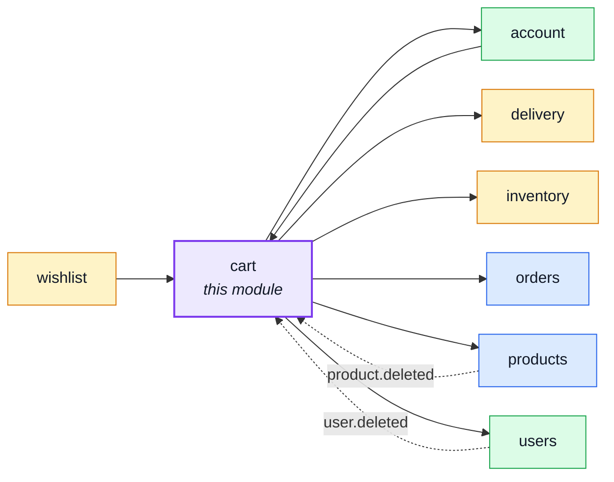
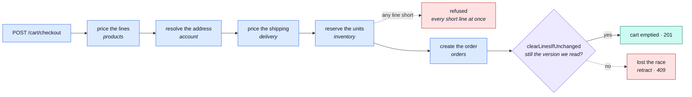

# cart

::: tip At a glance
**Owns** — one cart document per user, priced against the live catalogue, and the checkout that ends it.
**Depends on** — six modules. Checkout is where every rule in the shop has to agree at once.
**Breaks if you change** — `clearLinesIfUnchanged`. It is what stops two parallel checkouts becoming two orders.
:::

## Its neighbourhood

<!-- module-graph:cart:start -->

_Solid arrows are imports. Dotted arrows are domain events — the return path an import
graph cannot see._

<!-- module-graph:cart:end -->

## The story

Checkout is the one place price, stock, address, shipping and order creation must all agree at
the same instant, and that is why this module carries more edges than any other. **The six arrows
are not a smell to be refactored away — they are what a checkout is.** This module is a customer of
four contexts rather than an orchestration layer sitting above them.

A cart is its own collection keyed by `userId`, not a subdocument of the user. Two things follow,
and both are the point: a user response cannot leak a cart it does not carry, and touching a cart
reads and writes one small document instead of the whole account.

::: warning The concurrency rule
`unique: true` on `userId` makes "one cart per user" a database fact rather than something every
write path has to remember — which is what lets every mutation be a single upsert. Checkout then
empties the cart _conditionally on the version it read the lines at_. Remove that condition and two
parallel checkouts turn one cart into two orders.
:::

The second index, `items.productId: 1`, exists for exactly one query: a deleted product has to find
every cart holding it. Without the index that read scans the collection.

Field names match the contract's `CartItem` — `{ productId, quantity }` — so a stored line and a
wire line are the same shape, and there is no mapper between them to keep in sync.

Mongo and not Redis, deliberately: Redis here is cache-only, with no persistence and `allkeys-lru`
eviction. A cart in Redis would make concurrent writes race-free for nothing, paid for in
durability — and would turn one indexed query into a hand-maintained secondary index.

## The pipeline

The six arrows, in the order checkout walks them. [Checkout](./cart-checkout.md) draws the same
flow at step-by-step resolution, including the retract.

## Related pages

- [Checkout](./cart-checkout.md) — the flow, step by step
- [`orders`](./orders.md) — what a checkout produces
- [`inventory`](./inventory.md) — who holds the units while a checkout runs
- [Redis Cache](../tools/redis-cache.md) — why the cart is not in it
- [Strategic DDD](../theory/strategic-ddd.md) — reading a six-edge context map
