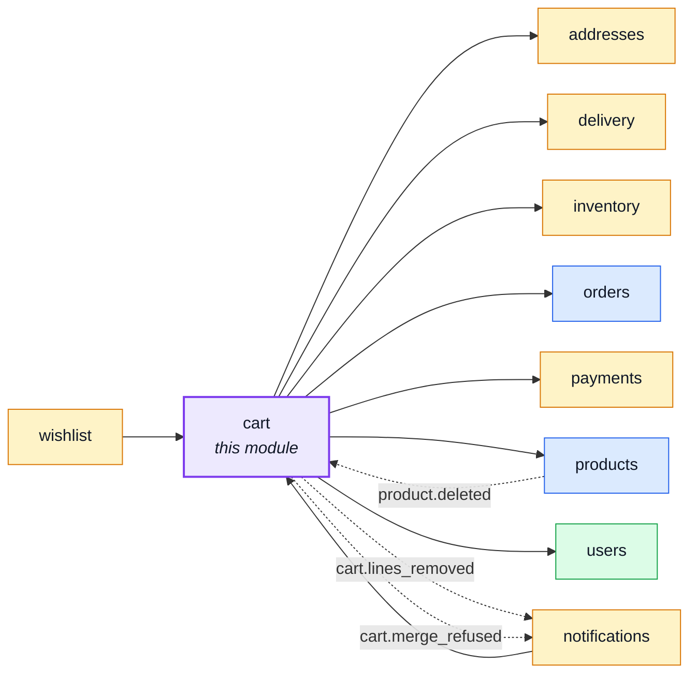
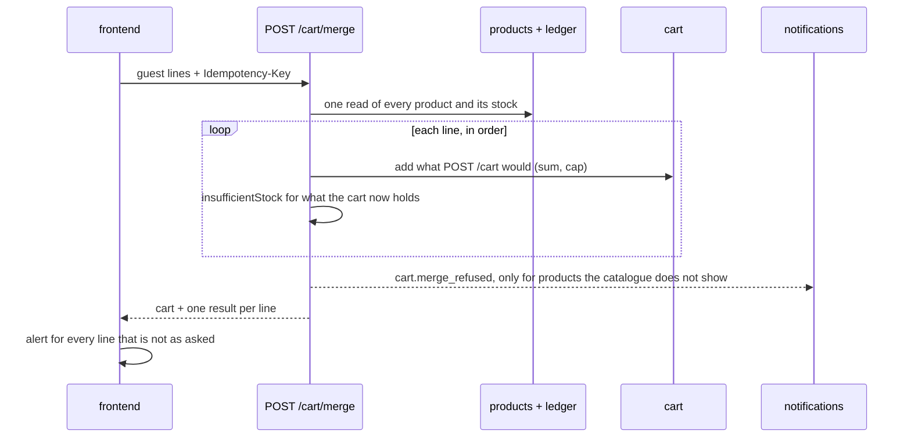
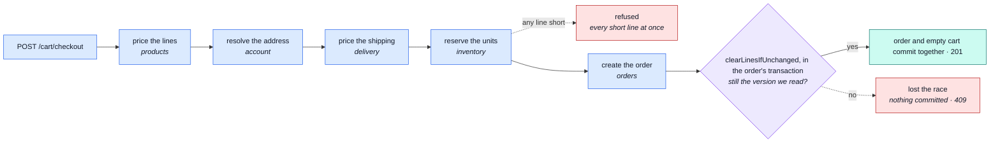

# cart

::: tip At a glance
**Owns** — one cart document per user, priced against the live catalogue, and the checkout that ends it.
**Depends on** — six modules. Checkout is where every rule in the shop has to agree at once.
**Breaks if you change** — `clearLinesIfUnchanged`. It is what stops two parallel checkouts becoming two orders.
:::

## Its neighbourhood

<!-- module-graph:cart:start -->

_Solid arrows are imports. Dotted arrows are domain events — the return path an import
graph cannot see._

```mermaid
%%{init: {'flowchart': {'nodeSpacing': 30, 'rankSpacing': 60}}}%%
flowchart LR
    cart["cart<br/><i>this module</i>"]
    addresses["addresses"]
    delivery["delivery"]
    inventory["inventory"]
    notifications["notifications"]
    orders["orders"]
    payments["payments"]
    products["products"]
    users["users"]
    wishlist["wishlist"]

    notifications --> cart
    wishlist --> cart
    cart --> addresses
    cart --> delivery
    cart --> inventory
    cart --> orders
    cart --> payments
    cart --> products
    cart --> users
    products -. "product.deleted" .-> cart
    cart -. "cart.lines_removed" .-> notifications
    cart -. "cart.merge_refused" .-> notifications

    classDef core fill:#dbeafe,stroke:#2563eb,color:#111827;
    classDef supporting fill:#fef3c7,stroke:#d97706,color:#111827;
    classDef generic fill:#dcfce7,stroke:#16a34a,color:#111827;
    classDef centre fill:#ede9fe,stroke:#7c3aed,stroke-width:2px,color:#111827;
    class orders,products core;
    class addresses,delivery,inventory,notifications,payments,wishlist supporting;
    class users generic;
    class cart centre;
```

<!-- module-graph:cart:end -->

## The story

Checkout is the one place price, stock, address, shipping and order creation must all agree at
the same instant, and that is why this module carries more edges than any other. **The six arrows
are not a smell to be refactored away — they are what a checkout is.** This module is a customer of
four contexts rather than an orchestration layer sitting above them.

A cart is its own collection keyed by `userId`, not a subdocument of the user. Two things follow,
and both are the point: a user response cannot leak a cart it does not carry, and touching a cart
reads and writes one small document instead of the whole account.

::: warning The concurrency rule
`unique: true` on `userId` makes "one cart per user" a database fact rather than something every
write path has to remember — which is what lets every mutation be a single upsert. Checkout then
empties the cart _conditionally on the version it read the lines at_. Remove that condition and two
parallel checkouts turn one cart into two orders.
:::

The second index, `items.productId: 1`, exists for exactly one query: a deleted product has to find
every cart holding it. Without the index that read scans the collection.

Field names match the contract's `CartItem` — `{ productId, quantity }` — so a stored line and a
wire line are the same shape, and there is no mapper between them to keep in sync.

**A line holds at most `NODE_CART_LINE_MAX` units** (default 10, the contract's hard ceiling is 999):
a `PUT` past it, an add that would push a line past it and a reorder all answer 422
`CART_QUANTITY_LIMIT` (a reorder clamps instead), and checkout re-checks every line, so a basket
filled before the ceiling was lowered is refused with the lines named rather than quietly trimmed.
It is one of three caps on denial of inventory, with `NODE_MAX_OPEN_UNPAID_ORDERS_PER_ACCOUNT` and
`NODE_RESERVATION_TTL_MINUTES` — see [checkout](./cart-checkout.md).

Mongo and not Redis, deliberately: Redis here is cache-only, with no persistence and `allkeys-lru`
eviction. A cart in Redis would make concurrent writes race-free for nothing, paid for in
durability — and would turn one indexed query into a hand-maintained secondary index.

## Stock checked in three places

One rule answers "does this line fit what is for sale", in the cart's domain layer
(`domain/stock.ts`), and three callers share it. All three read the **stock ledger**
(`inventoryService.availableFor`, one batched read per request), never the catalogue's cached copy,
so a line cannot read as fitting and then be refused at checkout.

| Where        | When                               | What happens on a short line                                                   |
| ------------ | ---------------------------------- | ------------------------------------------------------------------------------ |
| **Checkout** | `POST /cart/checkout`              | Refused, `CART_INSUFFICIENT_STOCK`, naming the line and the quantity asked for |
| **Merge**    | `POST /cart/merge`                 | The line keeps its quantity and comes back `insufficientStock`                 |
| **View**     | every answer that carries the cart | The line is flagged; a client polling `GET /cart` learns it                    |

A line carries one boolean, `insufficientStock`: true when its quantity is more than is for sale.
A product the catalogue no longer shows (deleted or deactivated) fits nothing, so its line reads
short too, and checkout refuses it as `CART_PRODUCT_UNAVAILABLE`.

**No number is ever disclosed.** The flag says short, not how many are left: exact stock is for
callers holding `inventory.any.read` ([Reading the shelf](../theory/defences/authorization.md)).
That is also why the merge never lowers a short line: lowering it to what is for sale would let
anyone read the stock by merging 999.

`POST /cart` and `PUT` still do not refuse a line for stock, so the gate that refuses is checkout.

## Merging a guest cart

A cart built while signed out lives in the browser. At sign-in the client sends it in one call,
`POST /cart/merge`, and the cart folds it in by `POST /cart`'s own rule: a product held in both
carts ends at the sum, capped at `NODE_CART_LINE_MAX`. The answer is the cart as it now stands plus
**one result per submitted line, in request order**: what the guest asked for (`requested`), what the
cart holds now (`resulting`), a `reason` when the two differ, and `insufficientStock`.

```mermaid
sequenceDiagram
    participant FE as frontend
    participant API as POST /cart/merge
    participant P as products + ledger
    participant C as cart
    participant N as notifications
    FE->>API: guest lines + Idempotency-Key
    API->>P: one read of every product and its stock
    loop each line, in order
        API->>C: add what POST /cart would (sum, cap)
        API->>API: insufficientStock for what the cart now holds
    end
    API-->>N: cart.merge_refused, only for products the catalogue does not show
    API-->>FE: cart + one result per line
    FE->>FE: alert for every line that is not as asked
```

| Line                                           | Result                                                 |
| ---------------------------------------------- | ------------------------------------------------------ |
| a new product                                  | added; no `reason`                                     |
| already in the cart                            | added to the line, `reason: summed`                    |
| the sum passes the ceiling                     | the line stops at the ceiling, `reason: capped`        |
| sold out, or short                             | added anyway, `insufficientStock`                      |
| not shown by the catalogue (deleted or hidden) | nothing added, `reason: unavailable`, one notification |

One bad line is a result, never a failure: the call answers 200 and the rest still land. The
request carries an `Idempotency-Key`, so a lost answer replays instead of adding twice (the server
keeps keys 24 hours). Lines are merged one at a time because each add rewrites the same cart
document; a product listed twice sees its first line's result.

## The pipeline

The six arrows, in the order checkout walks them. [Checkout](./cart-checkout.md) draws the same
flow at step-by-step resolution, including the lost race.

```mermaid
%%{init: {'flowchart': {'nodeSpacing': 30, 'rankSpacing': 50}}}%%
flowchart LR
    A["POST /cart/checkout"] --> B["price the lines<br/><i>products</i>"]
    B --> C["resolve the address<br/><i>account</i>"]
    C --> D["price the shipping<br/><i>delivery</i>"]
    D --> E["reserve the units<br/><i>inventory</i>"]
    E -.->|"any line short"| R["refused<br/><i>every short line at once</i>"]
    E --> F["create the order<br/><i>orders</i>"]
    F --> G{"clearLinesIfUnchanged, in the order's transaction<br/><i>still the version we read?</i>"}
    G -->|yes| H["order and empty cart commit together · 201"]
    G -.->|no| I["lost the race<br/><i>nothing committed · 409</i>"]

    classDef step fill:#dbeafe,stroke:#2563eb,color:#111827;
    classDef guard fill:#ede9fe,stroke:#7c3aed,color:#111827;
    classDef done fill:#ccfbf1,stroke:#0f766e,color:#111827;
    classDef bad fill:#fee2e2,stroke:#b91c1c,color:#111827;
    class A,B,C,D,E,F step;
    class G guard;
    class H done;
    class R,I bad;
```

## Related pages

- [Checkout](./cart-checkout.md) — the flow, step by step
- [`orders`](./orders.md) — what a checkout produces
- [`inventory`](./inventory.md) — who holds the units while a checkout runs
- [Redis Cache](../tools/redis-cache.md) — why the cart is not in it
- [Strategic DDD](../theory/strategic-ddd.md) — reading a six-edge context map
