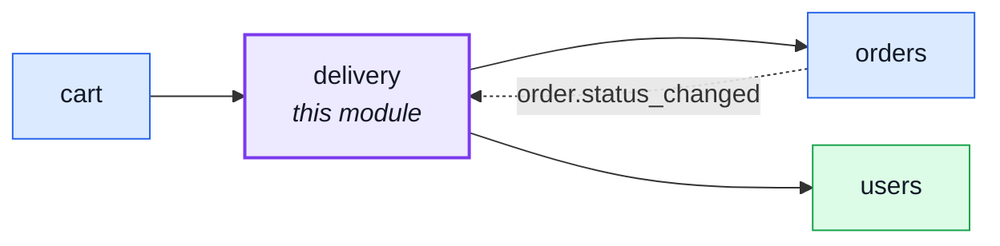
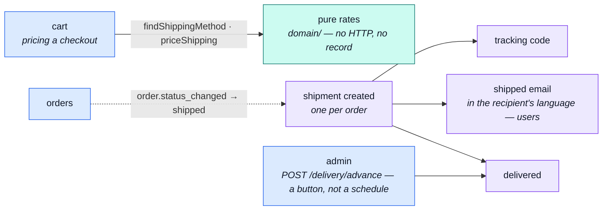

# delivery

::: tip At a glance
**Owns** — shipping rates, shipment records, and the fake courier that moves them along.
**Depends on** — [`orders`](./orders.md) for the order a parcel is about, [`users`](./users.md) for the recipient's language.
**Breaks if you change** — `findShippingMethod` or `priceShipping`. The cart prices a checkout through both.
:::

## Its neighbourhood

<!-- module-graph:delivery:start -->

_Solid arrows are imports. Dotted arrows are domain events — the return path an import
graph cannot see._

<!-- module-graph:delivery:end -->

## The story

A shipment is _about_ an order. The dependency on [`users`](./users.md) is narrower than it looks:
this module reads the account only to address the shipped email in the recipient's language.

**The rates are pure functions in `domain/`, and that is what makes the cart's edge
`published-language`.** [`cart`](./cart.md) prices a shipping method through `findShippingMethod`
and `priceShipping` without ever touching this module's HTTP surface or learning that a shipment
record exists. It receives vocabulary, not state — the strongest kind of edge on the map, and the
reason the arrow is dashed.

::: tip What deleting this module actually costs
The shipping selector, the parcel records and the costs go with it. Orders simply stop carrying a
`shippingCost` — which is the state the shop was in before this module existed. That is a clean
removal, not a broken build.
:::

The courier is fake, like the payment provider, and for the same reason: `shipped → delivered` has
to be reachable in tests and in the demo profile without an integration. `unique: true` on
`orderId` keeps it to one parcel per order.

## The pipeline

Two halves that never touch. The cart only ever reaches the pure rates on the left; the parcel on
the right is this module's own business.

## Related pages

- [`orders`](./orders.md) — what a shipment is about
- [`cart`](./cart.md) — the checkout that prices a method
- [Domain Layer](../theory/domain-layer.md) — why the rates are pure functions
- [Email & PDF Rendering](../tools/email-and-rendering.md) — the shipped notification
- [Strategic DDD](../theory/strategic-ddd.md#_5-published-language-—-the-barrel) — what `published-language` buys
