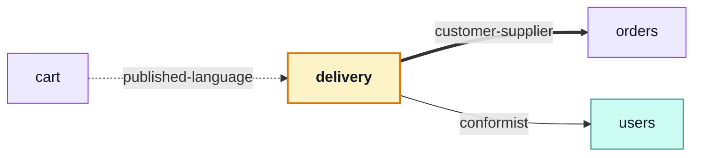

# delivery

::: tip At a glance
**Owns** — shipping rates, shipment records, and the fake courier that moves them along.
**Depends on** — [`orders`](./orders.md) for the order a parcel is about, [`users`](./users.md) for the recipient's language.
**Breaks if you change** — `findShippingMethod` or `priceShipping`. The cart prices a checkout through both.
:::

<!-- gen:identity:start -->

| Fact                     | This module                                                                    |
| ------------------------ | ------------------------------------------------------------------------------ |
| **Subdomain**            | `supporting` — Specific to this business but not a differentiator. Kept plain. |
| **Base path**            | `/delivery`                                                                    |
| **Collection**           | `shipments` (model `Shipment`)                                                 |
| **Depends on**           | [`orders`](./orders.md) · [`users`](./users.md)                                |
| **Depended on by**       | [`cart`](./cart.md)                                                            |
| **Languages**            | `en` · `it`                                                                    |
| **Seeded**               | no                                                                             |
| **Frontend counterpart** | `delivery` in `boilerplate-vue-frontend`                                       |

<!-- gen:identity:end -->

## The map

<!-- gen:map:start -->



- `cart` → **published-language** — Prices a shipping method through `findShippingMethod`/`priceShipping` — pure functions over plain data, no shipment record in sight.
- → `orders` **customer-supplier** — A shipment is about an order: this module reads the order it ships and moves its status.
- → `users` **conformist** — Reads the recipient record to address the shipped email in their own language.

<!-- gen:map:end -->

## The story

A shipment is _about_ an order. The dependency on [`users`](./users.md) is narrower than it looks:
this module reads the account only to address the shipped email in the recipient's language.

**The rates are pure functions in `domain/`, and that is what makes the cart's edge
`published-language`.** [`cart`](./cart.md) prices a shipping method through `findShippingMethod`
and `priceShipping` without ever touching this module's HTTP surface or learning that a shipment
record exists. It receives vocabulary, not state — the strongest kind of edge on the map, and the
reason the arrow is dashed.

::: tip What deleting this module actually costs
The shipping selector, the parcel records and the costs go with it. Orders simply stop carrying a
`shippingCost` — which is the state the shop was in before this module existed. That is a clean
removal, not a broken build.
:::

The courier is fake, like the payment provider, and for the same reason: `shipped → delivered` has
to be reachable in tests and in the demo profile without an integration. `unique: true` on
`orderId` keeps it to one parcel per order.

## Data

<!-- gen:data:start -->

#### `shipments`

From model `Shipment`. `_id` and `__v` are omitted — every document carries them.

| Field          | Type       | Flags            | Default   | Reference / values       |
| -------------- | ---------- | ---------------- | --------- | ------------------------ |
| `orderId`      | `ObjectId` | required, unique | —         | → `Order`                |
| `trackingCode` | `String`   | required         | —         | —                        |
| `status`       | `String`   | —                | "shipped" | `shipped` \| `delivered` |
| `deliveredAt`  | `Date`     | —                | —         | —                        |
| `createdAt`    | `Date`     | —                | —         | —                        |
| `updatedAt`    | `Date`     | —                | —         | —                        |

**Declared indexes**

| Keys         | Options |
| ------------ | ------- |
| `orderId: 1` | unique  |

<!-- gen:data:end -->

## Surface

<!-- gen:surface:start -->

| Endpoint                        | Middlewares                      | Controller           | What it does                     |
| ------------------------------- | -------------------------------- | -------------------- | -------------------------------- |
| `POST /delivery/advance`        | `getAuth` → `isAuth` → `isAdmin` | `postCourierAdvance` | Advance the fake courier         |
| `GET /delivery/methods`         | —                                | `getShippingMethods` | List shipping methods            |
| `GET /delivery/order/{orderId}` | `getAuth` → `isAuth`             | `getShipmentByOrder` | Get the shipment behind an order |

Middlewares run left to right; the controller is the last handler on the route. Summaries come from this module’s own `openapi.yaml`, which is where they are edited.

<!-- gen:surface:end -->

## Signals

<!-- gen:signals:start -->

#### Domain events

| Event                  | Direction                    |
| ---------------------- | ---------------------------- |
| `order.status_changed` | subscribed to in `module.ts` |

#### Audit actions

| Constant                 | Action name              |
| ------------------------ | ------------------------ |
| `ADMIN_COURIER_ADVANCED` | `admin.courier.advanced` |

<!-- gen:signals:end -->

## Files

<!-- gen:files:start -->

| File                                   | What it is                                                                                                                                                   | Explained in                             |
| -------------------------------------- | ------------------------------------------------------------------------------------------------------------------------------------------------------------ | ---------------------------------------- |
| `audit.ts`                             | Which of this module’s operations reach the audit trail, and under what action names.                                                                        | [read](../tools/winston.md)              |
| `controllers/get-shipment-by-order.ts` | One operation: reads inputs, calls the service, answers through the response envelope, and catches.                                                          | [read](../theory/request-flow.md)        |
| `controllers/get-shipping-methods.ts`  | One operation: reads inputs, calls the service, answers through the response envelope, and catches.                                                          | [read](../theory/request-flow.md)        |
| `controllers/post-courier-advance.ts`  | One operation: reads inputs, calls the service, answers through the response envelope, and catches.                                                          | [read](../theory/request-flow.md)        |
| `domain/index.ts`                      | The domain barrel.                                                                                                                                           | [read](../theory/domain-layer.md)        |
| `domain/rates.ts`                      | Pure rules over plain data — no Mongoose, no Express, and lint-guaranteed free of both.                                                                      | [read](../theory/domain-layer.md)        |
| `emails.ts`                            | Which templates this module sends and what they are given.                                                                                                   | [read](../tools/email-and-rendering.md)  |
| `index.ts`                             | The public barrel: the only surface a sibling module may import.                                                                                             | [read](../theory/strategic-ddd.md)       |
| `locales/en.json`                      | This module's user-facing strings, one file per language.                                                                                                    | [read](../tools/i18n.md)                 |
| `locales/it.json`                      | This module's user-facing strings, one file per language.                                                                                                    | [read](../tools/i18n.md)                 |
| `model.ts`                             | The Mongoose schema, its indexes and its serialisation rules — the collection's shape.                                                                       | [read](../tools/mongodb-mongoose.md)     |
| `module.ts`                            | The manifest — the only file the application loads directly. Declares the name, base path, router, dependency edges, locales, seeds and event subscriptions. | [read](../theory/modules.md)             |
| `openapi.yaml`                         | This module's slice of the REST contract. The root `openapi.yaml` is bundled from these.                                                                     | [read](../api/contract-fragmentation.md) |
| `repository.ts`                        | Every query this module makes, on the shared base repository. The only tier that talks to Mongoose.                                                          | [read](../tools/mongodb-mongoose.md)     |
| `routes.ts`                            | The URL surface — one line per endpoint, naming its middlewares, the role it requires and the controller it lands on.                                        | [read](../api/endpoints.md)              |
| `service.ts`                           | The domain decision, and the layer that owns status-code meaning.                                                                                            | [read](../theory/layers.md)              |
| `tests/contract/api.contract.test.ts`  | Contract suite — the responses, against the fragment.                                                                                                        | [read](../tools/contract-testing.md)     |
| `tests/unit/service.test.ts`           | Unit suite — the rules, in isolation.                                                                                                                        | [read](../tools/unit-testing.md)         |

<!-- gen:files:end -->

## Working on it

<!-- gen:working:start -->

| Suite    | Files | Where                                  |
| -------- | ----- | -------------------------------------- |
| Unit     | 1     | `src/modules/delivery/tests/unit/`     |
| Contract | 1     | `src/modules/delivery/tests/contract/` |

```bash
# every suite this module carries
npm run test:module -- src/modules/delivery

# after editing this module’s openapi.yaml
npm run contracts:bundle && npm run lint:openapi:modules
```

<!-- gen:working:end -->

## Deeper in

<!-- gen:subpages:start -->

Nothing in this domain needs a page of its own — the story above is the whole of it.

<!-- gen:subpages:end -->

## Related pages

- [`orders`](./orders.md) — what a shipment is about
- [`cart`](./cart.md) — the checkout that prices a method
- [Domain Layer](../theory/domain-layer.md) — why the rates are pure functions
- [Email & PDF Rendering](../tools/email-and-rendering.md) — the shipped notification
- [Strategic DDD](../theory/strategic-ddd.md#_5-published-language-—-the-barrel-held-to-a-size) — what `published-language` buys
