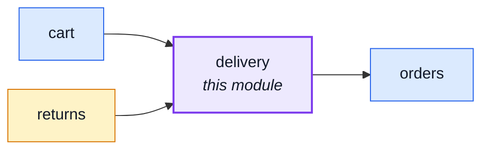
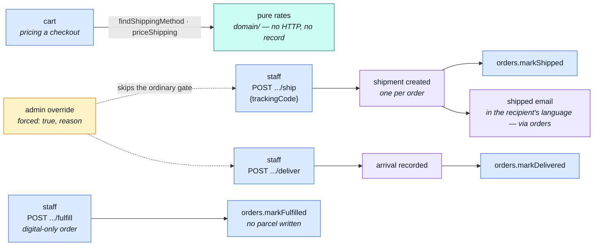

# delivery

::: tip At a glance
**Owns** — shipping rates and shipment records: who handed a parcel over, and who recorded its arrival.
**Depends on** — [`orders`](./orders.md) for the order a parcel is about.
**Breaks if you change** — `findShippingMethod` or `priceShipping`. The cart prices a checkout through both.
:::

## Its neighbourhood

<!-- module-graph:delivery:start -->

_Solid arrows are imports. Dotted arrows are domain events — the return path an import
graph cannot see._

```mermaid
%%{init: {'flowchart': {'nodeSpacing': 30, 'rankSpacing': 60}}}%%
flowchart LR
    delivery["delivery<br/><i>this module</i>"]
    cart["cart"]
    orders["orders"]
    returns["returns"]

    cart --> delivery
    returns --> delivery
    delivery --> orders

    classDef core fill:#dbeafe,stroke:#2563eb,color:#111827;
    classDef supporting fill:#fef3c7,stroke:#d97706,color:#111827;
    classDef generic fill:#dcfce7,stroke:#16a34a,color:#111827;
    classDef centre fill:#ede9fe,stroke:#7c3aed,stroke-width:2px,color:#111827;
    class cart,orders core;
    class returns supporting;
    class delivery centre;
```

<!-- module-graph:delivery:end -->

## The story

A shipment is _about_ an order. The shipped email's language comes through `orders`' `mailBuyer`,
so this module never reads the account itself.

**The rates are pure functions in `domain/`, and that is what makes the cart's edge cheap to
hold.** [`cart`](./cart.md) imports `findShippingMethod` and `priceShipping` directly — a real,
solid import — but never touches this module's HTTP surface or learns that a shipment record
exists: it receives vocabulary, not state, the narrowest an import can be.

::: tip What deleting this module actually costs
The shipping selector, the parcel records and the costs go with it. Orders simply stop carrying a
`shippingCost` — which is the state the shop was in before this module existed. That is a clean
removal, not a broken build.
:::

There is no courier simulation any more — a parcel moves only when staff record it, through this
module's own doors. `unique: true` on `orderId` keeps it to one parcel per order.

Each shipping method (`domain/rates.ts`) says whether it is `tracked` — standard is untracked,
express is tracked, pickup is untracked.
`tracked` is what `POST /delivery/order/{orderId}/ship` enforces: a tracking code is required for a
tracked method, refused with a named 422 otherwise.

A method may also declare `minWeight`/`maxWeight`, grams — express caps at 5000g, standard at
30000g, pickup at neither. Unlike `tracked`, this one IS enforced against the basket:
`GET /delivery/methods?weight=` filters the list (advisory — a stale or omitted value only hides a
method a client would have seen anyway), and `cart`'s checkout refuses a chosen method whose range
the real basket doesn't fit (`CART_SHIPPING_METHOD_WEIGHT`, 409) — the server-side check, against
the lines actually joined, is what actually decides. A product with no `weight` set counts as 0g,
never as a refusal on its own account.

`requiresAddress` says whether the method needs somewhere to ship to — standard and express do,
pickup does not. `cart`'s checkout is what enforces it — see [Checkout](./cart-checkout.md).

## The pipeline

Two halves that never touch. The cart only ever reaches the pure rates on the left; the parcel on
the right is this module's own business — and this module is the one that TELLS `orders` to move
the status, never the other way around (see [Tactical DDD](../theory/tactical-ddd.md#who-writes-the-status)).

```mermaid
%%{init: {'flowchart': {'nodeSpacing': 30, 'rankSpacing': 55}}}%%
flowchart LR
    CA["cart<br/><i>pricing a checkout</i>"] -->|"findShippingMethod · priceShipping"| RA["pure rates<br/><i>domain/ — no HTTP, no record</i>"]
    S1["staff<br/>POST .../ship<br/>{trackingCode}"] --> SH["shipment created<br/><i>one per order</i>"]
    SH --> MS["orders.markShipped"]
    SH --> EM["shipped email<br/><i>in the recipient's language — via orders</i>"]
    S2["staff<br/>POST .../deliver"] --> DV["arrival recorded"]
    DV --> MD["orders.markDelivered"]
    S3["staff<br/>POST .../fulfill<br/><i>digital-only order</i>"] --> MF["orders.markFulfilled<br/><i>no parcel written</i>"]
    OV["admin override<br/><i>forced: true, reason</i>"] -.->|"skips the ordinary gate"| S1
    OV -.-> S2

    classDef pure fill:#ccfbf1,stroke:#0f766e,color:#111827;
    classDef own fill:#ede9fe,stroke:#7c3aed,color:#111827;
    classDef peer fill:#dbeafe,stroke:#2563eb,color:#111827;
    classDef override fill:#fef3c7,stroke:#d97706,color:#111827;
    class RA pure;
    class SH,EM,DV own;
    class CA,S1,S2,S3,MS,MD,MF peer;
    class OV override;
```

Both doors take an optional `forced`/`reason` pair from a caller holding `orders.any.override`: the
regular operation still runs — the parcel record, the tracking code if the method requires one, the
email — but the status write skips the ordinary gate ("processing only", "shipped only") the way an
uncorrected shipment cannot. See [orders](./orders.md#the-admin-override) for the two override
modes in full; this module only ever runs the "forced" one, since it always creates a real parcel.

`POST /delivery/order/{orderId}/fulfill` is a third door beside `ship`/`deliver`, not a variant of
either — a digital-only order (every line `requiresShipping: false`) has nothing to hand a carrier,
so staff move it `processing → delivered` directly, with no parcel record at all. Refused for any
order with even one physical line (`ORDER_NOT_DIGITAL_ONLY`); `ship` itself refuses a digital-only
order the other way (`ORDER_NOTHING_TO_SHIP`), so the two doors never overlap on what they accept.
No `forced` variant: there is no ordinary gate here for an override to skip past.

## The return address

The return address is [`orders`'s](./orders.md#shop-identity), not this module's: the placed-order
email must name where goods go, and `orders` cannot import `delivery`. `returnAddress()` is the
configured `NODE_RETURN_ADDRESS_*`, or the shop's legal address when none is fully set, so it is
never absent. `GET /delivery/methods` serves it as `returnAddress`, and [`returns`](./returns.md)
names it in the approval notice.

The same module answers "what would standard delivery have cost?" (`cheapestStandardShipping`,
`domain/rates.ts`): a withdrawal refunds delivery only up to that, and `pickup` — collection, not
delivery — never counts, which `requiresAddress: false` already says.

## Related pages

- [`orders`](./orders.md) — what a shipment is about
- [`cart`](./cart.md) — the checkout that prices a method
- [Domain Layer](../theory/domain-layer.md) — why the rates are pure functions
- [Email & PDF Rendering](../tools/email-and-rendering.md) — the shipped notification
- [Strategic DDD](../theory/strategic-ddd.md#_5-published-language-—-the-barrel) — what `published-language` buys
