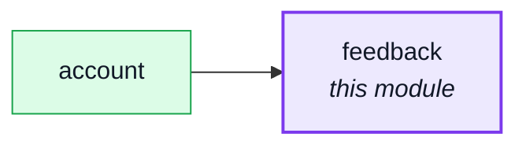
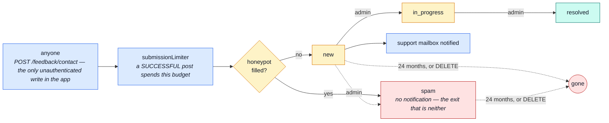

# feedback

::: tip At a glance
**Owns** — contact requests: anyone may file one, admins read and triage them.
**Depends on** — nothing, and nothing depends on it. A leaf in both directions.
**Breaks if you change** — the `status` enum, which is the whole triage workflow.
:::

## Its neighbourhood

<!-- module-graph:feedback:start -->

_Solid arrows are imports. Dotted arrows are domain events — the return path an import
graph cannot see._

<!-- module-graph:feedback:end -->

## The story

**It records an email address rather than referencing a user**, because the form is open to people
who have no account. That one decision explains everything else about this module: it needs nothing
from [`users`](./users.md), deleting an account leaves that person's feedback standing, and the
public write route is the only unauthenticated write in the application.

The status enum _is_ the triage workflow: `new → in_progress → resolved`, with `spam` as the exit
that is neither. `adminNotes` and `respondedAt` are the operator's side of the record, never served
to the person who filed it.

::: tip A leaf in both directions
Zero dependencies and zero dependents. Together with [`wishlist`](./wishlist.md) it is the pair to
read when you want to see what the module system looks like with none of the interesting coupling
in the way.
:::

The `status: 1, createdAt: -1` index is the admin queue, which is the only list anyone ever asks
for.

**The honeypot.** `website` is a field a real browser always submits empty and a bot reliably
fills — declared in the contract (so an undeclared field wouldn't 422 real browsers too) but never
persisted or returned. A non-empty value writes the row straight to `status: spam` and skips the
operator notification; the caller still gets the same `201` a real submission gets, so a bot learns
nothing from the response. That trades an email amplifier for a storage amplifier, which
`submissionLimiter` bounds and the TTL index below expires.

**Retention.** A `createdAt` TTL index (`NODE_FEEDBACK_RETENTION_DAYS`, default 730 — 24 months)
deletes tickets on its own; changing the window on a live database needs a `collMod` migration, the
same caveat [`audit-logs`](./audit-logs.md) carries for the identical reason. Erasing a specific
person's data goes through the existing admin search (`GET /feedback?email=` or
`POST /feedback/search`) plus `DELETE /feedback/{id}` — a GDPR request names an address, not an id,
so the operator finds the rows first and deletes them; a dedicated erase-by-email endpoint would be
a convenience wrapper over that loop. `email` stays unindexed on purpose (see the schema comment):
the only query touching it is case-insensitive and unanchored, so no B-tree index could serve it
either way.

## The pipeline

The status enum _is_ the triage workflow, so drawing one draws the other.

## Related pages

- [Modules overview](./index.md) — the whole context map
- [Email & PDF Rendering](../tools/email-and-rendering.md) — the acknowledgement and the triage notification
- [Security](../tools/security.md) — the three rate-limit budgets, including this module's own
- [Winston & Audit Logs](../tools/winston.md) — what a triage action records
- [Ops & Assets](../reference/ops.md) — the retention window and why changing it needs a migration
