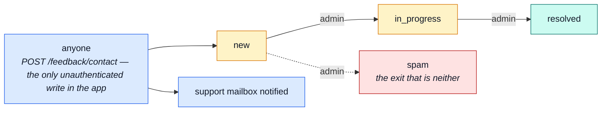

# feedback

::: tip At a glance
**Owns** — contact requests: anyone may file one, admins read and triage them.
**Depends on** — nothing, and nothing depends on it. A leaf in both directions.
**Breaks if you change** — the `status` enum, which is the whole triage workflow.
:::

## Its neighbourhood

<!-- module-graph:feedback:start -->

_Nothing reaches `feedback` and it reaches nothing — no imports either way, no events either way. Deleting it takes one folder and this page, and no other page changes._

<!-- module-graph:feedback:end -->

## The story

**It records an email address rather than referencing a user**, because the form is open to people
who have no account. That one decision explains everything else about this module: it needs nothing
from [`users`](./users.md), deleting an account leaves that person's feedback standing, and the
public write route is the only unauthenticated write in the application.

The status enum _is_ the triage workflow: `new → in_progress → resolved`, with `spam` as the exit
that is neither. `adminNotes` and `respondedAt` are the operator's side of the record, never served
to the person who filed it.

::: tip A leaf in both directions
Zero dependencies and zero dependents. Together with [`wishlist`](./wishlist.md) it is the pair to
read when you want to see what the module system looks like with none of the interesting coupling
in the way.
:::

The `status: 1, createdAt: -1` index is the admin queue, which is the only list anyone ever asks
for.

## The pipeline

The status enum _is_ the triage workflow, so drawing one draws the other.

## Related pages

- [Modules overview](./index.md) — the whole context map
- [Email & PDF Rendering](../tools/email-and-rendering.md) — the acknowledgement and the triage notification
- [Security](../tools/security.md) — rate limiting on the one public write
- [Winston & Audit Logs](../tools/winston.md) — what a triage action records
