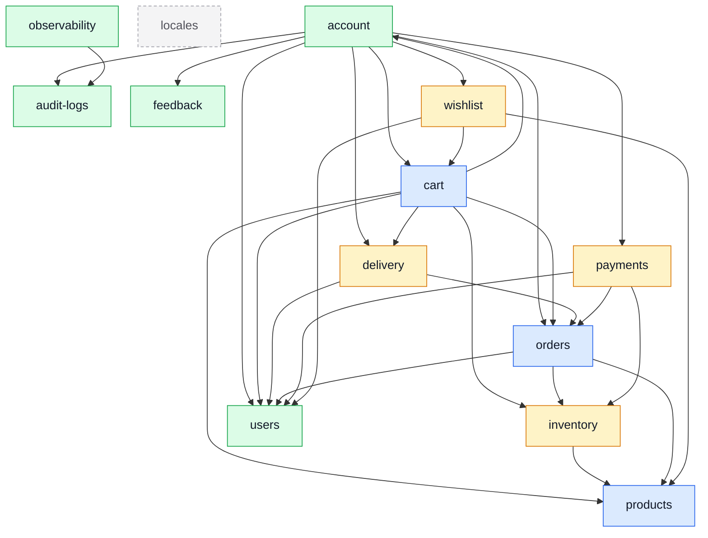

# Modules

One page per domain, top to bottom. This is the **vertical** cut through the codebase; the rest of
this site is the horizontal one.

::: tip Which section answers which question
| You want | Read |
| --- | --- |
| What this domain does for the _business_, without the code | [Demo Shop](../demo-ecommerce/) |
| What a module _is_, and the rules every one obeys | [Theory](../theory/) |
| What **this** domain does, end to end | a page in this section |
| How a mechanism works, in general | [Tools](../tools/) |
| The contract-first workflow | [API](../api/) |
| "I landed on a filename" | [Files](../reference/) |
:::

The division is one rule: **a horizontal page owns a mechanism, a module page owns a decision.**
[Winston & Audit Logs](../tools/winston.md) explains what an audit action is; the
[`cart`](./cart.md) page lists which two cart writes and links back. Neither says the other's half.

The test that keeps it honest is the one this architecture is already built on — delete
`src/modules/cart/` and exactly one page in this site dies with it. Every other page loses a link
and nothing else.

## The map

Every arrow is a real `import` across a module boundary, through the target's `index.ts`. Read it
top to bottom: the leaves at the bottom are depended on by everyone and depend on nobody, which is
what makes them safe to change last and dangerous to change carelessly.

::: tip Generated, not drawn
The diagram and table below are produced by `npm run docs:graph`, which reads the graph
`dependency-cruiser` already builds for `check:dependencies` — so they cannot drift from the
imports they describe. `check:docs-graph` fails `npm run complete` when they have. Everything
outside the markers, including the warning below, is written by hand.
:::

<!-- module-graph:start -->

|                 | Reaches                                                                 | Reached by                                          |
| --------------- | ----------------------------------------------------------------------- | --------------------------------------------------- |
| `account`       | audit-logs, cart, delivery, feedback, orders, payments, users, wishlist | cart                                                |
| `cart`          | account, delivery, inventory, orders, products, users                   | account, wishlist                                   |
| `orders`        | inventory, products, users                                              | account, cart, delivery, payments                   |
| `users`         | —                                                                       | account, cart, delivery, orders, payments, wishlist |
| `delivery`      | orders, users                                                           | account, cart                                       |
| `inventory`     | products                                                                | cart, orders, payments                              |
| `payments`      | inventory, orders, users                                                | account                                             |
| `products`      | —                                                                       | cart, inventory, orders, wishlist                   |
| `wishlist`      | cart, products, users                                                   | account                                             |
| `audit-logs`    | —                                                                       | account, observability                              |
| `feedback`      | —                                                                       | account                                             |
| `observability` | audit-logs                                                              | —                                                   |
| `locales`       | —                                                                       | —                                                   |

<!-- module-graph:end -->

`feedback` and `locales` are drawn detached because they are: nothing reaches them and they reach
nothing. Deleting either takes exactly one folder and one page with it.

Mutual awareness without a cycle is the shape worth noticing. `products` is reached by four modules
and reaches none — a deleted product still has to leave every cart and wishlist, and that half
travels back as a **domain event** (`product.deleted`) rather than as an import. Same for
`user.deleted`, and for `reservation.expired` from `inventory` to `orders`. The arrows above stay
one-way because the return path is the event bus; see [Events & Logging](../tools/events-and-logging.md).

::: warning Not every coupling is an arrow
This graph is derived from `import` statements, so it shows only the coupling the compiler can see.
Three kinds in this repo are real and invisible here, and each is written down in the docblock at
the top of the relevant `module.ts` because nothing mechanical can find them:

- **A shared document.** `inventory` owns the only writes to `onHand` and `reserved`, which are
  columns on the **product** document — and the migration that put them there,
  `20260817120000-inventory-counters.js`, belongs to `inventory` and alters `products`' collection.
  `account` and `users` likewise read and write one User record between them.
- **A name, not a symbol.** `observability` reads every domain's counters by string off the shared
  metrics registry, deliberately, so it can report on domains it may not import. Rename a counter
  and this compiles, lints and passes — and the dashboard goes flat.
- **Schema in the database.** `audit-logs` enforces its retention window with a TTL index, not with
  code. Six migrations touch the `users` collection.

This is the reason those couplings are recorded as **prose next to the imports** rather than as a
typed field. A manifest field reconciled against the import graph — which is what this repo used to
have — could not express any of the three: an edge no import backed was rejected as stale. See
`OVERENGINEERED.md` §5.
:::

## Every module

Grouped by subdomain, which is the first thing worth knowing about a domain: whether it is the
reason the product exists, something specific to this business that is not a differentiator, or a
solved problem where modelling effort would be waste.
[Strategic DDD](../theory/strategic-ddd.md) is where those three words are defined.

**core** — the reason the product exists.

- [`cart`](./cart.md) — `/cart`. One document per user, and checkout, the transaction the whole
  shop turns on. Deeper: [Checkout](./cart-checkout.md).
- [`orders`](./orders.md) — `/orders`. What a checkout produces, its status machine, and its
  invoice.
- [`products`](./products.md) — `/products`. The catalogue, its search surface and its cache.

**supporting** — specific to this business, but not a differentiator.

- [`delivery`](./delivery.md) — `/delivery`. Shipping rates as pure rules, and a fake courier
  driven by hand.
- [`inventory`](./inventory.md) — `/inventory`. The only writer of stock in the application.
  Deeper: [Reservations](./inventory-reservations.md).
- [`payments`](./payments.md) — `/payments`. An order's money, behind a provider port. Deeper:
  [The provider port](./payments-provider-port.md).
- [`wishlist`](./wishlist.md) — `/wishlist`. The smallest domain here, and the one to read first.

**generic** — a solved problem, kept plain.

- [`account`](./account.md) — `/account`. Who is making this request, plus the address book.
  Deeper: [Sessions](./account-sessions.md).
- [`audit-logs`](./audit-logs.md) — headless. Owns the trail and no URL of its own.
- [`feedback`](./feedback.md) — `/feedback`. Contact submissions and what an admin does with them.
- [`locales`](./locales.md) — `/locales`. Language discovery and the API's own message dictionary.
- [`observability`](./observability.md) — `/observability`. Health, metrics, the audit read and the
  SSE stream.
- [`users`](./users.md) — `/users`. Admin-side user management; the self-service half is
  `account`.

Every route in the application, in one table, is [Endpoints](../api/endpoints.md). What each file
inside a module folder is, is [Modules (files)](../reference/src-modules.md).

## The two repositories

Eleven of thirteen domains exist on both sides under the same name. **The interesting two do not**,
and neither does the frontend's third extra module — an asymmetry that is real architecture rather
than drift, and that is written down nowhere else in either repository.

| This repository | `boilerplate-vue-frontend` | Note                                                                                                                                                            |
| --------------- | -------------------------- | --------------------------------------------------------------------------------------------------------------------------------------------------------------- |
| `audit-logs`    | `admin`                    | This module owns the trail and no URL; the endpoint that reads it belongs to `observability`, and the screen that renders it is the frontend's admin dashboard. |
| `observability` | `admin` + `realtime`       | Its two surfaces are consumed by two different frontend modules: the health and metrics reads by `admin`, the SSE stream by `realtime`.                         |
| everything else | the same name              | —                                                                                                                                                               |

And one frontend module answers to nothing here: `demo`, a client-side showcase of the shared UI
kit, which pairs with the demo profile and the seeded dataset rather than with any single domain.

`tests/cross-cutting/frontend-pairing.test.ts` holds this map to the code: a module added here with
no entry fails, an entry naming a module that no longer exists fails, and a counterpart that is not
simply the same name has to carry its reason. The gap cannot widen quietly.
