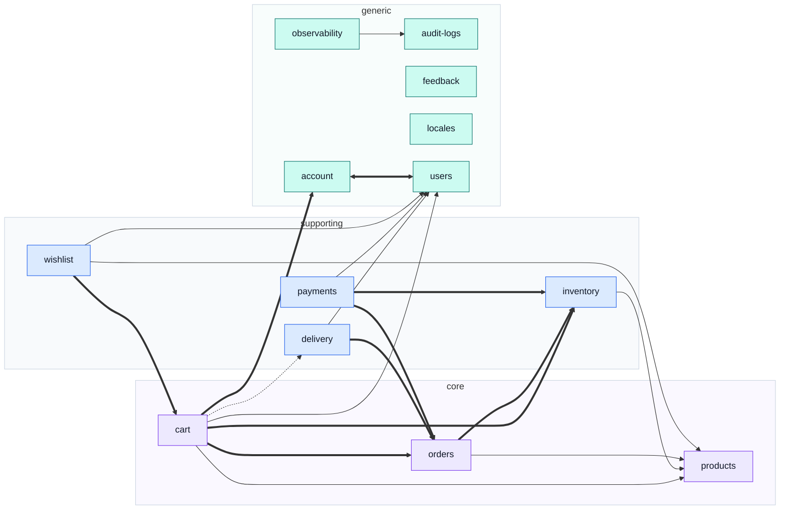

# Modules

One page per domain, top to bottom. This is the **vertical** cut through the codebase; the rest of
this site is the horizontal one.

::: tip Which section answers which question
| You want | Read |
| --- | --- |
| What a module _is_, and the rules every one obeys | [Theory](../theory/) |
| What **this** domain does, end to end | a page in this section |
| How a mechanism works, in general | [Tools](../tools/) |
| The contract-first workflow | [API](../api/) |
| "I landed on a filename" | [Files](../reference/) |
:::

The division is one rule: **a horizontal page owns a mechanism, a module page owns a decision.**
[Winston & Audit Logs](../tools/winston.md) explains what an audit action is; the
[`cart`](./cart.md) page lists which two cart writes and links back. Neither says the other's half.

The test that keeps it honest is the one this architecture is already built on — delete
`src/modules/cart/` and exactly one page in this site dies with it. Every other page loses a link
and nothing else.

## The whole map

<!-- gen:overview-map:start -->

<!-- gen:overview-map:end -->

## Reading the diagrams

Every diagram in this section encodes two things and only two, so a map is readable without a key
beside it.

<!-- gen:legend:start -->

**Node fill — where the domain sits in the business.**

| Fill      | Subdomain    | What it means                                                                                                                              |
| --------- | ------------ | ------------------------------------------------------------------------------------------------------------------------------------------ |
| 🟪 violet | `core`       | The reason the product exists. Worth entities, value objects and invariants.                                                               |
| 🟦 blue   | `supporting` | Specific to this business but not a differentiator. Kept plain.                                                                            |
| 🟩 teal   | `generic`    | A solved problem. Modelling effort here is waste — a `domain/` folder inside one fails `tests/cross-cutting/subdomain-discipline.test.ts`. |

**Arrow style — what kind of relationship the edge is.**

| Arrow         | Relationship         | What crosses the edge                                                          |
| ------------- | -------------------- | ------------------------------------------------------------------------------ |
| `-->` thin    | `conformist`         | Reads the upstream’s records as they are. No translation, no say in the shape. |
| `==>` thick   | `customer-supplier`  | Asks the upstream to _do_ something; its published surface answers the demand. |
| `-.->` dashed | `published-language` | Receives vocabulary, not records — pure functions over plain data.             |
| `<==>` double | `shared-kernel`      | Both read and write the same model. The expensive one, kept near zero.         |

Every diagram under `/modules/` uses this and only this. Since the diagrams are generated, obedience is free.

<!-- gen:legend:end -->

## Every module

The shape of the system in one row, then one row per domain. Both are generated from the manifests,
so a module that gains a route or a collection gains it here on the next `npm run docs:modules`.

<!-- gen:tally:start -->

| Modules | core | supporting | generic | Collections | Routes | Context edges |
| ------- | ---- | ---------- | ------- | ----------- | ------ | ------------- |
| 13      | 3    | 4          | 6       | 14          | 95     | 19            |

<!-- gen:tally:end -->

<!-- gen:matrix:start -->

| Module                                | Subdomain    | Base path        | Collection                        | Routes | Depends on | Depended on by |
| ------------------------------------- | ------------ | ---------------- | --------------------------------- | ------ | ---------- | -------------- |
| [`account`](./account.md)             | `generic`    | `/account`       | `addressbooks`                    | 21     | 1          | 1              |
| [`audit-logs`](./audit-logs.md)       | `generic`    | _headless_       | `auditlogs`                       | 0      | 0          | 1              |
| [`cart`](./cart.md)                   | `core`       | `/cart`          | `carts`                           | 8      | 6          | 1              |
| [`delivery`](./delivery.md)           | `supporting` | `/delivery`      | `shipments`                       | 3      | 2          | 1              |
| [`feedback`](./feedback.md)           | `generic`    | `/feedback`      | `feedbackrequests`                | 3      | 0          | 0              |
| [`inventory`](./inventory.md)         | `supporting` | `/inventory`     | `reservations` · `stockmovements` | 5      | 1          | 3              |
| [`locales`](./locales.md)             | `generic`    | `/locales`       | `localemessages` · `locales`      | 12     | 0          | 0              |
| [`observability`](./observability.md) | `generic`    | `/observability` | —                                 | 5      | 1          | 0              |
| [`orders`](./orders.md)               | `core`       | `/orders`        | `orders`                          | 11     | 2          | 3              |
| [`payments`](./payments.md)           | `supporting` | `/payments`      | `payments`                        | 4      | 3          | 0              |
| [`products`](./products.md)           | `core`       | `/products`      | `products`                        | 10     | 0          | 4              |
| [`users`](./users.md)                 | `generic`    | `/users`         | `users`                           | 9      | 0          | 5              |
| [`wishlist`](./wishlist.md)           | `supporting` | `/wishlist`      | `wishlists`                       | 4      | 3          | 0              |

<!-- gen:matrix:end -->

## The two repositories

Eleven of thirteen domains exist on both sides under the same name. **The interesting two do not**,
and neither does the frontend's third extra module — an asymmetry that is real architecture rather
than drift, and that until this table was written down nowhere in either repository.

`npm run check:module-docs` fails when an enabled module has no entry here, or when an entry pairs
with something other than its own name and gives no reason. The gap cannot widen quietly.

<!-- gen:pairing:start -->

| This repository                       | boilerplate-vue-frontend | Note                                                                                                                                                            |
| ------------------------------------- | ------------------------ | --------------------------------------------------------------------------------------------------------------------------------------------------------------- |
| [`account`](./account.md)             | `account`                | —                                                                                                                                                               |
| [`audit-logs`](./audit-logs.md)       | `admin`                  | This module owns the trail and no URL; the endpoint that reads it belongs to `observability`, and the screen that renders it is the frontend’s admin dashboard. |
| [`cart`](./cart.md)                   | `cart`                   | —                                                                                                                                                               |
| [`delivery`](./delivery.md)           | `delivery`               | —                                                                                                                                                               |
| [`feedback`](./feedback.md)           | `feedback`               | —                                                                                                                                                               |
| [`inventory`](./inventory.md)         | `inventory`              | —                                                                                                                                                               |
| [`locales`](./locales.md)             | `locales`                | —                                                                                                                                                               |
| [`observability`](./observability.md) | `admin` + `realtime`     | Its two surfaces are consumed by two different frontend modules: the health and metrics reads by `admin`, the SSE stream by `realtime`.                         |
| [`orders`](./orders.md)               | `orders`                 | —                                                                                                                                                               |
| [`payments`](./payments.md)           | `payments`               | —                                                                                                                                                               |
| [`products`](./products.md)           | `products`               | —                                                                                                                                                               |
| [`users`](./users.md)                 | `users`                  | —                                                                                                                                                               |
| [`wishlist`](./wishlist.md)           | `wishlist`               | —                                                                                                                                                               |

**Frontend modules with no counterpart here**

| Frontend module | Why it stands alone                                                                                                                    |
| --------------- | -------------------------------------------------------------------------------------------------------------------------------------- |
| `demo`          | A client-side showcase of the shared UI kit. It pairs with the demo profile and the seeded dataset rather than with any single domain. |

<!-- gen:pairing:end -->
