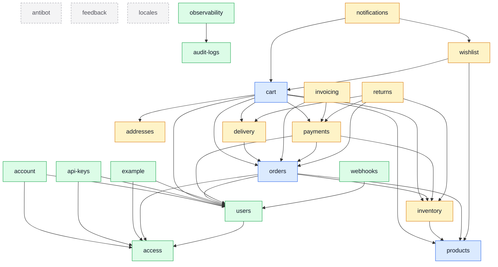

# Modules

One page per domain, top to bottom. This is the **vertical** cut through the codebase; the rest of
this site is the horizontal one.

::: tip Which section answers which question
| You want | Read |
| --- | --- |
| What this domain does for the _business_, without the code | [Demo Shop](../demo-ecommerce/) |
| What a module _is_, and the rules every one obeys | [Theory](../theory/) |
| What **this** domain does, end to end | a page in this section |
| How a mechanism works, in general | [Tools](../tools/) |
| The contract-first workflow | [API](../api/) |
| "I landed on a filename" | [Files](../reference/) |
:::

The division is one rule: **a horizontal page owns a mechanism, a module page owns a decision.**
[Winston & Audit Logs](../tools/winston.md) explains what an audit action is; the
[`cart`](./cart.md) page lists which two cart writes and links back. Neither says the other's half.

The test that keeps it honest is the one this architecture is already built on — delete
`src/modules/cart/` and exactly one page in this site dies with it. Every other page loses a link
and nothing else.

## The map

Every arrow is a real `import` across a module boundary, through the target's `index.ts`. Read it
top to bottom: the leaves at the bottom are depended on by everyone and depend on nobody, which is
what makes them safe to change last and dangerous to change carelessly.

::: tip Generated, not drawn
The diagram and table below are produced by `npm run docs:graph`, which reads the graph
`dependency-cruiser` already builds for `check:dependencies` — so they cannot drift from the
imports they describe. `check:docs-graph` fails `npm run complete` when they have. Everything
outside the markers, including the warning below, is written by hand.
:::

<!-- module-graph:start -->

```mermaid
%%{init: {'flowchart': {'nodeSpacing': 26, 'rankSpacing': 52}}}%%
flowchart TD
    access
    account
    addresses
    antibot
    api_keys["api-keys"]
    audit_logs["audit-logs"]
    cart
    delivery
    example
    feedback
    inventory
    invoicing
    locales
    notifications
    observability
    orders
    payments
    products
    returns
    users
    webhooks
    wishlist

    account --> access
    account --> users
    api_keys --> access
    api_keys --> users
    cart --> addresses
    cart --> delivery
    cart --> inventory
    cart --> orders
    cart --> payments
    cart --> products
    cart --> users
    delivery --> orders
    example --> access
    example --> users
    inventory --> products
    invoicing --> orders
    invoicing --> payments
    notifications --> cart
    notifications --> wishlist
    observability --> audit_logs
    orders --> access
    orders --> inventory
    orders --> products
    orders --> users
    payments --> inventory
    payments --> orders
    payments --> users
    returns --> delivery
    returns --> inventory
    returns --> orders
    returns --> payments
    users --> access
    webhooks --> users
    wishlist --> cart
    wishlist --> products

    classDef core fill:#dbeafe,stroke:#2563eb,color:#111827;
    classDef supporting fill:#fef3c7,stroke:#d97706,color:#111827;
    classDef generic fill:#dcfce7,stroke:#16a34a,color:#111827;
    classDef isolated fill:#f4f4f5,stroke:#a1a1aa,color:#52525b,stroke-dasharray:4 3;
    class cart,orders,products core;
    class addresses,delivery,inventory,invoicing,notifications,payments,returns,wishlist supporting;
    class access,account,api_keys,audit_logs,example,observability,users,webhooks generic;
    class antibot,feedback,locales isolated;
```

|                 | Reaches                                                           | Reached by                                                   |
| --------------- | ----------------------------------------------------------------- | ------------------------------------------------------------ |
| `cart`          | addresses, delivery, inventory, orders, payments, products, users | notifications, wishlist                                      |
| `orders`        | access, inventory, products, users                                | cart, delivery, invoicing, payments, returns                 |
| `users`         | access                                                            | account, api-keys, cart, example, orders, payments, webhooks |
| `payments`      | inventory, orders, users                                          | cart, invoicing, returns                                     |
| `access`        | —                                                                 | account, api-keys, example, orders, users                    |
| `inventory`     | products                                                          | cart, orders, payments, returns                              |
| `products`      | —                                                                 | cart, inventory, orders, wishlist                            |
| `returns`       | delivery, inventory, orders, payments                             | —                                                            |
| `delivery`      | orders                                                            | cart, returns                                                |
| `wishlist`      | cart, products                                                    | notifications                                                |
| `account`       | access, users                                                     | —                                                            |
| `api-keys`      | access, users                                                     | —                                                            |
| `example`       | access, users                                                     | —                                                            |
| `invoicing`     | orders, payments                                                  | —                                                            |
| `notifications` | cart, wishlist                                                    | —                                                            |
| `addresses`     | —                                                                 | cart                                                         |
| `audit-logs`    | —                                                                 | observability                                                |
| `observability` | audit-logs                                                        | —                                                            |
| `webhooks`      | users                                                             | —                                                            |
| `antibot`       | —                                                                 | —                                                            |
| `feedback`      | —                                                                 | —                                                            |
| `locales`       | —                                                                 | —                                                            |

<!-- module-graph:end -->

`feedback` and `locales` are drawn detached because they are: nothing reaches them and they reach
nothing. Deleting either takes exactly one folder and one page with it.

Mutual awareness without a cycle is the shape worth noticing. `products` is reached by four modules
and reaches none — a deleted product still has to leave every cart and wishlist, and that half
travels back as a **domain event** (`product.deleted`) rather than as an import. Same for
`inventory.reservation_expired` from `inventory` to `orders`. A user's hard delete travels the other
way, as a `personalData.erase` hook each module declares and `users` runs in one transaction. The arrows above stay
one-way because the return path is the event bus; see [Events & Logging](../tools/events-and-logging.md).

::: warning Not every coupling is an arrow
This graph is derived from `import` statements, so it shows only the coupling the compiler can see.
Three kinds in this repo are real and invisible here, and each is written down in the docblock at
the top of the relevant `module.ts` because nothing mechanical can find them:

- **A shared fact, mirrored.** `inventory` owns `onHand` and `reserved` in its own `stocklevels`
  collection, the only place they are written; `products` keeps a read-only mirror of both on its
  own document so a catalogue read needs no join. `account` and `users` share the actual User
  record between them instead — a genuine single document, not a mirrored pair.
- **A name, not a symbol.** `observability` reads every domain's counters by string off the shared
  metrics registry, deliberately, so it can report on domains it may not import. Rename a counter
  and this compiles, lints and passes — and the dashboard goes flat.
- **Schema in the database.** `audit-logs` enforces its retention window with a TTL index, not with
  code. Its window is an env var, so changing it is a `db:sync` away — never a restart.

This is the reason those couplings are recorded as **prose next to the imports** rather than as a
typed field. A manifest field reconciled against the import graph — which is what this repo used to
have — could not express any of the three: an edge no import backed was rejected as stale.
:::

## Every module

Grouped by `group` (declared in each module's own `module.yaml`): the **foundation** every
deployment keeps, then the **demo shop** that `npm run demo:remove` deletes. Which of the two a
module is, is an enforced fact rather than a label —
[Foundation and shop](../theory/strategic-ddd.md#4a-foundation-and-shop). The subdomain each one
belongs to (core, supporting, generic) is the colouring of the map above, and is defined in
[Strategic DDD](../theory/strategic-ddd.md).

::: tip Generated, not listed
The list below is produced by `npm run docs:graph` from each module's `module.yaml`
(`group`, `summary`) and the pages beside this one, the same way the sidebar is. A new module
appears here by declaring them.
:::

<!-- module-list:start -->

### Foundation

Ships with every deployment, whatever the project becomes.

- [`access`](./access.md) — Headless. The tenant and membership model every role check reads, owned apart from account and users so neither has to.
- [`account`](./account.md) — Who is making this request: signup, login, sessions, two-factor, OAuth and the account lifecycle. Deeper: [OAuth](./account-oauth.md), [Sessions](./account-sessions.md), [Two-factor authentication](./account-two-factor.md).
- [`addresses`](./addresses.md) — The address book, its own module so the cart's checkout can reach it without importing account.
- [`antibot`](./antibot.md) — The human-challenge port, and the endpoint that tells a frontend which provider is active.
- [`api-keys`](./api-keys.md) — Long-lived programmatic credentials, scoped to the same permission model a session uses.
- [`audit-logs`](./audit-logs.md) — Owns the audit trail; the read endpoint is its own, the platform operator's view lives in observability.
- [`feedback`](./feedback.md) — Contact submissions and what an admin does with them.
- [`locales`](./locales.md) — Language discovery and the API's own message dictionary.
- [`observability`](./observability.md) — Health, metrics, the platform operator's audit read and the SSE stream.
- [`users`](./users.md) — Admin-side user management; the self-service half is account.
- [`webhooks`](./webhooks.md) — Outbound event delivery to a subscriber's own URL.

### Demo shop

The pet-supply e-commerce domain this boilerplate demos itself with. Nothing in the foundation may depend on it, and `npm run demo:remove` deletes it.

- [`cart`](./cart.md) — One document per user, and checkout, the transaction the whole shop turns on. Deeper: [Checkout](./cart-checkout.md).
- [`delivery`](./delivery.md) — Shipping rates as pure rules, and the staff doors that record a parcel's handover and arrival.
- [`inventory`](./inventory.md) — The only writer of stock in the application. Deeper: [Reservations](./inventory-reservations.md).
- [`invoicing`](./invoicing.md) — Frozen invoice and credit-note documents, issued from payment and refund events.
- [`notifications`](./notifications.md) — A per-user inbox: messages that stay until the owner deletes them, fed by domain events and pushed live over SSE.
- [`orders`](./orders.md) — What a checkout produces: its status machine, its totals and its invoice link.
- [`payments`](./payments.md) — An order's money, behind a provider port. Deeper: [The provider port](./payments-provider-port.md).
- [`products`](./products.md) — The catalogue, its search surface and its cache.
- [`returns`](./returns.md) — Sending goods back, including the EU withdrawal button.
- [`wishlist`](./wishlist.md) — Saved products, one list per user. The smallest shop domain.

### Example

The module to copy when you start a new domain. Nothing depends on it, and it is deleted once you have your own.

- [`example`](../theory/modules.md#the-module-template) — The example to copy when starting a new domain: a small note with a draft, published, archived life. Delete it once you have your own.

<!-- module-list:end -->

Every route in the application, in one table, is [Endpoints](../api/endpoints.md). What each file
inside a module folder is, is [Modules (files)](../reference/src-modules.md).

## The two repositories

Most domains exist on both sides under the same name. **A few do not**, and neither does the
frontend's one extra module — an asymmetry that is real architecture rather than drift. It is
declared where it belongs: a `frontend:` block in the backend module's own `module.yaml`.

| This repository | `boilerplate-vue-frontend` | Note                                                                                                                                                                                                                                           |
| --------------- | -------------------------- | ---------------------------------------------------------------------------------------------------------------------------------------------------------------------------------------------------------------------------------------------- |
| `audit-logs`    | `observability`            | This module owns the trail and its own `GET /audit`; `observability` mounts a second, platform-scoped read (`GET /observability/audit`) over the same collection, and the screen that renders either is the frontend's `observability` module. |
| `addresses`     | `account`                  | The frontend keeps the address book inside `account` rather than its own module — see the pairing test's own reason for it.                                                                                                                    |
| `invoicing`     | `orders`                   | No screen of its own — `GET /orders/{id}/invoice` and `/credit-notes` are two buttons on the frontend's own order detail page.                                                                                                                 |
| everything else | the same name              | —                                                                                                                                                                                                                                              |

And one frontend module answers to nothing here: `demo`, a client-side showcase of the shared UI
kit, which pairs with the demo profile and the seeded dataset rather than with any single domain.

`tests/cross-cutting/frontend-pairing.test.ts` holds this to the code: a counterpart that is not
simply the same name has to carry its reason, and with a paired checkout every name has to exist
over there, in both directions. The gap cannot widen quietly.
