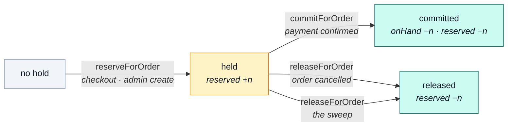

# Reservations

A reservation is a **promise that units exist**, made before money changes hands and kept for a
fixed window.

::: tip At a glance
**Window** — `NODE_RESERVATION_TTL_MINUTES`, 30 by default, stamped onto each hold at reserve time.
**Guarantee** — every transition is exactly-once, by conditional claim rather than by lock.
**Breaks if you change** — the conditional status claim. It is the entire correctness of this module.
:::

## Two counters, four transitions

Every product row carries `onHand` and `reserved`. [`products`](./products.md) never writes either,
and neither does anything else — the four transitions below are the only writers in the
application.

`held` is the only non-terminal state, and `expiresAt` is what makes it non-permanent.

| Transition        | Called by                                          | Counters                   | Ledger `reason` |
| ----------------- | -------------------------------------------------- | -------------------------- | --------------- |
| `reserveForOrder` | [checkout](./cart-checkout.md), admin order create | `reserved` +n              | `reserve`       |
| `commitForOrder`  | [`payments`](./payments.md) on confirm             | `onHand` −n, `reserved` −n | `commit`        |
| `releaseForOrder` | [`orders`](./orders.md) on cancel                  | `reserved` −n              | `release`       |
| `releaseForOrder` | the sweep                                          | `reserved` −n              | `expire`        |

Two more `reason` values exist and belong to no reservation at all: `receive`
(`POST /inventory/receipts`) and `adjust` (`POST /inventory/adjustments`), which move `onHand`
directly.

## Exactly-once, without a lock

::: warning The claim is the guarantee
Each transition claims the reservation's status **conditionally** — `held → committed` only
succeeds if the row is still `held`. So a cancel racing the sweep, or a provider webhook delivered
twice, resolves to exactly one winner and the loser is a no-op rather than a second counter move.

There is no transaction and no distributed lock holding this up. A single conditional update is the
whole mechanism, which is why it survives a restart and a second worker.
:::

## The ledger is half of the transition, not a reaction to it

`stockmovements` rows are written **by the same call that moves the counter**. There is deliberately
no `product.stock_moved` event, and there used to be:

> As an event, the ledger row became a _reaction_ to a counter change rather than half of one, so
> every mover had to remember to announce on every path — and on the rollback paths they did not.
> **A counter change nobody recorded is a corrupt audit trail, not a smaller feature.**

The row records the deltas rather than the resulting totals, so replaying the ledger reconstructs
either counter at any point in time.

## The sweep

`POST /inventory/reservations/sweep` releases every hold past its `expiresAt`. It is an admin route
rather than an internal timer, which is a deliberate call: the operation is idempotent, cheap, and
occasionally something an operator wants to force.

The `status: 1, expiresAt: 1` index exists for exactly that query, and for nothing else.

When a hold is swept, `inventory.reservation_expired` is published — and
[`orders`](./orders.md) listens for it and cancels the order. That is the one arrow pointing back
from this module, and it is an event rather than an import precisely so the two mutually-aware
domains stay acyclic.

## The threshold, and its two readers

`NODE_LOW_STOCK_THRESHOLD` (5 by default) has two readers that deliberately count **different
populations**:

| Reader                             | Population                     | Why                                                          |
| ---------------------------------- | ------------------------------ | ------------------------------------------------------------ |
| The stock board's `lowOnly` filter | the whole catalogue            | an admin restocking needs to see an inactive product's units |
| `products_low_stock_total`         | publicly visible products only | an alert about stock a customer cannot buy is noise          |

The two numbers will not match, and should not. Sharing the threshold while differing on the
population is the intended arrangement.

Both settings are read **per call** rather than captured at import, so an operator changing an env
var affects the next request.

## Related pages

- [`inventory`](./inventory.md) — the module this belongs to
- [Checkout](./cart-checkout.md) — where a hold is taken
- [`payments`](./payments.md) — where a hold becomes a sale
- [`orders`](./orders.md) — the listener for `inventory.reservation_expired`
- [Prometheus](../tools/prometheus.md) — the two gauges this module exports
