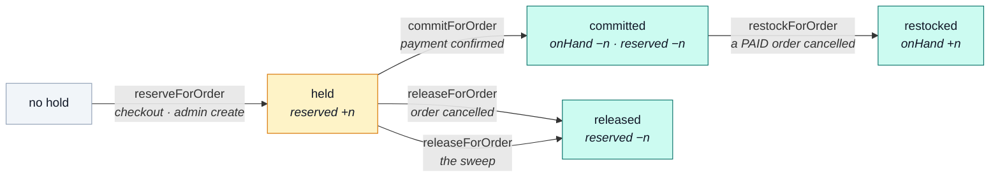

# Reservations

A reservation is a **promise that units exist**, made before money changes hands and kept for a
fixed window.

::: tip At a glance
**Window** — `NODE_RESERVATION_TTL_MINUTES`, 30 by default, stamped onto each hold at reserve time.
**Guarantee** — every transition is exactly-once, by conditional claim rather than by lock.
**Breaks if you change** — the conditional status claim. It is the entire correctness of this module.
:::

## Two counters, five transitions

Every product row carries `onHand` and `reserved`. [`products`](./products.md) never writes either,
and neither does anything else — the five transitions below are the only writers in the
application.

```mermaid
%%{init: {'flowchart': {'nodeSpacing': 34, 'rankSpacing': 60}}}%%
flowchart LR
    N["no hold"] -->|"reserveForOrder<br/><i>checkout · admin create</i>"| H["held<br/><i>reserved +n</i>"]
    H -->|"commitForOrder<br/><i>payment confirmed</i>"| C["committed<br/><i>onHand −n · reserved −n</i>"]
    H -->|"releaseForOrder<br/><i>order cancelled</i>"| R["released<br/><i>reserved −n</i>"]
    H -->|"releaseForOrder<br/><i>the sweep</i>"| R
    C -->|"restockForOrder<br/><i>a PAID order cancelled</i>"| S["restocked<br/><i>onHand +n</i>"]

    classDef open fill:#fef3c7,stroke:#d97706,color:#111827;
    classDef done fill:#ccfbf1,stroke:#0f766e,color:#111827;
    classDef none fill:#f1f5f9,stroke:#94a3b8,color:#111827;
    class H open;
    class C,R,S done;
    class N none;
```

`held` is the only non-terminal state, and `expiresAt` is what makes it non-permanent — `committed`
is otherwise terminal too, except for the one door `restockForOrder` opens onto `restocked` (B2).

| Transition        | Called by                                                                | Counters                   | Ledger `reason` |
| ----------------- | ------------------------------------------------------------------------ | -------------------------- | --------------- |
| `reserveForOrder` | [checkout](./cart-checkout.md), admin order create                       | `reserved` +n              | `reserve`       |
| `commitForOrder`  | [`payments`](./payments.md) on confirm                                   | `onHand` −n, `reserved` −n | `commit`        |
| `releaseForOrder` | [`orders`](./orders.md) on cancel                                        | `reserved` −n              | `release`       |
| `releaseForOrder` | the sweep                                                                | `reserved` −n              | `expire`        |
| `restockForOrder` | [`orders`](./orders.md) on cancel, once the release above claims nothing | `onHand` +n                | `restock`       |

**`restockForOrder` is never merged into `releaseForOrder`**, on purpose: the sweep only ever
releases a stale HOLD, and folding restock into that same function would let it put a just-paid
order's units back on sale the moment its unrelated reservation record aged past the sweep's
cutoff — a sale undone by a timer, not by anyone cancelling anything. A cancel calls it explicitly,
only after `releaseForOrder`'s own claim on `held → released` has already missed — exactly what a
PAID order's `committed` hold does, every time.

Both take an optional Mongo `session`. `orders`' cancel passes one so the status move, the release
and the restock commit together or not at all; given a session, the catalogue's stock cache is
not synced inside the transaction (that write cannot roll back), and the caller runs
`refreshStockCacheForOrder` after the commit.

Two more `reason` values exist and belong to no reservation at all: `receive`
(`POST /inventory/receipts`) and `adjust` (`POST /inventory/adjustments`), which move `onHand`
directly.

## Exactly-once, without a lock

::: warning The claim is the guarantee
Each transition claims the reservation's status **conditionally** — `held → committed` only
succeeds if the row is still `held`. So a cancel racing the sweep, or a provider webhook delivered
twice, resolves to exactly one winner and the loser is a no-op rather than a second counter move.

There is no transaction and no distributed lock holding this up. A single conditional update is the
whole mechanism, which is why it survives a restart and a second worker.
:::

## A commit with no hold is an incident, not a no-op

A paid order always commits its hold. When `commitForOrder`'s claim misses, that is one of two
very different facts, and it tells them apart before deciding what to do:

- the hold is already `committed` — a redelivered settlement, the sale already stands. Silent,
  correctly: replaying it is not new information.
- the hold is `released`/`expired`, or never existed — the order is paid and nothing was set aside
  for it. Alarmed: an `admin.commit.orphaned` audit row, `outcome: 'failure'`, naming the order.

The alarm only **records** the fact; nothing auto-compensates. A missing hold does not mean
missing goods — the units are still on the shelf, just unreserved — so refunding on that signal
alone would cancel a sale that may be perfectly fulfillable. A human reads the audit trail and
decides.

## The ledger is half of the transition, not a reaction to it

`stockmovements` rows are written **by the same call that moves the counter**. There is deliberately
no `product.stock_moved` event, and there used to be:

> As an event, the ledger row became a _reaction_ to a counter change rather than half of one, so
> every mover had to remember to announce on every path — and on the rollback paths they did not.
> **A counter change nobody recorded is a corrupt audit trail, not a smaller feature.**

The row records the deltas rather than the resulting totals, so replaying the ledger reconstructs
either counter at any point in time.

## The sweep

`POST /inventory/reservations/sweep` releases every hold past its `expiresAt`; `npm run
sweep:reservations` (B3) is the same work, driven every 5 minutes rather than on demand — see
[Scheduled jobs](../reference/ops.md#scheduled-jobs). The admin route stays, deliberately: the
operation is idempotent and cheap, and occasionally something an operator wants to force between
ticks.

The `status: 1, expiresAt: 1` index exists for exactly that query, and for nothing else.

When a hold is swept, `inventory.reservation_expired` is published — and
[`orders`](./orders.md) listens for it and cancels the order. That is the one arrow pointing back
from this module, and it is an event rather than an import precisely so the two mutually-aware
domains stay acyclic.

**The hold length is per-checkout, not a single constant.** `reserveForOrder` takes an optional
window and falls back to `NODE_RESERVATION_TTL_MINUTES` only when the caller gives none — `cart`'s
checkout hands it a longer one for a `bank_transfer` order (`NODE_BANK_TRANSFER_HOLD_HOURS`, a
week by default). The sweep itself needed no change to honour this: it only ever reads each hold's
own stored `expiresAt`, never a constant. See [Payments — Bank transfer](./payments.md#bank-transfer).

**A card payment gone `processing` gets the same week, after the fact (B3).** `extendHoldForOrder`
pushes a still-`held` hold's `expiresAt` out to `NODE_BANK_TRANSFER_HOLD_HOURS` from now, called by
`settlePayment` the moment the provider reports `processing` — a SEPA debit, some bank redirects,
can take days to settle, and the ordinary 30-minute window would let the sweep cancel an order
whose money is still genuinely on its way. `requires_action` gets no such grace: that state means
the BROWSER has a challenge to answer, not the provider a payment to finish, so the ordinary window
already fits it. No setting of its own — reusing the bank-transfer window is the whole point: both
are "this payment method settles over days", the same fact under two names. Guarded on
`status: 'held'`, the same as every other lifecycle write here, so a hold already claimed has
nothing left on it to extend.

## The threshold, and its two readers

`NODE_LOW_STOCK_THRESHOLD` (5 by default) has two readers that deliberately count **different
populations**:

| Reader                             | Population                     | Why                                                          |
| ---------------------------------- | ------------------------------ | ------------------------------------------------------------ |
| The stock board's `lowOnly` filter | the whole catalogue            | an admin restocking needs to see an inactive product's units |
| `products_low_stock_total`         | publicly visible products only | an alert about stock a customer cannot buy is noise          |

The two numbers will not match, and should not. Sharing the threshold while differing on the
population is the intended arrangement.

Both settings are read through their slice on every call rather than captured at import, and the
slice parses the environment once per process: a changed variable takes effect on restart.

## Related pages

- [`inventory`](./inventory.md) — the module this belongs to
- [Checkout](./cart-checkout.md) — where a hold is taken
- [`payments`](./payments.md) — where a hold becomes a sale
- [`orders`](./orders.md) — the listener for `inventory.reservation_expired`
- [Prometheus](../tools/prometheus.md) — the two gauges this module exports
