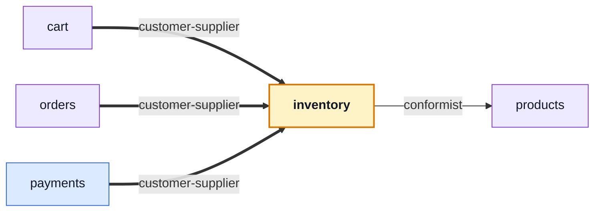

# inventory

::: tip At a glance
**Owns** — the two stock counters, the reservation lifecycle, and the ledger that explains both.
**Depends on** — [`products`](./products.md), whose document carries the counters it writes.
**Breaks if you change** — any transition's conditional claim. It is what makes each one exactly-once.
:::

<!-- gen:identity:start -->

| Fact                     | This module                                                                     |
| ------------------------ | ------------------------------------------------------------------------------- |
| **Subdomain**            | `supporting` — Specific to this business but not a differentiator. Kept plain.  |
| **Base path**            | `/inventory`                                                                    |
| **Collections**          | `reservations` (model `Reservation`) · `stockmovements` (model `StockMovement`) |
| **Depends on**           | [`products`](./products.md)                                                     |
| **Depended on by**       | [`cart`](./cart.md) · [`orders`](./orders.md) · [`payments`](./payments.md)     |
| **Languages**            | `en` · `it`                                                                     |
| **Seeded**               | no                                                                              |
| **Frontend counterpart** | `inventory` in `boilerplate-vue-frontend`                                       |

<!-- gen:identity:end -->

## The map

<!-- gen:map:start -->



- `cart` → **customer-supplier** — A checkout asks for the basket to be held (`reserveForOrder`) and gives the hold back when it loses the cart race. It never touches a counter itself — what a hold costs is inventory’s to know.
- `orders` → **customer-supplier** — Creating an order holds its units and cancelling one gives them back; this module asks for both by name and never touches a counter itself.
- `payments` → **customer-supplier** — A confirmed payment is what turns an order’s held units into a sale, so this module asks for the commit at the moment the order moves to `paid`.
- → `products` **conformist** — Reads catalogue documents as they are and drives their two counters through the repository’s conditional primitives. The columns are the catalogue’s to declare; what they may become is this module’s to decide.

<!-- gen:map:end -->

## The story

The counters live on the product document so a catalogue read needs no join — but
[`products`](./products.md) never writes them, and neither does anyone else. **Every change to
`onHand` or `reserved` is a transition here.**

There are four, and each has one caller:

| Transition        | Fired by                     | What it does                        |
| ----------------- | ---------------------------- | ----------------------------------- |
| `reserveForOrder` | checkout, admin order create | units held, not sold                |
| `commitForOrder`  | payment confirmed            | units leave                         |
| `releaseForOrder` | order cancelled              | units come back                     |
| `releaseForOrder` | the sweep                    | the hold timed out, units come back |

::: warning Exactly-once, by construction
Each transition claims the reservation's status **conditionally**, so a cancel racing the sweep — or
a provider webhook delivered twice — resolves to exactly one winner. That conditional claim is the
correctness of this module; there is no lock anywhere else holding it up.
:::

The ledger is not a reaction to a counter change, it is half of one. `stockmovements` rows are
written by the same call that moves the counter, which is why there is no `product.stock_moved`
event: an earlier version had one, and every mover had to remember to announce on every path — and
on the rollback paths they did not. A counter change nobody recorded is a corrupt audit trail, not
a smaller feature.

Deleting this module leaves a shop that cannot sell. That is the honest consequence of owning
something.

## Data

<!-- gen:data:start -->

#### `reservations`

From model `Reservation`. `_id` and `__v` are omitted — every document carries them.

| Field         | Type            | Flags            | Default | Reference / values                  |
| ------------- | --------------- | ---------------- | ------- | ----------------------------------- |
| `orderId`     | `ObjectId`      | required, unique | —       | —                                   |
| `items`       | `Subdocument[]` | required         | —       | —                                   |
| ↳ `productId` | `ObjectId`      | required         | —       | → `Product`                         |
| ↳ `quantity`  | `Number`        | required         | —       | —                                   |
| `status`      | `String`        | required         | "held"  | `held` \| `committed` \| `released` |
| `expiresAt`   | `Date`          | required         | —       | —                                   |
| `createdAt`   | `Date`          | —                | —       | —                                   |
| `updatedAt`   | `Date`          | —                | —       | —                                   |

**Declared indexes**

| Keys                      | Options                             |
| ------------------------- | ----------------------------------- |
| `orderId: 1`              | unique                              |
| `status: 1, expiresAt: 1` | name: reservations_status_expiresAt |

#### `stockmovements`

From model `StockMovement`. `_id` and `__v` are omitted — every document carries them.

| Field           | Type       | Flags    | Default | Reference / values                                                      |
| --------------- | ---------- | -------- | ------- | ----------------------------------------------------------------------- |
| `productId`     | `ObjectId` | required | —       | → `Product`                                                             |
| `reason`        | `String`   | required | —       | `reserve` \| `commit` \| `release` \| `expire` \| `receive` \| `adjust` |
| `onHandDelta`   | `Number`   | —        | 0       | —                                                                       |
| `reservedDelta` | `Number`   | —        | 0       | —                                                                       |
| `reference`     | `String`   | —        | —       | —                                                                       |
| `note`          | `String`   | —        | —       | —                                                                       |
| `createdAt`     | `Date`     | —        | —       | —                                                                       |
| `updatedAt`     | `Date`     | —        | —       | —                                                                       |

**Declared indexes**

| Keys                          | Options                                  |
| ----------------------------- | ---------------------------------------- |
| `productId: 1, createdAt: -1` | name: stockmovements_productId_createdAt |
| `createdAt: -1`               | name: stockmovements_createdAt           |

<!-- gen:data:end -->

## Surface

<!-- gen:surface:start -->

| Endpoint                             | Middlewares                      | Controller              | What it does              |
| ------------------------------------ | -------------------------------- | ----------------------- | ------------------------- |
| `POST /inventory/adjustments`        | `getAuth` → `isAuth` → `isAdmin` | `postAdjustment`        | Adjust stock              |
| `GET /inventory/levels`              | `getAuth` → `isAuth` → `isAdmin` | `getInventoryLevels`    | Stock levels              |
| `GET /inventory/movements`           | `getAuth` → `isAuth` → `isAdmin` | `getStockMovements`     | List stock movements      |
| `POST /inventory/receipts`           | `getAuth` → `isAuth` → `isAdmin` | `postReceipt`           | Receive stock             |
| `POST /inventory/reservations/sweep` | `getAuth` → `isAuth` → `isAdmin` | `postReservationsSweep` | Expire stale reservations |

Middlewares run left to right; the controller is the last handler on the route. Summaries come from this module’s own `openapi.yaml`, which is where they are edited.

<!-- gen:surface:end -->

## Signals

<!-- gen:signals:start -->

#### Domain events

| Event                           | Direction                |
| ------------------------------- | ------------------------ |
| `inventory.reservation_expired` | published by this module |

#### Audit actions

| Constant                   | Action name                |
| -------------------------- | -------------------------- |
| `ADMIN_STOCK_RECEIVED`     | `admin.stock.received`     |
| `ADMIN_STOCK_ADJUSTED`     | `admin.stock.adjusted`     |
| `ADMIN_RESERVATIONS_SWEPT` | `admin.reservations.swept` |

#### Metrics

| Collector                        | Type  | Labels | Help                                                                    |
| -------------------------------- | ----- | ------ | ----------------------------------------------------------------------- |
| `inventory_reserved_units_total` | Gauge | —      | Units held by open reservations across the catalogue.                   |
| `products_low_stock_total`       | Gauge | —      | Products whose available units are at or under the low-stock threshold. |

<!-- gen:signals:end -->

## Files

<!-- gen:files:start -->

| File                                     | What it is                                                                                                                                                   | Explained in                             |
| ---------------------------------------- | ------------------------------------------------------------------------------------------------------------------------------------------------------------ | ---------------------------------------- |
| `audit.ts`                               | Which of this module’s operations reach the audit trail, and under what action names.                                                                        | [read](../tools/winston.md)              |
| `config.ts`                              | The settings several of this module’s transitions read, in one place.                                                                                        | —                                        |
| `controllers/get-inventory-levels.ts`    | One operation: reads inputs, calls the service, answers through the response envelope, and catches.                                                          | [read](../theory/request-flow.md)        |
| `controllers/get-stock-movements.ts`     | One operation: reads inputs, calls the service, answers through the response envelope, and catches.                                                          | [read](../theory/request-flow.md)        |
| `controllers/post-adjustment.ts`         | One operation: reads inputs, calls the service, answers through the response envelope, and catches.                                                          | [read](../theory/request-flow.md)        |
| `controllers/post-receipt.ts`            | One operation: reads inputs, calls the service, answers through the response envelope, and catches.                                                          | [read](../theory/request-flow.md)        |
| `controllers/post-reservations-sweep.ts` | One operation: reads inputs, calls the service, answers through the response envelope, and catches.                                                          | [read](../theory/request-flow.md)        |
| `domain/index.ts`                        | The domain barrel.                                                                                                                                           | [read](../theory/domain-layer.md)        |
| `domain/transitions.ts`                  | Pure rules over plain data — no Mongoose, no Express, and lint-guaranteed free of both.                                                                      | [read](../theory/domain-layer.md)        |
| `events.ts`                              | The domain events this module publishes and subscribes to.                                                                                                   | [read](../tools/events-and-logging.md)   |
| `index.ts`                               | The public barrel: the only surface a sibling module may import.                                                                                             | [read](../theory/strategic-ddd.md)       |
| `locales/en.json`                        | This module's user-facing strings, one file per language.                                                                                                    | [read](../tools/i18n.md)                 |
| `locales/it.json`                        | This module's user-facing strings, one file per language.                                                                                                    | [read](../tools/i18n.md)                 |
| `metrics.ts`                             | The domain counters and histograms this module registers with Prometheus.                                                                                    | [read](../tools/prometheus.md)           |
| `model.ts`                               | The Mongoose schema, its indexes and its serialisation rules — the collection's shape.                                                                       | [read](../tools/mongodb-mongoose.md)     |
| `module.ts`                              | The manifest — the only file the application loads directly. Declares the name, base path, router, dependency edges, locales, seeds and event subscriptions. | [read](../theory/modules.md)             |
| `openapi.yaml`                           | This module's slice of the REST contract. The root `openapi.yaml` is bundled from these.                                                                     | [read](../api/contract-fragmentation.md) |
| `repository.ts`                          | Every query this module makes, on the shared base repository. The only tier that talks to Mongoose.                                                          | [read](../tools/mongodb-mongoose.md)     |
| `routes.ts`                              | The URL surface — one line per endpoint, naming its middlewares, the role it requires and the controller it lands on.                                        | [read](../api/endpoints.md)              |
| `service.ts`                             | The domain decision, and the layer that owns status-code meaning.                                                                                            | [read](../theory/layers.md)              |
| `tests/contract/api.contract.test.ts`    | Contract suite — the responses, against the fragment.                                                                                                        | [read](../tools/contract-testing.md)     |
| `tests/unit/ledger.property.test.ts`     | Unit suite — the rules, in isolation.                                                                                                                        | [read](../tools/unit-testing.md)         |
| `tests/unit/service.test.ts`             | Unit suite — the rules, in isolation.                                                                                                                        | [read](../tools/unit-testing.md)         |
| `tests/unit/transitions.test.ts`         | Unit suite — the rules, in isolation.                                                                                                                        | [read](../tools/unit-testing.md)         |

<!-- gen:files:end -->

## Working on it

<!-- gen:working:start -->

| Suite    | Files | Where                                   |
| -------- | ----- | --------------------------------------- |
| Unit     | 3     | `src/modules/inventory/tests/unit/`     |
| Contract | 1     | `src/modules/inventory/tests/contract/` |

```bash
# every suite this module carries
npm run test:module -- src/modules/inventory

# after editing this module’s openapi.yaml
npm run contracts:bundle && npm run lint:openapi:modules
```

<!-- gen:working:end -->

## Deeper in

<!-- gen:subpages:start -->

- [Reservations](./inventory-reservations.md)

<!-- gen:subpages:end -->

## Related pages

- [Reservations](./inventory-reservations.md) — the lifecycle and the sweep, in detail
- [`orders`](./orders.md) — what a reservation is attached to
- [`products`](./products.md) — where the counters physically live
- [Domain Layer](../theory/domain-layer.md) — the pure rules behind the transitions
- [Prometheus](../tools/prometheus.md) — the counters this module exports about itself
