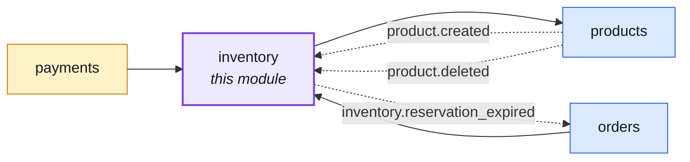
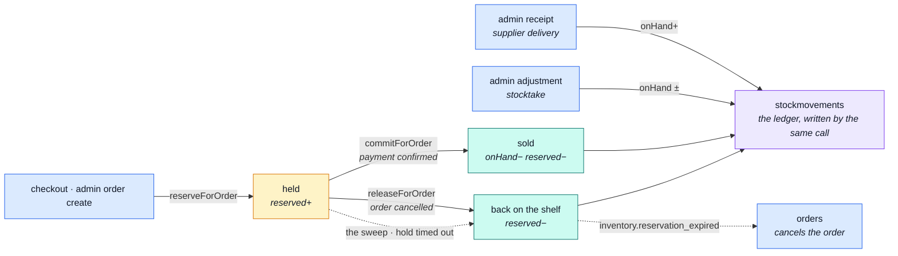

# inventory

::: tip At a glance
**Owns** — the two stock counters (its own `stocklevels` collection), the reservation lifecycle,
and the ledger that explains both.
**Depends on** — [`products`](./products.md), whose document keeps a read-only mirror of the
counters this module writes, so a catalogue read needs no join.
**Breaks if you change** — any transition's conditional claim. It is what makes each one exactly-once.
:::

## Its neighbourhood

<!-- module-graph:inventory:start -->

_Solid arrows are imports. Dotted arrows are domain events — the return path an import
graph cannot see._

<!-- module-graph:inventory:end -->

## The story

The counters live in this module's own `stocklevels` collection — one row per product, written
only by `applyTransition`, beside the ledger row that explains every move. `products` keeps a
synced copy of `onHand`/`reserved` on its own document purely so a catalogue read still needs no
join; that copy is never the source of truth and this module never reads it back. **Every change
to a stock count is a transition here.**

There are four, and each has one caller:

| Transition        | Fired by                     | What it does                        |
| ----------------- | ---------------------------- | ----------------------------------- |
| `reserveForOrder` | checkout, admin order create | units held, not sold                |
| `commitForOrder`  | payment confirmed            | units leave                         |
| `releaseForOrder` | order cancelled              | units come back                     |
| `releaseForOrder` | the sweep                    | the hold timed out, units come back |

::: warning Exactly-once, by construction
Each transition claims the reservation's status **conditionally**, so a cancel racing the sweep — or
a provider webhook delivered twice — resolves to exactly one winner. That conditional claim is the
correctness of this module; there is no lock anywhere else holding it up.
:::

A paid order always commits its hold. `commitForOrder` finding no hold to claim is either a benign
replay (already `committed`) or an incident — see
[Reservations](./inventory-reservations.md#a-commit-with-no-hold-is-an-incident-not-a-no-op) for
which is which, and what gets recorded.

The ledger is not a reaction to a counter change, it is half of one. `stockmovements` rows are
written by the same call that moves the counter, which is why there is no `product.stock_moved`
event: an earlier version had one, and every mover had to remember to announce on every path — and
on the rollback paths they did not. A counter change nobody recorded is a corrupt audit trail, not
a smaller feature.

Deleting this module leaves a shop that cannot sell. That is the honest consequence of owning
something.

## Why `products` still carries a copy

A catalogue read is the shop's most common query and must not need a join — that constraint predates
this module owning its own collection and still holds. Three shapes were weighed for how a product
read keeps showing `available` once the counters move here:

1. **A separate `inventory` endpoint the storefront calls.** Rejected: it turns one catalogue read
   into two round trips, which costs the same as the join the constraint exists to avoid — worse,
   from the client's own timing.
2. **`products` imports this module and reads live.** Rejected for the same reason: a live
   cross-collection read at catalogue-read time is a join in every way that matters, just not
   spelled `$lookup`.
3. **`products` keeps a maintained projection.** Chosen. `onHand`/`reserved` stay columns on the
   product document, but this module is still their only writer — `productService.syncStockCache`
   sets them, and nothing else may.

The sync is a **plain awaited function call inside `applyTransition`**, never a domain event. This
module's own history already warns against event-driven counters — see "The story" above, and the
old `product.stock_moved` event this codebase deliberately does not have any more: an event a
listener can miss is fine for a fact nothing depends on, and wrong for one a catalogue page reads.
Write order matters and is deliberate: the counter and its ledger row commit first, exactly as
`applyTransition` has always done it — the transition IS the source of truth the moment it commits,
regardless of whether the cache sync afterward succeeds. A failed sync is logged and left for the
next transition on that product to correct, the same tolerance
[`commitForOrder`](#the-pipeline) already applies to a refused counter write elsewhere in this file
— never a reason to fail the transition that already committed.

One consequence worth naming: this module keeps importing `products` (for a shortfall's title, and
now for the cache sync) exactly as it does today. Nothing about this decision reverses that edge —
only `products → inventory` would be a cycle, and nothing here creates it.

## The pipeline

Two entry points move stock — a checkout, and an admin with a clipboard. Every one of them writes
the ledger in the same call that moves the counter.

## Related pages

- [Reservations](./inventory-reservations.md) — the lifecycle and the sweep, in detail
- [`orders`](./orders.md) — what a reservation is attached to
- [`products`](./products.md) — where the counters physically live
- [Domain Layer](../theory/domain-layer.md) — the pure rules behind the transitions
- [Prometheus](../tools/prometheus.md) — the counters this module exports about itself
