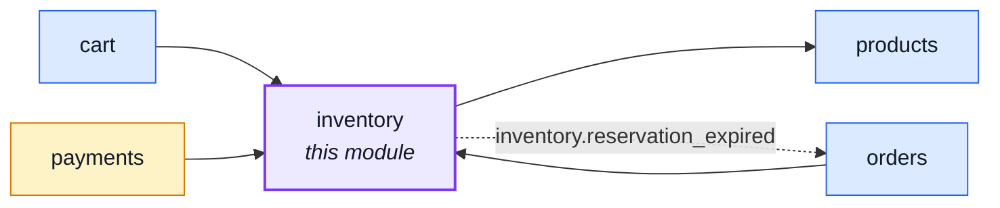
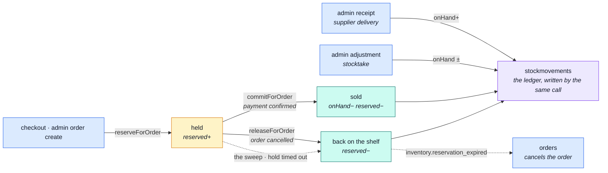

# inventory

::: tip At a glance
**Owns** — the two stock counters, the reservation lifecycle, and the ledger that explains both.
**Depends on** — [`products`](./products.md), whose document carries the counters it writes.
**Breaks if you change** — any transition's conditional claim. It is what makes each one exactly-once.
:::

## Its neighbourhood

<!-- module-graph:inventory:start -->

_Solid arrows are imports. Dotted arrows are domain events — the return path an import
graph cannot see._

<!-- module-graph:inventory:end -->

## The story

The counters live on the product document so a catalogue read needs no join — but
[`products`](./products.md) never writes them, and neither does anyone else. **Every change to
`onHand` or `reserved` is a transition here.**

There are four, and each has one caller:

| Transition        | Fired by                     | What it does                        |
| ----------------- | ---------------------------- | ----------------------------------- |
| `reserveForOrder` | checkout, admin order create | units held, not sold                |
| `commitForOrder`  | payment confirmed            | units leave                         |
| `releaseForOrder` | order cancelled              | units come back                     |
| `releaseForOrder` | the sweep                    | the hold timed out, units come back |

::: warning Exactly-once, by construction
Each transition claims the reservation's status **conditionally**, so a cancel racing the sweep — or
a provider webhook delivered twice — resolves to exactly one winner. That conditional claim is the
correctness of this module; there is no lock anywhere else holding it up.
:::

The ledger is not a reaction to a counter change, it is half of one. `stockmovements` rows are
written by the same call that moves the counter, which is why there is no `product.stock_moved`
event: an earlier version had one, and every mover had to remember to announce on every path — and
on the rollback paths they did not. A counter change nobody recorded is a corrupt audit trail, not
a smaller feature.

Deleting this module leaves a shop that cannot sell. That is the honest consequence of owning
something.

## The pipeline

Two entry points move stock — a checkout, and an admin with a clipboard. Every one of them writes
the ledger in the same call that moves the counter.

## Related pages

- [Reservations](./inventory-reservations.md) — the lifecycle and the sweep, in detail
- [`orders`](./orders.md) — what a reservation is attached to
- [`products`](./products.md) — where the counters physically live
- [Domain Layer](../theory/domain-layer.md) — the pure rules behind the transitions
- [Prometheus](../tools/prometheus.md) — the counters this module exports about itself
