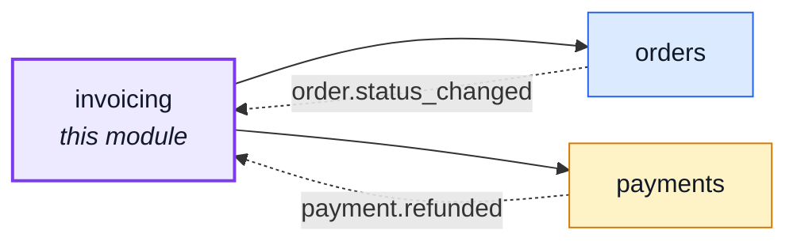
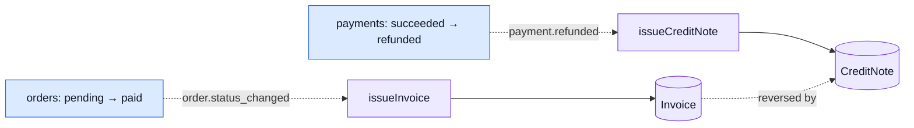

# invoicing

::: tip At a glance
**Owns** — the `Invoice`/`CreditNote` collections and their own numbering series, outright.
**Depends on** — [`orders`](./orders.md) (the VAT breakdown, the seller's jurisdiction, an
auth-scoped order read) and [`payments`](./payments.md) (`PAYMENT_REFUNDED`).
**Breaks if you change** — `orders`' `ORDER_STATUS_CHANGED` payload shape, or `payments`'
`PAYMENT_REFUNDED` one; both listeners below read them by name.
:::

## Its neighbourhood

<!-- module-graph:invoicing:start -->

_Solid arrows are imports. Dotted arrows are domain events — the return path an import
graph cannot see._

<!-- module-graph:invoicing:end -->

## The story

`orders`' own PDF used to be titled "Fattura n." — a tax invoice's name — while behaving like
neither one: numbered and emailed before any payment, re-rendered from whatever the shop's config
said today, downloadable on a cancelled order, and destroyed outright by a hard delete. Three
sessions of review (`AUDIT_0924`, `DECISIONS_0925_2`) relabelled it honestly first — "order
confirmation / receipt, not a tax invoice" — and this module is the second half: the real thing,
built once the relabel had already shipped.

The model here is Stripe's invoice lifecycle (finalize once, void rather than delete) and Magento's
"invoice at capture, credit memo at refund" — an invoice is minted from a FACT (the order was paid),
never from a request, and it is immutable from the moment it exists.

::: tip Shares a URL, not a folder
`GET /orders/{id}/invoice` and `GET /orders/{id}/credit-note` mount at `/orders`, the same prefix
`orders` itself answers at — see [`addresses`](./addresses.md) for the precedent (`/account`,
shared with `account`) and `docs/api/contract-fragmentation.md` for why fragmenting by `basePath`
still splits the two contracts correctly.
:::

Depending on `orders` — never the reverse — is what keeps the graph acyclic. `orders` already has
`payments` and `cart` depending on it the same way; this module reuses `orderTaxBreakdown`
(`orders/domain/tax.ts`) for its own VAT arithmetic rather than re-deriving EN 16931's BR-CO-17
reconciliation by hand a second time, and reads the order once, through `orderService.getById`, for
the auth-scoped download routes. `orders` itself carries no import of, and no wiring for, this
module at all — the one thing it knows is `paidAt` (`orders/model.ts`), stamped in the same write
that moves an order to `paid`, which is the proxy `orders`' own `actions.invoice` flag and
hard-delete refusal read instead of asking this module whether the freeze actually landed.

## Issuing a document

Two domain-event listeners, `module.ts`'s whole `subscribe()`, are the ONLY way either document is
ever created. No route requests one into existence.

`issueInvoice` (`services/issue-invoice.ts`) freezes: the order's own lines (title, quantity,
frozen unit price, frozen VAT rate, frozen rate type), the VAT breakdown `orderTaxBreakdown`
computes from them, the order's own `shippingAddress` as the Art. 226 billing address (this shop
collects no separate billing address — the ship-to address is the only customer address a checkout
ever records), the seller's own identity (`config.ts`), and the order's own frozen
`currency`/`orderNumber`/`locale`.
`issueCreditNote` (`services/issue-credit-note.ts`) mirrors the invoice it corrects wholesale —
today's `payments` only ever refunds the FULL amount of a `succeeded` payment, so there is no
partial amount to compute; a future partial-refund design (SH5) needs its own input here, not a
change to this shape.

Both are idempotent the same way: a unique index on `orderId` (`model.ts`) is what actually
guarantees "at most one", not the listener's own read-then-insert — a redelivered event, or two
writers racing the same order, both attempt the insert, and the loser's duplicate-key error reads
back the row the winner already wrote (`repository.ts`). A listener failure is logged by
`emitDomainEvent` and never rolls back the write that triggered it: an order that reached `paid`
stays `paid` whether or not its invoice freeze succeeded — the same "gaps are acceptable" policy
`orderNumber` (`orders/services/order-numbering.ts`) already documents, now shared by this module's
own two series.

## Downloading a document

`GET /orders/{id}/invoice` and `/credit-note` render on the request thread and stream the bytes
back: `200` once the document exists, `404` otherwise (`ORDER_INVOICE_NOT_ISSUED` /
`ORDER_CREDIT_NOTE_NOT_ISSUED`) — for an order that has not reached the fact yet, or a gap in the
policy above. Never re-rendered from live config: every render reads the SAME frozen row, byte for
byte, run through the same EJS template (`shared/templates/documents/invoicing.document.ejs`) every
time.

## The e-invoicing port

`providers/index.ts` declares `EInvoicingProvider`, shaped after `payments/providers` (one
interface, one shipped implementation, an env var choosing between them): `pdf`
(`providers/pdf.ts`) is the only one this boilerplate ships, rendering through the same
EJS + Puppeteer pipeline `orders`' old receipt used. Italy's SdI and the EU's Peppol network are
integrations, not built here — both transmit a structured document to a third party and get back a
delivery outcome, a shape genuinely different from "hand back some bytes", so a real adapter's
`issue` would also need to report that outcome onto the document. Left for whoever builds the
first one.

## Configuration

| Variable                        | Default | Meaning                                                                                                                                           |
| ------------------------------- | ------- | ------------------------------------------------------------------------------------------------------------------------------------------------- |
| `NODE_SHOP_VAT_NUMBER`          | —       | The seller's VAT id, printed on the invoice. Optional — a deployment below the registration threshold prints no VAT number rather than a fake one |
| `NODE_SHOP_LEGAL_NAME`          | —       | The seller's legal name, printed on the invoice — distinct from any storefront brand name                                                         |
| `NODE_SHOP_STREET`              | —       | The seller's own street address — Art. 226(f) needs the full postal address, not just `orders`' own `NODE_SHOP_COUNTRY`                           |
| `NODE_SHOP_CITY`                | —       | The seller's own city                                                                                                                             |
| `NODE_SHOP_ZIP`                 | —       | The seller's own postal code                                                                                                                      |
| `NODE_EINVOICING_PROVIDER`      | `pdf`   | Which e-invoicing provider issues a document — see above                                                                                          |
| `NODE_INVOICING_RATE_LIMIT_MAX` | `20`    | Invoice/credit-note renders allowed per window, per ACCOUNT — every hit spawns a Chromium launch                                                  |

Every getter is read fresh per call (`config.ts`), so a correction needs no restart; an empty
string reads as unset, never as a blank row on the invoice.

## VAT category codes

EN 16931's category codes distinguish a 0%-rated line (`Z`) from an exempt one (`E`) — a
distinction `products`' `taxClass` enum (`reduced`/`zero`) alone cannot make, since `zero` covers
both reasons. `products`' `rateType` (`standard`/`zero-rated`/`exempt`) says which, frozen onto the
order line the same way `taxClass` resolves into `taxRate` — but copied AS IS rather than resolved,
since there is no numeric form for a reason code to become.

- **Where it lives.** `taxCategoryCode()`, `emails.ts` — the only place a code is decided.
- **Rule.** `taxRate !== 0` → `S`. Otherwise `rateType === 'exempt'` → `E`, else `Z`.
- **Printed.** The per-line VAT table only (`invoicing.document.vat-table.ejs`'s `category`
  column). The shipping and per-rate summary tables stay grouped by rate alone — see the
  per-category summary gap below.
- **Not covered.** A reduced, non-zero rate always prints `S`. EN 16931 has its own code for that
  too, out of scope here.

## What this module deliberately does not do

- **A per-category VAT summary.** The summary and shipping tables above group by decimal rate
  alone, so a rate carrying both a zero-rated and an exempt line folds into one 0% row instead of
  two. Splitting those tables by (rate, category) is a bigger rework than adding the per-line code
  above — left for later, alongside the module's own per-line-vs-per-rate rounding question
  (EN 16931 BR-CO-17), which this change does not touch either.
- **A render cache.** The old receipt cached a render for a few minutes to absorb a burst of
  requests for the same order; this module skips it. The document is immutable once issued, so
  there is no correctness reason to cache it — only a possible future perf one, if traffic ever
  asks for it.
- **Partial credit notes.** SH5's returns/partial-refund design is a separate lane; this module's
  credit note is a full reversal, matching today's full-refund-only `payments`.

## Related pages

- [`orders`](./orders.md) — the order this module reads, and the `paidAt`/`actions.invoice` proxy it keeps instead of a live dependency
- [`payments`](./payments.md) — the fake payment provider port this module's own `EInvoicingProvider` is shaped after
- [`addresses`](./addresses.md) — the `/account`-sharing precedent this module's `/orders`-sharing routes follow
- [Adding & Removing a Module](../theory/module-lifecycle.md) — the deletability procedure
