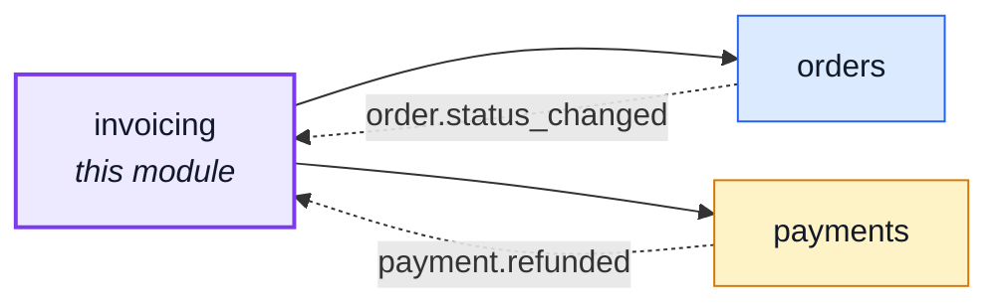
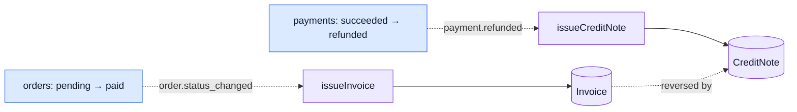
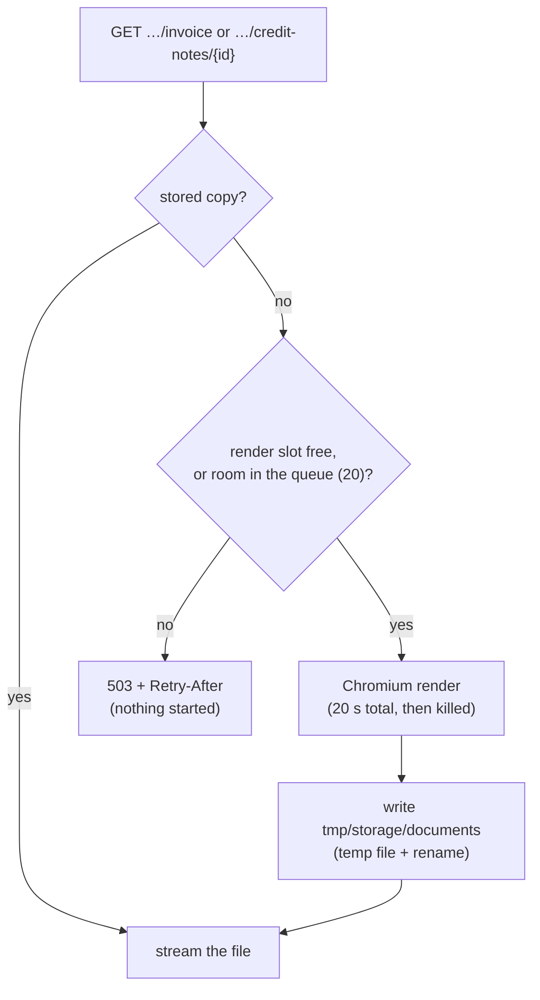
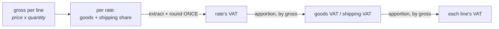

# invoicing

::: tip At a glance
**Owns** — the `Invoice`/`CreditNote` collections and their own numbering series, outright.
**Depends on** — [`orders`](./orders.md) (the VAT breakdown, the seller's jurisdiction, an
auth-scoped order read) and [`payments`](./payments.md) (`PAYMENT_REFUNDED`).
**Breaks if you change** — `orders`' `ORDER_STATUS_CHANGED` payload shape, or `payments`'
`PAYMENT_REFUNDED` one; both listeners below read them by name.
:::

## Its neighbourhood

<!-- module-graph:invoicing:start -->

_Solid arrows are imports. Dotted arrows are domain events — the return path an import
graph cannot see._

<!-- module-graph:invoicing:end -->

## The story

`orders`' own PDF used to be titled "Fattura n." — a tax invoice's name — while behaving like
neither one: numbered and emailed before any payment, re-rendered from whatever the shop's config
said today, downloadable on a cancelled order, and destroyed outright by a hard delete. A review
relabelled it honestly first — "order confirmation / receipt, not a tax invoice" — and this module is the second half: the real thing,
built once the relabel had already shipped.

The model here is Stripe's invoice lifecycle (finalize once, void rather than delete) and Magento's
"invoice at capture, credit memo at refund" — an invoice is minted from a FACT (the order was paid),
never from a request, and it is immutable from the moment it exists.

::: tip Shares a URL, not a folder
`GET /orders/{id}/invoice` and `GET /orders/{id}/credit-notes` mount at `/orders`, the same prefix
`orders` itself answers at — see [`addresses`](./addresses.md) for the precedent (`/account`,
shared with `account`) and `docs/api/contract-fragmentation.md` for why fragmenting by `basePath`
still splits the two contracts correctly.
:::

Depending on `orders` — never the reverse — is what keeps the graph acyclic. `orders` already has
`payments` and `cart` depending on it the same way; this module reuses `orderTaxBreakdown`
(`orders/domain/tax.ts`) for its own VAT arithmetic rather than re-deriving EN 16931's BR-CO-17
rounding rule ([VAT rounding](#vat-rounding-and-the-net-unit-price)) by hand a second time, and reads the order once, through `orderService.getById`, for
the auth-scoped download routes. `orders` itself carries no import of, and no wiring for, this
module at all — the one thing it knows is `paidAt` (`orders/model.ts`), stamped in the same write
that moves an order to `paid`, which is the proxy `orders`' own `actions.invoice` flag and
hard-delete refusal read instead of asking this module whether the freeze actually landed.

## Issuing a document

Two domain-event listeners, `module.ts`'s whole `subscribe()`, are the ONLY way either document is
ever created. No route requests one into existence.

`issueInvoice` (`services/issue-invoice.ts`) freezes: the order's own lines (title, quantity,
frozen unit price, frozen VAT rate, frozen rate type), the VAT breakdown `orderTaxBreakdown`
computes from them, the order's own `billingAddress` as the Art. 226 buyer address (every checkout
order carries one, chosen at checkout — "same as shipping" by default, so a digital-only order,
which has no ship-to address at all, is still invoiced to someone), the seller's own identity (`config.ts`), and the order's own frozen
`currency`/`orderNumber`/`locale`.
`issueCreditNote` (`services/issue-credit-note.ts`) freezes one credit note per REFUND
(`PAYMENT_REFUNDED` carries `refundId`, this refund's `amount` and `full`). A full refund mirrors the
invoice it corrects wholesale. A partial one carries only the refunded share: `src/modules/invoicing/services/partial-credit.ts`
spreads the amount over the invoice's VAT rates in proportion to what each collected (goods and
shipping together), one line per rate, and the VAT is extracted the way the invoice's own was — so
the credit note reconciles to the cent and only ever names rates the invoice charged. An order
refunded in parts therefore has several credit notes; `refundId` is unique, which is what makes a
redelivered event issue nothing twice.

Both are idempotent the same way: a unique index on `orderId` (`model.ts`) is what actually
guarantees "at most one", not the listener's own read-then-insert — a redelivered event, or two
writers racing the same order, both attempt the insert, and the loser's duplicate-key error reads
back the row the winner already wrote (`repository.ts`). A listener failure is logged by
`emitDomainEvent` and never rolls back the write that triggered it: an order that reached `paid`
stays `paid` whether or not its invoice freeze succeeded — the same "gaps are acceptable" policy
`orderNumber` (`orders/services/order-numbering.ts`) already documents, now shared by this module's
own two series.

## Downloading a document

`GET /orders/{id}/invoice` and `GET /orders/{id}/credit-notes/{creditNoteId}` render on the request
thread and stream the bytes back (`GET /orders/{id}/credit-notes` lists an order's credit notes as
JSON, so a client can pick one): `200` once the document exists, `404` otherwise (`ORDER_INVOICE_NOT_ISSUED` /
`ORDER_CREDIT_NOTE_NOT_ISSUED`) — for an order that has not reached the fact yet, or a gap in the
policy above. Never re-rendered from live config: every render reads the SAME frozen row, byte for
byte, run through the same EJS template (`src/modules/invoicing/templates/documents/invoicing.document.ejs`) every
time.

**Rendered on the first download, then kept.** An invoice nobody opens costs no Chromium and no
disk. The PDF is written to a private store (`NODE_DOCUMENT_STORE_PATH`, outside the public
directory) and streamed from there for `NODE_INVOICE_PDF_RETENTION_DAYS` (30); the nightly
`reap:invoice-pdfs` deletes files past the window by modification time. `0` stores nothing.

- **Not the record.** The frozen invoice data in Mongo is the legal record; the file is a
  regenerable copy, so it is not backed up. A PDF rendered again after its file was reaped follows
  the CURRENT template: a template change can change how an old invoice looks, never the numbers.
- **A store that fails never fails the download:** an unreadable or unwritable file falls back to
  rendering, with a log line.
- **Plaintext on disk, accepted in writing:** the file holds personal and financial data and is not
  encrypted, like the Mongo data files; at-rest protection is the host's
  ([Secrets at rest](../theory/defences/crypto-and-secrets.md#secrets-at-rest)).
- **Bounded renders.** At most two Chromium processes run at once; up to 20 more renders wait; the
  21st is refused at once with `503` and `Retry-After`, because an unbounded queue is memory and
  held connections a burst can grow at will. One render has 20 seconds in all (launch, load,
  print): past it the browser is closed and the slot freed, and a hung Chromium cannot hold every
  render behind it.

## The e-invoicing port

`providers/index.ts` declares `EInvoicingProvider`, shaped after `payments/providers` (one
interface, one shipped implementation, an env var choosing between them): `pdf`
(`providers/pdf.ts`) is the only one this boilerplate ships, rendering through the same
EJS + Puppeteer pipeline `orders`' old receipt used. Italy's SdI and the EU's Peppol network are
integrations, not built here — both transmit a structured document to a third party and get back a
delivery outcome, a shape genuinely different from "hand back some bytes", so a real adapter's
`issue` would also need to report that outcome onto the document. Left for whoever builds the
first one.

## Configuration

| Variable                          | Default                 | Meaning                                                                                          |
| --------------------------------- | ----------------------- | ------------------------------------------------------------------------------------------------ |
| `NODE_EINVOICING_PROVIDER`        | `pdf`                   | Which e-invoicing provider issues a document — see above                                         |
| `NODE_INVOICING_RATE_LIMIT_MAX`   | `20`                    | Invoice/credit-note renders allowed per window, per ACCOUNT — every hit spawns a Chromium launch |
| `NODE_INVOICE_PDF_RETENTION_DAYS` | `30`                    | Days a rendered PDF is kept for the next download; `0` stores nothing                            |
| `NODE_DOCUMENT_STORE_PATH`        | `tmp/storage/documents` | Where those PDFs live — private, plaintext, regenerable; mount a volume                          |

The seller's identity (legal name, VAT number, address) is [`orders`'s](./orders.md#shop-identity):
the withdrawal notice prints it too, and `orders` cannot import this module. Every getter is read
fresh per call, so a correction needs no restart.

## VAT rounding and the net unit price

Two rules, both from the law rather than taste, both decided once in `orders/domain/tax.ts`.

- **VAT is rounded once per rate** (EN 16931 BR-CO-17). Each rate's taxable total — goods AND its
  share of shipping — has its VAT extracted and rounded a single time. It is never the sum of
  per-line rounded amounts: three 0.10 lines at 22% owe `round(0.30 x 0.22/1.22)` = 0.05, where
  rounding each line first would bill 0.06.
- **The printed unit price is net** (VAT Directive Art. 226(8): "the unit price exclusive of
  VAT"). The frozen `unitPrice` stays what the customer was charged (gross); the document divides
  the rate back out and prints it with two places beyond the currency's own, because a net price is
  rarely a whole cent (19.90 at 22% is 16.3115).

Prices are gross, so the extraction is `gross x rate / (1 + rate)`, not `net x rate`. Each rate's
`net + VAT` therefore equals what was charged to the minor unit, and the line figures, the
per-rate rows and the totals add up exactly — `apportion` hands leftover minor units to the
largest weight. The line rows on a printed document are re-derived from the frozen
`taxSummary` and `shippingByRate` (`lineTaxFromRateTotals`), so a stored invoice needs no new
field.

Credit notes follow the same rule: a full refund mirrors the invoice's frozen figures; a partial
one is split across the invoice's rates, and each rate's share has its VAT extracted and rounded
once (`services/partial-credit.ts`). Several partial notes each round their own share, so their
VAT can differ from the invoice's by a minor unit in total; every document is self-consistent.

## VAT category codes

EN 16931's category codes distinguish a 0%-rated line (`Z`) from an exempt one (`E`) — a
distinction `products`' `taxClass` enum (`reduced`/`zero`) alone cannot make, since `zero` covers
both reasons. `products`' `rateType` (`standard`/`zero-rated`/`exempt`) says which, frozen onto the
order line the same way `taxClass` resolves into `taxRate` — but copied AS IS rather than resolved,
since there is no numeric form for a reason code to become.

- **Where it lives.** `taxCategoryCode()`, `emails.ts` — the only place a code is decided.
- **Rule.** `taxRate !== 0` → `S`. Otherwise `rateType === 'exempt'` → `E`, else `Z`.
- **Printed.** The per-line VAT table only (`invoicing.document.vat-table.ejs`'s `category`
  column). The shipping and per-rate summary tables stay grouped by rate alone — see the
  per-category summary gap below.
- **Not covered.** A reduced, non-zero rate always prints `S`. EN 16931 has its own code for that
  too, out of scope here.

## What this module deliberately does not do

- **A per-category VAT summary.** The summary and shipping tables above group by decimal rate
  alone, so a rate carrying both a zero-rated and an exempt line folds into one 0% row instead of
  two. Splitting those tables by (rate, category) is a bigger rework than adding the per-line code
  above — left for later.
- **A render cache.** The old receipt cached a render for a few minutes to absorb a burst of
  requests for the same order; this module skips it. The document is immutable once issued, so
  there is no correctness reason to cache it — only a possible future perf one, if traffic ever
  asks for it.
- **Line-level credit notes for a return.** A partial credit note names the VAT rates it refunds,
  not the returned products: the refund amount is all `payments` announces. A return's own lines
  would need `returns` to hand this module more than an amount.

## Related pages

- [`orders`](./orders.md) — the order this module reads, and the `paidAt`/`actions.invoice` proxy it keeps instead of a live dependency
- [`payments`](./payments.md) — the fake payment provider port this module's own `EInvoicingProvider` is shaped after
- [`addresses`](./addresses.md) — the `/account`-sharing precedent this module's `/orders`-sharing routes follow
- [Adding & Removing a Module](../theory/module-lifecycle.md) — the deletability procedure
