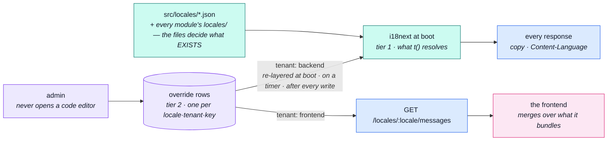

# locales

::: tip At a glance
**Owns** — which languages this deployment speaks, and the runtime overrides layered over the bundled copy.
**Depends on** — nothing. It has no barrel either: nothing may import it.
**Breaks if you change** — the `tenant` field. It decides which of two dictionaries a row patches.
:::

## Its neighbourhood

<!-- module-graph:locales:start -->

_Nothing reaches `locales` and it reaches nothing — no imports either way, no events either way. Deleting it takes one folder and this page, and no other page changes._

<!-- module-graph:locales:end -->

## The story

This is the subtlest module in the repo, and almost all of the subtlety is one distinction.

**There are two tiers, and they never merge.**

_Tier 1 is the API's own copy_ — `src/locales/*.json` plus every module's `locales/` folder, loaded
into i18next at boot. It is what `t()` resolves, what decides `Content-Language`, and it stays on
the filesystem permanently. It exists so a client can render copy _when no response arrives_, and
putting it behind a database would make it unavailable in exactly the outage it was created for.

_Tier 2 is the overrides_ — the two collections this module owns, edited at runtime by people who do
not open a code editor. One row per `(locale, tenant, key)`, and `tenant` says which dictionary it
patches — a keyspace, not a customer: `NODE_LOCALE_TENANT_BACKEND`/`_FRONTEND` name the two this
deployment starts with, and `NODE_LOCALE_TENANTS_EXTRA` may add more frontend ones (a mobile app, a
kiosk) that share the same rows and never collide with each other's keys:

| Tenant kind | Served by                           | Merged where                                                         |
| ----------- | ----------------------------------- | -------------------------------------------------------------------- |
| `frontend`  | `GET /locales/:locale/messages`     | the frontend, over what it bundles, key by key                       |
| `backend`   | nothing — never leaves this service | layered over tier 1 at boot, on a timer, and after every admin write |

::: warning Both halves are overrides, never dictionaries
Neither side may introduce a key its files do not already define and expect it to render. **The
files decide what exists; the rows decide what it says.**
:::

::: warning A language in the database does not mean the API can answer in it
`GET /locales` reports `tenants` per language rather than a bare list of tags, so "may I send
`Accept-Language: es`" and "may I download a Spanish dictionary" stay two questions. The demo
dataset registers `es` with no `src/locales/es.json` behind it precisely so the answers really are <!-- doc-paths:ignore -->
_no_ and _yes_.
:::

Nothing here is awaited on the request path. Mongo down, a language half-translated, a malformed
key — the worst outcome is one endpoint failing and the overlay going stale, while every other
response still resolves its copy from the files.

## The pipeline

The two tiers, and the two sinks they never share. Follow `tenant` and the whole module falls out.

Nothing on that diagram is awaited on the request path. Mongo down and the overlay goes stale while
every response still resolves its copy from the files.

## The translations collection

A third axis, unrelated to the two tiers above: not the shop's own UI copy, but content an editor
or translator writes — a product's `title`, its `description`. This module owns that collection
too, though nothing about it is a tier — see
[Internationalisation](../tools/i18n.md#tier-3-user-authored-content) for how it composes with tier
1's fallback locale and tier 2's `locales` collection.

One row per `(entityType, entityId, locale)`, unique on that triple
(`translations_entity_locale` in `src/modules/locales/model.ts`), including the fallback-language
row — there is no separate "source" flag, only the row whose `locale` equals the deployment's
fallback locale.

| field          | what it is                                                                                                                                                                                                                              |
| -------------- | --------------------------------------------------------------------------------------------------------------------------------------------------------------------------------------------------------------------------------------- |
| `entityType`   | A `translatables` registry key — `product` in V1, generic beyond it.                                                                                                                                                                    |
| `entityId`     | The translated document's id.                                                                                                                                                                                                           |
| `fields`       | `Record<string, string>` — `{ title, description }` for a product.                                                                                                                                                                      |
| `sourceDigest` | Hash of the fallback row's `fields` at the moment THIS row was translated. Absent on the fallback row itself — it can't be stale relative to its own content. A mismatch means the source changed since; nothing recomputes it on read. |
| `origin`       | `machine` or `human` — what a reviewer would prioritise. No workflow gate behind either: a write is live immediately.                                                                                                                   |
| `translatedBy` | Whoever last wrote the row, for the audit trail.                                                                                                                                                                                        |

`src/modules/locales/services/translations.ts` owns the write path: `planTranslationWrites`
validates a whole PATCH-shaped batch — the locale exists and is `active`, every field name is one
the registry declares for that `entityType` — before anything is written; `writePlannedTranslations`
applies it, and is also the one place that updates an entity's derived index column (its own
`title`/`description`, kept for sort and search only — see [`products`](./products.md)), so that
write can never vary by caller.

### The translator's door, and why it's not the only one

`GET`/`PATCH /locales/translations/{entityType}/{id}` is generic across whatever `translatables`
declares — words only, any registered entity, and it has no way to touch anything else about that
entity. A product also has its own write surface,
[`POST /products` / `PATCH /products/{id}`](./products.md#writing-translated-content), which
writes the SAME rows but alongside price, stock flags and the image, in one request.

Both doors stay, on purpose:

| door                                      | who        | may change a price | generic across entities |
| ----------------------------------------- | ---------- | ------------------ | ----------------------- |
| `/products/{id}`                          | editor     | **yes**            | no — products only      |
| `/locales/translations/{entityType}/{id}` | translator | **no**             | yes                     |

Collapsing them would mean handing the translator `products.manage` just so a form can save a title
alongside a price — the coupling `Translation` was carved out as its own CASL subject specifically
to avoid: a mistranslation can never become a mischanged price. The generic door also has to
outlive `product`: the next `translatables` entry — a category description, a CMS page, an email
template — gets no product-shaped write surface of its own.

::: warning A locale slot's three states, on either door
Absent leaves that language's row untouched; a `{ fields, … }` object upserts it; `null` deletes
it. An empty `fields` object is a 422, never treated as a delete, and `null` on the fallback locale
is a 422 too — deleting it would leave the entity with nothing to fall back to.
:::

### What happens when the translated thing goes away

| event                          | what happens to its translation rows                                                                                                                                                                         |
| ------------------------------ | ------------------------------------------------------------------------------------------------------------------------------------------------------------------------------------------------------------ |
| A product is **soft**-deleted  | Rows survive — a restore must not come back with no name in any language.                                                                                                                                    |
| A product is **hard**-deleted  | Rows are removed in the SAME operation, through `@infrastructure/i18n`'s port — never via the `product.deleted` event, which fires on both delete paths with an identical payload and can't tell them apart. |
| A language is deleted          | Its rows cascade with it, the way `localeEntrySchema` rows already do (`src/modules/locales/repository.ts`'s `deleteLocaleCascade`), reported back as a count.                                               |
| A language is only deactivated | Nothing — deactivating hides a language, it doesn't retire it.                                                                                                                                               |
| The FALLBACK locale itself     | Cannot be deleted or deactivated (`src/modules/locales/services/languages.ts`'s `rejectFallbackLocale`) — every entity's source row lives in it.                                                             |

## Related pages

- [Internationalisation](../tools/i18n.md) — the mechanism both tiers, and the translations collection, run on
- [`products`](./products.md) — the one entity translatable today, and its own write surface
- [Modules overview](./index.md) — the whole context map
- [Demo profile](../tools/demo-profile.md) — the seeded languages and which square of the grid each covers
- [Request Input](../theory/request-input.md) — how a locale is negotiated
