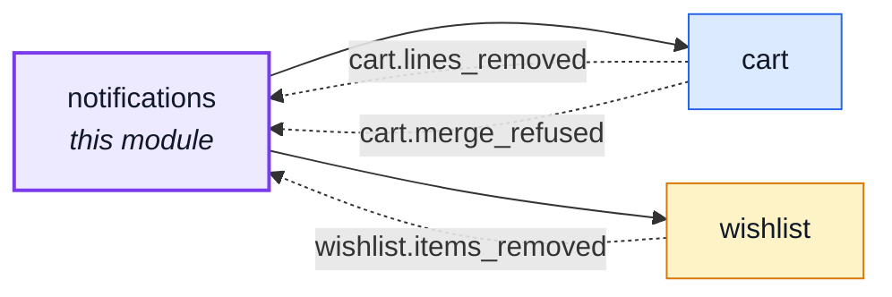
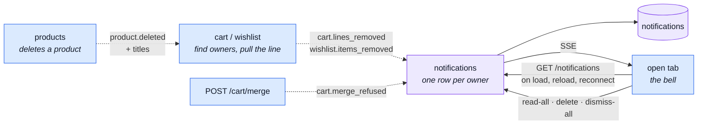

# notifications

::: tip At a glance
**Owns** — the per-user inbox: one row per message, kept until its owner deletes it.
**Depends on** — [`cart`](./cart.md) and [`wishlist`](./wishlist.md), only for the event names it listens to.
**Breaks if you change** — nothing outside this folder. No module imports it: a producer announces an event and never calls in.
:::

## Its neighbourhood

<!-- module-graph:notifications:start -->

_Solid arrows are imports. Dotted arrows are domain events — the return path an import
graph cannot see._

<!-- module-graph:notifications:end -->

## The story

A cart line that disappears used to leave nothing behind. A product is deleted, `cart` and
`wishlist` strip it from every list, and nobody is told. This module is where that message goes:
a row in a per-user inbox that stays until the user deletes it.

Two kinds of message exist, and only one lives here.

|             | Toast                    | Notification                         |
| ----------- | ------------------------ | ------------------------------------ |
| Lives in    | the page's memory        | the database, one row per user       |
| Lasts       | seconds, or until closed | until the owner deletes it           |
| Who sees it | anyone, guests too       | the signed-in owner, on every device |
| Written by  | the frontend             | this module, from a domain event     |

The backend stores a **code and its params, never the sentence**. The frontend translates the code
from its own locale files, like every other API code, so a row survives a language change and this
backend keeps no copy in step with the UI.

`Notification` is a discriminated union on `code`, and each variant types its own `params`:

| `code`                                | `params`                                        |
| ------------------------------------- | ----------------------------------------------- |
| `notifications.cart-line-removed`     | `{ productId, titles }`                         |
| `notifications.wishlist-item-removed` | `{ productId, titles }`                         |
| `notifications.cart-merge-refused`    | `{ lines: [{ productId, requested, titles }] }` |

The stored `params` is `Mixed` in Mongo, but the document type is the same union
(`NotificationBody` in `model.ts`), so a writer cannot pair a code with another code's params and
the presenter builds each variant without a cast. The SSE `notifications.created` payload is the
same union.

## The pipeline

## What decides what

- **Who reaches the inbox.** Only domain events. `cart` knows whose carts held a product, so `cart`
  emits `cart.lines_removed`; `notifications` never listens to `product.deleted` itself.
- **The merge message.** Only for guest-cart lines that could not be added at all (the product
  is not publicly visible: deleted or hidden). A sold-out or short product is added and flagged
  instead, and a line that landed with another quantity is the cart page's alert to show, not the
  inbox's: it can be seen again later, a vanished product cannot.
- **The product's name.** `product.deleted` carries `titles`, every translated name, read before a
  hard delete drops the translation rows. The notification copies them in: the product is gone, so
  nothing can be looked up afterwards. The reader sees their own language.
- **The cap.** The newest `NODE_NOTIFICATIONS_MAX_PER_USER` rows are kept (default 100); a write
  past that deletes the oldest. Without it one bulk delete can flood an inbox, and the inactivity
  reaper is off by default. GDPR (Art. 5(1)(e)) does not ask for an expiry here: the rows die with
  the account.
- **Read state.** `readAt` is set by `POST /notifications/read-all`, which the bell calls when it
  opens. The badge counts the unread; deleting is separate.
- **Delete is a hard delete.** One field fewer, and no "dismissed but still stored" personal data.
  Another user's id answers the same 404 as one that does not exist.
- **Live push.** `GET /notifications/stream` is Server-Sent Events, keyed by user, authenticated by
  the refresh cookie because an `EventSource` cannot send a header. It carries only what happens
  while a tab is open; `GET /notifications` is still how a tab starts. Per process, like the
  observability stream: a message written by another worker arrives at the next fetch.

## Personal data

A notification says what was in someone's cart, so it is personal data: it is in the account
export (`personalData.collect`) and removed with the account (`personalData.erase`, inside the
hard-delete transaction).

## Configuration

| Variable                          | Default | What                               |
| --------------------------------- | ------- | ---------------------------------- |
| `NODE_NOTIFICATIONS_MAX_PER_USER` | `100`   | Newest notifications kept per user |

## Related pages

- [`cart`](./cart.md) — `cart.lines_removed`, and `POST /cart/merge` with `cart.merge_refused`
- [`wishlist`](./wishlist.md) — `wishlist.items_removed`
- [`products`](./products.md) — `product.deleted` and its `titles`
- [Observability](./observability.md) — the SSE stream this one follows
- [Events & Logging](../tools/events-and-logging.md) — why events, and what the bus does not promise
