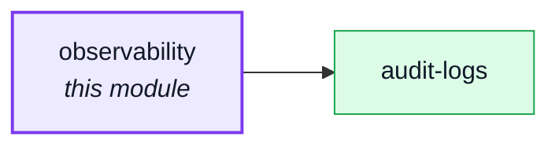
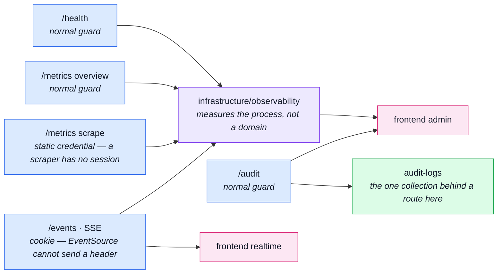

# observability

::: tip At a glance
**Owns** — the operator-facing surface: health, the metrics overview, the live SSE stream, the scrape endpoint, and the audit read.
**Depends on** — [`audit-logs`](./audit-logs.md), whose collection one of its routes reads.
**Breaks if you change** — the three authentication styles in `routes.ts`. They are not interchangeable.
:::

## Its neighbourhood

<!-- module-graph:observability:start -->

_Solid arrows are imports. Dotted arrows are domain events — the return path an import
graph cannot see._

<!-- module-graph:observability:end -->

## The story

This module owns **URLs, not data**. Everything it serves beyond the audit read comes from
`infrastructure/observability`, which measures the process rather than any domain — so it reads its
own numbers off infrastructure and owns no collection at all. That is also why it has no `model.ts`
and no `repository.ts`.

::: tip There is deliberately no `index.ts`
A barrel is a promise to sibling modules, and this one has nothing to promise. With no barrel the
boundary lint makes that structural: a sibling **cannot** import this module, rather than being
asked politely not to.
:::

Every route here is authenticated, and the three styles are chosen per route rather than shared:
the SSE stream authenticates by cookie because an `EventSource` cannot send a header, and the
Prometheus scrape endpoint takes a static credential because a scraper has no session. `routes.ts`
documents each choice at the line that makes it.

Deleting this module removes the dashboard, not the measurements. The metrics keep being collected;
nothing serves them.

Its two frontend counterparts are the clearest asymmetry in the pairing table: `admin` renders the
health and metrics reads, `realtime` consumes the stream. One backend module, two frontend ones.

## The pipeline

Five routes, three authentication styles, two frontend consumers — and one route that is the only
one reading a collection at all.

## Related pages

- [`audit-logs`](./audit-logs.md) — the collection behind the audit route
- [The Observability Layer](../tools/observability-layer.md) — what is measured and where
- [Observability Reference](../tools/observability-reference.md) — every metric and its meaning
- [Observability Endpoints](../api/observability.md) — the contract for these routes
- [AsyncAPI Workflow](../api/asyncapi-workflow.md) — the SSE stream's contract
