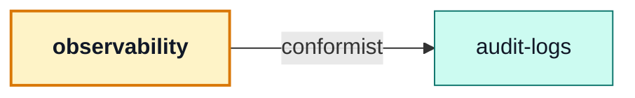

# observability

::: tip At a glance
**Owns** — the operator-facing surface: health, the metrics overview, the live SSE stream, the scrape endpoint, and the audit read.
**Depends on** — [`audit-logs`](./audit-logs.md), whose collection one of its routes reads.
**Breaks if you change** — the three authentication styles in `routes.ts`. They are not interchangeable.
:::

<!-- gen:identity:start -->

| Fact                     | This module                                                                                                                                                                                  |
| ------------------------ | -------------------------------------------------------------------------------------------------------------------------------------------------------------------------------------------- |
| **Subdomain**            | `generic` — A solved problem. Modelling effort here would be waste.                                                                                                                          |
| **Base path**            | `/observability`                                                                                                                                                                             |
| **Collection**           | _none_ — owns no collection                                                                                                                                                                  |
| **Depends on**           | [`audit-logs`](./audit-logs.md)                                                                                                                                                              |
| **Depended on by**       | _nothing_                                                                                                                                                                                    |
| **Languages**            | `en` · `it`                                                                                                                                                                                  |
| **Seeded**               | no                                                                                                                                                                                           |
| **Frontend counterpart** | `admin` + `realtime` in `boilerplate-vue-frontend` — Its two surfaces are consumed by two different frontend modules: the health and metrics reads by `admin`, the SSE stream by `realtime`. |

<!-- gen:identity:end -->

## The map

<!-- gen:map:start -->



- → `audit-logs` **conformist** — Renders audit entries exactly as that module stores them; `GET /observability/audit` adds a URL, not a model.

<!-- gen:map:end -->

## The story

This module owns **URLs, not data**. Everything it serves beyond the audit read comes from
`infrastructure/observability`, which measures the process rather than any domain — so it reads its
own numbers off infrastructure and owns no collection at all. That is also why it has no `model.ts`
and no `repository.ts`.

::: tip There is deliberately no `index.ts`
A barrel is a promise to sibling modules, and this one has nothing to promise. With no barrel the
boundary lint makes that structural: a sibling **cannot** import this module, rather than being
asked politely not to.
:::

Every route here is authenticated, and the three styles are chosen per route rather than shared:
the SSE stream authenticates by cookie because an `EventSource` cannot send a header, and the
Prometheus scrape endpoint takes a static credential because a scraper has no session. `routes.ts`
documents each choice at the line that makes it.

Deleting this module removes the dashboard, not the measurements. The metrics keep being collected;
nothing serves them.

Its two frontend counterparts are the clearest asymmetry in the pairing table: `admin` renders the
health and metrics reads, `realtime` consumes the stream. One backend module, two frontend ones.

## Data

<!-- gen:data:start -->

This module owns no collection. Whatever state it reads belongs to a module it depends on.

<!-- gen:data:end -->

## Surface

<!-- gen:surface:start -->

| Endpoint                              | Middlewares                      | Controller                        | What it does             |
| ------------------------------------- | -------------------------------- | --------------------------------- | ------------------------ |
| `GET /observability/audit`            | `getAuth` → `isAuth` → `isAdmin` | `getObservabilityAuditLogs`       | Recent audit events      |
| `GET /observability/events`           | `isAdminViaCookie`               | `(inline)`                        | Observability SSE stream |
| `GET /observability/health`           | `getAuth` → `isAuth` → `isAdmin` | `getObservabilityHealth`          | Health snapshot          |
| `GET /observability/metrics`          | `isMetricsScraper`               | `(inline)`                        | Prometheus metrics       |
| `GET /observability/metrics/overview` | `getAuth` → `isAuth` → `isAdmin` | `getObservabilityMetricsOverview` | Metrics overview (JSON)  |

Middlewares run left to right; the controller is the last handler on the route. Summaries come from this module’s own `openapi.yaml`, which is where they are edited.

<!-- gen:surface:end -->

## Signals

<!-- gen:signals:start -->

This module emits no domain events, writes nothing to the audit trail, registers no metrics and declares no probes. Its only output is its responses.

<!-- gen:signals:end -->

## Files

<!-- gen:files:start -->

| File                                                | What it is                                                                                                                                                   | Explained in                             |
| --------------------------------------------------- | ------------------------------------------------------------------------------------------------------------------------------------------------------------ | ---------------------------------------- |
| `asyncapi.yaml`                                     | This module's slice of the realtime contract, bundled the same way.                                                                                          | [read](../api/asyncapi-workflow.md)      |
| `controllers/get-observability-audit.ts`            | One operation: reads inputs, calls the service, answers through the response envelope, and catches.                                                          | [read](../theory/request-flow.md)        |
| `controllers/get-observability-health.ts`           | One operation: reads inputs, calls the service, answers through the response envelope, and catches.                                                          | [read](../theory/request-flow.md)        |
| `controllers/get-observability-metrics-overview.ts` | One operation: reads inputs, calls the service, answers through the response envelope, and catches.                                                          | [read](../theory/request-flow.md)        |
| `locales/en.json`                                   | This module's user-facing strings, one file per language.                                                                                                    | [read](../tools/i18n.md)                 |
| `locales/it.json`                                   | This module's user-facing strings, one file per language.                                                                                                    | [read](../tools/i18n.md)                 |
| `module.ts`                                         | The manifest — the only file the application loads directly. Declares the name, base path, router, dependency edges, locales, seeds and event subscriptions. | [read](../theory/modules.md)             |
| `openapi.yaml`                                      | This module's slice of the REST contract. The root `openapi.yaml` is bundled from these.                                                                     | [read](../api/contract-fragmentation.md) |
| `routes.ts`                                         | The URL surface — one line per endpoint, naming its middlewares, the role it requires and the controller it lands on.                                        | [read](../api/endpoints.md)              |
| `tests/contract/api.contract.test.ts`               | Contract suite — the responses, against the fragment.                                                                                                        | [read](../tools/contract-testing.md)     |
| `tests/unit/metrics-overview.test.ts`               | Unit suite — the rules, in isolation.                                                                                                                        | [read](../tools/unit-testing.md)         |

<!-- gen:files:end -->

## Working on it

<!-- gen:working:start -->

| Suite    | Files | Where                                       |
| -------- | ----- | ------------------------------------------- |
| Unit     | 1     | `src/modules/observability/tests/unit/`     |
| Contract | 1     | `src/modules/observability/tests/contract/` |

```bash
# every suite this module carries
npm run test:module -- src/modules/observability

# after editing this module’s openapi.yaml
npm run contracts:bundle && npm run lint:openapi:modules
```

<!-- gen:working:end -->

## Deeper in

<!-- gen:subpages:start -->

Nothing in this domain needs a page of its own — the story above is the whole of it.

<!-- gen:subpages:end -->

## Related pages

- [`audit-logs`](./audit-logs.md) — the collection behind the audit route
- [The Observability Layer](../tools/observability-layer.md) — what is measured and where
- [Observability Reference](../tools/observability-reference.md) — every metric and its meaning
- [Observability Endpoints](../api/observability.md) — the contract for these routes
- [AsyncAPI Workflow](../api/asyncapi-workflow.md) — the SSE stream's contract
