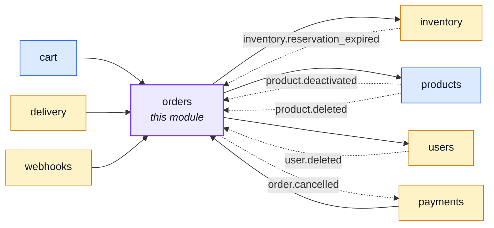
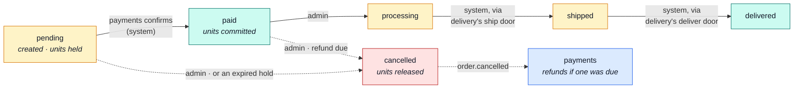
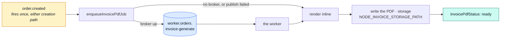

# orders

::: tip At a glance
**Owns** — placed orders: the line items frozen at purchase time, the status machine, and what cancelling restores.
**Depends on** — [`inventory`](./inventory.md) for the units, [`products`](./products.md) for the shape it embeds.
**Breaks if you change** — the `status` enum. Three other modules react to transitions in it.
:::

## Its neighbourhood

<!-- module-graph:orders:start -->

_Solid arrows are imports. Dotted arrows are domain events — the return path an import
graph cannot see._

<!-- module-graph:orders:end -->

## The story

This is the module with the real invariants: what an order totals, which status transitions are
legal, and what cancelling gives back. If any module here ever grows a proper aggregate, it is
this one.

**An order embeds a snapshot of the catalogue row rather than referencing it.** `items` carries its
own `orderLineProductSchema` — the OpenAPI `OrderLineProduct` shape, not `Product` — populated at
purchase time from [`products`](./products.md)'s live row, so a later edit cannot rewrite the
history of an order placed last March. It is deliberately its OWN schema rather than a reuse of
the catalogue's: `onHand` and `reserved` describe the warehouse right now, and an order line has no
path to store either — the alternative is an invoice that quietly republishes live stock as if it
were history.

The snapshot's `title`/`description` are already RESOLVED, not the product's raw fallback-locale
column: `items[].locale` (required on `OrderItem`) freezes which language they were resolved into at
purchase time, so an order confirmation and its invoice read in the buyer's language rather than
whatever the storefront happened to be showing. Reading the order back later must reproduce exactly
that, never re-resolve against whoever is reading it now — see
[Internationalisation](../tools/i18n.md#tier-3-user-authored-content).

The status enum is the module's public vocabulary:

| Status                  | What it means                                | Who moves it                                                                     |
| ----------------------- | -------------------------------------------- | -------------------------------------------------------------------------------- |
| `pending`               | created, unpaid, units held                  | checkout or an admin                                                             |
| `paid`                  | money taken, units committed                 | [`payments`](./payments.md) on confirm                                           |
| `processing`            | fulfilment started                           | admin                                                                            |
| `shipped` · `delivered` | fulfilment                                   | [`delivery`](./delivery.md), reporting a recorded handover/arrival               |
| `cancelled`             | units released, refund issued if one was due | admin, an expired hold, or the system when a held product is removed/deactivated |

Any of these except `paid` (`system`-only, absolute) can also be reached by an admin override with
a reason — see [Who writes the status](#who-writes-the-status) below.

::: warning Two modules reach back, and both do it through events
[`inventory`](./inventory.md) cancels an order when its hold times out (`inventory.reservation_expired`), and
this module announces `order.cancelled` so [`payments`](./payments.md) can refund. Neither is an
import, which is what keeps a mutually-aware pair acyclic.
:::

Each account reads back only its own orders; writing and soft-deleting is admin-only. The
`userId: 1, deletedAt: 1` index is what makes both of those cheap at once.

Three scheduled jobs, all nightly via `docker/crontab`: `npm run reap:orders` replaces an order's
remaining PII with placeholders once its post-account-deletion retention window has passed —
amounts, line items and dates survive, only the person is gone (an order is an invoice, never
deleted outright, unlike `payments`' abandoned attempts). `npm run sweep:order-effects` re-announces
`order.cancelled` for a refund the event bus's one delivery attempt did not carry through. `npm run
reap:invoices` deletes a stored invoice PDF with no order left to name it — the hard-delete path
cleans up its own file, this is the backstop for a row removed any other way. See
[Scheduled jobs](../reference/ops.md#scheduled-jobs) for the full mechanism.

## Creating an order

Every order, whoever makes it, is written through exactly one function — `placeOrder`
(`services/place.ts`): freeze the lines against the catalogue, allocate the invoice number, mint a
`bank_transfer` reference when that's the payment method (minted from the same id the write is
about to land on, so a retried place cannot mint a second one for the same order), hold the stock,
write the row. Everything caller-specific — payment-method validation, the open-transfer cap,
resolving a shipping address or method, cart pre-flight and clearing — stays with the caller;
`placeOrder` only takes what it needs to write and hold. See [Checkout](./cart-checkout.md#the-sequence)
for the storefront path in full.

`POST /orders` is the OTHER caller — the admin path — and it is deliberately minimal, because it
exists for manual corrections, not as a second sales channel:

- it takes a buyer, an email and line items, and nothing else — no payment method, no address, no
  shipping method, and no frontend screen behind it;
- it holds stock for the default reservation window like any other order, so an unpaid correction
  order is cancelled by the same nightly sweep as an abandoned checkout;
- carrying no address or shipping, it cannot be fulfilled through the warehouse's normal
  ship/deliver flow — moving it forward is the admin override's job (see below), not a parcel
  someone can actually hand over.

## The pipeline

The status enum above, drawn. Every solid edge is someone deciding; the dotted ones are this
module announcing and a sibling reacting.

Every one of these edges is still written by `orders` alone — `delivery`, `payments` and an admin
override all ASK for a move, never assign the field themselves. See
[Tactical DDD](../theory/tactical-ddd.md#who-writes-the-status) for the placement rule and
[Who writes the status](#who-writes-the-status) below for the permission rule and the override.

## Who writes the status

| Move                                        | Who asks                                                                         | Through                                |
| ------------------------------------------- | -------------------------------------------------------------------------------- | -------------------------------------- |
| `pending` → `paid`                          | `system`                                                                         | `payments`' settlement, on confirm     |
| `paid` → `processing`                       | `admin`                                                                          | `PUT /orders/:id`, `orders.any.update` |
| `processing` → `shipped`                    | `system`                                                                         | `POST /delivery/order/{id}/ship`       |
| `shipped` → `delivered`                     | `system`                                                                         | `POST /delivery/order/{id}/deliver`    |
| `pending`/`paid`/`processing` → `cancelled` | `customer` (own order, `pending`/`paid` only) or an operator (also `processing`) | `POST /orders/{id}/cancel`             |

### The admin override

A correction the ordinary table above cannot express — a mis-scanned parcel, a shipment recorded
against the wrong order — needs `orders.any.override`, a step-up permission granted to `admin` by
name. Two modes, both requiring a `reason`, both writing an embedded override-history entry
(who, when, from → to, mode, reason) plus an audit event:

- **Forced** — the delivery doors (`ship`/`deliver`) accept `forced: true` alongside the ordinary
  request. The regular operation still runs: a parcel record is created, a tracking code is
  required if the method needs one, the shipped email still sends. Only the status GATE is skipped
  — it may jump past `processing`, but never lands on `paid` (that stays `system`-only, absolute,
  echo included).
- **Status-only** — `POST /orders/{id}/status-override` with `{ to, reason }` moves the status
  alone, forward to `processing`/`shipped`/`delivered` only. No parcel, no shipped email — but
  webhooks still fire, since a subscriber's own view of the order genuinely changed.

`PUT /orders/:id` never accepts `shipped`/`delivered` from anyone, override holder included — the
override's own two doors are the only way to reach those statuses outside the ordinary sequence.

Either mode also commits the order's stock hold (`inventory.commitForOrder`) whenever it moves the
order out of `pending` — the same commit a normal payment confirmation triggers. Without it, the
reservation sweep would eventually release units an override already shipped, since the sweep only
knows the order is still `pending` from its own point of view.

## The invoice pipeline

`GET /orders/{id}/invoice` never renders on the request thread — every order's invoice generates
asynchronously, off the module's own `worker.orders.invoice-generate` queue
(`transport/invoice-pdf.ts`, `asyncapi.internal.yaml`), the same "a module owns its own queue"
shape `webhooks` set first. An order that predates this pipeline — no `invoicePdfStatus` at
all — or one `ready` with nothing on disk (a data anomaly) both self-heal the same way: the
controller queues a render (`enqueueInvoicePdfRetry`) and answers 202, exactly like an order still
waiting on its very first render.

A new order is written `pending` (the schema default), never absent — only an order from before
this field existed reads as absent. `GET /orders/{id}/invoice` branches on that field: `ready`
streams the stored file, `pending` answers `202` so a client can grey out the download button and
poll, and absent falls back to the pre-existing synchronous render. The confirmation email is
never held for the PDF to finish — it sends immediately, as it always has, linking to the order's
page; the download button there is what waits.

The job payload carries an order id and nothing else — never a template path or an output path.
The queue it replaces (`worker.pdf.generate`, domainless, in the shared workers contract) shipped a
producer-chosen template path and output path with no producer ever wired to publish to it: a
latent arbitrary-file-write, closed by removing the surface rather than guarding it. See
[RabbitMQ](../tools/rabbitmq.md#invoice-pdf-generation-async-module-owned).

## Configuration

| Variable                    | Default            | Meaning                                                                                                                                                                                             |
| --------------------------- | ------------------ | --------------------------------------------------------------------------------------------------------------------------------------------------------------------------------------------------- |
| `NODE_SHOP_COUNTRY`         | —                  | The shop's own jurisdiction — the only one VAT is ever charged at, no destination lookup. Required at boot; the manifest's `requiredConfig` refuses to start without it                             |
| `NODE_SHOP_VAT_NUMBER`      | —                  | The shop's VAT id, printed on the invoice. Optional — a deployment below the registration threshold prints no VAT number rather than a fake one                                                     |
| `NODE_SHOP_LEGAL_NAME`      | —                  | The shop's legal name, printed on the invoice — distinct from any storefront brand name                                                                                                             |
| `NODE_INVOICE_STORAGE_PATH` | `storage/invoices` | Where the invoice worker writes each order's stored PDF. Outside `NODE_PUBLIC_PATH` on purpose — an invoice is personal and financial data, reachable only through the authenticated download route |

The first three are read fresh per call (`config.ts`), so a correction needs no restart; an empty
string reads as unset, never as a blank invoice row. The VAT RATES charged against an order line
are a different thing with a different owner — see [products](./products.md#configuration); this
module only freezes onto the order the rate `products` hands it at checkout.

## Related pages

- [Modules overview](./index.md) — the whole context map
- [`inventory`](./inventory.md) — where the units actually move
- [`payments`](./payments.md) — the money half of the same transition
- [Tactical DDD](../theory/tactical-ddd.md) — why this is the aggregate candidate
- [Events & Logging](../tools/events-and-logging.md) — `order.cancelled` and `inventory.reservation_expired`
