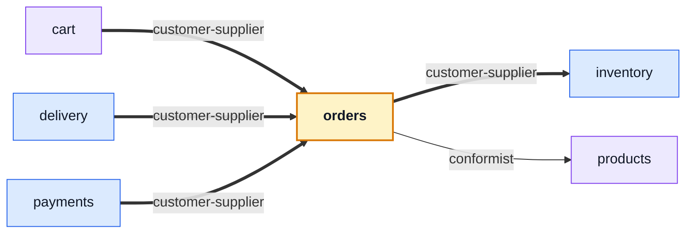

# orders

::: tip At a glance
**Owns** — placed orders: the line items frozen at purchase time, the status machine, and what cancelling restores.
**Depends on** — [`inventory`](./inventory.md) for the units, [`products`](./products.md) for the shape it embeds.
**Breaks if you change** — the `status` enum. Three other modules react to transitions in it.
:::

<!-- gen:identity:start -->

| Fact                     | This module                                                                           |
| ------------------------ | ------------------------------------------------------------------------------------- |
| **Subdomain**            | `core` — The reason the product exists. Worth entities, value objects and invariants. |
| **Base path**            | `/orders`                                                                             |
| **Collection**           | `orders` (model `Order`)                                                              |
| **Depends on**           | [`inventory`](./inventory.md) · [`products`](./products.md)                           |
| **Depended on by**       | [`cart`](./cart.md) · [`delivery`](./delivery.md) · [`payments`](./payments.md)       |
| **Languages**            | `en` · `it`                                                                           |
| **Seeded**               | yes — `orders` as `response`                                                          |
| **Frontend counterpart** | `orders` in `boilerplate-vue-frontend`                                                |

<!-- gen:identity:end -->

## The map

<!-- gen:map:start -->



- `cart` → **customer-supplier** — A checkout is the one place an order is created outside the admin routes.
- `delivery` → **customer-supplier** — A shipment is about an order: this module reads the order it ships and moves its status.
- `payments` → **customer-supplier** — A payment is about an order: the intent freezes its total, the confirm moves its status, and `order.cancelled` is what asks for the refund.
- → `inventory` **customer-supplier** — Creating an order holds its units and cancelling one gives them back; this module asks for both by name and never touches a counter itself.
- → `products` **conformist** — An order item embeds `productSchema` itself, so the catalogue’s shape is this module’s shape too.

<!-- gen:map:end -->

## The story

This is the module with the real invariants: what an order totals, which status transitions are
legal, and what cancelling gives back. If any module here ever grows a proper aggregate, it is
this one.

**An order embeds the catalogue row rather than referencing it.** `items` carries `productSchema`
itself, so a later edit to a product cannot rewrite the history of an order placed last March.
That is the whole reason [`products`](./products.md) publishes its schema and its serialisation
transform through its barrel — the alternative is an invoice that changes after it was paid.

The status enum is the module's public vocabulary:

| Status                                 | What it means                                | Who moves it                            |
| -------------------------------------- | -------------------------------------------- | --------------------------------------- |
| `pending`                              | created, unpaid, units held                  | checkout or an admin                    |
| `paid`                                 | money taken, units committed                 | [`payments`](./payments.md) on confirm  |
| `processing` · `shipped` · `delivered` | fulfilment                                   | admin, then [`delivery`](./delivery.md) |
| `cancelled`                            | units released, refund issued if one was due | admin, or an expired hold               |

::: warning Two modules reach back, and both do it through events
[`inventory`](./inventory.md) cancels an order when its hold times out (`reservation.expired`), and
this module announces `order.cancelled` so [`payments`](./payments.md) can refund. Neither is an
import, which is what keeps a mutually-aware pair acyclic.
:::

Each account reads back only its own orders; writing and soft-deleting is admin-only. The
`userId: 1, deletedAt: 1` index is what makes both of those cheap at once.

## Data

<!-- gen:data:start -->

#### `orders`

From model `Order`. `_id` and `__v` are omitted — every document carries them.

| Field             | Type            | Flags    | Default                           | Reference / values                                                             |
| ----------------- | --------------- | -------- | --------------------------------- | ------------------------------------------------------------------------------ |
| `userId`          | `ObjectId`      | required | —                                 | —                                                                              |
| `email`           | `String`        | required | —                                 | —                                                                              |
| `items`           | `Subdocument[]` | —        | —                                 | —                                                                              |
| ↳ `product`       | `Subdocument[]` | —        | —                                 | —                                                                              |
| ↳ ↳ `title`       | `String`        | required | —                                 | —                                                                              |
| ↳ ↳ `price`       | `Number`        | required | —                                 | —                                                                              |
| ↳ ↳ `onHand`      | `Number`        | —        | 100                               | —                                                                              |
| ↳ ↳ `reserved`    | `Number`        | —        | 0                                 | —                                                                              |
| ↳ ↳ `description` | `String`        | —        | ""                                | —                                                                              |
| ↳ ↳ `imageUrl`    | `String`        | —        | "https://placekitten.com/400/400" | —                                                                              |
| ↳ ↳ `categories`  | `Mixed[]`       | —        | []                                | —                                                                              |
| ↳ ↳ `tags`        | `Mixed[]`       | —        | []                                | —                                                                              |
| ↳ ↳ `active`      | `Boolean`       | —        | true                              | —                                                                              |
| ↳ ↳ `deletedAt`   | `Date`          | —        | —                                 | —                                                                              |
| ↳ ↳ `createdAt`   | `Date`          | —        | —                                 | —                                                                              |
| ↳ ↳ `updatedAt`   | `Date`          | —        | —                                 | —                                                                              |
| ↳ ↳ `__v`         | `Number`        | —        | —                                 | —                                                                              |
| ↳ `quantity`      | `Number`        | required | —                                 | —                                                                              |
| `status`          | `String`        | —        | "pending"                         | `pending` \| `paid` \| `processing` \| `shipped` \| `delivered` \| `cancelled` |
| `notes`           | `String`        | —        | —                                 | —                                                                              |
| `shippingMethod`  | `String`        | —        | —                                 | —                                                                              |
| `shippingCost`    | `Number`        | —        | —                                 | —                                                                              |
| `shippingAddress` | `Subdocument[]` | —        | —                                 | —                                                                              |
| ↳ `fullName`      | `String`        | required | —                                 | —                                                                              |
| ↳ `street`        | `String`        | required | —                                 | —                                                                              |
| ↳ `city`          | `String`        | required | —                                 | —                                                                              |
| ↳ `zip`           | `String`        | required | —                                 | —                                                                              |
| ↳ `country`       | `String`        | required | —                                 | —                                                                              |
| ↳ `phone`         | `String`        | —        | —                                 | —                                                                              |
| `deletedAt`       | `Date`          | —        | —                                 | —                                                                              |
| `createdAt`       | `Date`          | —        | —                                 | —                                                                              |
| `updatedAt`       | `Date`          | —        | —                                 | —                                                                              |

**Declared indexes**

| Keys                       | Options                       |
| -------------------------- | ----------------------------- |
| `userId: 1, createdAt: -1` | name: orders_userId_createdAt |
| `email: 1`                 | name: orders_email            |
| `userId: 1, deletedAt: 1`  | name: orders_userId_deletedAt |

<!-- gen:data:end -->

## Surface

<!-- gen:surface:start -->

| Endpoint                   | Middlewares                                                | Controller        | What it does                 |
| -------------------------- | ---------------------------------------------------------- | ----------------- | ---------------------------- |
| `DELETE /orders`           | `getAuth` → `isAuth` → `isAdmin` → `(inline)`              | `deleteOrder`     | Delete order                 |
| `GET /orders`              | `getAuth` → `isAuth` → `(inline)`                          | `getOrders`       | List orders (paginated)      |
| `POST /orders`             | `getAuth` → `isAuth` → `isAdmin` → `(inline)`              | `writeOrders`     | Create order                 |
| `PUT /orders`              | `getAuth` → `isAuth` → `isAdmin` → `(inline)`              | `writeOrders`     | Update order                 |
| `DELETE /orders/{id}`      | `getAuth` → `isAuth` → `isAdmin` → `(inline)`              | `deleteOrder`     | Delete order                 |
| `GET /orders/{id}`         | `getAuth` → `isAuth` → `(inline)`                          | `getOrderItem`    | Order details                |
| `PUT /orders/{id}`         | `getAuth` → `isAuth` → `isAdmin` → `(inline)`              | `writeOrders`     | Edit order                   |
| `POST /orders/{id}/cancel` | `getAuth` → `isAuth` → `(inline)`                          | `postCancelOrder` | Cancel order                 |
| `DELETE /orders/{id}/hard` | `getAuth` → `isAuth` → `isAdmin` → `(inline)` → `(inline)` | `deleteOrder`     | Permanently delete order     |
| `GET /orders/{id}/invoice` | `getAuth` → `isAuth` → `(inline)`                          | `getOrderInvoice` | Download order invoice (PDF) |
| `POST /orders/search`      | `getAuth` → `isAuth`                                       | `getOrders`       | Search orders (DTO-friendly) |

Middlewares run left to right; the controller is the last handler on the route. Summaries come from this module’s own `openapi.yaml`, which is where they are edited.

<!-- gen:surface:end -->

## Signals

<!-- gen:signals:start -->

#### Domain events

| Event                           | Direction                    |
| ------------------------------- | ---------------------------- |
| `order.cancelled`               | published by this module     |
| `order.status_changed`          | published by this module     |
| `inventory.reservation_expired` | subscribed to in `module.ts` |

#### Audit actions

| Constant               | Action name            |
| ---------------------- | ---------------------- |
| `ADMIN_ORDER_CREATED`  | `admin.order.created`  |
| `ADMIN_ORDER_UPDATED`  | `admin.order.updated`  |
| `ADMIN_ORDER_DELETED`  | `admin.order.deleted`  |
| `USER_ORDER_CANCELLED` | `user.order.cancelled` |

#### Analytics events

| Constant          | Event name        |
| ----------------- | ----------------- |
| `ORDER_CREATED`   | `order_created`   |
| `ORDER_CANCELLED` | `order_cancelled` |
| `ORDERS_VIEWED`   | `orders_viewed`   |

#### Metrics

| Collector             | Type    | Labels | Help                  |
| --------------------- | ------- | ------ | --------------------- |
| `order_created_total` | Counter | —      | Total orders created. |

#### Contract probes

Requests the contract cannot describe — the calls that prove this module refuses things.

| Call                                 | Probe                                                    |
| ------------------------------------ | -------------------------------------------------------- |
| `GET /orders/{{seedDeletedOrderId}}` | Probe: the owner asking for their own soft-deleted order |
| `GET /orders/{{seedOrderId}}`        | Probe: another user's order                              |

<!-- gen:signals:end -->

## Files

<!-- gen:files:start -->

| File                                      | What it is                                                                                                                                                   | Explained in                              |
| ----------------------------------------- | ------------------------------------------------------------------------------------------------------------------------------------------------------------ | ----------------------------------------- |
| `analytics.ts`                            | The product-analytics event names this module emits.                                                                                                         | [read](../tools/analytics.md)             |
| `audit.ts`                                | Which of this module’s operations reach the audit trail, and under what action names.                                                                        | [read](../tools/winston.md)               |
| `controllers/delete-orders.ts`            | One operation: reads inputs, calls the service, answers through the response envelope, and catches.                                                          | [read](../theory/request-flow.md)         |
| `controllers/get-order-invoice.ts`        | One operation: reads inputs, calls the service, answers through the response envelope, and catches.                                                          | [read](../theory/request-flow.md)         |
| `controllers/get-order-item.ts`           | One operation: reads inputs, calls the service, answers through the response envelope, and catches.                                                          | [read](../theory/request-flow.md)         |
| `controllers/get-orders.ts`               | One operation: reads inputs, calls the service, answers through the response envelope, and catches.                                                          | [read](../theory/request-flow.md)         |
| `controllers/post-cancel-order.ts`        | One operation: reads inputs, calls the service, answers through the response envelope, and catches.                                                          | [read](../theory/request-flow.md)         |
| `controllers/write-orders.ts`             | One operation: reads inputs, calls the service, answers through the response envelope, and catches.                                                          | [read](../theory/request-flow.md)         |
| `demo.ts`                                 | This module's seed fixtures, upserted through the shared seeding primitive.                                                                                  | [read](../tools/demo-profile.md)          |
| `domain/index.ts`                         | The domain barrel.                                                                                                                                           | [read](../theory/domain-layer.md)         |
| `domain/lifecycle.ts`                     | Pure rules over plain data — no Mongoose, no Express, and lint-guaranteed free of both.                                                                      | [read](../theory/domain-layer.md)         |
| `domain/money.ts`                         | Pure rules over plain data — no Mongoose, no Express, and lint-guaranteed free of both.                                                                      | [read](../theory/domain-layer.md)         |
| `domain/rules.ts`                         | Pure rules over plain data — no Mongoose, no Express, and lint-guaranteed free of both.                                                                      | [read](../theory/domain-layer.md)         |
| `domain/totals.ts`                        | Pure rules over plain data — no Mongoose, no Express, and lint-guaranteed free of both.                                                                      | [read](../theory/domain-layer.md)         |
| `emails.ts`                               | Which templates this module sends and what they are given.                                                                                                   | [read](../tools/email-and-rendering.md)   |
| `events.ts`                               | The domain events this module publishes and subscribes to.                                                                                                   | [read](../tools/events-and-logging.md)    |
| `factory.ts`                              | Fixture builders for tests, on top of the shared persistence factory.                                                                                        | [read](../tools/unit-testing.md)          |
| `index.ts`                                | The public barrel: the only surface a sibling module may import.                                                                                             | [read](../theory/strategic-ddd.md)        |
| `locales/en.json`                         | This module's user-facing strings, one file per language.                                                                                                    | [read](../tools/i18n.md)                  |
| `locales/it.json`                         | This module's user-facing strings, one file per language.                                                                                                    | [read](../tools/i18n.md)                  |
| `metrics.ts`                              | The domain counters and histograms this module registers with Prometheus.                                                                                    | [read](../tools/prometheus.md)            |
| `model.ts`                                | The Mongoose schema, its indexes and its serialisation rules — the collection's shape.                                                                       | [read](../tools/mongodb-mongoose.md)      |
| `module.ts`                               | The manifest — the only file the application loads directly. Declares the name, base path, router, dependency edges, locales, seeds and event subscriptions. | [read](../theory/modules.md)              |
| `openapi.yaml`                            | This module's slice of the REST contract. The root `openapi.yaml` is bundled from these.                                                                     | [read](../api/contract-fragmentation.md)  |
| `probes.ts`                               | The requests the contract cannot describe — the calls that prove the API refuses things.                                                                     | [read](../tools/contract-request-data.md) |
| `repository.ts`                           | Every query this module makes, on the shared base repository. The only tier that talks to Mongoose.                                                          | [read](../tools/mongodb-mongoose.md)      |
| `routes.ts`                               | The URL surface — one line per endpoint, naming its middlewares, the role it requires and the controller it lands on.                                        | [read](../api/endpoints.md)               |
| `service.ts`                              | The domain decision, and the layer that owns status-code meaning.                                                                                            | [read](../theory/layers.md)               |
| `tests/contract/api.contract.test.ts`     | Contract suite — the responses, against the fragment.                                                                                                        | [read](../tools/contract-testing.md)      |
| `tests/factory.ts`                        | Fixture builders used only by this module’s own suites.                                                                                                      | [read](../tools/unit-testing.md)          |
| `tests/unit/audit.test.ts`                | Unit suite — the rules, in isolation.                                                                                                                        | [read](../tools/unit-testing.md)          |
| `tests/unit/cancel.test.ts`               | Unit suite — the rules, in isolation.                                                                                                                        | [read](../tools/unit-testing.md)          |
| `tests/unit/domain-rules.test.ts`         | Unit suite — the rules, in isolation.                                                                                                                        | [read](../tools/unit-testing.md)          |
| `tests/unit/invoice-locale.test.ts`       | Unit suite — the rules, in isolation.                                                                                                                        | [read](../tools/unit-testing.md)          |
| `tests/unit/lifecycle.test.ts`            | Unit suite — the rules, in isolation.                                                                                                                        | [read](../tools/unit-testing.md)          |
| `tests/unit/model.test.ts`                | Unit suite — the rules, in isolation.                                                                                                                        | [read](../tools/unit-testing.md)          |
| `tests/unit/money.property.test.ts`       | Unit suite — the rules, in isolation.                                                                                                                        | [read](../tools/unit-testing.md)          |
| `tests/unit/repository.test.ts`           | Unit suite — the rules, in isolation.                                                                                                                        | [read](../tools/unit-testing.md)          |
| `tests/unit/schema-contract.test.ts`      | Unit suite — the rules, in isolation.                                                                                                                        | [read](../tools/unit-testing.md)          |
| `tests/unit/serialization-guards.test.ts` | Unit suite — the rules, in isolation.                                                                                                                        | [read](../tools/unit-testing.md)          |
| `tests/unit/service-crud.test.ts`         | Unit suite — the rules, in isolation.                                                                                                                        | [read](../tools/unit-testing.md)          |
| `tests/unit/service-scope.test.ts`        | Unit suite — the rules, in isolation.                                                                                                                        | [read](../tools/unit-testing.md)          |
| `tests/unit/service-search.test.ts`       | Unit suite — the rules, in isolation.                                                                                                                        | [read](../tools/unit-testing.md)          |
| `tests/unit/totals.property.test.ts`      | Unit suite — the rules, in isolation.                                                                                                                        | [read](../tools/unit-testing.md)          |

<!-- gen:files:end -->

## Working on it

<!-- gen:working:start -->

| Suite    | Files | Where                                |
| -------- | ----- | ------------------------------------ |
| Unit     | 14    | `src/modules/orders/tests/unit/`     |
| Contract | 1     | `src/modules/orders/tests/contract/` |

```bash
# every suite this module carries
npm run test:module -- src/modules/orders

# after editing this module’s openapi.yaml
npm run contracts:bundle && npm run lint:openapi:modules

# after editing this module’s seeds
npm run db:seed && npm run check:seed-export
```

<!-- gen:working:end -->

## Deeper in

<!-- gen:subpages:start -->

Nothing in this domain needs a page of its own — the story above is the whole of it.

<!-- gen:subpages:end -->

## Related pages

- [Modules overview](./index.md) — the whole context map
- [`inventory`](./inventory.md) — where the units actually move
- [`payments`](./payments.md) — the money half of the same transition
- [Tactical DDD](../theory/tactical-ddd.md) — why this is the aggregate candidate
- [Events & Logging](../tools/events-and-logging.md) — `order.cancelled` and `reservation.expired`
