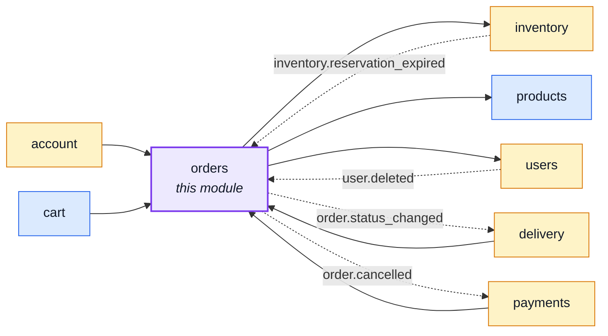
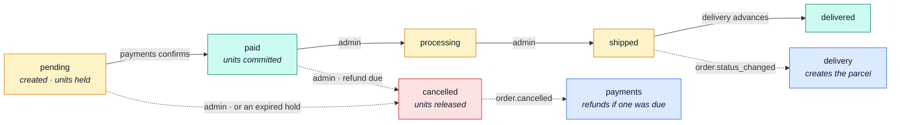

# orders

::: tip At a glance
**Owns** — placed orders: the line items frozen at purchase time, the status machine, and what cancelling restores.
**Depends on** — [`inventory`](./inventory.md) for the units, [`products`](./products.md) for the shape it embeds.
**Breaks if you change** — the `status` enum. Three other modules react to transitions in it.
:::

## Its neighbourhood

<!-- module-graph:orders:start -->

_Solid arrows are imports. Dotted arrows are domain events — the return path an import
graph cannot see._

<!-- module-graph:orders:end -->

## The story

This is the module with the real invariants: what an order totals, which status transitions are
legal, and what cancelling gives back. If any module here ever grows a proper aggregate, it is
this one.

**An order embeds a snapshot of the catalogue row rather than referencing it.** `items` carries its
own `orderLineProductSchema` — the OpenAPI `OrderLineProduct` shape, not `Product` — populated at
purchase time from [`products`](./products.md)'s live row, so a later edit cannot rewrite the
history of an order placed last March. It is deliberately its OWN schema rather than a reuse of
the catalogue's: `onHand` and `reserved` describe the warehouse right now, and an order line has no
path to store either — the alternative is an invoice that quietly republishes live stock as if it
were history.

The snapshot's `title`/`description` are already RESOLVED, not the product's raw fallback-locale
column: `items[].locale` (required on `OrderItem`) freezes which language they were resolved into at
purchase time, so an order confirmation and its invoice read in the buyer's language rather than
whatever the storefront happened to be showing. Reading the order back later must reproduce exactly
that, never re-resolve against whoever is reading it now — see
[Internationalisation](../tools/i18n.md#tier-3-user-authored-content).

The status enum is the module's public vocabulary:

| Status                                 | What it means                                | Who moves it                            |
| -------------------------------------- | -------------------------------------------- | --------------------------------------- |
| `pending`                              | created, unpaid, units held                  | checkout or an admin                    |
| `paid`                                 | money taken, units committed                 | [`payments`](./payments.md) on confirm  |
| `processing` · `shipped` · `delivered` | fulfilment                                   | admin, then [`delivery`](./delivery.md) |
| `cancelled`                            | units released, refund issued if one was due | admin, or an expired hold               |

::: warning Two modules reach back, and both do it through events
[`inventory`](./inventory.md) cancels an order when its hold times out (`reservation.expired`), and
this module announces `order.cancelled` so [`payments`](./payments.md) can refund. Neither is an
import, which is what keeps a mutually-aware pair acyclic.
:::

Each account reads back only its own orders; writing and soft-deleting is admin-only. The
`userId: 1, deletedAt: 1` index is what makes both of those cheap at once.

## The pipeline

The status enum above, drawn. Every solid edge is someone deciding; the dotted ones are this
module announcing and a sibling reacting.

## Related pages

- [Modules overview](./index.md) — the whole context map
- [`inventory`](./inventory.md) — where the units actually move
- [`payments`](./payments.md) — the money half of the same transition
- [Tactical DDD](../theory/tactical-ddd.md) — why this is the aggregate candidate
- [Events & Logging](../tools/events-and-logging.md) — `order.cancelled` and `reservation.expired`
