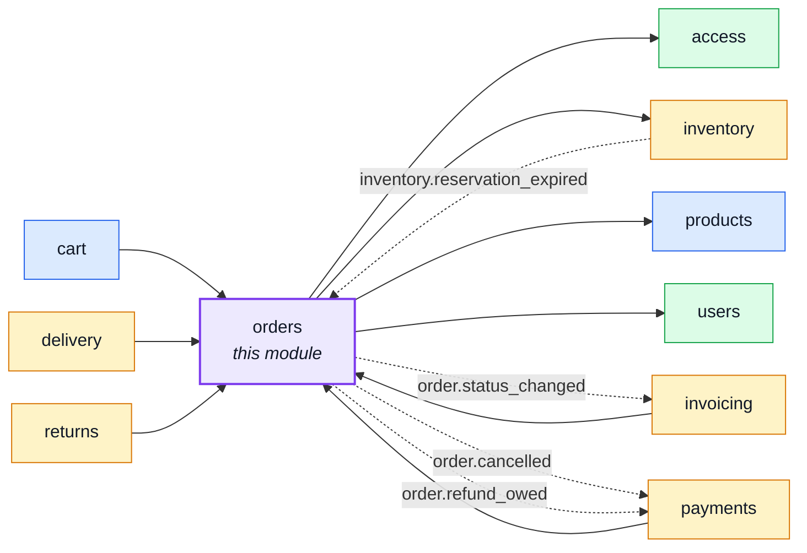
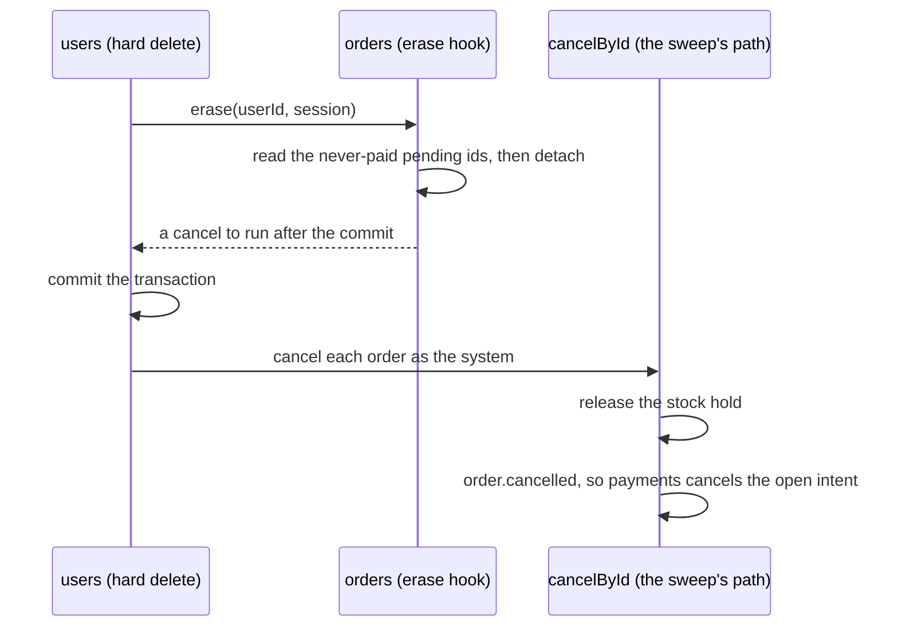
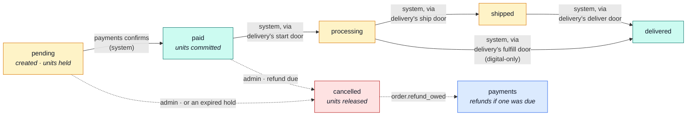
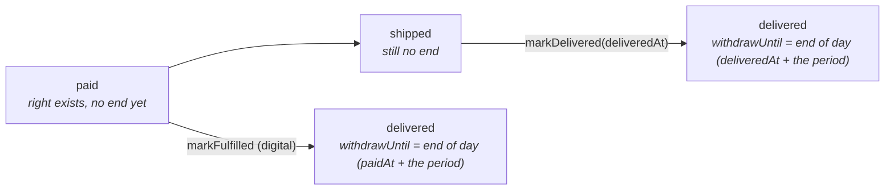
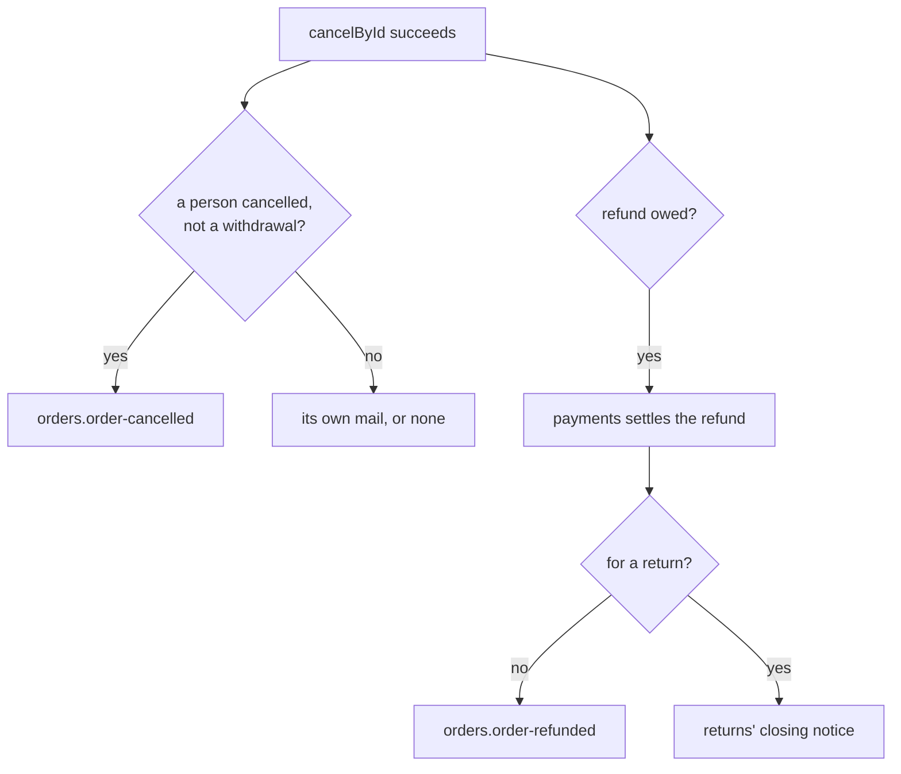

# orders

::: tip At a glance
**Owns** — placed orders: the line items frozen at purchase time, the status machine, and what cancelling restores.
**Depends on** — [`inventory`](./inventory.md) for the units, [`products`](./products.md) for the shape it embeds.
**Breaks if you change** — the `status` enum. Three other modules react to transitions in it.
:::

## Its neighbourhood

<!-- module-graph:orders:start -->

_Solid arrows are imports. Dotted arrows are domain events — the return path an import
graph cannot see._

```mermaid
%%{init: {'flowchart': {'nodeSpacing': 30, 'rankSpacing': 60}}}%%
flowchart LR
    orders["orders<br/><i>this module</i>"]
    access["access"]
    cart["cart"]
    delivery["delivery"]
    inventory["inventory"]
    invoicing["invoicing"]
    payments["payments"]
    products["products"]
    returns["returns"]
    users["users"]

    cart --> orders
    delivery --> orders
    invoicing --> orders
    payments --> orders
    returns --> orders
    orders --> access
    orders --> inventory
    orders --> products
    orders --> users
    inventory -. "inventory.reservation_expired" .-> orders
    orders -. "order.status_changed" .-> invoicing
    orders -. "order.cancelled" .-> payments
    orders -. "order.refund_owed" .-> payments

    classDef core fill:#dbeafe,stroke:#2563eb,color:#111827;
    classDef supporting fill:#fef3c7,stroke:#d97706,color:#111827;
    classDef generic fill:#dcfce7,stroke:#16a34a,color:#111827;
    classDef centre fill:#ede9fe,stroke:#7c3aed,stroke-width:2px,color:#111827;
    class cart,products core;
    class delivery,inventory,invoicing,payments,returns supporting;
    class access,users generic;
    class orders centre;
```

<!-- module-graph:orders:end -->

## The story

This is the module with the real invariants: what an order totals, which status transitions are
legal, and what cancelling gives back. If any module here ever grows a proper aggregate, it is
this one.

**An order embeds a snapshot of the catalogue row rather than referencing it.** `items` carries its
own `orderLineProductSchema` — the OpenAPI `OrderLineProduct` shape, not `Product` — populated at
purchase time from [`products`](./products.md)'s live row, so a later edit cannot rewrite the
history of an order placed last March. It is deliberately its OWN schema rather than a reuse of
the catalogue's: `onHand` and `reserved` describe the warehouse right now, and an order line has no
path to store either — the alternative is an invoice that quietly republishes live stock as if it
were history.

The snapshot's `title`/`description` are already RESOLVED, not the product's raw fallback-locale
column: `items[].locale` (required on `OrderItem`) freezes which language they were resolved into at
purchase time, so an order confirmation and its invoice read in the buyer's language rather than
whatever the storefront happened to be showing. Reading the order back later must reproduce exactly
that, never re-resolve against whoever is reading it now — see
[Internationalisation](../tools/i18n.md#tier-3-user-authored-content).

The status enum is the module's public vocabulary:

| Status                  | What it means                                | Who moves it                                                                                                          |
| ----------------------- | -------------------------------------------- | --------------------------------------------------------------------------------------------------------------------- |
| `pending`               | created, unpaid, units held                  | checkout or an admin                                                                                                  |
| `paid`                  | money taken, units committed                 | [`payments`](./payments.md) on confirm                                                                                |
| `processing`            | fulfilment started                           | [`delivery`](./delivery.md), reporting a recorded fulfilment-start fact (until that door exists, an admin correction) |
| `shipped` · `delivered` | fulfilment                                   | [`delivery`](./delivery.md), reporting a recorded handover/arrival                                                    |
| `cancelled`             | units released, refund issued if one was due | admin, or an expired hold. A product removed or deactivated afterwards does not cancel it                             |

Any of these except `paid` (`system`-only, absolute) can also be reached by an admin override with
a reason — see [Who writes the status](#who-writes-the-status) below.

::: warning Two modules reach back, and both do it through events
[`inventory`](./inventory.md) cancels an order when its hold times out (`inventory.reservation_expired`), and
this module announces `order.refund_owed` (split from `order.cancelled` itself, so retrying the
refund never re-delivers the customer-facing cancellation webhook — B6) so [`payments`](./payments.md)
can refund. Neither is an import, which is what keeps a mutually-aware pair acyclic.
:::

Each account reads back only its own orders; writing and soft-deleting is admin-only. The
`userId: 1, deletedAt: 1` index is what makes both of those cheap at once.

Three scheduled jobs, all nightly via `docker/crontab`: `npm run reap:orders` replaces an order's
remaining PII (email, shipping name/phone/street, notes) with placeholders once
`NODE_ORDER_PII_RETENTION_DAYS` has passed from the order's OWN `createdAt`, counted from account
erasure or that date, whichever is later — amounts, line items and dates survive, only the person
is gone. An admin can still hard-delete an UNPAID order outright (`services/remove.ts`'s `remove`) —
this reap is what protects the far more common case, the order nobody ever deletes. A paid order
refuses a hard delete instead, once and for as long as `paidAt` is stamped: `invoicing` freezes a
legal document from that same transition, and it must survive the order it was issued for. `npm run
sweep:order-effects` re-announces `order.refund_owed` for a refund the event bus's one delivery
attempt did not carry through. See [Scheduled jobs](../reference/ops.md#scheduled-jobs) for the
full mechanism.

## When the account is erased

A hard delete of an account runs `orders`' `personalData.erase` hook inside the erasure
transaction. Two things happen to the account's orders, by whether the buyer ever paid:

| Order                                           | What erasure does                                                                      |
| ----------------------------------------------- | -------------------------------------------------------------------------------------- |
| Paid (`paidAt` set), in any status              | Detached (`userId` unset) and scheduled for scrubbing, nothing else: it is the invoice |
| Never paid (`paidAt` unset) and still `pending` | Detached, due for scrubbing at once, **and cancelled**                                 |

```mermaid
sequenceDiagram
    participant U as users (hard delete)
    participant O as orders (erase hook)
    participant S as cancelById (the sweep's path)
    U->>O: erase(userId, session)
    O->>O: read the never-paid pending ids, then detach
    O-->>U: a cancel to run after the commit
    U->>U: commit the transaction
    U->>S: cancel each order as the system
    S->>S: release the stock hold
    S->>S: order.cancelled, so payments cancels the open intent
```

The cancel is the one the reservation sweep takes when a hold times out, so it releases the hold
and, through `order.cancelled`, cancels the payment intent. It runs after the commit because it
moves stock and talks to a provider, neither of which a rolled-back erasure could undo. It sends
no mail: the address belongs to an account that no longer exists. A failed cancel is logged and
never undoes the erasure; the sweep still cancels it when the hold times out (up to 168 hours for
a bank transfer), which is the late case that already existed.

## Creating an order

Every order, whoever makes it, is written through exactly one function — `placeOrder`
(`services/place.ts`): freeze the lines against the catalogue, hold the stock, allocate the order
number, mint a `bank_transfer` reference when that's the payment method (minted from the same id
the write is about to land on, so a retried place cannot mint a second one for the same order),
write the row. **The hold comes before the write, deliberately**: a refused hold then writes
nothing at all — no order to roll back and no order number burned on a sale that never happened.
Everything caller-specific — payment-method validation, the open-transfer cap, resolving a shipping
address or method, cart pre-flight and clearing — stays with the caller; `placeOrder` only takes
what it needs to hold and write. See [Checkout](./cart-checkout.md#the-sequence) for the storefront
path in full.

Two frozen addresses ride on the order, both snapshots like the lines (an order keeps where it went
and whom it was billed to, not what the address book says today):

| Field             | Present when                                                | Read by                                |
| ----------------- | ----------------------------------------------------------- | -------------------------------------- |
| `shippingAddress` | a line ships to an address (not digital-only, not a pickup) | the warehouse, the order page          |
| `billingAddress`  | every checkout order                                        | the invoice (Art. 226), the order page |

The split is Shopify's: a digital-only order is invoiced to someone but ships nowhere, so it freezes
no shipping address. Billing is "same as shipping" unless the buyer names another entry
([how checkout resolves it](./cart-checkout.md#the-sequence)); the admin's `POST /orders` runs no
checkout and carries neither. The retention scrub anonymises both.

`POST /orders` is the OTHER caller — the admin path — and it is deliberately minimal, because it
exists for manual corrections, not as a second sales channel:

- it takes a buyer, an email and line items, and nothing else — no payment method, no address, no
  shipping method, and no frontend screen behind it;
- it holds stock for the default reservation window like any other order, so an unpaid correction
  order is cancelled by the same nightly sweep as an abandoned checkout;
- carrying no address or shipping, it cannot be fulfilled through the warehouse's normal
  ship/deliver flow — moving it forward is the admin override's job (see below), not a parcel
  someone can actually hand over.

## The pipeline

The status enum above, drawn. Every solid edge is someone deciding; the dotted ones are this
module announcing and a sibling reacting.

```mermaid
%%{init: {'flowchart': {'nodeSpacing': 30, 'rankSpacing': 55}}}%%
flowchart LR
    P["pending<br/><i>created · units held</i>"] -->|"payments confirms<br/>(system)"| PA["paid<br/><i>units committed</i>"]
    PA -->|"system, via<br/>delivery's start door"| PR["processing"]
    PR -->|"system, via<br/>delivery's ship door"| SH["shipped"]
    SH -->|"system, via<br/>delivery's deliver door"| DE["delivered"]
    PR -->|"system, via<br/>delivery's fulfill door<br/>(digital-only)"| DE
    P -.->|"admin · or an expired hold"| CA["cancelled<br/><i>units released</i>"]
    PA -.->|"admin · refund due"| CA
    CA -. "order.refund_owed" .-> PM["payments<br/><i>refunds if one was due</i>"]

    classDef open fill:#fef3c7,stroke:#d97706,color:#111827;
    classDef done fill:#ccfbf1,stroke:#0f766e,color:#111827;
    classDef bad fill:#fee2e2,stroke:#b91c1c,color:#111827;
    classDef peer fill:#dbeafe,stroke:#2563eb,color:#111827;
    class P,PR,SH open;
    class PA,DE done;
    class CA bad;
    class PM peer;
```

Every one of these edges is still written by `orders` alone — `delivery`, `payments` and an admin
override all ASK for a move, never assign the field themselves. See
[Tactical DDD](../theory/tactical-ddd.md#who-writes-the-status) for the placement rule and
[Who writes the status](#who-writes-the-status) below for the permission rule and the override.

## Who writes the status

| Move                                        | Who asks                                                                         | Through                                                                                                                 |
| ------------------------------------------- | -------------------------------------------------------------------------------- | ----------------------------------------------------------------------------------------------------------------------- |
| `pending` → `paid`                          | `system`                                                                         | `payments`' settlement, on confirm                                                                                      |
| `paid` → `processing`                       | `system`                                                                         | `POST /delivery/order/{id}/start`, `delivery.any.start` — or `POST /orders/{id}/status-override`, `orders.any.override` |
| `processing` → `shipped`                    | `system`                                                                         | `POST /delivery/order/{id}/ship`                                                                                        |
| `shipped` → `delivered`                     | `system`                                                                         | `POST /delivery/order/{id}/deliver`                                                                                     |
| `processing` → `delivered` (digital-only)   | `system`                                                                         | `POST /delivery/order/{id}/fulfill` — no parcel; refused if any line still needs shipping                               |
| `pending`/`paid`/`processing` → `cancelled` | `customer` (own order, `pending`/`paid` only) or an operator (also `processing`) | `POST /orders/{id}/cancel`                                                                                              |

### The admin override

A correction the ordinary table above cannot express — a mis-scanned parcel, a shipment recorded
against the wrong order — needs `orders.any.override`, a step-up permission granted to `admin` by
name. Two modes, both requiring a `reason`, both writing an embedded override-history entry
(who, when, from → to, mode, reason) plus an audit event:

- **Forced** — the delivery doors (`ship`/`deliver`) accept `forced: true` alongside the ordinary
  request. The regular operation still runs: a parcel record is created, a tracking code is
  required if the method needs one, the shipped email still sends. Only the status GATE is skipped
  — it may jump past `processing`, but never lands on `paid` (that stays `system`-only, absolute,
  echo included).
- **Status-only** — `POST /orders/{id}/status-override` with `{ to, reason }` moves the status
  alone, forward to `processing`/`shipped`/`delivered` only. No parcel, no shipped email — but
  webhooks still fire, since a subscriber's own view of the order genuinely changed.

`PUT /orders/:id` carries no `status` field at all — the override's own two doors are the only way
to reach `processing`/`shipped`/`delivered` outside the ordinary sequence, override holder included.

Either mode also commits the order's stock hold (`inventory.commitForOrder`) whenever it moves the
order out of `pending` — the same commit a normal payment confirmation triggers. Without it, the
reservation sweep would eventually release units an override already shipped, since the sweep only
knows the order is still `pending` from its own point of view.

## The invoice

`orderNumber` is Shopify's `#1001`, not a fiscal sequence: gaps are fine (E13), and it names this
order alone. The actual tax invoice — a frozen document, its own numbering series, credit notes on
refund — is [`invoicing`](./invoicing.md), a module this one has no import of and no wiring for:
`invoicing` depends on `orders`, never the reverse, and reaches its own `GET /orders/{id}/invoice`
and `GET /orders/{id}/credit-notes` by sharing this module's `/orders` basePath (the same pattern
[`addresses`](./addresses.md) uses on `/account`).

The only trace of that relationship here is `paidAt` (`model.ts`), stamped by `services/status.ts`'s
`markPaid` in the same write that moves an order to `paid` — the proxy `services/scope.ts`'s
`actions.invoice` flag and `services/remove.ts`'s hard-delete refusal both read, so neither has to ask
`invoicing` whether the freeze actually landed.

The placed-order email carries no invoice: nothing is invoiced yet at that point, whatever the
payment method — see [`invoicing`](./invoicing.md) for what changed and why.

## The withdrawal window

The EU right of withdrawal (Consumer Rights Directive Art. 9 and 11a) is decided here and made in
[`returns`](./returns.md#the-withdrawal-button). `orders` cannot import `returns`, `payments` or `delivery`, so what it
owns is the clock and the button:

```mermaid
flowchart LR
    paid["paid<br/><i>right exists, no end yet</i>"] --> shipped["shipped<br/><i>still no end</i>"]
    shipped -- "markDelivered(deliveredAt)" --> goods["delivered<br/><i>withdrawUntil = end of day (deliveredAt + the period)</i>"]
    paid -- "markFulfilled (digital)" --> digital["delivered<br/><i>withdrawUntil = end of day (paidAt + the period)</i>"]
```

- **`withdrawUntil` is frozen, never recomputed** — the same "freeze the fact at the moment it
  happens" rule `shippingCost` and `currency` follow, so a config change cannot move a promise
  already made. Goods count from delivery (Art. 9(2)(b)); digital content from the conclusion of the
  contract (Art. 9(2)(c)), which is `paidAt` here. `delivery` reports the timestamp through
  `markDelivered(orderId, deliveredAt)`; `orders` cannot read `delivery`'s own.
- **The window ends with the last hour of its last day.** The day of the event is not counted and
  the last day of the period is counted whole (CRD recital 41 → Regulation 1182/71 Art. 3(1),
  3(2)(c)), in UTC.
- **No weekend or holiday roll-over is computed.** Art. 3(4) moves a deadline that lands on one to
  the next working day; closing early would be illegal, offering more never is. So the period is
  long enough that the move cannot matter:

    |                                                                    | days |
    | ------------------------------------------------------------------ | ---- |
    | the legal period                                                   | 14   |
    | longest weekend + holiday run in any EU country (Denmark's Easter) | +5   |
    | UTC day counting                                                   | +1   |
    | needed                                                             | 20   |
    | minimum, a day to spare                                            | 21   |

    The default is 30, a common return window.

- **Before either has happened the window has no end** — the right exists from the moment the
  contract is concluded, so `withdrawUntil` is absent, not far in the future.
- **The button is server-driven.** `OrderActions.withdraw` is true for the order's own buyer (not an
  operator reading it) while the status is withdrawable and the window is open; `withdrawUntil`
  rides along once the clock has started. A client never counts days.
- An admin override into `delivered` starts the clock at the override, since no delivery timestamp
  exists for it.

## Cancel and refund mails

Every cancel and every refund leaves one written trace, and each has exactly one mail:

| What happened                                      | The mail                                                                      | Template                                                     |
| -------------------------------------------------- | ----------------------------------------------------------------------------- | ------------------------------------------------------------ |
| The customer, or staff, cancelled                  | what the cancel did to their money: going back, no refund, or nothing charged | `orders.order-cancelled`                                     |
| The reservation sweep cancelled (a hold timed out) | the expiry notice for the payment method                                      | `orders.order-transfer-expired`, `orders.order-card-expired` |
| The customer withdrew before dispatch              | `returns`' withdrawal acknowledgement                                         | `returns.notice`                                             |
| The account was erased                             | none: the address belongs to an account that no longer exists                 |                                                              |
| Money went back outside a return                   | the amount, and whether it was everything                                     | `orders.order-refunded`                                      |
| Money went back for a return                       | `returns`' closing notice                                                     | `returns.notice`                                             |

```mermaid
flowchart TD
    cancel["cancelById succeeds"] --> person{"a person cancelled,<br/>not a withdrawal?"}
    person -- yes --> cancelled["orders.order-cancelled"]
    person -- no --> own["its own mail, or none"]
    cancel --> owed{"refund owed?"}
    owed -- yes --> refund["payments settles the refund"]
    refund --> ret{"for a return?"}
    ret -- no --> refunded["orders.order-refunded"]
    ret -- yes --> closed["returns' closing notice"]
```

The cancelled mail is sent when the cancel happens, so it says what is being returned. The refunded
mail is sent when `payments` settles the refund, so it only ever says what already went back. A paid
cancel therefore sends both, a few moments apart. A refund the provider refused sends nothing: no
money moved.

## Shop identity

`orders` owns who the shop is, because `invoicing`, `delivery` and `returns` all import `orders` and
`orders` may not import them back. One slice (`config.ts`), three getters:

| Getter                 | Returns                                                                      | Read by                                   |
| ---------------------- | ---------------------------------------------------------------------------- | ----------------------------------------- |
| `shopIdentity()`       | legal name, VAT number (if set), address, country, email, phone              | `invoicing` (the seller block), the email |
| `returnAddress()`      | the configured return address, or the legal address when it is not fully set | `delivery`, `returns`, the email          |
| `returnPostagePayer()` | `consumer` (default) or `shop`                                               | `returns`, the email                      |

Everything but the VAT number and the return address is required at boot, so a getter never answers
`undefined`. A partly-set return address counts as none.

### What the placed-order emails carry

Both placed-order emails, the confirmation and the bank-transfer instructions that replace it, end
with the same partial (`templates/partials/orders.withdrawal-notice.ejs`). The text goes in the body,
not behind a link: a web page is not a durable medium (CJEU C-49/11). `withdrawalNotice()` in
`emails.ts` builds it from the official Annex I wording, and picks one of three cases:

| Case    | When                                 | What it says                                                      |
| ------- | ------------------------------------ | ----------------------------------------------------------------- |
| goods   | a withdrawable line ships            | Annex I(A), period from receipt, where goods go, who pays postage |
| digital | every withdrawable line is digital   | Annex I(A), period from the contract; no return paragraphs        |
| none    | every line is excluded under Art. 16 | only the Art. 6(1)(k) sentence: no instructions, no form          |

The "online" sentence is Annex I(A) note 3 as Directive 2023/2673 rewrote it, because the shop has a
withdrawal function (Art. 11a): it points at the order page and promises the acknowledgement on a
durable medium. The Italian is the Official Journal's text, copied, not translated.

Lines excluded under Art. 16 are named when others are not. The model form (Annex I(B)) has its "To"
row filled with the shop. The refund and return legs always say 14 days, the statutory figure, even
when the shop offers a longer withdrawal period.

## Configuration

| Variable                                                           | Default             | Meaning                                                                                                                                                                                          |
| ------------------------------------------------------------------ | ------------------- | ------------------------------------------------------------------------------------------------------------------------------------------------------------------------------------------------ |
| `NODE_SHOP_COUNTRY`                                                | —                   | The shop's own jurisdiction — the only one VAT is ever charged at, no destination lookup. Required at boot; its slice (`config.ts`) refuses to start without it                                  |
| `NODE_SHOP_LEGAL_NAME`                                             | —                   | The shop's legal name. Required. Printed on invoices and in the withdrawal notice                                                                                                                |
| `NODE_SHOP_STREET`, `_CITY`, `_ZIP`                                | —                   | The shop's postal address. Required                                                                                                                                                              |
| `NODE_SHOP_EMAIL`                                                  | —                   | Where a customer writes to (checked as an email). Required. Not the no-reply sender                                                                                                              |
| `NODE_SHOP_PHONE`                                                  | —                   | The shop's telephone number. Required                                                                                                                                                            |
| `NODE_SHOP_VAT_NUMBER`                                             | —                   | VAT identification number. Optional: a shop below the registration threshold prints none                                                                                                         |
| `NODE_RETURN_ADDRESS_NAME`, `_STREET`, `_CITY`, `_ZIP`, `_COUNTRY` | —                   | Where returned goods go. Optional; street, city, zip and country must all be set, or the shop's own address is used                                                                              |
| `NODE_RETURN_POSTAGE_PAYER`                                        | `consumer`          | Who pays to send the goods back: `consumer` or `shop`. Said in the order email, frozen on each return                                                                                            |
| `NODE_SHIP_TO_COUNTRIES`                                           | `NODE_SHOP_COUNTRY` | Comma-separated ISO-3166 codes checkout will ship a physical order to; a resolved address outside it refuses with 422 once the chosen method needs one. Defaults to the shop's own country alone |
| `NODE_WITHDRAWAL_PERIOD_DAYS`                                      | `14`                | Days a consumer has to withdraw. 14 is the legal minimum, so a smaller value is refused at read; a shop may offer longer                                                                         |

The VAT RATES charged against an order line are a different thing with a different owner — see
[products](./products.md#configuration); this module only freezes onto the order the rate `products`
hands it at checkout. Every getter asks its slice (`config.ts`) per call, and the slice parses once per process, so a
correction takes effect on restart.

## Related pages

- [Modules overview](./index.md) — the whole context map
- [`inventory`](./inventory.md) — where the units actually move
- [`payments`](./payments.md) — the money half of the same transition
- [Tactical DDD](../theory/tactical-ddd.md) — why this is the aggregate candidate
- [Events & Logging](../tools/events-and-logging.md) — `order.cancelled` and `inventory.reservation_expired`
