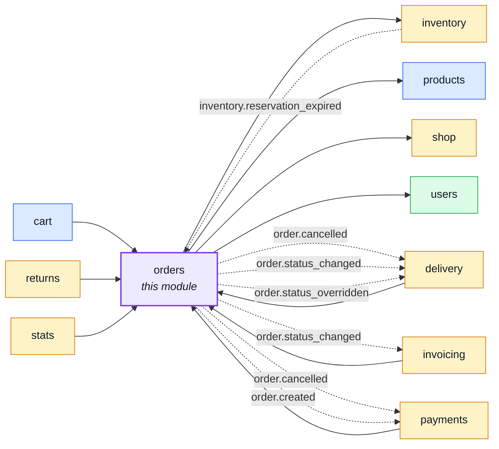
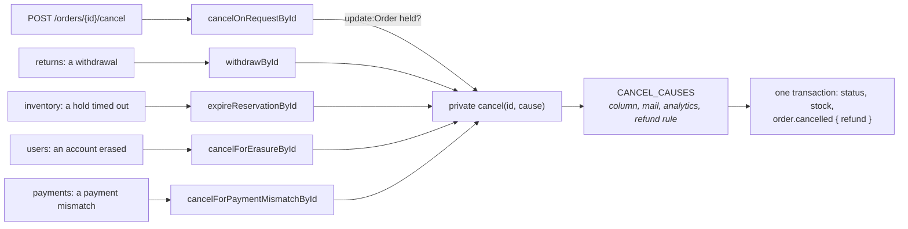
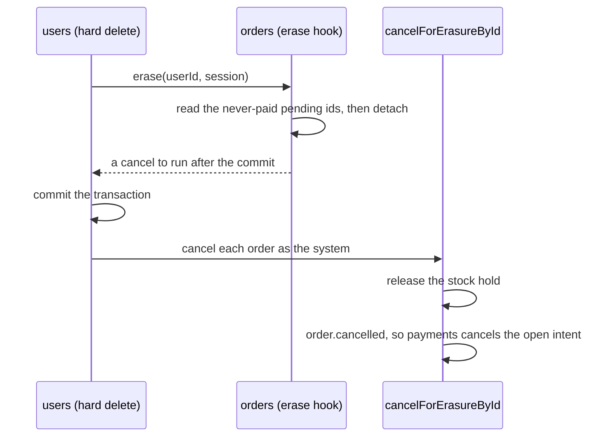
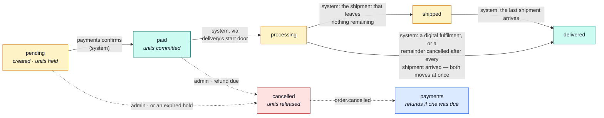
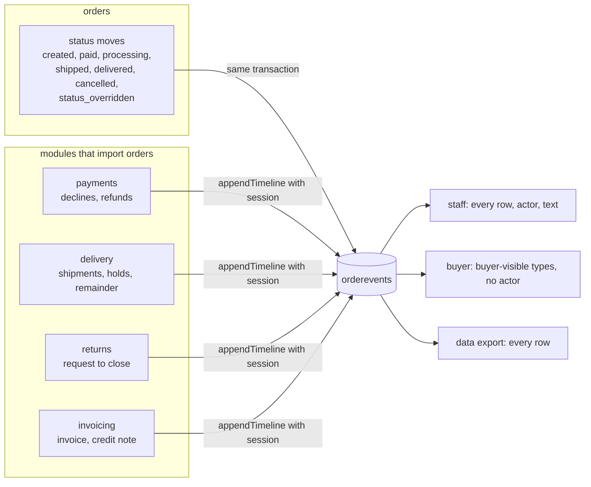
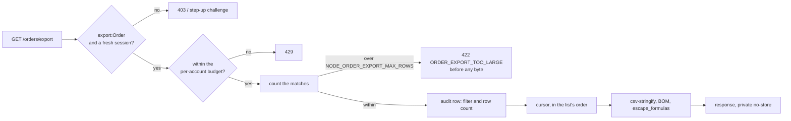
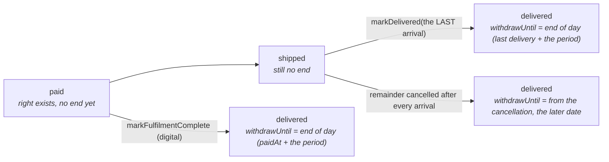
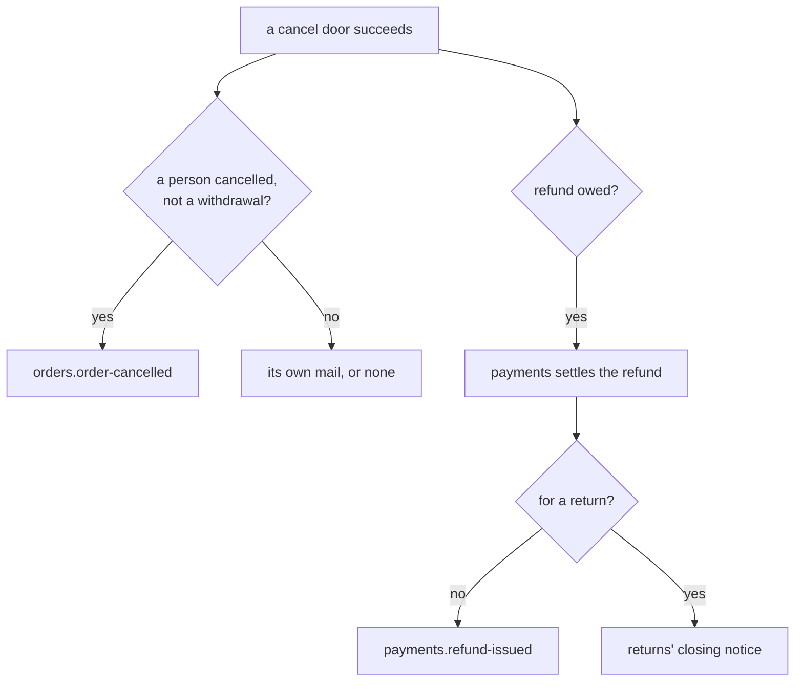

# orders

::: tip At a glance
**Owns** — placed orders: the line items frozen at purchase time, the status machine, and what cancelling restores.
**Depends on** — [`inventory`](./inventory.md) for the units, [`products`](./products.md) for the shape it embeds.
**Breaks if you change** — the `status` enum. Three other modules react to transitions in it.
:::

## Its neighbourhood

<!-- module-graph:orders:start -->

_Solid arrows are imports. Dotted arrows are domain events — the return path an import
graph cannot see._

```mermaid
%%{init: {'flowchart': {'nodeSpacing': 30, 'rankSpacing': 60}}}%%
flowchart LR
    orders["orders<br/><i>this module</i>"]
    cart["cart"]
    delivery["delivery"]
    inventory["inventory"]
    invoicing["invoicing"]
    payments["payments"]
    products["products"]
    returns["returns"]
    shop["shop"]
    stats["stats"]
    users["users"]

    cart --> orders
    delivery --> orders
    invoicing --> orders
    payments --> orders
    returns --> orders
    stats --> orders
    orders --> inventory
    orders --> products
    orders --> shop
    orders --> users
    inventory -. "inventory.reservation_expired" .-> orders
    orders -. "order.cancelled" .-> delivery
    orders -. "order.status_changed" .-> delivery
    orders -. "order.status_overridden" .-> delivery
    orders -. "order.status_changed" .-> invoicing
    orders -. "order.cancelled" .-> payments
    orders -. "order.created" .-> payments

    classDef core fill:#dbeafe,stroke:#2563eb,color:#111827;
    classDef supporting fill:#fef3c7,stroke:#d97706,color:#111827;
    classDef generic fill:#dcfce7,stroke:#16a34a,color:#111827;
    classDef centre fill:#ede9fe,stroke:#7c3aed,stroke-width:2px,color:#111827;
    class cart,products core;
    class delivery,inventory,invoicing,payments,returns,shop,stats supporting;
    class users generic;
    class orders centre;
```

<!-- module-graph:orders:end -->

## The story

This is the module with the real invariants: what an order totals, which status transitions are
legal, and what cancelling gives back. If any module here ever grows a proper aggregate, it is
this one.

**An order embeds a snapshot of the catalogue row rather than referencing it.** `items` carries its
own `orderLineProductSchema` — the OpenAPI `OrderLineProduct` shape, not `Product` — populated at
purchase time from [`products`](./products.md)'s live row, so a later edit cannot rewrite the
history of an order placed last March. It is deliberately its OWN schema rather than a reuse of
the catalogue's: `onHand` and `reserved` describe the warehouse right now, and an order line has no
path to store either — the alternative is an invoice that quietly republishes live stock as if it
were history.

The snapshot's `title`/`description` are already RESOLVED, not the product's raw fallback-locale
column: `items[].locale` (required on `OrderItem`) freezes which language they were resolved into at
purchase time, so an order confirmation and its invoice read in the buyer's language rather than
whatever the storefront happened to be showing. Reading the order back later must reproduce exactly
that, never re-resolve against whoever is reading it now — see
[Internationalisation](../tools/i18n.md#tier-3-user-authored-content).

The snapshot also freezes what a preorder promised: `preorder: true` and the `releaseDate` the
buyer saw. Both are decided once at checkout and never re-derived: the date passing, or an admin moving
it, must not change what this order bought (CRD Art. 18 treats the date shown when ordering as the
agreed one), and a bank transfer may be paid a week after the order was placed.
[`delivery`](./delivery.md) groups the lines into fulfillment orders from this frozen pair, and the
hold takes the product's preorder allowance instead of a shelf unit.

The status enum is the module's public vocabulary:

| Status                  | What it means                                | Who moves it                                                                                                                                                             |
| ----------------------- | -------------------------------------------- | ------------------------------------------------------------------------------------------------------------------------------------------------------------------------ |
| `pending`               | created, unpaid, units held                  | checkout or an admin                                                                                                                                                     |
| `paid`                  | money taken, units committed                 | [`payments`](./payments.md) on confirm                                                                                                                                   |
| `processing`            | fulfilment started                           | [`delivery`](./delivery.md), reporting a recorded fulfilment-start fact (until that door exists, an admin correction)                                                    |
| `shipped` · `delivered` | fulfilment                                   | [`delivery`](./delivery.md): `shipped` once the LAST unit has left (an order shipped in parts stays `processing` until then), `delivered` once the last shipment arrived |
| `cancelled`             | units released, refund issued if one was due | admin, or an expired hold. A product hidden, taken off sale or removed afterwards does not cancel it ([why](./products.md#hiding-taking-off-sale-removing))              |

An operator's cancel (a caller holding `update:Order`) asks for a fresh session first, since it
can refund or keep a paid order's money (`401 REAUTH_REQUIRED` on a stale one); the buyer's own
cancel is never prompted. Holding the key is the whole rule: there is no rank, so an operator
cancels a staff member's order, or their own, like anyone's.

### The cancel doors

Cancelling has one door per reason, over one private `cancel` and one table of causes
(`CANCEL_CAUSES` in `services/cancel.ts`). The reason is a value the caller states by choosing a
door, never inferred from which argument was left out. The table decides the lifecycle column the
move is read from, the mail, the analytics event name and whether the caller picks the refund.

```mermaid
%%{init: {'flowchart': {'nodeSpacing': 25, 'rankSpacing': 40}}}%%
flowchart LR
    R["POST /orders/{id}/cancel"] --> D1["cancelOnRequestById"]
    W["returns: a withdrawal"] --> D2["withdrawById"]
    X["inventory: a hold timed out"] --> D3["expireReservationById"]
    E["users: an account erased"] --> D4["cancelForErasureById"]
    P["payments: a payment mismatch"] --> D5["cancelForPaymentMismatchById"]
    D1 -->|"update:Order held?"| C["private cancel(id, cause)"]
    D2 --> C
    D3 --> C
    D4 --> C
    D5 --> C
    C --> T["CANCEL_CAUSES<br/><i>column, mail, analytics, refund rule</i>"]
    T --> M["one transaction: status, stock,<br/>order.cancelled { refund }"]
```

| Door                           | Cause                 | Column     | Buyer is mailed        | Refund                                |
| ------------------------------ | --------------------- | ---------- | ---------------------- | ------------------------------------- |
| `cancelOnRequestById`          | `customer`            | customer   | the cancelled notice   | always                                |
| `cancelOnRequestById`          | `operator`            | admin      | the cancelled notice   | the operator's `refund`, default true |
| `withdrawById`                 | `withdrawal`          | withdrawal | `returns` acknowledges | always                                |
| `expireReservationById`        | `reservation_expired` | system     | the expiry notice      | whatever was paid                     |
| `cancelForErasureById`         | `erasure`             | system     | nobody                 | whatever was paid                     |
| `cancelForPaymentMismatchById` | `payment_mismatch`    | system     | nobody                 | whatever was paid                     |
| `cancelUnanswered`             | `wait_unanswered`     | fulfilment | the cancelled notice   | always (its own `from` set)           |

The one door that serves two actors, `cancelOnRequestById`, resolves which inside the service: a
caller holding `update:Order` is the operator. The controller never makes that decision. A new
reason is a new row and a new door.

Any of these except `paid` (`system`-only, absolute) can also be reached by an admin override with
a reason — see [Who writes the status](#who-writes-the-status) below.

::: warning Two modules reach back, and both do it through events
[`inventory`](./inventory.md) cancels an order when its hold times out (`inventory.reservation_expired`), and
this module announces `order.cancelled` with the `refund` it owes, so [`payments`](./payments.md)
can open the refund from the same outbox row. Neither is an import, which is what keeps a mutually-aware pair acyclic.
The `refund` flag is the cancel's policy, for `payments` alone: the public `order.cancelled` webhook
carries only `{ orderId }`, since "owed" is not "paid back", and a subscriber hears `payment.refunded`
when money actually moved.
:::

Each account reads back only its own orders; writing and soft-deleting is admin-only, and an order can be soft-deleted (hidden) only once it is `cancelled`. The
`userId: 1, deletedAt: 1` index is what makes both of those cheap at once.

Two scheduled jobs via `docker/crontab`. `npm run reap:orders`, nightly, replaces an order's
remaining PII (email, shipping name/phone/street, notes) with placeholders once
`NODE_ORDER_PII_RETENTION_DAYS` has passed from the order's OWN `createdAt` — due at `createdAt`
plus that many days, or at once when account erasure or inactivity minimisation comes later; a
never-paid order is due at once — amounts, line items and dates survive, only the person is gone. An account inactive past `NODE_INACTIVE_MINIMISE_DAYS` starts the same clock through this
module's `personalData.minimise` hook, keeping its `userId`; a live, active account's orders keep
their personal fields, since order history is part of the contract
([why](../theory/data-retention.md#orders-kept-while-the-account-lives)). An admin can still hard-delete an order, but only one that is `cancelled` and was never paid
(`services/remove.ts`'s `remove`): the cancel owns every end-of-order effect (stock, payment intent,
`order.cancelled`), so an open order answers 409 `ORDER_NOT_CANCELLED` until it is cancelled. This
reap is what protects the far more common case, the order nobody ever deletes. A paid order refuses
a hard delete instead (409 `ORDER_INVOICED`), once and for as long as `paidAt` is stamped:
`invoicing` freezes a legal document from that same transition, and it must survive the order it
was issued for. The refusal does not trust the document the caller read: the hard delete is one
`deleteOne` that filters on `status: cancelled` and `paidAt: null`, so a settlement or a reopen
that commits in between turns it into the matching 409.

## When the account is erased

A hard delete of an account runs `orders`' `personalData.erase` hook inside the erasure
transaction. Two things happen to the account's orders, by whether the buyer ever paid:

| Order                                           | What erasure does                                                                      |
| ----------------------------------------------- | -------------------------------------------------------------------------------------- |
| Paid (`paidAt` set), in any status              | Detached (`userId` unset) and scheduled for scrubbing, nothing else: it is the invoice |
| Never paid (`paidAt` unset) and still `pending` | Detached, due for scrubbing at once, **and cancelled**                                 |

```mermaid
sequenceDiagram
    participant U as users (hard delete)
    participant O as orders (erase hook)
    participant S as cancelForErasureById
    U->>O: erase(userId, session)
    O->>O: read the never-paid pending ids, then detach
    O-->>U: a cancel to run after the commit
    U->>U: commit the transaction
    U->>S: cancel each order as the system
    S->>S: release the stock hold
    S->>S: order.cancelled, so payments cancels the open intent
```

The cancel is the system's own (`cancelForErasureById`, the lifecycle column the reservation
sweep's expiry uses), so it releases the hold and, through `order.cancelled`, cancels the payment
intent. It runs after the commit because it
moves stock and talks to a provider, neither of which a rolled-back erasure could undo. It sends
no mail: the address belongs to an account that no longer exists. A failed cancel is logged and
never undoes the erasure; the sweep still cancels it when the hold times out (up to 168 hours for
a bank transfer).

## Creating an order

Every order, whoever makes it, is written through exactly one function — `placeOrder`
(`services/place.ts`): freeze the lines against the catalogue, hold the stock, allocate the order
number, write the row. A `bank_transfer` order's reference, instructions and payment are
[`payments`'](./payments.md#bank-transfer): its `order.created` listener opens them. **The hold comes before the write, deliberately**: a refused hold then writes
nothing at all — no order to roll back and no order number burned on a sale that never happened.
Everything caller-specific — payment-method validation, the open-order cap (owned by `cart`), resolving a shipping
address or method, cart pre-flight and clearing — stays with the caller; `placeOrder` only takes
what it needs to hold and write. See [Checkout](./cart-checkout.md#the-sequence) for the storefront
path in full.

A line the shelf only half covered carries what it owes, frozen like the rest of it: `backorderedQuantity`
(how many of `quantity` were owed), `promisedAt` (the product's restock date, else the day it was
placed plus 30 days) and `promiseDated` (whether that was a date the product named). The confirmation
email prints each line's promise, `ships from {date}` for a preorder and `{n} to arrive by {date}` or
`within 30 days` for owed units (CRD Art. 8(7)(a)); `delivery` reads the same frozen fields to make a
fulfillment order of the owed part.

Two frozen addresses ride on the order, both snapshots like the lines (an order keeps where it went
and whom it was billed to, not what the address book says today):

| Field             | Present when                                                | Read by                                |
| ----------------- | ----------------------------------------------------------- | -------------------------------------- |
| `shippingAddress` | a line ships to an address (not digital-only, not a pickup) | the warehouse, the order page          |
| `billingAddress`  | every checkout order                                        | the invoice (Art. 226), the order page |

The split is Shopify's: a digital-only order is invoiced to someone but ships nowhere, so it freezes
no shipping address. Billing is "same as shipping" unless the buyer names another entry
([how checkout resolves it](./cart-checkout.md#the-sequence)); the admin's `POST /orders` runs no
checkout and carries neither. The retention scrub unsets both, with the notes.

Both addresses and the notes are stored encrypted (`pii.ts`, AES-256-GCM, the order `_id` in the
associated data) and decrypted in `applyOrderTransform`'s `after` hook, so no reader sees
ciphertext and `GET /orders` has no `notes` filter: an encrypted field cannot be searched. The
write door is `orderRepository.create`, which every writer goes through. `orders.email` stays
plaintext, because it is filtered and sorted on. Why an explicit codec, not mongoose getters:
`toJSON` would ship ciphertext, copying a foreign subdocument would double-encrypt, and a setter
runs on query filters, so an encrypted path in a filter silently matches nothing. The invoicing
issuers decrypt the order's address (`billingAddressOf`) and re-encrypt it under the invoice's own
id (`invoicing/pii.ts`); only the PDF render decrypts it again.

`POST /orders` is the OTHER caller — the admin path — and it is deliberately minimal, because it
exists for manual corrections, not as a second sales channel:

- it takes a buyer, an email and line items, and nothing else — no payment method, no address, no
  shipping method, and no frontend screen behind it;
- it sells the shelf a shopper buys from: a hidden, off-sale or soft-deleted product is refused with
  `409 ORDER_PRODUCT_UNAVAILABLE` (`isSellable`, the three facts checkout refuses on), every refused
  product named in `details.productIds`;
- it holds stock for the default reservation window like any other order, so an unpaid correction
  order is cancelled by the same reservation sweep as an abandoned checkout;
- carrying no address or shipping, it cannot be fulfilled through the warehouse's normal
  ship/deliver flow — moving it forward is the admin override's job (see below), not a parcel
  someone can actually hand over.

## The pipeline

The status enum above, drawn. Every solid edge is someone deciding; the dotted ones are this
module announcing and a sibling reacting.

```mermaid
%%{init: {'flowchart': {'nodeSpacing': 30, 'rankSpacing': 55}}}%%
flowchart LR
    P["pending<br/><i>created · units held</i>"] -->|"payments confirms<br/>(system)"| PA["paid<br/><i>units committed</i>"]
    PA -->|"system, via<br/>delivery's start door"| PR["processing"]
    PR -->|"system: the shipment that leaves<br/>nothing remaining"| SH["shipped"]
    SH -->|"system: the last shipment arrives"| DE["delivered"]
    PR -->|"system: a digital fulfilment, or a<br/>remainder cancelled after every<br/>shipment arrived — both moves at once"| DE
    P -.->|"admin · or an expired hold"| CA["cancelled<br/><i>units released</i>"]
    PA -.->|"admin · refund due"| CA
    CA -. "order.cancelled" .-> PM["payments<br/><i>refunds if one was due</i>"]

    classDef open fill:#fef3c7,stroke:#d97706,color:#111827;
    classDef done fill:#ccfbf1,stroke:#0f766e,color:#111827;
    classDef bad fill:#fee2e2,stroke:#b91c1c,color:#111827;
    classDef peer fill:#dbeafe,stroke:#2563eb,color:#111827;
    class P,PR,SH open;
    class PA,DE done;
    class CA bad;
    class PM peer;
```

Every one of these edges is still written by `orders` alone — `delivery`, `payments` and an admin
override all ASK for a move, never assign the field themselves. See
[Tactical DDD](../theory/tactical-ddd.md#who-writes-the-status) for the placement rule and
[Who writes the status](#who-writes-the-status) below for the permission rule and the override.

## Who writes the status

| Move                                        | Who asks                                                                         | Through                                                                                                                                                              |
| ------------------------------------------- | -------------------------------------------------------------------------------- | -------------------------------------------------------------------------------------------------------------------------------------------------------------------- |
| `pending` → `paid`                          | `system`                                                                         | `payments`' settlement, on confirm                                                                                                                                   |
| `paid` → `processing`                       | `system`                                                                         | `POST /delivery/order/{id}/start`, `start:Shipment` — or `POST /orders/{id}/status-override`, `override:Order`                                                       |
| `processing` → `shipped`                    | `system`                                                                         | `POST /delivery/fulfillment-orders/{id}/shipments` — only the shipment that leaves **nothing** remaining                                                             |
| `shipped` → `delivered`                     | `system`                                                                         | `POST /delivery/shipments/{id}/deliver` — only the last arrival, with nothing left to ship                                                                           |
| `processing` → `delivered`                  | `system`                                                                         | `POST /delivery/fulfillment-orders/{id}/fulfill` (digital), or a remainder cancel after every shipment arrived — `markFulfilmentComplete`, the one named double move |
| `pending`/`paid`/`processing` → `cancelled` | `customer` (own order, `pending`/`paid` only) or an operator (also `processing`) | `POST /orders/{id}/cancel` — **only while nothing has shipped**, conditional on `fulfillment.shipped` in the write's own filter                                      |

### The fulfilment summary

`orders` cannot import `delivery` (the arrow points the other way), so the order carries a small
summary of where its goods stand, written **only** through `orderService.recordFulfillmentProgress`,
which `delivery` calls inside its own transaction:

| Field                         | Meaning                                         |
| ----------------------------- | ----------------------------------------------- |
| `fulfillment.shipped`         | at least one shipment exists                    |
| `fulfillment.remaining`       | units not shipped and not cancelled             |
| `fulfillment.onHold`          | of those, units in `on_hold` fulfillment orders |
| `fulfillment.awaitingStock`   | of those, units on `awaiting_stock`             |
| `fulfillment.undelivered`     | shipments not yet delivered                     |
| `fulfillment.lastDeliveredAt` | the latest `deliveredAt`                        |

It is internal: clients read the order's `fulfillmentStatus` and `actions`. The summary is recomputed
from the fulfillment orders **inside the same transaction** as the write that changed them, so a stale
read can never overwrite a newer one. The doors `delivery` writes through
(`services/fulfillment.ts`, `services/status.ts`) all take the act's session — the shipment, the
summary, the status move and the events commit together or not at all.

`fulfillmentStatus` is derived from the status and that summary. First match wins:

| #   | When                                                                            | Value                               |
| --- | ------------------------------------------------------------------------------- | ----------------------------------- |
| 1   | the status ignores the summary (`pending`, `shipped`, `delivered`, `cancelled`) | its trait's value                   |
| 2   | something shipped, units remain                                                 | `partially_fulfilled`               |
| 3   | nothing shipped, every remaining unit held                                      | `on_hold` (wins over `in_progress`) |
| 4   | otherwise (`paid`, `processing`)                                                | its trait's value                   |

The per-status half (rows 1 and 4) is the `fulfillment` trait in [the status traits](#status-traits).

`GET /orders?fulfillmentStatus=` lists by that value. The filter is built from the same table
(`fulfillmentStatusFilter`) and ANDed into the caller's own scope, rather than storing a copy of the
answer: the filter and the value a row serializes with cannot disagree, and a unit test holds them to
each other.

The summary is also why `cancel` and `withdraw` read the order, not its status (and `withdrawBlocked`
carries the reason a withdrawal is refused, so a client disables the button instead of hiding it): a whole-order cancel
refuses once any shipment left (`actions.cancel` is `false`, and the write itself is conditional on
`fulfillment.shipped`), and `isBeforeDispatch` reads `fulfillment.shipped`, not `processing` — a
withdrawal after shipment 1 would otherwise refund goods the buyer already holds. What has not shipped
is cancelled one fulfillment order at a time, through [`returns`](./returns.md#cancelling-what-has-not-shipped).

### Status traits

Every question the module asks of a status alone reads one record,
`ORDER_STATUS_TRAITS` (`domain/status-traits.ts`), declared `satisfies Record<OrderStatus, ...>`.
A status added to the contract fails the build there instead of falling into a default category.

| Trait            | Read by                               | `pending` | `paid`    | `processing` | `shipped` | `delivered` | `cancelled` |
| ---------------- | ------------------------------------- | --------- | --------- | ------------ | --------- | ----------- | ----------- |
| `stockCommitted` | `paymentSettled`                      | no        | yes       | yes          | yes       | yes         | no          |
| `beforeDispatch` | `isBeforeDispatch` (with the summary) | yes       | yes       | yes          | no        | no          | no          |
| `withdrawable`   | `canWithdraw`                         | yes       | yes       | yes          | yes       | yes         | no          |
| `fulfillment`    | `fulfillmentStatusOf`, its filter     | see below | see below | see below    | see below | see below   | see below   |

`fulfillment` is a value plus whether the summary may refine it: `unfulfilled` (`pending`,
`cancelled`, and `paid` which follows the summary), `in_progress` (`processing`, follows the
summary), `shipped`, `fulfilled`. The edges between statuses are not traits; they live in the
[event table](../theory/tactical-ddd.md#1-the-order-lifecycle).

### The admin override

A correction the ordinary table above cannot express — a mis-scanned parcel, a shipment recorded
against the wrong order — needs `override:Order`, a step-up permission granted to `admin` by
name. Two modes, both requiring a `reason`, both writing a `status_overridden` row on the
[timeline](#the-timeline) (who, when, from → to, mode, reason):

- **Forced** — `delivery`'s ship and deliver doors accept `forced: true`. The regular operation still
  runs; the order skips a step (ship from `paid` without `start`, deliver without a carrier
  confirmation) and leaves a history row through `recordForcedFulfilment` — a row **without** a move of
  its own. It never lands on `paid` (that stays `system`-only, absolute), and never ships from `on_hold`.
- **Status-only** — `POST /orders/{id}/status-override` with `{ to, reason }` moves the status
  alone, forward to `processing`/`shipped`/`delivered` only. No shipped email — but webhooks still fire,
  since a subscriber's own view of the order genuinely changed.

The status-only door announces `order.status_overridden {orderId, from, to, at}` through the outbox,
in its own transaction, and [`delivery`](./delivery.md#the-status-override) listens: forward to
`shipped` ships every remainder, forward to `delivered` delivers them too, all at `at` — the same
instant `withdrawUntil` was counted from. It is **refused while any unit awaits stock**
(`ORDER_OVERRIDE_AWAITING_STOCK`): it would ship goods the stock ledger never counted out.

`PUT /orders/:id` carries no `status` field at all — the override's own doors are the only way
to reach `processing`/`shipped`/`delivered` outside the ordinary sequence, override holder included.

A digital-only order has no shipment to have left, so an override into `shipped` is refused with the
same 409 as any other illegal target; `delivered` stays reachable.

An override into `shipped` or `delivered` also takes whatever is left of the order's hold off the
shelf (`inventory.shipForOrder`), in the same transaction as the status write — the same dispatch a
normal shipment triggers for its own units. An override into `processing` moves no stock. A hold
already `shipped` makes the second call silent.

## The timeline

What happened to an order, oldest first: `GET /orders/{id}/timeline`. One append-only collection,
`orderevents`, owned by `orders` and typed as an `AppendOnlyLedger` (the stock-movement precedent).
It is its own collection because the alternatives fail: an array on the order collides with the
conditional status writes siblings make in their own transactions, the audit log expires at 90
days, and rebuilding from the siblings would need reads `orders` may not make.

```mermaid
flowchart LR
    subgraph orders
        M[status moves<br/>created, paid, processing,<br/>shipped, delivered, cancelled,<br/>status_overridden]
    end
    subgraph siblings["modules that import orders"]
        P[payments<br/>declines, refunds]
        D[delivery<br/>shipments, holds, remainder]
        R[returns<br/>request to close]
        I[invoicing<br/>invoice, credit note]
    end
    M -- same transaction --> E[(orderevents)]
    P -- appendTimeline with session --> E
    D -- appendTimeline with session --> E
    R -- appendTimeline with session --> E
    I -- appendTimeline with session --> E
    E --> S[staff: every row, actor, text]
    E --> B[buyer: buyer-visible types, no actor]
    E --> X[data export: every row]
```

**Two writers, one door.** `orders` writes its own moves inside the move's transaction (the
`markPaid`, `markProcessing`, `markShipped`, `markDelivered` and `markFulfilmentComplete` doors take
an `actor`). A module that depends on `orders` calls `orderService.appendTimeline(orderId, entry,
session)` in its own transaction, so a row commits with the fact it describes or not at all, and a
write that lost its race leaves no row. `orders` cannot listen to them: they import it.

**Types and audience.** `domain/timeline.ts` decides, per type, whether the buyer may read it
(Magento's `is_visible_on_front`, WooCommerce's `is_customer_note`); a private row is hidden whole,
never stripped field by field. The set of types is the contract's `OrderTimelineType`, so a type
added there without an audience row fails to compile.

| Group     | Type                                                                                         | Buyer sees |
| --------- | -------------------------------------------------------------------------------------------- | ---------- |
| Order     | `created`, `paid`, `processing`, `shipped`, `delivered`, `cancelled`                         | yes        |
| Order     | `status_overridden` (mode, from, to, and the staff's reason as `text`)                       | no         |
| Payment   | `payment_declined`, `refund_issued`, `refund_settled`                                        | yes        |
| Payment   | `refund_failed` (a failure code, never the provider's wording)                               | no         |
| Shipments | `shipment_shipped`, `shipment_delivered`, `remainder_cancelled`                              | yes        |
| Shipments | `fulfillment_held`, `fulfillment_released` (a hold's reason code)                            | no         |
| Returns   | `return_requested`, `return_approved`, `return_declined`, `return_received`, `return_closed` | yes        |
| Documents | `invoice_issued`, `credit_note_issued`                                                       | yes        |
| Preorders | `release_date_moved`, `delay_notice_sent`, `wait_confirmed`, `wait_expired`                  | yes        |

A row holds ids, codes and numbers in `data`. Never a sibling's free text: `returns`' `note` and
`declineReason`, `delivery`'s hold note are reaped on their own clocks, and a copy here would
outlive the original. The one free text `orders` owns is an override's reason (`text`).

**GDPR.**

- Rows live as long as the order, and go with it on a hard delete.
- `text` has its own clock, `NODE_ORDER_EVENT_TEXT_RETENTION_DAYS`, counted from the row's own
  instant and swept by `npm run reap:orders`. The order's clock starts only at erasure or
  inactivity, so a live customer's text would otherwise never go. The row stays.
- An erased account loses its name on every row it made (`actor` unset), staff or buyer.
- The buyer's data export (`orderTimeline` section of `POST /account/export`) carries every row of
  their own orders, staff text and actor included: the export is their data, the screen is a view.
- The buyer's own screen never shows `actor`: who at the shop did something is the shop's business.

Not built: `note_added` (no staff-note door exists) and `email_sent`.

## The CSV export

`GET /orders/export` answers the list's filters as one `text/csv` file, for reconciliation and the
accountant. A staff-only door, and a sharp one: the file holds every matching customer's email.

```mermaid
flowchart LR
    R[GET /orders/export] --> K{export:Order<br/>and a fresh session?}
    K -- no --> X[403 / step-up challenge]
    K -- yes --> L{within the<br/>per-account budget?}
    L -- no --> T[429]
    L -- yes --> C[count the matches]
    C -- over NODE_ORDER_EXPORT_MAX_ROWS --> U[422 ORDER_EXPORT_TOO_LARGE<br/>before any byte]
    C -- within --> A[audit row: filter and row count]
    A --> S[cursor, in the list's order]
    S --> W[csv-stringify, BOM, escape_formulas]
    W --> P[response, private no-store]
```

| Question              | Answer                                                                                                                                                                                                                                   |
| --------------------- | ---------------------------------------------------------------------------------------------------------------------------------------------------------------------------------------------------------------------------------------- |
| Who                   | `export:Order`: manager and admin, `stepUp: sensitive` (the same tier as exporting your own data). A support desk that can read every order cannot export them (Shopify's separate Export permission)                                    |
| API keys              | Cannot: the step-up needs a session, which a key never has (`requireFreshAuth` refuses without an `authContext`)                                                                                                                         |
| Synchronous, streamed | No file on disk, no reaper, no mailed link: a file that exists can be forgotten and a link forwarded (Art. 5(1)(e)). The account export is a job because it walks every module, not because exports must be                              |
| Route order           | Mounted before `/:id`, or `requireId` answers 404 for the word `export`                                                                                                                                                                  |
| Columns               | The list's, in file order: `createdAt`, `orderNumber`, `status`, `paymentStatus`, `fulfillmentStatus`, `returnStatus`, `email`, `lines`, `units`, `total`, `currency`, `paymentMethod`, `paidAt`. No address: both are encrypted at rest |
| Email                 | Kept: support and reconciliation need it, and the guards above are what make that acceptable                                                                                                                                             |
| Audit                 | `admin.orders.exported`, with the filter and the row count, never a row. An email filter is recorded only as "an email was given"                                                                                                        |
| Limits                | Own per-account budget (`NODE_ORDER_EXPORT_RATE_LIMIT_MAX`, default 10 a window) and a row cap (`NODE_ORDER_EXPORT_MAX_ROWS`, default 20000)                                                                                             |
| Headers               | `Cache-Control: private, no-store` (ASVS 14.3.2)                                                                                                                                                                                         |

**CSV injection.** `zod.email()` accepts `+cmd@example.com`, so the email column can start a
formula in a spreadsheet. The writer's `escape_formulas` prefixes any cell starting with `=`, `+`,
`-` (except a number), `@`, tab or carriage return with `'`. It does not cover `\0` or the
full-width `＝＋－＠` variants: that gap is known and not handled. See
[injection](../theory/defences/injection.md).

## Reads other modules compose

- `orderService.findManyByIds(ids)` answers each order's number and email, nothing more (no lines,
  no addresses). The staff payments list uses it to name its rows.
- `orderService.findOwedRefunds(cutoff, limit)` lists orders cancelled after payment whose refund
  is still owed: the payments page's needs-attention read.
- `orderService.paidBuckets`, `productTotals`, `categoryTotals`, `productSeries`, `customerCounts`,
  `cancellationCohort` and `pipeline` are the grouped reads [`stats`](./stats.md) composes: each
  answers a few hundred rows at most, counts live orders only, and dates a sale by `paidAt`.
- `GET /orders` and `POST /orders/search` filter by `createdFrom`/`createdTo` and `paidFrom`/`paidTo`
  (inclusive instants; an unpaid order has no `paidAt`, so no paid bound matches it), by
  `paymentStatus` and `returnStatus`, and sort by `paidAt`. The two statuses are derived on read,
  so each filter value is mapped back to the stored fields behind it (`domain/projections.ts`); the
  integration suite checks every value both ways. `paidAt` is on the wire: the buyer's own fact.
  Scope stays the permission key: `read:Order` alone sees its own orders.
- `GET /orders` sorts by `payBy` (index `{status, payBy}`), which is how the Awaiting-transfer tab
  reads: `?paymentMethod=bank_transfer&status=pending&sort=payBy`.

## The invoice

`orderNumber` is Shopify's `#1001`, not a fiscal sequence: gaps are fine, and it names this
order alone. Its year is the shop calendar's (`NODE_SHOP_TIMEZONE`), the same cut the invoice series
uses, so order `2026-x` never gets invoice `2027-y`. The actual tax invoice — a frozen document, its own numbering series, credit notes on
refund — is [`invoicing`](./invoicing.md), a module this one has no import of and no wiring for:
`invoicing` depends on `orders`, never the reverse, and reaches its own `GET /orders/{id}/invoice`
and `GET /orders/{id}/credit-notes` by sharing this module's `/orders` basePath (the same pattern
[`addresses`](./addresses.md) uses on `/account`).

The only trace of that relationship here is `paidAt` (`model.ts`), stamped by `services/status.ts`'s
`markPaid` in the same write that moves an order to `paid` — the proxy `services/scope.ts`'s
`actions.invoice` flag and `services/remove.ts`'s hard-delete refusal both read, so neither has to ask
`invoicing` whether the freeze actually landed.

The placed-order email carries no invoice: nothing is invoiced yet at that point, whatever the
payment method — see [`invoicing`](./invoicing.md) for where the invoice comes from.

## The withdrawal window

The EU right of withdrawal (Consumer Rights Directive Art. 9 and 11a) is decided here and made in
[`returns`](./returns.md#the-withdrawal-button). `orders` cannot import `returns`, `payments` or `delivery`, so what it
owns is the clock and the button:

```mermaid
flowchart LR
    paid["paid<br/><i>right exists, no end yet</i>"] --> shipped["shipped<br/><i>still no end</i>"]
    shipped -- "markDelivered(the LAST arrival)" --> goods["delivered<br/><i>withdrawUntil = end of day (last delivery + the period)</i>"]
    paid -- "markFulfilmentComplete (digital)" --> digital["delivered<br/><i>withdrawUntil = end of day (paidAt + the period)</i>"]
    shipped -- "remainder cancelled after every arrival" --> late["delivered<br/><i>withdrawUntil = from the cancellation, the later date</i>"]
```

- **`conformityUntil` is frozen beside it**, two calendar years from the arrival plus one UTC day of margin (the legal guarantee of conformity); `returns` judges a defect or a wrong item by it, see [the two deadlines](./returns.md#the-two-deadlines).
- **`withdrawUntil` is frozen, never recomputed** — the same "freeze the fact at the moment it
  happens" rule `shippingCost` and `currency` follow, so a config change cannot move a promise
  already made. Goods count from delivery (Art. 9(2)(b)); digital content from the conclusion of the
  contract (Art. 9(2)(c)), which is `paidAt` here. An order that arrives in several shipments has ONE
  window, from the last good (Art. 9(2)(b)(i), Commission Notice 2021/C 525/01 §5.1.2: "a single
  withdrawal period should apply from the day after delivery of the last item"): `delivery` reports the
  LAST arrival through `markDelivered(orderId, deliveredAt)`, and a remainder cancelled after every
  shipment arrived counts from the later of the two, since the order only became complete then.
  `orders` cannot read `delivery`'s own timestamps.
- **The window ends with the last hour of its last day.** The day of the event is not counted and
  the last day of the period is counted whole (CRD recital 41 → Regulation 1182/71 Art. 3(1),
  3(2)(c)), in UTC. A date in an email is the opposite case: staff type it on the shop's clock, so it
  is printed in `NODE_SHOP_TIMEZONE` (the delivery mails, the order confirmation, the bank-transfer
  deadline with its zone named, the API-key expiry in UTC, named).
- **No weekend or holiday roll-over is computed.** Art. 3(4) moves a deadline that lands on one to
  the next working day; closing early would be illegal, offering more never is. So the period is
  long enough that the move cannot matter:

    |                                                                    | days |
    | ------------------------------------------------------------------ | ---- |
    | the legal period                                                   | 14   |
    | longest weekend + holiday run in any EU country (Denmark's Easter) | +5   |
    | UTC day counting                                                   | +1   |
    | needed                                                             | 20   |
    | minimum, a day to spare                                            | 21   |

    The default is 30, a common return window.

- **Before either has happened the window has no end** — the right exists from the moment the
  contract is concluded, so `withdrawUntil` is absent, not far in the future.
- **The button is server-driven.** `OrderActions.withdraw` is true for the order's own buyer (not an
  operator reading it) while the status is withdrawable and the window is open; `withdrawUntil`
  rides along once the clock has started. A client never counts days.
- An admin override into `delivered` starts the clock at the override, since no delivery timestamp
  exists for it. A digital-only order is the exception: its clock starts at `paidAt`, as it does
  through fulfilment (`withdrawalStartFor` owns that rule).

## Correcting the shipping address

`PUT /orders/{id}/shipping-address` (`update:Order`) replaces where an order ships, for the case a held
`incorrect_address` fulfillment order creates: nothing else could change an address after checkout.
Shopify lets staff edit an unfulfilled fulfillment order's address the same way; the buyer's own
edit is a later, optional step.

- Allowed only while the order has a shipping address and **nothing has shipped**
  (`canCorrectAddress`): a parcel on its way went where it went. Otherwise `409 ORDER_ADDRESS_LOCKED`,
  and `OrderActions.correctAddress` says in advance, so no button is offered that the door refuses.
- The new address is encrypted under the order's id like the one it replaces. The staff-only timeline
  row `address_corrected` and the audit row name **who**, never what it says.

## Cancel and refund mails

Every cancel and every refund leaves one written trace, and each has exactly one mail:

| What happened                                      | The mail                                                                                             | Template                                                 |
| -------------------------------------------------- | ---------------------------------------------------------------------------------------------------- | -------------------------------------------------------- |
| The customer, or staff, cancelled                  | what the cancel did to their money: going back, no refund, or nothing charged                        | `orders.order-cancelled`                                 |
| The reservation sweep cancelled (a hold timed out) | a card hold's expiry notice; a transfer's is `payments`' (`cause: reservation_expired` on the event) | `orders.order-card-expired`, `payments.transfer-expired` |
| The customer withdrew before dispatch              | `returns`' withdrawal acknowledgement                                                                | `returns.notice`                                         |
| The account was erased                             | none: the address belongs to an account that no longer exists                                        |                                                          |
| Money went back outside a return                   | the amount, and whether it was everything                                                            | `payments.refund-issued` (sent by `payments`)            |
| Money went back for a return                       | `returns`' closing notice                                                                            | `returns.notice`                                         |

The analytics event follows the same split: only a hold that timed out reports
`order_reservation_expired`. An erasure's cancel, which also has no request behind it, reports
`order_cancelled` like any other.

An anonymised order is never mailed: its email is a `.invalid` placeholder (`mailBuyer` skips it), so
any mail to it would only bounce.

```mermaid
flowchart TD
    cancel["a cancel door succeeds"] --> person{"a person cancelled,<br/>not a withdrawal?"}
    person -- yes --> cancelled["orders.order-cancelled"]
    person -- no --> own["its own mail, or none"]
    cancel --> owed{"refund owed?"}
    owed -- yes --> refund["payments settles the refund"]
    refund --> ret{"for a return?"}
    ret -- no --> refunded["payments.refund-issued"]
    ret -- yes --> closed["returns' closing notice"]
```

The cancelled mail is sent from the `order.cancelled` listener (`services/cancel-mail.ts`, the rule
is [Customer mail](../tools/outbox.md#customer-mail)), so it says what is being returned. The refunded
mail belongs to `payments`, which sends it from its own `payment.refunded` listener once the refund settles, so it only ever says what already went back. A paid
cancel therefore sends both, a few moments apart. A refund the provider refused sends nothing: no
money moved.

## Shop identity

Who the shop is — the legal identity, the return address, who pays the return postage — belongs to
[shop](./shop.md), which `orders` reads. A partly-set return address counts as none.

### What the placed-order emails carry

Both placed-order emails, the confirmation and the bank-transfer instructions that replace it, end
with the same partial (`templates/partials/orders.withdrawal-notice.ejs`). The text goes in the body,
not behind a link: a web page is not a durable medium (CJEU C-49/11). `withdrawalNotice()` in
`emails.ts` builds it from the official Annex I wording, and picks one of three cases:

| Case    | When                                 | What it says                                                      |
| ------- | ------------------------------------ | ----------------------------------------------------------------- |
| goods   | a withdrawable line ships            | Annex I(A), period from receipt, where goods go, who pays postage |
| digital | every withdrawable line is digital   | Annex I(A), period from the contract; no return paragraphs        |
| none    | every line is excluded under Art. 16 | only the Art. 6(1)(k) sentence: no instructions, no form          |

The "online" sentence is Annex I(A) note 3 as Directive 2023/2673 rewrote it, because the shop has a
withdrawal function (Art. 11a): it points at the order page and promises the acknowledgement on a
durable medium. The Italian is the Official Journal's text, copied, not translated.

Lines excluded under Art. 16 are named when others are not. The model form (Annex I(B)) has its "To"
row filled with the shop. The refund and return legs always say 14 days, the statutory figure, even
when the shop offers a longer withdrawal period.

## Configuration

| Variable                               | Default | Meaning                                                                                                                                                                                        |
| -------------------------------------- | ------- | ---------------------------------------------------------------------------------------------------------------------------------------------------------------------------------------------- |
| `NODE_WITHDRAWAL_PERIOD_DAYS`          | `30`    | Days a consumer has to withdraw. The legal 14 plus the margin in [the withdrawal window](#the-withdrawal-window) gives a floor of 21, so a smaller value is refused at read; the default is 30 |
| `NODE_ORDER_PII_RETENTION_DAYS`        | `3653`  | Days after an order's `createdAt` (or account erasure or inactivity minimisation, if later) before `reap:orders` replaces its remaining personal data with placeholders                        |
| `NODE_ORDER_EVENT_TEXT_RETENTION_DAYS` | `1095`  | Days after a timeline row's own instant before `reap:orders` unsets the free text staff wrote on it (an override's reason). The row stays                                                      |
| `NODE_ORDER_EXPORT_MAX_ROWS`           | `20000` | Most orders one `GET /orders/export` may carry. Over it: `422` `ORDER_EXPORT_TOO_LARGE`, before any byte of the file                                                                           |
| `NODE_ORDER_EXPORT_RATE_LIMIT_MAX`     | `10`    | Exports allowed per window, per ACCOUNT                                                                                                                                                        |
| `NODE_ADMIN_ORDER_MAX_LINES`           | `100`   | Most lines an admin-created order (`POST /orders`) may carry. Over it: `422` `ORDER_LINE_LIMIT_EXCEEDED`. The contract's own ceiling is 1000; a larger value has no effect                     |
| `NODE_ADMIN_ORDER_MAX_LINE_QUANTITY`   | `99999` | Largest quantity on one line of an admin-created order. Same refusal. The contract's ceiling is 999999                                                                                         |

The VAT RATES charged against an order line are a different thing with a different owner — see
[products](./products.md#configuration); this module only freezes onto the order the rate `products`
hands it at checkout. Every getter asks its slice (`config.ts`) per call, and the slice parses once per process, so a
correction takes effect on restart.

## Libraries

`csv-stringify` is this module's alone, used by the [CSV export](#the-csv-export). See
[Package Dependencies](../tools/package-dependencies.md) for where it sits among everything else.

| Library                  | Maintained                            | What it costs you                                                                                      |
| ------------------------ | ------------------------------------- | ------------------------------------------------------------------------------------------------------ |
| `csv-stringify` (chosen) | active, typed, MIT, zero dependencies | A Transform stream (so the file is never whole in memory) with `escape_formulas` built in              |
| a hand-rolled writer     | —                                     | quoting, delimiters and formula escaping are exactly the parsing `CLAUDE.md` rules out writing by hand |
| a spreadsheet library    | varies                                | binary formats, a larger tree and no stream: the file would be built in memory                         |

## Who can do what

Every rule this module declares and who holds it, role by role. The rule is what a route guard asks for; the set is what a role lists.

<!-- permissions:start -->

| Rule             | Set             | `guest` | `unverified` | `customer` | `manager` | `warehouse` | `support` | `editor` | `moderator` | `admin` | `operator` | Credential | What it lets them do                                                                                                                  |
| ---------------- | --------------- | ------- | ------------ | ---------- | --------- | ----------- | --------- | -------- | ----------- | ------- | ---------- | ---------- | ------------------------------------------------------------------------------------------------------------------------------------- |
| `read:Order`     | `OrderOwn`      | —       | ✅ own       | ✅ own     | ✅ own    | ✅ own      | ✅ own    | ✅ own   | ✅ own      | ✅ own  | —          | —          | Read the caller's own orders.                                                                                                         |
| `display:Order`  | `OrderDisplay`  | —       | —            | —          | ✅        | ✅          | ✅        | —        | ✅          | ✅      | —          | ✅         | Read every order in the shop — the support desk and the warehouse, who help with or pack an order that is never their own.            |
| `create:Order`   | `OrderCreation` | —       | —            | —          | ✅        | —           | —         | —        | —           | ✅      | —          | ✅         | Raise an order on someone else's behalf. Checking out is not this key.                                                                |
| `update:Order`   | `OrderEditing`  | —       | —            | —          | ✅        | —           | —         | —        | ✅          | ✅      | —          | ✅         | Move an order along its status path.                                                                                                  |
| `delete:Order`   | `OrderRemoval`  | —       | —            | —          | ✅        | —           | —         | —        | —           | ✅      | —          | ✅         | Remove an order.                                                                                                                      |
| `override:Order` | `OrderOverride` | —       | —            | —          | —         | —           | —         | —        | —           | ✅ ⚡c  | —          | —          | Skip the normal lifecycle gate to force a delivery move, or correct a status by hand, with a recorded reason.                         |
| `export:Order`   | `OrderExport`   | —       | —            | —          | ✅ ⚡s    | —           | —         | —        | —           | ✅ ⚡s  | —          | —          | Take every order out of the shop as a CSV file, customer emails included. An API key cannot use it, since its step-up needs a person. |

✅ held · `own` only the caller’s own rows · ⚡c / ⚡s needs a freshly proved session (critical / sensitive) ·
Credential: ✅ when an API key can be minted with the rule. Generated from the rules and sets in
`src/modules/*/authorization.yaml` and the roles in `shared/authorization-roles.yaml`, asked of the
evaluator — [Authorization](../theory/authorization.md) explains the model.

<!-- permissions:end -->

## Related pages

- [Modules overview](./index.md) — the whole context map
- [`inventory`](./inventory.md) — where the units actually move
- [`payments`](./payments.md) — the money half of the same transition
- [Tactical DDD](../theory/tactical-ddd.md) — why this is the aggregate candidate
- [Events & Logging](../tools/events-and-logging.md) — `order.cancelled` and `inventory.reservation_expired`
