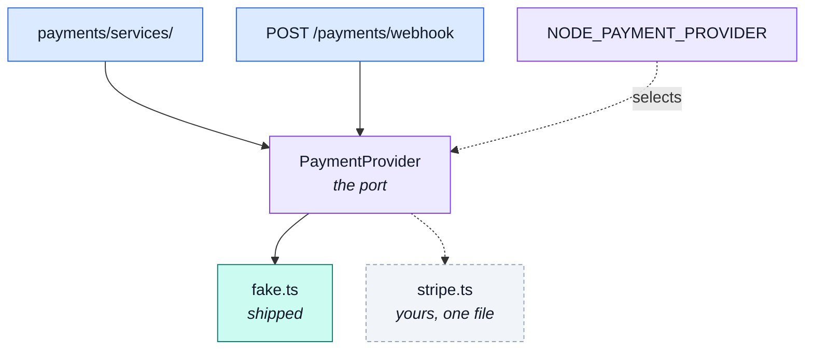

# The provider port

The seam a real payment service provider plugs into — and the reason nothing above it knows which
one is wired in.

::: tip At a glance
**Selected by** — `NODE_PAYMENT_PROVIDER`, read fresh per call. Default `fake`.
**Shipped with** — one implementation, which never talks to the outside world.
**Breaks if you change** — the `PaymentProvider` interface. It is the contract a real PSP has to satisfy.
:::

## The shape is not a choice

A port could have been written as _"here is a card, take the money"_. It is not, and the reason is
worth stating before anything else: **no real payment provider works that way, and the ones that
let you try put your whole deployment in the wrong compliance bracket.**

Three constraints come from outside this codebase and cannot be designed around.

**The card number must never reach this server.** A provider's own widget collects it inside an
iframe the provider owns, and hands the browser an opaque handle (`pm_…`). A server that receives
a real card number is in the heavyweight PCI DSS bracket — the full questionnaire, quarterly
external scans, an annual attestation — rather than the light one a tokenised integration gets.
That is why `confirm` takes a **method reference**, and why there is no `CardDetails` type anywhere
in this module.

**The answer is not always immediate.** A European card can come back needing a 3-D Secure
challenge answered in the browser, and some methods settle over days. `requires_action` and
`processing` exist because a payment in either state has to be representable — without them a
challenged payment has nowhere to live.

**The authoritative answer arrives separately.** It comes as a webhook, possibly after the customer
has closed the tab. The browser's report is a hint that makes the happy path feel synchronous; the
webhook is the authority.

## What the port is

[`payments`](./payments.md)' service talks to **one interface and nothing else**, and which
implementation answers is a deployment decision rather than a code path.

| Member                             | Contract                                                                                                                                                                                                                                                |
| ---------------------------------- | ------------------------------------------------------------------------------------------------------------------------------------------------------------------------------------------------------------------------------------------------------- |
| `name`                             | Persisted on every payment document, so a row says who handled it.                                                                                                                                                                                      |
| `prepare(charge, metadata)`        | Opens an intent for an amount this application already froze. Returns `providerRef` (persisted) and `clientSecret` (handed to the browser, never stored). **Idempotent on `metadata.paymentId`** — the double-click case must not open a second intent. |
| `confirm(providerRef, methodRef)`  | Attaches the browser's tokenised method and asks for the money. Returns one of four states; **a decline is an answer, not an error** — only transport failures throw.                                                                                   |
| `retrieve(providerRef)`            | Reads the authoritative state back. The reconciliation path, and what a finished challenge settles against.                                                                                                                                             |
| `refund(providerRef, charge)`      | Idempotent provider-side; the caller guards its own side by only refunding a `succeeded` payment.                                                                                                                                                       |
| `parseWebhook(rawBody, signature)` | Verifies the delivery and translates the provider's own event shape into this module's. Takes the **unparsed** body — a signature covers exact bytes.                                                                                                   |

::: warning A typo'd env value fails loudly
`resolvePaymentProvider` throws when the environment names a provider this build does not carry.
Falling back to `fake` would turn a deployment's typo into orders marked paid that nobody was ever
charged for.
:::

## The raw body is load-bearing

`parseWebhook` verifies an HMAC over the bytes the provider transmitted. `JSON.stringify` of a
parsed body is **not** those bytes — key order, number formatting and whitespace all move.

`app/security.ts` keeps the buffer for the webhook path alone, through the JSON parser's `verify`
hook, and lists the paths in `RAW_BODY_PATHS`. Changing that ordering makes every signature fail to
verify, with no error anywhere to say why; the controller notices an absent buffer and says so.

## The fake, and why it is honest

It imposes the same shape a real provider does — asynchronous states included — so the demo and
every e2e walk the challenge and webhook paths without an account anywhere.

| Method reference                   | First answer      | Settles to  |
| ---------------------------------- | ----------------- | ----------- |
| `pm_card_visa` (and anything else) | `succeeded`       | `succeeded` |
| `pm_card_declined`                 | `declined`        | `declined`  |
| `pm_card_authentication_required`  | `requires_action` | `succeeded` |
| `pm_card_processing`               | `processing`      | `succeeded` |

Anything unrecognised succeeds, with its last four digits taken from the reference's own tail — a
visitor poking at a demo should reach the happy path, and each interesting case stays one
documented value away.

`retrieve` answers `processing` for a reference it does not know. That is deliberate: `processing`
is the only status that settles nothing in either direction, and an intent the stub has forgotten
(a restart, a second worker) must move no money.

::: tip Every call is logged, and that is the point
A real PSP leaves a trail you can go and read — a dashboard, a webhook log, a statement. This one
leaves nothing, so "charged, succeeded" and "never reached the provider at all" look identical from
the outside. The log line is the fake's substitute for that trail. It carries the last four digits
and never more, the same rule the payment document follows.
:::

## Going live is one file and one variable

1. Write `stripe.ts` beside `fake.ts`, implementing `PaymentProvider`. Its `parseWebhook` calls the <!-- doc-paths:ignore -->
   vendor's own verifier (`stripe.webhooks.constructEvent`) and maps `payment_intent.succeeded` /
   `.payment_failed` onto this module's state shape.
2. Add one line to the `PROVIDERS` registry.
3. Set `NODE_PAYMENT_PROVIDER`, the vendor's secret key, and `NODE_PAYMENT_WEBHOOK_SECRET` to the
   vendor's webhook signing secret.
4. Point the vendor's dashboard at `POST /payments/webhook`, which needs a public HTTPS endpoint.

The frontend swaps its method widget for the vendor's, which is the point of the exercise — the app
stops touching card data. The service, the settlement and the contract's shape stay as they are.

## Related pages

- [`payments`](./payments.md) — the module this belongs to
- [Layers](../theory/layers.md) — what a port is, and why it sits where it does
- [Security](../tools/security.md) — what is never stored or logged
- [Demo profile](../tools/demo-profile.md) — where the magic method references are used
