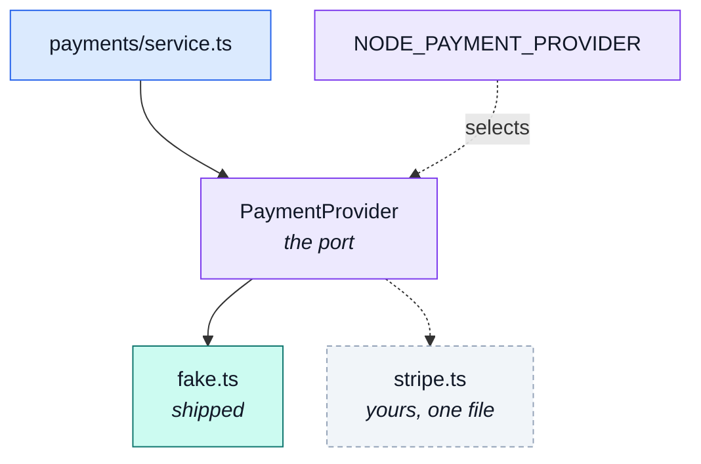

# The provider port

The seam a real payment service provider plugs into — and the reason nothing above it knows which
one is wired in.

::: tip At a glance
**Selected by** — `NODE_PAYMENT_PROVIDER`, read lazily and memoised. Default `fake`.
**Shipped with** — one implementation, which never talks to the outside world.
**Breaks if you change** — the `PaymentProvider` interface. It is the contract a real PSP has to satisfy.
:::

## What the port is

[`payments`](./payments.md)' service talks to **one interface and nothing else**. Amounts, cards and
refunds all go through it, and which implementation answers is a deployment decision rather than a
code path.

The interface is three members wide:

| Member                 | Contract                                                                                                           |
| ---------------------- | ------------------------------------------------------------------------------------------------------------------ |
| `name`                 | Persisted on every payment document, so a row says who handled it.                                                 |
| `charge(charge, card)` | Returns `succeeded` or `declined`. **A decline is an answer, not an error** — only transport-level failures throw. |
| `refund(charge)`       | Idempotent provider-side; the caller guards its own side by only refunding a `succeeded` payment.                  |

::: warning A typo'd env value fails loudly
`resolvePaymentProvider` throws when the environment names a provider this build does not carry,
listing the ones it does. A deployment misconfiguration has to surface at the first payment — not as
silent fake charges against a real shop.
:::

## Going live is one file and one variable

1. Write `stripe.ts` beside `fake.ts`, implementing `PaymentProvider`.
2. Add one line to the `PROVIDERS` registry.
3. Change `NODE_PAYMENT_PROVIDER`.

The contract, the service and the paired frontend never hear about it. This is the same shape as
`ImageStore` in `@infrastructure/adapters/image-store`, with the env-driven selection borrowed from
how the mailer picks its transport — read lazily inside the function so tests can vary the
environment per case, memoised, with a `reset` seam.

## The fake, and why it is honest

It answers the way real providers do in their test modes, magic card numbers included, so the demo
and every e2e can walk the decline path as truthfully as the happy one:

| Card               | Outcome     |
| ------------------ | ----------- |
| `4000000000000002` | `declined`  |
| anything else      | `succeeded` |

`4242424242424242` is the conventional success card, but **any** other number succeeds — a visitor
typing digits into a demo should reach the happy path, and the decline stays one specific,
documented number away. Refunds always succeed: there is no outside ledger to disagree.

::: tip Every call is logged, and that is the point
A real PSP leaves a trail you can go and read — a dashboard, a webhook log, a statement. This one
leaves nothing, so "charged, succeeded" and "never reached the provider at all" look identical from
the outside. The log line is the fake's substitute for that trail.

**The card number is never logged, only its last four digits** — the same rule the payment document
follows. A stub is exactly where that discipline is easiest to drop and worst to learn late.
:::

## Related pages

- [`payments`](./payments.md) — the module this belongs to
- [Layers](../theory/layers.md) — what a port is, and why it sits where it does
- [Security](../tools/security.md) — what is never stored or logged
- [Demo profile](../tools/demo-profile.md) — where the magic card numbers are used
