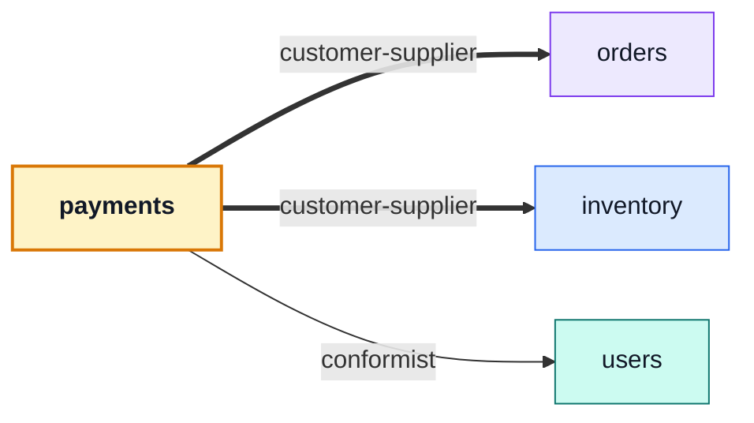

# payments

::: tip At a glance
**Owns** — an order's money, behind a provider port. The intent freezes a total; the confirm moves the order to `paid`.
**Depends on** — [`orders`](./orders.md), [`inventory`](./inventory.md), [`users`](./users.md).
**Breaks if you change** — the confirm path. It is the single moment held units become a sale.
:::

<!-- gen:identity:start -->

| Fact                     | This module                                                                     |
| ------------------------ | ------------------------------------------------------------------------------- |
| **Subdomain**            | `supporting` — Specific to this business but not a differentiator. Kept plain.  |
| **Base path**            | `/payments`                                                                     |
| **Collection**           | `payments` (model `Payment`)                                                    |
| **Depends on**           | [`orders`](./orders.md) · [`inventory`](./inventory.md) · [`users`](./users.md) |
| **Depended on by**       | _nothing_                                                                       |
| **Languages**            | `en` · `it`                                                                     |
| **Seeded**               | no                                                                              |
| **Frontend counterpart** | `payments` in `boilerplate-vue-frontend`                                        |

<!-- gen:identity:end -->

## The map

<!-- gen:map:start -->



- → `orders` **customer-supplier** — A payment is about an order: the intent freezes its total, the confirm moves its status, and `order.cancelled` is what asks for the refund.
- → `inventory` **customer-supplier** — A confirmed payment is what turns an order’s held units into a sale, so this module asks for the commit at the moment the order moves to `paid`.
- → `users` **conformist** — Resolves the payer against the account record rather than copying the id off the order, so a payment history is a query on an id that pointed at a real account when the money moved.

<!-- gen:map:end -->

## The story

A payment is _about_ an order: the intent freezes its total, the confirm moves its status to
`paid`. The arrow never comes back — [`orders`](./orders.md) announces `order.cancelled` and this
module answers with the refund.

**The confirm is the one place where the money and the goods agree.** It commits the order's held
units itself rather than announcing and hoping, because that instant is the only moment a hold
becomes a sale. Without this module nothing would ever commit a hold, and every order would sit
reserved until its window expired.

::: tip The provider is a port, and the implementation is fake on purpose
Nothing above `providers/` knows which processor is wired in. The fake is what lets the whole
checkout-to-paid path run in tests and in the demo profile without a sandbox account. Swapping in a
real processor is one file behind an interface that already exists.
:::

The dependency on [`users`](./users.md) is groundwork rather than a current feature. The order
already carries a `userId`; resolving it against the account record is what makes the id on a
payment document worth querying later, when "everything this account has paid" becomes a screen.
An unresolvable payer is logged rather than refused.

`unique: true` on `orderId` is the guard against a double charge: one payment per order is a
database fact, not a check somebody has to remember.

Delete this module and cancelling an order still releases its stock but returns no money — which is
exactly the sentence `CANCELLABLE_ORDER_STATUSES` documents.

## Data

<!-- gen:data:start -->

#### `payments`

From model `Payment`. `_id` and `__v` are omitted — every document carries them.

| Field       | Type       | Flags            | Default                 | Reference / values                                                 |
| ----------- | ---------- | ---------------- | ----------------------- | ------------------------------------------------------------------ |
| `orderId`   | `ObjectId` | required, unique | —                       | → `Order`                                                          |
| `userId`    | `ObjectId` | required         | —                       | → `User`                                                           |
| `amount`    | `Number`   | required         | —                       | —                                                                  |
| `currency`  | `String`   | required         | —                       | —                                                                  |
| `status`    | `String`   | —                | "requires_confirmation" | `requires_confirmation` \| `succeeded` \| `declined` \| `refunded` |
| `provider`  | `String`   | required         | —                       | —                                                                  |
| `cardLast4` | `String`   | —                | —                       | —                                                                  |
| `createdAt` | `Date`     | —                | —                       | —                                                                  |
| `updatedAt` | `Date`     | —                | —                       | —                                                                  |

**Declared indexes**

| Keys         | Options |
| ------------ | ------- |
| `orderId: 1` | unique  |

<!-- gen:data:end -->

## Surface

<!-- gen:surface:start -->

| Endpoint                                | Middlewares                      | Controller           | What it does                    |
| --------------------------------------- | -------------------------------- | -------------------- | ------------------------------- |
| `POST /payments/{id}/confirm`           | `getAuth` → `isAuth`             | `postPaymentConfirm` | Confirm a payment               |
| `POST /payments/intent`                 | `getAuth` → `isAuth`             | `postPaymentIntent`  | Create a payment intent         |
| `GET /payments/order/{orderId}`         | `getAuth` → `isAuth`             | `getPaymentByOrder`  | Get the payment behind an order |
| `POST /payments/order/{orderId}/refund` | `getAuth` → `isAuth` → `isAdmin` | `postPaymentRefund`  | Refund an order's payment       |

Middlewares run left to right; the controller is the last handler on the route. Summaries come from this module’s own `openapi.yaml`, which is where they are edited.

<!-- gen:surface:end -->

## Signals

<!-- gen:signals:start -->

#### Domain events

| Event             | Direction                    |
| ----------------- | ---------------------------- |
| `order.cancelled` | subscribed to in `module.ts` |

#### Audit actions

| Constant                 | Action name              |
| ------------------------ | ------------------------ |
| `USER_PAYMENT_SUCCEEDED` | `user.payment.succeeded` |
| `USER_PAYMENT_DECLINED`  | `user.payment.declined`  |
| `USER_PAYMENT_REFUNDED`  | `user.payment.refunded`  |

#### Analytics events

| Constant            | Event name          |
| ------------------- | ------------------- |
| `PAYMENT_SUCCEEDED` | `payment_succeeded` |
| `PAYMENT_DECLINED`  | `payment_declined`  |

#### Metrics

| Collector               | Type    | Labels    | Help                                      |
| ----------------------- | ------- | --------- | ----------------------------------------- |
| `payment_confirm_total` | Counter | `outcome` | Payment confirmation attempts by outcome. |

<!-- gen:signals:end -->

## Files

<!-- gen:files:start -->

| File                                  | What it is                                                                                                                                                   | Explained in                             |
| ------------------------------------- | ------------------------------------------------------------------------------------------------------------------------------------------------------------ | ---------------------------------------- |
| `analytics.ts`                        | The product-analytics event names this module emits.                                                                                                         | [read](../tools/analytics.md)            |
| `audit.ts`                            | Which of this module’s operations reach the audit trail, and under what action names.                                                                        | [read](../tools/winston.md)              |
| `controllers/get-payment-by-order.ts` | One operation: reads inputs, calls the service, answers through the response envelope, and catches.                                                          | [read](../theory/request-flow.md)        |
| `controllers/post-payment-confirm.ts` | One operation: reads inputs, calls the service, answers through the response envelope, and catches.                                                          | [read](../theory/request-flow.md)        |
| `controllers/post-payment-intent.ts`  | One operation: reads inputs, calls the service, answers through the response envelope, and catches.                                                          | [read](../theory/request-flow.md)        |
| `controllers/post-payment-refund.ts`  | One operation: reads inputs, calls the service, answers through the response envelope, and catches.                                                          | [read](../theory/request-flow.md)        |
| `locales/en.json`                     | This module's user-facing strings, one file per language.                                                                                                    | [read](../tools/i18n.md)                 |
| `locales/it.json`                     | This module's user-facing strings, one file per language.                                                                                                    | [read](../tools/i18n.md)                 |
| `metrics.ts`                          | The domain counters and histograms this module registers with Prometheus.                                                                                    | [read](../tools/prometheus.md)           |
| `model.ts`                            | The Mongoose schema, its indexes and its serialisation rules — the collection's shape.                                                                       | [read](../tools/mongodb-mongoose.md)     |
| `module.ts`                           | The manifest — the only file the application loads directly. Declares the name, base path, router, dependency edges, locales, seeds and event subscriptions. | [read](../theory/modules.md)             |
| `openapi.yaml`                        | This module's slice of the REST contract. The root `openapi.yaml` is bundled from these.                                                                     | [read](../api/contract-fragmentation.md) |
| `providers/fake.ts`                   | The provider port and the implementation behind it, so nothing above the port knows which processor is wired in.                                             | [read](../theory/layers.md)              |
| `providers/index.ts`                  | The provider port and the implementation behind it, so nothing above the port knows which processor is wired in.                                             | [read](../theory/layers.md)              |
| `repository.ts`                       | Every query this module makes, on the shared base repository. The only tier that talks to Mongoose.                                                          | [read](../tools/mongodb-mongoose.md)     |
| `routes.ts`                           | The URL surface — one line per endpoint, naming its middlewares, the role it requires and the controller it lands on.                                        | [read](../api/endpoints.md)              |
| `service.ts`                          | The domain decision, and the layer that owns status-code meaning.                                                                                            | [read](../theory/layers.md)              |
| `tests/contract/api.contract.test.ts` | Contract suite — the responses, against the fragment.                                                                                                        | [read](../tools/contract-testing.md)     |
| `tests/unit/service.test.ts`          | Unit suite — the rules, in isolation.                                                                                                                        | [read](../tools/unit-testing.md)         |

<!-- gen:files:end -->

## Working on it

<!-- gen:working:start -->

| Suite    | Files | Where                                  |
| -------- | ----- | -------------------------------------- |
| Unit     | 1     | `src/modules/payments/tests/unit/`     |
| Contract | 1     | `src/modules/payments/tests/contract/` |

```bash
# every suite this module carries
npm run test:module -- src/modules/payments

# after editing this module’s openapi.yaml
npm run contracts:bundle && npm run lint:openapi:modules
```

<!-- gen:working:end -->

## Deeper in

<!-- gen:subpages:start -->

- [The provider port](./payments-provider-port.md)

<!-- gen:subpages:end -->

## Related pages

- [The provider port](./payments-provider-port.md) — the interface and the fake behind it
- [`orders`](./orders.md) — what a payment is about
- [`inventory`](./inventory.md) — the units this module commits
- [Layers](../theory/layers.md) — what a port is and where it sits
- [Security](../tools/security.md) — what is never stored here
