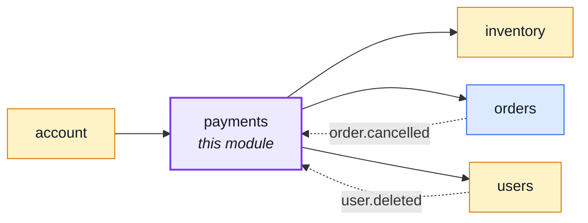
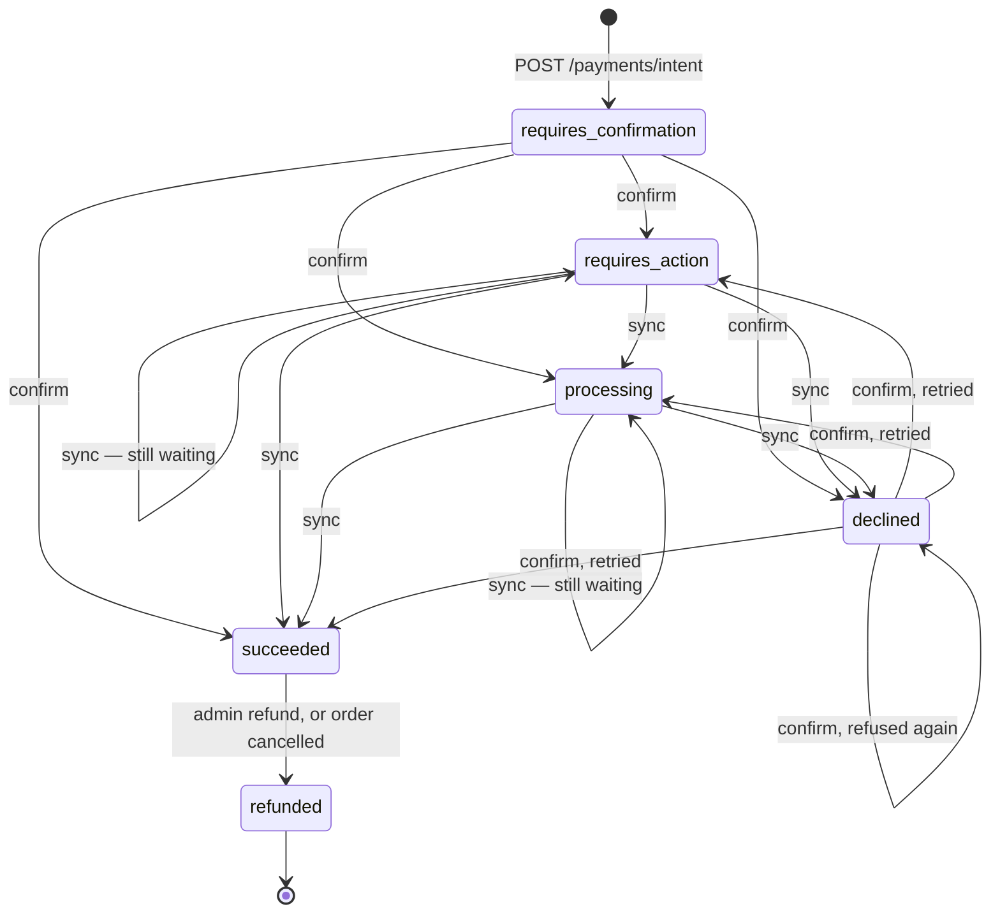
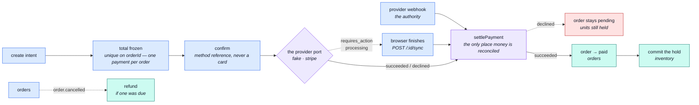

# payments

::: tip At a glance
**Owns** — an order's money, behind a provider port. The intent freezes a total; the confirm moves the order to `paid`.
**Depends on** — [`orders`](./orders.md), [`inventory`](./inventory.md), [`users`](./users.md).
**Breaks if you change** — the confirm path. It is the single moment held units become a sale.
:::

## Its neighbourhood

<!-- module-graph:payments:start -->

_Solid arrows are imports. Dotted arrows are domain events — the return path an import
graph cannot see._

<!-- module-graph:payments:end -->

## The story

A payment is _about_ an order: the intent freezes its total, the confirm moves its status to
`paid`. The arrow never comes back — [`orders`](./orders.md) announces `order.cancelled` and this
module answers with the refund.

**`settlePayment` is the one place where the money and the goods agree.** It commits the order's
held units itself rather than announcing and hoping, because that instant is the only moment a hold
becomes a sale. Without this module nothing would ever commit a hold, and every order would sit
reserved until its window expired.

It is reached three ways — the confirm, the sync, and the provider's webhook — and there is exactly
one of it because two would drift, and drifted copies commit the hold twice. Every write inside it
is conditional on the payment still being settleable, and the two terminal statuses are deliberately
outside that set: that absence is what makes a provider retrying a delivery for three days find
nothing left to move.

::: tip The provider is a port, and the implementation is fake on purpose
Nothing above `providers/` knows which processor is wired in. The fake is what lets the whole
checkout-to-paid path run in tests and in the demo profile without a sandbox account — including
the 3-D Secure challenge and the webhook, which it imposes exactly as a real provider would.
Swapping in a real processor is one file behind an interface that already exists.
:::

::: warning The card never reaches this server
`POST /payments/{id}/confirm` takes an opaque method reference the browser's provider widget
produced, never a card number. That is what keeps the deployment in the light PCI DSS bracket
rather than the heavy one, and it is why the request schema refuses a value shaped like a PAN.
:::

## The answer is not always immediate

Two statuses sit between submitted and settled, and a lifecycle without them loses every European
card payment the bank decides to challenge:

| Status            | What it means                                                                |
| ----------------- | ---------------------------------------------------------------------------- |
| `requires_action` | The bank wants a 3-D Secure challenge answered in the browser.               |
| `processing`      | The provider has the payment but has not settled it. Some methods take days. |

Both answer **200**, not an error: the browser has a next step, and a 4xx would tell it to stop.
`POST /payments/{id}/sync` re-reads the provider and settles, which is what makes the happy path
feel synchronous.

**`POST /payments/webhook` is the authority**, and the browser never is. It arrives whether or not
the customer kept the tab open, and it is the one route in the module mounted above the auth wall:
its caller is a machine with no account, authenticating by signing the raw body — a stronger proof
of origin than any cookie this API could ask it for. Deliveries are deduplicated by event id,
because a provider retries for days and the inventory commit is not conditional on anything else.

The dependency on [`users`](./users.md) is groundwork rather than a current feature. The order
already carries a `userId`; resolving it against the account record is what makes the id on a
payment document worth querying later, when "everything this account has paid" becomes a screen.
An unresolvable payer is logged rather than refused.

`unique: true` on `orderId` is the guard against a double charge: one payment per order is a
database fact, not a check somebody has to remember.

Delete this module and cancelling an order still releases its stock but returns no money — which is
exactly the sentence `CANCELLABLE_ORDER_STATUSES` documents.

## Status transitions

`requires_confirmation` is entered once, by `POST /payments/intent`, and never again — nothing a
provider reports is ever that value. From there, every non-terminal status can settle to any other
non-terminal status: `CONFIRMABLE_PAYMENT_STATUSES` (`service.ts`) gates which ones `POST
/payments/{id}/confirm` accepts as a starting point (`requires_confirmation`, `declined` — a
decline is retryable with another method), and `SETTLEABLE_PAYMENT_STATUSES` gates which ones
`settlePayment` will still write over (everything except the two terminal states below). `succeeded`
moves to `refunded` and nowhere else; `refunded` moves nowhere.

The webhook is not on this diagram because it does not add an edge the diagram doesn't already
have — it reaches the exact same `settlePayment` a sync does, with `succeeded` or `declined` as the
only two states it ever reports.

## The pipeline

Three entry points, one settlement. What differs between them is only how the provider was asked.

## Configuration

| Variable                      | Default | Meaning                                                                                                                                                                               |
| ----------------------------- | ------- | ------------------------------------------------------------------------------------------------------------------------------------------------------------------------------------- |
| `NODE_PAYMENT_PROVIDER`       | `fake`  | Which implementation under `providers/` answers. A name this build does not carry throws at boot rather than silently taking no payments                                              |
| `NODE_PAYMENT_WEBHOOK_SECRET` | —       | What `POST /payments/webhook` verifies deliveries against. With a live provider this is THEIR signing secret, and it is the only thing between an attacker and marking any order paid |
| `NODE_DEFAULT_CURRENCY`       | `EUR`   | ISO-4217, stamped on every payment document at creation                                                                                                                               |

The currency is stamped rather than looked up, so changing it affects new payments and leaves
existing ones reading in the currency they were actually taken in. There is no conversion
anywhere in this module: a deployment that needs several currencies needs a price per currency
on the product, not a rate here.

## Related pages

- [The provider port](./payments-provider-port.md) — the interface and the fake behind it
- [`orders`](./orders.md) — what a payment is about
- [`inventory`](./inventory.md) — the units this module commits
- [Layers](../theory/layers.md) — what a port is and where it sits
- [Security](../tools/security.md) — what is never stored here
